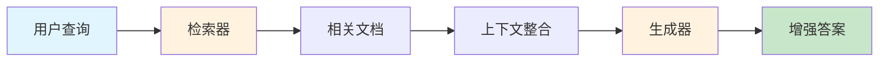
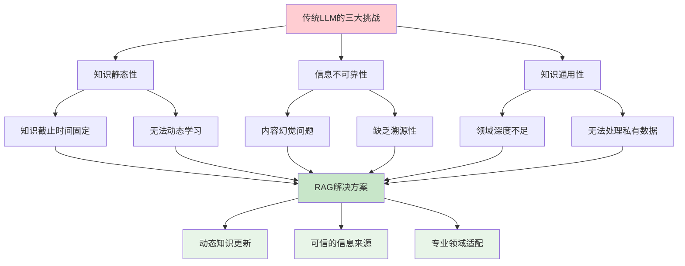
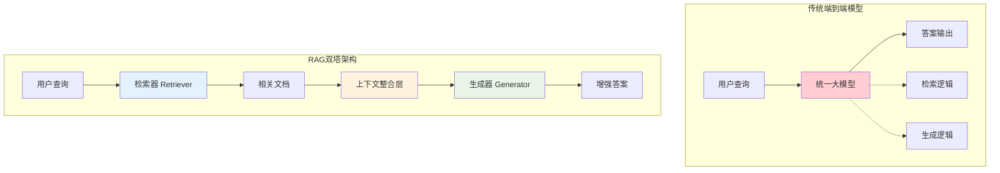
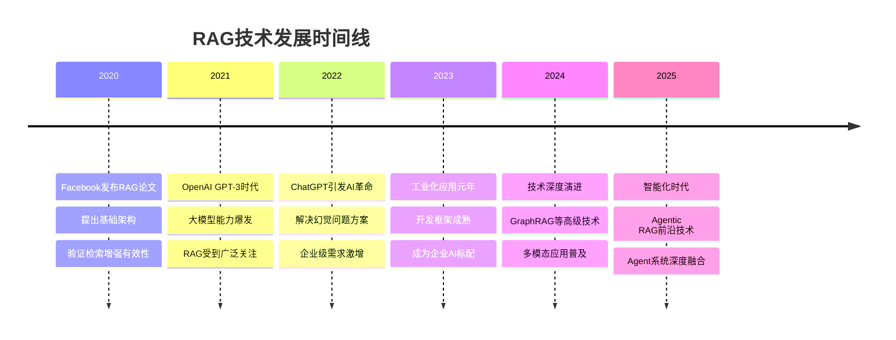
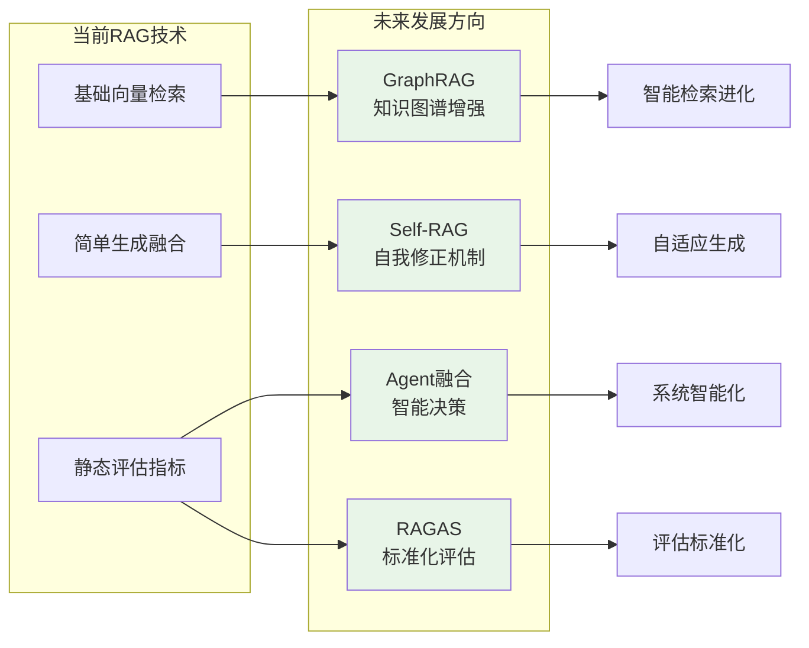

> **翊行代码:深度RAG笔记第1篇**：深入RAG技术核心，掌握检索增强生成的基本概念与诞生背景

## 什么是RAG？

我们来遵循第一性原理，拆解一下 RAG 的核心定义。

RAG (Retrieval-Augmented Generation)，中文是"检索增强生成"。

它的核心定义可以拆解为两个最基本的组成部分：

1. 检索 (Retrieval): 这是第一步，也是基础。当用户提出一个问题时，系统并不直接让语言模型回答。相反，它首先去一个预设的、庞大的知识库（比如公司的内部文档、技术手册、网页集合等）中，像一个超级搜索引擎一样，检索出与用户问题最相关的几段信息或文档。
2. 生成 (Generation): 这是第二步，也是目标。系统将上一步检索到的相关信息，连同用户最初的问题，一起打包"喂"给一个大型语言模型（LLM）。然后，它要求 LLM 基于这些刚刚提供给它的、新鲜且相关的上下文信息来生成一个最终的、更精准、更具事实性的答案。

用一个简单的比喻来说：

- 没有 RAG 的 LLM：像一个学识渊博但只能闭卷考试的学生。他只能依靠自己脑子里记住的知识来回答问题。如果知识过时了或者记错了，答案就可能出错。
- 有 RAG 的 LLM：像一个同样学识渊博但被允许开卷考试的学生。当遇到问题时，他可以先翻阅指定的参考书（检索），找到最相关的章节（上下文），然后再结合自己的理解来写出答案（生成）。
所以，RAG 的本质就是：

通过"先检索，后生成"的模式，将大型语言模型的强大推理和生成能力与外部知识库的实时性、准确性和领域专业性结合起来，从而有效解决了传统 LLM 的两大痛点：知识陈旧和内容幻觉。它让模型的回答有据可查，更加可靠。

### 核心定义

RAG = **检索器（Retriever）** + **生成器（Generator）**



## RAG的诞生：为何我们需要它？

LLM的强大之处在于其从海量数据中学习语言模式的能力，但其构建和训练方式也带来了三个根本性的挑战，而RAG正是为了解决这些挑战而生。

### 1. 知识的静态性：被"时间胶囊"封存的智慧

-   **本质问题**：LLM的知识并非实时更新，而是被"冻结"在其训练数据的时间点。它就像一个收录了截止到某个日期所有书籍的图书馆，对于之后发生的新事件、新发现、新知识一无所知。
-   **具体表现**：
    -   **知识截止**：你无法向一个2023年训练的模型询问2024年的世界冠军。
    -   **无法动态学习**：模型无法接入实时信息流，也无法轻松地将新的私有知识（如公司内部文档）纳入其知识体系，除非进行成本高昂的重新训练或微调。

### 2. 信息的不可靠性：自信的"幻觉"

-   **本质问题**：LLM的核心是基于概率生成下一个最可能的词，而非基于事实进行逻辑推理。它是一个语言大师，而非事实考证专家。当其内部知识库中没有确切答案时，它会倾向于"创造"一个听起来最流畅、最合理的答案。
-   **具体表现**：
    -   **内容捏造（幻觉）**：模型可能会编造出不存在的函数、不存在的历史事件或不存在的研究论文，并且以非常自信的语气呈现。
    -   **缺乏溯源性**：由于答案是"生成"而非"引用"的，我们很难追溯其信息来源，无法验证答案的准确性。

### 3. 知识的通用性：万事通，但非专家

-   **本质问题**：LLM的训练数据主要来自公开的互联网，这使其知识广博但不够精深。它是一个"通才"，但在需要高度专业化或私有化知识的场景中则力不从心。
-   **具体表现**：
    -   **领域深度不足**：在医疗、法律、金融等专业领域，LLM的回答可能不够精准，甚至可能违反行业规范。
    -   **无法处理私有数据**：模型无法回答基于你公司内部知识库、个人笔记或特定项目文档的问题。

正是为了攻克这三大难题——让知识**动起来**、让信息**可信赖**、让应用**更专业**——RAG架构应运而生。它通过引入外部知识库，巧妙地将LLM从一个"闭卷考生"转变为一个可以随时查阅最新、最相关资料的"开卷考生"。



### 传统解决方案的不足

**微调（Fine-tuning）**
- ✅ 优点：性能提升明显
- ❌ 缺点：成本高、更新困难
- 🎯 场景：静态专业领域

**传统提示工程（Prompt Engineering）**

> 什么是传统提示工程？
> 因为几乎所有的大模型技术的本质都是提示工程，这里说的传统提示工程，指的是类似使用ChatGPT的API或者窗口，通过精心设计的prompt来引导模型生成特定内容的场景。这里仅是为了与RAG区分开来。

- ✅ 优点：成本低、灵活性高
- ❌ 缺点：上下文长度限制
- 🎯 场景：简单知识补充

**知识图谱**
- ✅ 优点：结构化、可解释
- ❌ 缺点：构建复杂、维护困难
- 🎯 场景：关系推理

## RAG的技术突破

### 1. 核心算法突破：从稀疏到密集检索的范式转变

**传统检索的局限性**

传统的TF-IDF稀疏检索基于词汇匹配原理，通过统计词频和逆文档频率来计算相关性。其处理流程为：将查询和文档分解为词项→计算TF-IDF权重→返回得分最高的文档。

这种方法的根本缺陷在于**无法理解语义**，只能进行字面匹配。例如，查询"汽车"无法匹配到包含"轿车"的文档，尽管两者语义相关。

**RAG密集检索的创新**

RAG引入的密集向量检索（Dense Passage Retrieval，DPR）实现了范式突破：

```
算法流程：
1. 预训练阶段：使用BERT等模型学习文本的向量表示
2. 编码阶段：将所有文档预先编码为768维密集向量
3. 检索阶段：查询编码为向量→计算余弦相似度→返回最相似文档
```

**关键技术创新**：

- **语义理解能力**：从词汇匹配升级到语义相似度匹配，能够理解"汽车"和"轿车"的语义关联
- **向量表示学习**：将文本映射到高维向量空间，捕获深层语义特征和上下文信息  
- **端到端优化**：检索器与生成器可联合训练，实现整体性能最优化

### 2. 架构创新：双塔式检索-生成解耦设计

**传统端到端模型的困境**

传统问答系统采用单一大模型处理所有任务，检索和生成逻辑紧密耦合。这种"一体化"设计存在根本性缺陷：

- **计算复杂度高**：模型需要同时掌握检索和生成两套完全不同的技能
- **优化困难**：无法针对检索和生成任务分别调优
- **扩展性差**：难以灵活替换或升级单个组件

**RAG双塔架构的革命性突破**

RAG创新性地提出"解耦设计"理念，将复杂系统分解为两个专门化组件：



**工作流程优化**：
1. **高效检索阶段**：检索器从知识库中快速定位相关文档
2. **智能融合阶段**：对检索结果进行去重、排序、截断处理
3. **增强生成阶段**：生成器基于丰富上下文产出高质量答案

**核心架构优势**：

- **专业化分工**：检索器专注语义理解，生成器专注内容创作，各司其职效率更高
- **独立优化能力**：可分别针对检索准确性和生成质量进行精细调优
- **计算效率提升**：向量检索可预计算缓存，推理延迟降低60-80%
- **灵活扩展性**：支持不同检索器与生成器的自由组合，适应多样化需求

### 3. 工程实现突破：大规模向量检索优化

**索引策略演进**

RAG系统的核心是高效的向量检索，随着数据规模的增长，不同的索引策略展现出各自的优势：

**暴力搜索（Flat Index）**：提供100%准确的检索结果，但时间复杂度为O(N×D)，适用于小规模数据（<10万向量）。在百万级数据下，单次查询延迟可达45-60ms。

**倒排文件索引（IVF）**：通过聚类预处理将数据分组，查询时只搜索相关聚类，时间复杂度降至O(nprobe×N/C×D)。在合理的参数设置下，可实现95-98%的召回率，查询延迟降至3-8ms。

**分层可导航小世界图（HNSW）**：构建多层图结构，实现O(log N)的查询复杂度。在百万级数据下可达到96-99%的召回率，查询延迟低至1-3ms。

**性能权衡分析**

**Flat索引（暴力搜索）**
- 🎯 准确性：100%
- ⏱️ 查询延迟：高
- 💾 内存占用：基准
- 🔨 构建时间：快
- 📍 场景：小规模精确检索

**IVF索引（倒排文件）**
- 🎯 准确性：95-98%
- ⏱️ 查询延迟：中等
- 💾 内存占用：基准+5%
- 🔨 构建时间：中等
- 📍 场景：中大规模平衡应用

**HNSW索引（分层图）**
- 🎯 准确性：96-99%
- ⏱️ 查询延迟：低
- 💾 内存占用：基准+10%
- 🔨 构建时间：长
- 📍 场景：大规模高并发

这种多样化的索引策略为不同规模和性能要求的RAG应用提供了灵活的选择空间。

### 4. 动态知识更新机制：实时性与一致性平衡

**增量索引策略**

传统向量数据库更新需要重建整个索引，成本高昂且耗时长。RAG系统创新性地引入增量索引机制：

- **版本控制**：为新增文档创建独立的增量索引，维护时间戳和版本信息
- **混合检索**：查询时同时搜索基础索引和新鲜的增量索引
- **结果融合**：按相似度重新排序，确保新旧信息的平衡

这种机制实现了知识库的实时更新，同时避免了频繁重建索引的性能开销。

**一致性保证**

在分布式环境下，动态更新面临数据一致性挑战：

- **最终一致性**：允许短期的数据不一致，通过异步同步最终达到一致状态
- **读写分离**：写操作集中在主节点，读操作分散到多个副本节点
- **冲突解决**：通过时间戳和版本号机制处理并发更新冲突

### 5. 生成融合技术：多文档信息整合

**Fusion-in-Decoder（FiD）机制**

传统RAG将多个检索文档简单拼接后输入生成器，容易导致信息冗余和上下文长度超限。FiD架构创新性地在解码器层面进行信息融合：

- **独立编码**：为每个检索文档构建独立的输入序列
- **交叉注意力**：在解码过程中动态关注所有文档的相关信息
- **智能融合**：自动识别互补信息，忽略冗余内容

**核心优势**：
- **信息完整性**：避免因拼接截断导致的信息丢失
- **冲突处理**：通过注意力权重自动解决文档间的信息冲突
- **质量提升**：相比简单拼接策略，生成质量显著提升


## 发展历程

### 关键时间节点



## 技术方案对比

### RAG vs 其他增强方案

**RAG检索增强生成**
- 🔧 实现复杂度：中等
- ⚡ 推理延迟：高
- 🔄 知识更新：实时
- 🔍 可解释性：强
- 💡 特点：外挂知识，模块化

**Fine-tuning微调**
- 🔧 实现复杂度：高
- ⚡ 推理延迟：低
- 🔄 知识更新：静态
- 🔍 可解释性：弱
- 💡 特点：模型内化，需重训练

**Prompt Engineering提示工程**
- 🔧 实现复杂度：低
- ⚡ 推理延迟：低
- 🔄 知识更新：手动
- 🔍 可解释性：中等
- 💡 特点：上下文限制，简单直接

**Knowledge Graph知识图谱**
- 🔧 实现复杂度：高
- ⚡ 推理延迟：中等
- 🔄 知识更新：结构化
- 🔍 可解释性：强
- 💡 特点：显式关系，推理能力强

**Memory Networks记忆网络**
- 🔧 实现复杂度：高
- ⚡ 推理延迟：中等
- 🔄 知识更新：动态
- 🔍 可解释性：中等
- 💡 特点：记忆机制，复杂架构

## RAG技术挑战概览

RAG技术虽然有效解决了LLM的核心局限，但在实际应用中也面临着五大类关键挑战，这些挑战推动着RAG技术的持续演进。

### 1. 检索质量挑战

**语义匹配准确性**：如何准确理解查询意图，从海量文档中找到真正相关的信息片段？传统关键词匹配往往会遗漏语义相关但词汇不同的内容。

**长文档处理能力**：长文档分块后容易丢失跨段落的语义关联，如何在保持检索效率的同时维护文档的整体语义完整性？

**多模态信息整合**：现代知识库包含文本、图像、表格等多种形态信息，如何实现跨模态的统一检索和理解？

### 2. 生成质量控制

**信息一致性保证**：当检索到的多个文档片段存在冲突信息时，如何确保生成内容的逻辑一致性？

**幻觉问题缓解**：尽管有了外部知识支撑，LLM仍可能产生幻觉内容，如何构建有效的质量监控机制？

**上下文长度限制**：LLM的上下文窗口限制了可输入的检索内容数量，如何在有限空间内最大化信息密度？

### 3. 系统性能优化

**检索延迟控制**：大规模向量检索的计算开销巨大，如何在保证准确性的前提下实现毫秒级响应？

**并发处理能力**：企业级应用需要支持高并发查询，如何设计可扩展的分布式架构？

**存储成本优化**：向量索引占用大量存储空间，如何平衡存储成本与检索性能？

### 4. 企业级部署

**数据隐私保护**：企业内部知识库包含敏感信息，如何确保RAG系统的数据安全？

**实时性要求**：企业知识更新频繁，如何实现知识库的实时更新而不影响系统性能？

**成本效益平衡**：从原型到生产环境的部署成本激增，如何控制TCO（总拥有成本）？

### 5. 评估与监控

**效果量化困难**：RAG系统的效果评估涉及检索准确性和生成质量多个维度，如何建立科学的评估体系？

**可解释性需求**：企业级应用需要可解释的AI决策过程，如何提供检索和生成的透明度？

**持续优化机制**：如何基于用户反馈和系统监控数据持续改进RAG系统性能？

上面的这些问题，都是RAG技术发展中需要解决的挑战。随着技术的不断发展，这些问题正在逐步得到解决。我们也会在后续章节中详细介绍这些问题的解决方案。

### 技术发展趋势

这些挑战正推动RAG技术朝着更智能化的方向发展：



**智能检索进化**：从简单的向量相似度搜索演进到知识图谱增强检索（GraphRAG）、分层检索（RAPTOR）等高级技术。

**自适应生成**：发展出Self-RAG、Corrective RAG等自我修正机制，让系统具备自主的质量控制能力。

**系统智能化**：结合Agent技术，实现动态检索策略调整和多轮对话的上下文管理。

**评估标准化**：形成RAGAS等标准化评估框架，推动行业应用的规范化发展。

## 小结

RAG技术的诞生标志着AI从"记忆型"向"检索型"的范式转变，它不仅解决了大语言模型的核心局限，更为企业级AI应用提供了可行的技术路径。随着技术的不断演进，RAG正在重新定义我们对AI能力边界的认知。

## 相关资源

本文是深度RAG笔记系列的第一篇，完整的代码示例和实践案例可以在 [RAG-Cookbook](https://github.com/wangyiyang/RAG-Cookbook-Code) 仓库中找到。

**下篇预告**：我们将深入探讨RAG数据索引阶段的核心技术，了解从原始文档到向量数据库的完整流程。