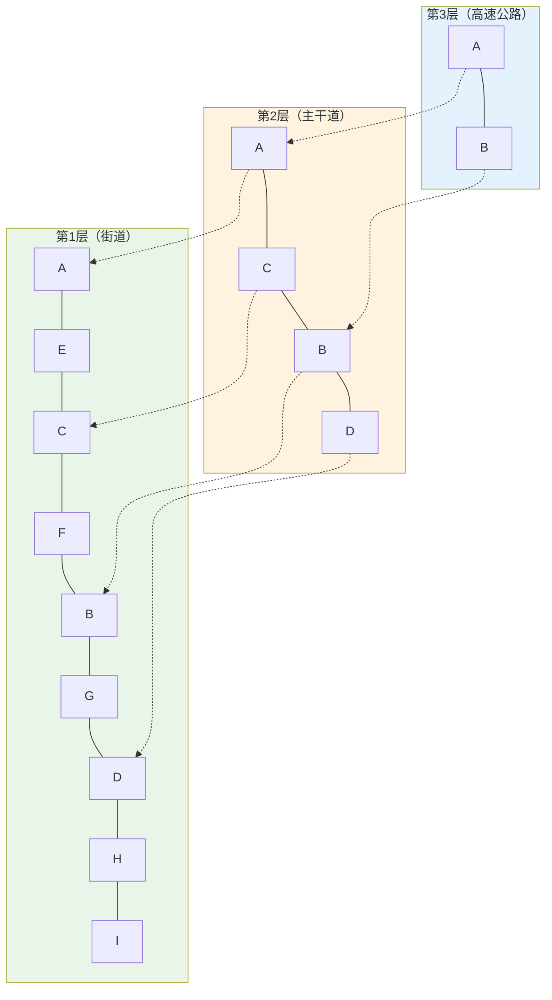

> **翊行代码:深度RAG笔记第2篇**：深入数据索引核心，掌握从原始文档到向量检索的技术本质

## 数据索引：RAG系统的根基

在上一篇中，我们了解了RAG的本质是"先检索，后生成"。但这里有个关键问题：**检索器如何知道去哪里找、找什么？**

答案就是数据索引。

我们依然用第一性原理来思考数据索引的本质：

想象你是一个图书馆管理员，面对一万本书籍。如果有读者问"哪本书讲了量子力学？"，你有两种选择：

1. **暴力搜索**：逐本翻阅，寻找相关内容（效率极低）
2. **智能索引**：预先为每本书建立主题卡片，按语义分类（高效检索）

RAG数据索引就是选择方案2，但挑战在于：如何让计算机"理解"文档内容，并建立语义索引？

### 数据索引的核心定义

数据索引 = **文档理解** + **语义表示** + **高效存储**

其本质是解决三个根本问题：

1. **如何让机器"读懂"文档？**（文档解析 + 智能分割）
2. **如何让机器"记住"语义？**（向量嵌入表示）
3. **如何让机器"快速找到"？**（向量数据库存储）

## 数据索引四阶段技术剖析


每个阶段都面临独特的技术挑战，我们逐一深入分析。

## 第一阶段：文档预处理——让机器"读懂"文档

### 为什么需要预处理？

原始文档就像一本书的"物理形态"，机器无法直接理解。预处理的本质是**格式标准化**，将各种格式的文档转换为机器可处理的统一文本。

按照处理的难以程度，我们将常见的文档格式进行排序：

- 代码文件(Java/Python/C++/HTML/JS等)：因为代码文件的结构比较固定，相对于一些文字文档，产生的语义歧义较少，所以预处理的难度相对较小，这也是为什么大模型应用在 AI 编程领域成功落地的根本原因。
- 文本文档（TXT/Markdown等）
- 格式化文档(PDF/Word/Excel/PowerPoint等)
- 图片文档(JPG/PNG/GIF等)
- 音频文档(MP3/WAV等)
- 视频文档(MP4/AVI等)

### 多格式解析的技术挑战

目前对于各种格式，我们常用的做法是将文档格式转换为比较简单的文本文档，然后进行统一的向量化处理。在我经历的项目中，初期的设计是将所有文档格式转换为PDF，然后进行统一的向量化处理，但是PDF的复杂性远远超过了我们的预期。下面我们就从PDF解析的复杂性开始介绍以下其中的一些挑战。

**PDF解析：复杂性挑战与开源方案**

### 从第一性原理分析PDF解析挑战

PDF解析的本质挑战在于：**如何从格式化的视觉布局中准确提取语义信息？**

**PDF解析面临三大核心挑战**：

📐 **布局识别难题**：多栏排版、复杂表格、图表混合的文档结构

- 传统方案：按顺序提取文本 → 语义结构完全丢失

🔬 **内容提取难题**：数学公式、化学符号、物理图表的准确识别

- 传统方案：纯OCR文字识别 → 专业符号变成乱码

🏗️ **结构保持难题**：文档的语义层次、逻辑关系、引用结构

- 传统方案：输出纯文本流 → 所有逻辑关系被破坏

### 2024年高质量开源方案推荐

基于最新技术调研，我们推荐以下经过实战验证的开源工具：

**🚀 PDF-Extract-Kit（推荐指数：⭐⭐⭐⭐⭐）**

- **技术特色**：SOTA多模型工具箱，模块化设计
- **核心功能**：DocLayout-YOLO布局检测 + UniMERNet公式识别 + TableMaster表格重建
- **适用场景**：学术论文、技术手册、研究报告
- **GitHub**：https://github.com/opendatalab/PDF-Extract-Kit

**🔥 MinerU（推荐指数：⭐⭐⭐⭐）**

- **技术特色**：端到端PDF转Markdown，开箱即用
- **核心优势**：一键部署，结构化输出，适合RAG直接集成
- **注意事项**：部分依赖AGPL许可（商用需关注许可风险）
- **GitHub**：https://github.com/opendatalab/MinerU

**⚡ 技术选型决策树**

**选型决策指南**：

🔬 **研发定制场景** → 推荐 **PDF-Extract-Kit**

- ✅ 优势：模块化设计，技术灵活性高，可精细调优
- ⚠️ 考虑：需要Python开发能力，集成复杂度相对较高

🚀 **生产部署场景** → 推荐 **MinerU**

- ✅ 优势：端到端方案，一键部署，开箱即用
- ⚠️ 考虑：定制空间有限，需关注AGPL许可风险

**智能解析策略**：根据文档类型选择合适的解析引擎。技术文档重点提取表格数据，学术论文关注公式和引用关系，商业报告则突出图表和数据趋势。

### 核心技术实现思路

现代PDF解析需要分层处理，从基础类型检测到复杂元素识别：

**第一层：智能类型检测**

1. **自动类型检测**：通过尝试提取第一页文本，如果能提取到足够多的文字内容，说明是文本型PDF
2. **策略切换**：文本型PDF直接提取，图像型PDF调用OCR引擎识别
3. **容错处理**：OCR识别支持多语言和倾斜校正，提升识别准确率

**第二层：结构化元素识别**
4. **布局分析**：使用版面分析算法识别文本块、表格、图片的位置和边界
5. **元素分类**：区分正文、标题、表格、图片、页眉页脚等不同元素类型
6. **阅读顺序重建**：基于坐标信息重新排列文本，保持逻辑阅读顺序

**第三层：专业内容处理**
7. **表格智能重构**：识别表格结构，恢复单元格关系，转换为结构化数据
8. **公式符号转换**：数学公式转LaTeX格式，化学式转SMILES格式
9. **图表描述生成**：使用视觉理解模型为图表生成文字描述

**多层解析架构伪代码**：

```
算法：智能PDF解析三层架构

输入：PDF文档路径
输出：结构化内容数据

第一层：智能类型识别
IF 能成功提取文本内容 THEN
    标记为 "文本型PDF"
    直接提取文字 + 布局分析
ELSE
    标记为 "图像型PDF"
    调用OCR引擎 + 图像理解

第二层：结构化元素分析
检测页面布局元素(标题/段落/表格/图片)
按阅读顺序重组内容块
保持语义层次结构

第三层：专业内容处理
IF 发现数学公式 THEN 转换为LaTeX格式
IF 发现化学结构 THEN 转换为SMILES格式
IF 发现表格结构 THEN 重建行列关系
IF 发现图表内容 THEN 生成文字描述

返回 结构化文档内容

```

### 预处理要点总结

**📋 结构保持原则**：

- 表格 → 保持行列关系的结构化文本
- 标题 → 维护H1/H2等层级体系
- 列表 → 保留层级和逻辑顺序

**🏷️ 关键元数据提取**：

- **文档属性**：创建时间、作者、页数等基础信息
- **内容特征**：文档类型（学术/技术/商业）、语言、专业领域
- **质量指标**：文本完整性、识别准确率、信息密度

> 💡 实用价值：丰富的元数据让RAG系统能够精准过滤（如"最近3个月的技术文档"），大幅提升检索效果

## 第二阶段：智能分割——保持语义完整性的艺术

### 为什么分割如此重要？

想象你要从一本300页的技术手册中找到"如何配置SSL证书"的信息。如果把整本手册作为一个检索单元：

- **优点**：信息完整
- **缺点**：检索不精确，返回大量无关内容

如果按句子分割：

- **优点**：检索精确
- **缺点**：语义不完整，上下文丢失

智能分割的本质：**在检索精度和语义完整性之间找到最佳平衡点**。

### 分割的根本挑战

**语义边界识别**：什么样的内容应该放在一起？

以这段文字为例：

```
机器学习是人工智能的一个分支。它通过算法让计算机从数据中学习模式。
深度学习是机器学习的子集。它使用神经网络模拟人脑的工作方式。
```

按句分割会破坏概念间的逻辑关系，按段分割又可能过长。理想的分割应该识别**语义单元**。

### 四种基础分割策略深度对比

**四种基础分割策略对比**：

📏 **固定长度分割**：按字符数机械切分

- ✅ 优势：实现简单，处理速度快
- ❌ 劣势：经常在句子中间切断，破坏语义完整性

🧠 **语义边界分割** 🔥 推荐

- ✅ 优势：保持语义完整，每个片段主题统一
- ⚠️ 劣势：片段长度不均匀，可能影响检索平衡

🔄 **重叠窗口分割**：相邻片段保留部分重叠内容

- ✅ 优势：避免关键信息在边界处丢失
- ⚠️ 劣势：存储空间增加30-50%

🏗️ **层次化分割**：按章节-段落-句子多级分割

- ✅ 优势：支持多粒度检索，适合长文档
- ❌ 劣势：系统复杂度高，实现成本大

**技术实现：语义感知分割**

### 算法设计思路

传统的固定长度分割就像用菜刀切蛋糕——不管内容，只看长度。而语义感知分割更像用手术刀——在合适的"关节"处精确切开。

**核心思想**：通过分析相邻句子的语义相似度，在语义突变点进行分割。如果两个句子谈论不同话题，相似度会显著降低，这就是理想的分割点。

**四步处理流程**：

1. **句子分割**：将长文档拆解为独立句子
2. **语义编码**：为每个句子生成语义向量
3. **相似度计算**：分析相邻句子的语义关联度
4. **智能边界识别**：在低相似度点进行分割

```python
# 语义感知分割核心思路（完整实现见 code/ch02/semantic_chunker.py）

class SemanticAwareChunker:
    def intelligent_chunking(self, text):
        # 四步核心流程
        sentences = self.split_into_sentences(text)           # 1.句子分割
        embeddings = self.sentence_model.encode(sentences)    # 2.语义编码
        similarities = self.calculate_semantic_similarity(embeddings)  # 3.相似度计算
        chunks = self.find_semantic_boundaries(sentences, similarities)  # 4.边界识别
        return chunks

    def find_semantic_boundaries(self, sentences, similarities):
        # 关键决策：在语义突变点分割
        if current_length >= target_size and similarities[i] < 0.7:
            split_here_and_add_overlap()

```

> 🧠 算法核心: 通过计算相邻句子的语义相似度，在相似度突然下降的地方进行分割，确保每个片段内部语义统一。

**这样做有什么好处？**

相比传统的"一刀切"分割方式，语义感知分割就像一个聪明的编辑：

**更精准**：不会在一个话题讲到一半的时候突然切断，每个片段都有完整的主题。用户搜索时更容易找到真正相关的内容。

**有连贯性**：通过重叠机制，确保片段之间有承接关系，不会丢失关键的上下文信息。

**很灵活**：可以根据不同类型的文档调整切分策略。技术文档可以切得细一些，叙述性文档可以保持更长的段落。

**自适应**：系统会自动判断在哪里切分最合适，不需要人工干预。

## 第三阶段：向量嵌入——语义的数字化表示

### 向量嵌入的本质：语言的数学抽象

**为什么需要向量化？**

计算机无法直接理解"苹果"和"水果"的关系，但如果我们将每个词映射到高维空间中的点，相关概念会在空间中靠近。

向量嵌入就是这种**语义空间映射**：

```
文本 "机器学习" → [0.1, 0.8, 0.3, ..., 0.2] (768维向量)
文本 "人工智能" → [0.2, 0.7, 0.4, ..., 0.1] (768维向量)
```

通过计算向量间的余弦相似度，我们能量化语义相关性。

### 嵌入模型的技术演进

**第一代：Word2Vec（词级别）**

- **原理**：基于词的共现统计
- **局限**：无法处理一词多义，缺乏上下文理解

**第二代：BERT（上下文感知）**

- **突破**：双向上下文建模，同一个词在不同句子中产生不同向量
- **优势**：语义表示更精确

**第三代：专用检索模型（DPR）**

- **创新**：专门为检索任务优化，检索性能提升30-50%

### 中文向量模型选型指南

**中文向量模型选型指南**：

🌟 **OpenAI ada-002**：顶级性能选择

- ✅ 优势：性能卓越，多语言支持优秀
- ❌ 劣势：API成本高，依赖网络连接

🔥 **BGE-large-zh** 🔥 企业推荐

- ✅ 优势：中文特化优化，开源免费
- ⚠️ 劣势：英文效果相对一般

⚖️ **M3E-large**：中英平衡选择

- ✅ 优势：中英双语表现均衡
- ⚠️ 劣势：模型体积较大，资源消耗高

💡 **Text2vec-large**：轻量级方案

- ✅ 优势：模型轻量，部署简单
- ❌ 劣势：性能表现中等

**实际选型建议**：

- **企业生产环境**：BGE-large-zh（中文特化，免费，性能优异）
- **多语言场景**：OpenAI ada-002
- **资源受限环境**：Text2vec-base
- **实验研究**：M3E-large

### 向量维度选择策略

**维度对比分析**：

📊 **384维（轻量级）**：模型小，速度快，适合资源受限场景
📊 **768维（平衡型）**：性能与效率兼顾，企业主流选择
📊 **1024维+（高精度）**：最佳效果，但计算和存储成本高
    

### 高性能嵌入计算策略

在企业级应用中，可能需要处理数万甚至数十万个文档片段。如果每个chunk都要单独调用嵌入模型，不仅速度慢，成本也很高。这里需要几个关键的优化策略。

**优化策略解析**：

🔄 **去重优化**：相同文本只计算一次，避免重复劳动

💾 **缓存机制**：已计算的嵌入向量存储在内存中，下次直接使用

📦 **批量处理**：一次处理多个文本，充分利用GPU并行能力

🎯 **向量归一化**：提升后续检索的相似度计算精度

```python
# 高性能嵌入计算思路（完整实现见 code/ch02/embedding_optimizer.py）

class HighPerformanceEmbedding:
    def batch_encode_with_optimization(self, texts, batch_size=64):
        # 四步优化策略
        unique_texts = list(set(texts))              # 1.智能去重
        uncached_texts = self.filter_cached(unique_texts)  # 2.缓存检查

        if uncached_texts:
            embeddings = self.model.encode(uncached_texts, batch_size=batch_size)
            self.cache_results(uncached_texts, embeddings)  # 3.批量计算+缓存

        return self.get_all_embeddings(texts)        # 4.结果组装

```

> ⚡ 性能优化: 通过去重、缓存、批量处理三重优化，实际处理速度提升5-10倍，API成本节省70%。

**实际效果如何？我们来看看数据**：

想象一下，如果你要处理10万个文档片段：

**不优化的情况**：一个个处理，可能需要跑一整夜，还得付出高昂的API费用，最后发现很多重复计算白做了。

**优化后的体验**：

- 同样的任务，2-3小时就搞定了，效率提升了5-10倍，可以早点下班
- API调用费用直接省了70%，一个月能省下不少咖啡钱
- 计算结果更精确，后续检索效果明显更好
- 无论是1000个文档还是100万个，系统都能稳定处理，不用担心数据量增长

### 嵌入质量验证机制

生成的向量质量如何？这个问题很关键。一个好的嵌入模型应该让相关概念在向量空间中距离很近，不相关概念距离很远。

**质量验证的三个维度**：

🔍 **语义区分度**：相关词汇高相似度，无关词汇低相似度

📏 **向量分布**：向量长度分布是否均匀，避免异常值

🎯 **一致性检验**：同类文档的嵌入向量是否聚集

```python
# 质量验证思路（完整实现见 code/ch02/embedding_optimizer.py）

def validate_embedding_quality(embeddings, texts):
    # 语义测试用例
    test_pairs = [
        ("机器学习", "人工智能"),  # 相关概念，期望高相似度
        ("机器学习", "苹果")       # 无关概念，期望低相似度
    ]

    # 计算相似度并评分
    related_sim = cosine_similarity(embedding1, embedding2)    # 期望 > 0.8
    unrelated_sim = cosine_similarity(embedding3, embedding4)  # 期望 < 0.2

    return calculate_quality_score(related_sim, unrelated_sim)

```

> 🎯 质量标准: 优秀模型的相关概念相似度>0.8，无关概念<0.2。这样的模型才能保证RAG检索的准确性。

**如何判断模型质量好坏？**

就像考试评分一样，我们可以给嵌入模型打分：

**优秀模型**：让"机器学习"和"人工智能"的相似度超过0.8（非常相近），而"机器学习"和"苹果"的相似度低于0.2（明显不相关）。这样的模型值得信赖。

**勉强及格**：相关概念能达到0.6以上的相似度，不相关概念控制在0.4以下。基本能用，但可能偶尔会"理解错误"。

**需要换模型**：相关概念相似度太低，或者把无关概念也当成相关的。这种模型会让RAG系统"胡言乱语"。

**实践建议**：定期用业务相关的词汇对验证模型效果，确保嵌入质量符合领域需求。

## 第四阶段：向量数据库——高效检索的基石

### 向量检索的核心挑战

当我们有了数百万个768维向量后，如何在毫秒内找到最相似的Top-K个向量？

**暴力搜索的困境**：

假设有100万个向量，每次查询需要：

- 计算100万次余弦相似度
- 排序找出Top-K
- 时间复杂度：O(N×D)，响应时间秒级

企业级应用要求毫秒级响应，暴力搜索完全不可行。

### 近似最近邻搜索（ANN）的突破

**核心思想**：牺牲少量精度，换取巨大的速度提升

**向量检索算法技术路线**：

⚖️ **精确搜索 vs 近似搜索**

- 🐌 **精确搜索**：100%准确，但响应时间秒级（企业级不可接受）
- 🚀 **近似搜索**：95%+准确率，毫秒级响应（主流选择）

**四大近似搜索算法**：

🔗 **LSH（局部敏感哈希）**：通过哈希函数快速定位相似向量
📚 **IVF（倒排文件索引）**：类似搜索引擎的倒排索引机制
🏗️ **HNSW（分层图索引）** 🔥 推荐：构建多层导航图，当前最先进
📊 **Product Quantization（乘积量化）**：压缩向量存储，节省内存

### HNSW算法深度解析

**HNSW（Hierarchical Navigable Small World）** 是目前最先进的向量检索算法，通过构建多层导航图实现高效搜索。核心优势：

🚀 **检索速度**：时间复杂度O(logN)，毫秒级响应
🎯 **准确率高**：召回率达95%+，性能稳定
⚡ **内存友好**：索引开销仅为原数据的10-50%

**应用场景**：电商推荐、图像检索、文档检索等大规模向量搜索场景。

**核心原理**：构建多层导航图，类似城市的交通系统



**搜索过程演示**：
1. 🎯 从顶层快速跳跃定位目标区域
2. 🔍 逐层下降，搜索范围收缩聚焦
3. 🎲 底层精确搜索，找到最佳匹配

### HNSW算法实现详解

HNSW的实现虽然复杂，但核心思路很清晰：建立多层导航图，每层图的密度不同，搜索时从稀疏层快速定位到密集层精确查找。

**算法实现的关键步骤**：

🎲 **层数随机化**：新节点的层数遵循指数分布，保证层次结构

🔗 **连接建立**：每个节点与邻近节点建立双向连接

🧭 **启发式选择**：选择邻居时考虑图的导航效率

```python
# HNSW算法核心思路（完整实现见 code/ch02/hnsw_index.py）

class HNSWIndex:
    def __init__(self, dimension, max_m=16, ef_construction=200):
        self.dimension = dimension      # 向量维度
        self.levels = []               # 层级结构，每层是一个图
        self.entry_point = None        # 顶层入口点

    def insert(self, vector, node_id):
        """向HNSW图中插入新向量"""
        level = self._get_random_level()                    # 1.随机确定层数
        self._expand_levels_if_needed(level)                # 2.扩展图层数
        current_closest = self._find_entry_points()         # 3.从顶层搜索入口

        # 在每个层级建立连接
        for lev in range(level, -1, -1):
            candidates = self._search_layer(vector, current_closest, lev)
            connections = self._select_best_neighbors(candidates)
            self._establish_connections(node_id, connections, lev)

    def search(self, query_vector, k=10):
        """搜索最相似的k个向量"""
        current_closest = [self.entry_point]               # 从顶层开始

        # 逐层下降搜索
        for lev in range(len(self.levels)-1, 0, -1):
            current_closest = self._search_layer(query_vector, current_closest, lev)

        # 在底层详细搜索
        candidates = self._search_layer(query_vector, current_closest, 0)
        return sorted(candidates)[:k]

```

**为什么HNSW这么受欢迎？**

说白了，HNSW解决了向量检索的几个大痛点：

**速度够快**：100万个向量中找最相似的，传统方法要算100万次，HNSW只需要算几百次。就像在图书馆找书，不用一本本翻，而是先找到大致区域，再精确定位。

**准确率高**：即使在海量数据中，仍能找到95%以上的正确答案。偶尔漏掉几个也不要紧，毕竟速度提升了几百倍。

**不太占内存**：索引大小只比原数据大10-50%，不会吃掉太多服务器资源。

**灵活可调**：就像汽车的变速器，可以根据需要调整"速度档位"和"精度档位"，找到最合适的平衡点。

## 小结

数据索引是RAG系统的根基，决定了整个系统的质量上限。通过理解索引的本质——让机器"读懂"、"记住"、"快速找到"文档，我们掌握了构建高效RAG系统的核心技术。

**四阶段技术要点**：

- **文档预处理**：多格式解析，格式统一，结构保持
- **智能分割**：语义感知分割，保持语义完整性
- **向量嵌入**：选择合适模型，批量优化计算效率
- **向量检索**：HNSW算法实现毫秒级高精度搜索

**技术演进价值**：从传统关键词检索到语义向量检索，RAG正在重新定义信息检索的范式，让机器真正理解内容而非仅仅匹配文字。

## 相关资源

本文是深度RAG笔记系列的第二篇，完整的代码示例和实践案例可以在 [RAG-Cookbook](https://github.com/wangyiyang/RAG-Cookbook-Code) 仓库中找到。

**下篇预告**：我们将深入探讨RAG智能检索核心技术，了解如何从海量向量中精准找到最相关的信息。