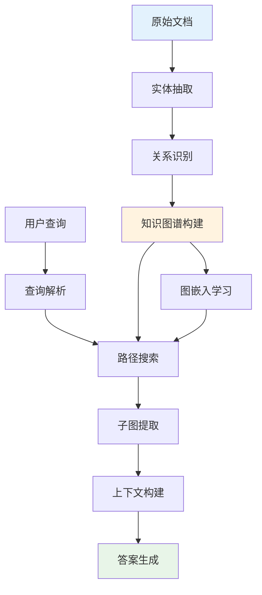
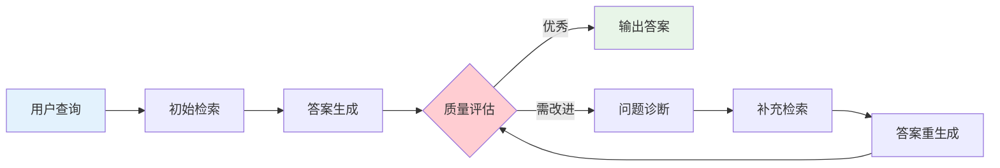

> **翊行代码:深度RAG笔记第5篇**：深入GraphRAG、Self-RAG等前沿技术，掌握下一代RAG系统的核心算法

当传统RAG系统在复杂推理和多跳查询面前显得力不从心时，我们需要更强大的武器。今天我们深入探讨两项革命性的RAG技术：**GraphRAG**和**Self-RAG**，看看它们如何将RAG系统的能力推向新的高度。

## GraphRAG：知识图谱增强检索

### GraphRAG的核心创新

传统RAG在处理需要多步推理的复杂查询时存在明显短板。GraphRAG通过引入知识图谱，将碎片化的信息片段连接成结构化的知识网络，实现了从"点状检索"到"网状推理"的跨越。

**核心优势**：
- **关系推理能力**：理解实体间的复杂关系
- **多跳查询支持**：支持跨多个文档的推理链
- **全局视角**：从局部信息中发现全局模式
- **动态路径规划**：智能选择最优的推理路径

### 技术架构详解



**GraphRAG工作流程**：

1. **知识图谱构建阶段**：从文档中抽取实体和关系，构建大规模知识图谱
2. **图表示学习**：使用图神经网络学习实体和关系的向量表示
3. **智能路径搜索**：根据查询内容，在图中寻找相关的推理路径
4. **动态上下文组装**：基于搜索路径，组装结构化的上下文信息

### 实现核心技术

```python
# GraphRAG核心实现思路

class GraphRAG:
    def __init__(self):
        self.knowledge_graph = KnowledgeGraph()
        self.graph_embedder = GraphNeuralNetwork()
        self.path_finder = PathSearchEngine()
    
    def build_knowledge_graph(self, documents):
        """从文档构建知识图谱"""
        for doc in documents:
            # 实体识别与抽取
            entities = self.extract_entities(doc)
            
            # 关系识别与抽取
            relations = self.extract_relations(doc, entities)
            
            # 添加到知识图谱
            self.knowledge_graph.add_entities(entities)
            self.knowledge_graph.add_relations(relations)
        
        # 学习图表示
        self.graph_embedder.fit(self.knowledge_graph)
    
    def query(self, question):
        """基于知识图谱的查询处理"""
        # 查询实体识别
        query_entities = self.extract_query_entities(question)
        
        # 多跳路径搜索
        reasoning_paths = self.path_finder.find_paths(
            query_entities, max_hops=3
        )
        
        # 构建结构化上下文
        context = self.build_graph_context(reasoning_paths)
        
        # 生成答案
        return self.generate_answer(question, context)
```

### 应用场景与优势

**科研文献分析**：连接不同论文中的相关概念，发现跨文献的研究脉络

**企业知识管理**：构建部门间的知识关联，支持复杂的业务决策查询

**医疗诊断辅助**：连接症状、疾病、治疗方案之间的复杂关系

## Self-RAG：自主修正的智能系统

### Self-RAG的革命性创新

Self-RAG引入了"自我反思"机制，让系统具备了质疑自己、修正错误的能力。这种self-correction能力使RAG系统变得更加可靠和智能。

**核心特性**：
- **自主质量评估**：实时评估生成内容的质量
- **动态检索决策**：智能判断是否需要额外检索
- **多轮迭代优化**：通过多轮修正提升答案质量
- **置信度量化**：为每个答案提供可信度评分

### 技术架构设计



### 核心算法实现

```python
# Self-RAG核心实现

class SelfRAG:
    def __init__(self):
        self.retriever = HybridRetriever()
        self.generator = AdvancedGenerator()
        self.critic = QualityCritic()
        self.reflector = SelfReflector()
    
    def generate_with_self_correction(self, query, max_iterations=3):
        """带自主修正的生成流程"""
        context = self.retriever.retrieve(query)
        
        for iteration in range(max_iterations):
            # 生成候选答案
            answer = self.generator.generate(query, context)
            
            # 自主质量评估
            quality_score = self.critic.evaluate(answer, query, context)
            
            if quality_score >= 0.9:  # 质量达标
                return AnswerWithConfidence(answer, quality_score)
            
            # 问题诊断与改进
            issues = self.reflector.diagnose_issues(answer, query, context)
            
            if self.should_retrieve_more(issues):
                # 补充检索
                additional_context = self.retriever.retrieve_targeted(
                    query, issues
                )
                context = self.merge_context(context, additional_context)
            
            # 修正生成策略
            self.generator.adjust_strategy(issues)
        
        return AnswerWithConfidence(answer, quality_score)
    
    def should_retrieve_more(self, issues):
        """判断是否需要补充检索"""
        return any(issue.type == "insufficient_information" for issue in issues)
```

### Self-RAG的评估体系

```python
class QualityCritic:
    def evaluate(self, answer, query, context):
        """多维度质量评估"""
        scores = {
            'relevance': self.assess_relevance(answer, query),
            'factuality': self.check_factuality(answer, context),
            'completeness': self.assess_completeness(answer, query),
            'consistency': self.check_consistency(answer),
            'clarity': self.assess_clarity(answer)
        }
        
        # 加权综合评分
        weights = [0.3, 0.25, 0.2, 0.15, 0.1]
        final_score = sum(score * weight for score, weight in zip(scores.values(), weights))
        
        return final_score
```

## 高级技术对比分析

| 技术方案 | 核心优势 | 适用场景 | 技术复杂度 | 部署成本 |
|---------|----------|----------|------------|----------|
| **GraphRAG** | 关系推理强 | 复杂推理查询 | 高 | 高 |
| **Self-RAG** | 自主修正能力 | 质量敏感场景 | 中高 | 中 |
| **传统RAG** | 简单高效 | 基础问答 | 低 | 低 |

## 技术融合与发展趋势

### 混合架构设计

在实际应用中，我们可以将多种技术融合，形成更强大的RAG系统：

```python
class HybridAdvancedRAG:
    def __init__(self):
        self.graph_rag = GraphRAG()
        self.self_rag = SelfRAG()
        self.query_router = QueryRouter()
    
    def query(self, question):
        """智能路由到最适合的处理方式"""
        query_type = self.query_router.classify(question)
        
        if query_type == "complex_reasoning":
            return self.graph_rag.query(question)
        elif query_type == "quality_critical":
            return self.self_rag.generate_with_self_correction(question)
        else:
            return self.traditional_rag.query(question)
```

### 未来发展方向

**多模态GraphRAG**：整合文本、图像、音频等多种模态信息

**增强自主学习**：Self-RAG系统的持续自我优化能力

**实时知识更新**：动态更新知识图谱，保持信息新鲜度

**分布式推理**：支持大规模分布式的图推理计算

## 性能优化策略

### GraphRAG优化技巧

```python
class OptimizedGraphRAG:
    def __init__(self):
        self.graph_cache = GraphCache()
        self.path_pruner = PathPruner()
        self.parallel_searcher = ParallelSearcher()
    
    def optimized_search(self, query):
        """优化的图搜索策略"""
        # 1. 缓存热点路径
        cached_paths = self.graph_cache.get_cached_paths(query)
        if cached_paths:
            return self.build_context_from_cache(cached_paths)
        
        # 2. 智能路径剪枝
        candidate_paths = self.find_candidate_paths(query)
        pruned_paths = self.path_pruner.prune(candidate_paths)
        
        # 3. 并行路径探索
        final_paths = self.parallel_searcher.explore(pruned_paths)
        
        # 4. 缓存结果
        self.graph_cache.cache_paths(query, final_paths)
        
        return self.build_context(final_paths)
```

### Self-RAG效率提升

**早停机制**：质量达标即停止迭代
**增量检索**：只检索缺失的特定信息
**并行评估**：多个评估维度并行计算

## 实际应用案例

### 科研助手系统

使用GraphRAG构建的科研助手能够：
- 发现跨学科的研究关联
- 追踪技术发展脉络
- 识别研究空白和机会

### 智能客服升级

Self-RAG在客服系统中的应用：
- 自动识别回答质量问题
- 主动补充相关信息
- 提供置信度标注

## 小结

高级RAG技术代表了检索增强生成的未来发展方向：

**GraphRAG突破**：
- 从片段检索到关系推理
- 支持复杂多跳查询
- 全局知识整合能力

**Self-RAG创新**：
- 自主质量控制机制
- 动态迭代优化策略
- 可解释的置信度评估

这些前沿技术正在重新定义RAG系统的能力边界，为构建真正智能的知识助手奠定了坚实基础。

## 相关资源

本文是深度RAG笔记系列的第五篇，完整的代码示例和实践案例可以在 [RAG-Cookbook](https://github.com/wangyiyang/RAG-Cookbook-Code) 仓库中找到。

**下篇预告**：我们将探讨RAG在法律领域的具体应用实践，看看专业领域如何定制化RAG系统！