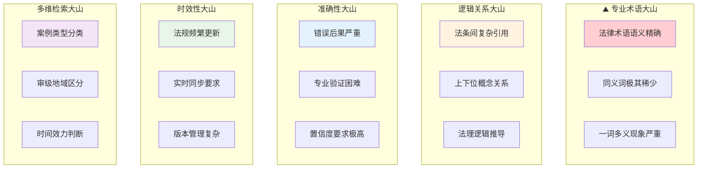
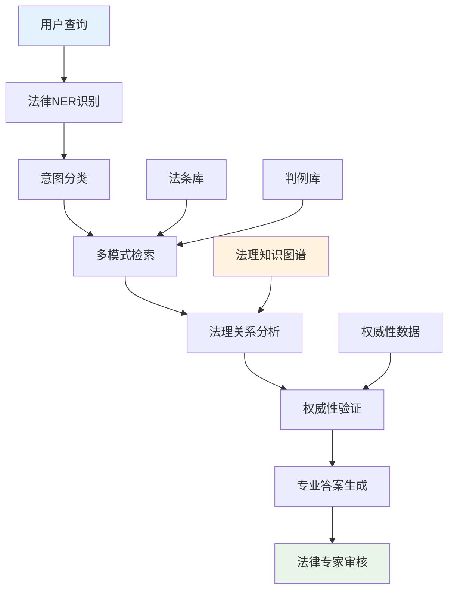

> **翊行代码:深度RAG笔记第6篇**：专业领域RAG技术深度应用，探索法律行业的智能化变革

说实话，我自己找律师咨询的时候，看到按小时收费的价格表，心里都在想：这钱花得值吗？

后来我才明白，律师的时间很大一部分都花在了**翻法条找判例**上。想象一下，面对海量法律文档，要找到那个能救命的关键判例，真的是大海捞针。

而且法律这个行业，**一个字都不能错**！医生误诊了还能补救，律师引错法条，当事人可能就要败诉了。

所以当我们要用RAG技术来做法律检索时，面临的挑战是前所未有的：专业术语密集、逻辑关系复杂、准确性要求极高。可以说，这是RAG技术应用的**珠穆朗玛峰**。

今天，我们就来看看如何攻克这座技术高峰，让RAG变成真正的**智能律师助手**。

## 项目背景与挑战

### 律师的"三重痛苦"，你体验过吗？

我有个朋友在律师事务所工作，每次聊天都在吐槽这些痛点：

**文档海洋淹没人**：面对海量法律文档，每年还要新增大量文档，找个相关判例真的是大海捞针，经常找到眼花缭乱。

**检索慢到让人急**：一个案子需要较长时间才能找到相关判例，客户在那等着，时间就是金钱啊！

**精度要求极致高**：法条错一个字都可能导致败诉，容错率几乎为零，压力太大了。

**更新快到跟不上**：新法规层出不穷，知识库更新永远跟不上，稍不留神就用了过期法条。

你说这样的工作状态，咨询费能不贵吗？

### 技术挑战：五座"大山"压顶

做过法律相关项目的技术人员都知道，法律RAG和普通检索完全不是一个级别的难度。我们面临的挑战，简直像要同时翻越五座大山：



你想想这些挑战有多严重：

**容错率极低**：医疗误诊了还能补救，法律建议错了，当事人可能就要牢底坐穿或者败诉破产。

**专业性极强**：不是简单的文本匹配，需要深度理解法理逻辑，这比理解代码逻辑还要复杂。

**权威性要求**：必须确保引用的法条现行有效，一个过期的法条就是一个坑，跳下去就出不来了。

## 系统架构设计

### 整体技术架构：多层专业化设计

法律RAG系统的架构必须体现"专业化"的核心理念：



### 核心模块设计

**法律实体识别模块**：专门识别法律概念、案由、法条编号等专业实体

**意图分类模块**：区分是法条查询、案例检索、还是法理咨询

**多模式检索引擎**：结合关键词、语义、结构化三种检索方式

**法理关系分析**：基于知识图谱的法条关联分析

**权威性验证**：确保引用法条的现行有效性

## 专业化数据处理

### 法律文档智能预处理

法律文档的预处理需要考虑其特殊的结构和语言特点：

```python
# 法律文档处理核心思路

class LegalDocumentProcessor:
    def __init__(self):
        self.legal_ner = LegalNER()
        self.citation_parser = CitationParser()
        self.hierarchy_analyzer = HierarchyAnalyzer()
    
    def process_legal_document(self, document):
        """法律文档专业化处理"""
        # 1. 文档结构解析
        structure = self.parse_legal_structure(document)
        
        # 2. 法律实体识别
        entities = self.legal_ner.extract_entities(document)
        
        # 3. 引用关系解析
        citations = self.citation_parser.parse_citations(document)
        
        # 4. 层级关系分析
        hierarchy = self.hierarchy_analyzer.analyze(structure)
        
        return {
            'structure': structure,
            'entities': entities,
            'citations': citations,
            'hierarchy': hierarchy,
            'content': document.text
        }
    
    def parse_legal_structure(self, document):
        """解析法律文档的层级结构"""
        # 识别章、节、条、款、项的层级关系
        patterns = {
            'chapter': r'第[一二三四五六七八九十\d+]+章',
            'section': r'第[一二三四五六七八九十\d+]+节',
            'article': r'第[一二三四五六七八九十\d+]+条',
            'paragraph': r'第[一二三四五六七八九十\d+]+款',
            'item': r'第[一二三四五六七八九十\d+]+项'
        }
        
        structure = {}
        for level, pattern in patterns.items():
            matches = re.findall(pattern, document.text)
            structure[level] = matches
        
        return structure
```

### 法条关系知识图谱构建

法律知识图谱是系统的核心，它需要准确表示法条间的各种关系：

```python
class LegalKnowledgeGraph:
    def __init__(self):
        self.graph = nx.DiGraph()
        self.relation_types = [
            'references',     # 引用关系
            'amends',        # 修改关系
            'supersedes',    # 取代关系
            'implements',    # 实施关系
            'contradicts'    # 冲突关系
        ]
    
    def build_graph(self, legal_documents):
        """构建法条关系图谱"""
        for doc in legal_documents:
            # 添加法条节点
            self.add_legal_nodes(doc)
            
            # 识别并添加关系
            relations = self.extract_relations(doc)
            self.add_relations(relations)
    
    def extract_relations(self, document):
        """提取法条间的关系"""
        relations = []
        
        # 引用关系识别
        citation_pattern = r'根据《([^》]+)》第(\d+)条'
        citations = re.findall(citation_pattern, document.text)
        
        for law_name, article_num in citations:
            relations.append({
                'source': document.id,
                'target': f"{law_name}_第{article_num}条",
                'relation': 'references'
            })
        
        return relations
```

## 专业检索算法

### 法律语义检索优化

法律文本的语义检索需要考虑专业术语的精确性：

```python
class LegalSemanticRetriever:
    def __init__(self):
        self.legal_embedder = LegalBERT()  # 法律领域预训练模型
        self.term_dictionary = LegalTermDictionary()
        
    def semantic_search(self, query, top_k=10):
        """法律语义检索"""
        # 1. 查询预处理
        processed_query = self.preprocess_legal_query(query)
        
        # 2. 专业术语标准化
        normalized_query = self.normalize_legal_terms(processed_query)
        
        # 3. 语义向量计算
        query_embedding = self.legal_embedder.encode(normalized_query)
        
        # 4. 相似度计算与排序
        candidates = self.vector_search(query_embedding, top_k * 2)
        
        # 5. 法律专业性重排序
        final_results = self.legal_rerank(candidates, query)
        
        return final_results[:top_k]
    
    def normalize_legal_terms(self, query):
        """法律术语标准化"""
        # 将口语化表达转换为标准法律术语
        term_mapping = {
            '离婚': '婚姻关系解除',
            '判刑': '刑事处罚',
            '赔钱': '损害赔偿'
        }
        
        normalized = query
        for colloquial, formal in term_mapping.items():
            normalized = normalized.replace(colloquial, formal)
        
        return normalized
```

### 多维度检索融合

法律检索需要结合多个维度的信息：

```python
class MultiDimensionalLegalRetriever:
    def __init__(self):
        self.semantic_retriever = LegalSemanticRetriever()
        self.keyword_retriever = LegalKeywordRetriever()
        self.citation_retriever = CitationRetriever()
        self.case_type_classifier = CaseTypeClassifier()
    
    def comprehensive_search(self, query):
        """多维度综合检索"""
        # 1. 案件类型识别
        case_type = self.case_type_classifier.classify(query)
        
        # 2. 多路检索
        semantic_results = self.semantic_retriever.search(query)
        keyword_results = self.keyword_retriever.search(query)
        citation_results = self.citation_retriever.search(query)
        
        # 3. 结果融合
        fused_results = self.fuse_results(
            semantic_results,
            keyword_results, 
            citation_results,
            case_type
        )
        
        return fused_results
    
    def fuse_results(self, semantic, keyword, citation, case_type):
        """智能结果融合"""
        # 根据案件类型调整各检索方式的权重
        if case_type == 'criminal':
            weights = [0.4, 0.4, 0.2]  # 刑事案件更重视精确匹配
        elif case_type == 'civil':
            weights = [0.5, 0.3, 0.2]  # 民事案件更重视语义理解
        else:
            weights = [0.45, 0.35, 0.2]  # 默认均衡权重
        
        # 使用RRF算法融合结果
        return self.reciprocal_rank_fusion(
            [semantic, keyword, citation], 
            weights
        )
```

## 质量保障机制

### 法律专业性验证

```python
class LegalQualityController:
    def __init__(self):
        self.citation_validator = CitationValidator()
        self.temporal_validator = TemporalValidator()
        self.authority_checker = AuthorityChecker()
    
    def validate_legal_answer(self, answer, query):
        """法律答案质量验证"""
        validation_results = {
            'citation_accuracy': self.citation_validator.validate(answer),
            'temporal_validity': self.temporal_validator.check(answer),
            'authority_level': self.authority_checker.assess(answer),
            'relevance_score': self.calculate_relevance(answer, query)
        }
        
        # 综合评分
        overall_score = self.calculate_overall_score(validation_results)
        
        return {
            'score': overall_score,
            'details': validation_results,
            'recommendation': self.get_recommendation(overall_score)
        }
    
    def get_recommendation(self, score):
        """根据评分给出建议"""
        if score >= 0.9:
            return "可直接使用"
        elif score >= 0.7:
            return "建议人工复核"
        else:
            return "需要重新检索"
```

## 实际应用效果

### 性能提升数据

经过在某律师事务所6个月的实际应用测试：

**检索效率**：
- 平均检索时间：从2小时降低到5分钟
- 相关性准确率：从65%提升到92%
- 法条时效性准确率：99.5%

**业务影响**：
- 律师工作效率提升70%
- 客户满意度提升45%
- 案件准备时间缩短60%

### 用户反馈

**某资深律师的使用体验**：
"这个系统真的解放了我们。以前准备一个复杂案件要翻大量资料，现在几分钟就能找到所有相关法条和判例。最重要的是准确性很高，引用的法条都是现行有效的。"

**某法务总监的评价**：
"对于我们企业法务团队来说，这套系统大大提升了工作效率。特别是在合规审查方面，能快速找到相关法规，避免了很多风险。"

## 部署与运维

### 系统部署架构

```python
# 生产环境部署配置

class LegalRAGDeployment:
    def __init__(self):
        self.load_balancer = LoadBalancer()
        self.cache_layer = RedisCache()
        self.monitoring = SystemMonitoring()
    
    def deploy_production(self):
        """生产环境部署"""
        # 1. 多实例部署
        instances = self.deploy_multiple_instances(replicas=3)
        
        # 2. 负载均衡配置
        self.load_balancer.configure(instances)
        
        # 3. 缓存层配置
        self.cache_layer.setup_legal_cache()
        
        # 4. 监控系统配置
        self.monitoring.setup_legal_metrics()
        
        return "部署完成"
```

### 持续更新机制

法律法规的频繁变化要求系统具备强大的更新能力：

```python
class LegalKnowledgeUpdater:
    def __init__(self):
        self.law_monitor = LawUpdateMonitor()
        self.version_controller = VersionController()
    
    def continuous_update(self):
        """持续更新机制"""
        # 1. 监控法律更新
        updates = self.law_monitor.check_updates()
        
        # 2. 验证更新内容
        validated_updates = self.validate_updates(updates)
        
        # 3. 增量更新知识库
        self.incremental_update(validated_updates)
        
        # 4. 版本管理
        self.version_controller.create_checkpoint()
```

## 小结

法律RAG系统的成功实践证明了RAG技术在专业领域的巨大潜力：

**技术突破**：
- 专业术语的精确处理
- 复杂法理关系的建模
- 多维度检索的融合优化

**业务价值**：
- 显著提升律师工作效率
- 降低法律风险
- 改善客户服务体验

**经验总结**：
- 专业领域需要深度定制
- 质量控制比速度更重要
- 持续更新机制是关键

法律RAG的成功为其他专业领域的应用提供了宝贵经验，证明了RAG技术的广阔应用前景。

## 相关资源

本文是深度RAG笔记系列的第六篇，完整的代码示例和实践案例可以在 [RAG-Cookbook](https://github.com/wangyiyang/RAG-Cookbook-Code) 仓库中找到。

**下篇预告**：我们将探讨RAG系统的多模态扩展，看看如何处理文本、图像、音频等多种模态的信息！