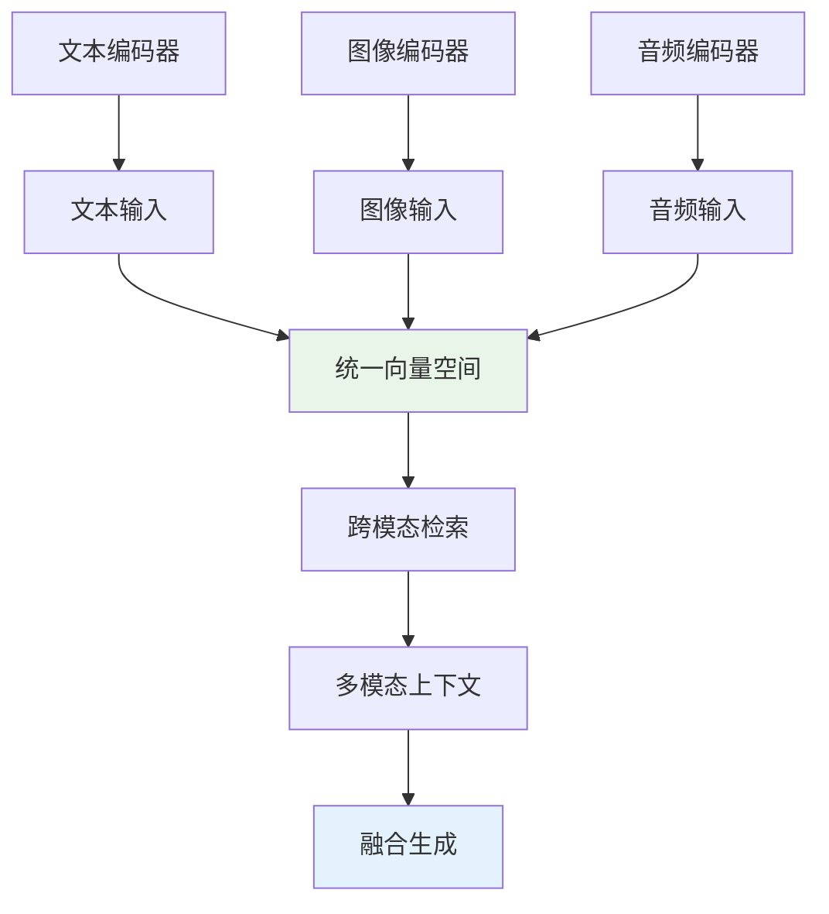
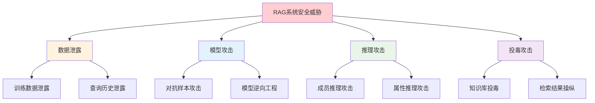

> **翊行代码:深度RAG笔记第7篇**：探索多模态RAG技术，深入安全隐私保护机制

在信息爆炸的今天，我们面对的不仅仅是文本信息，还有海量的图像、音频、视频等多模态数据。如何让RAG系统能够理解和处理这些不同形态的信息？同时，在处理敏感数据时，如何确保用户隐私和数据安全？

今天我们探讨两个前沿话题：**多模态RAG技术**和**隐私安全保护机制**。

## 多模态RAG技术架构

### 多模态信息融合挑战

传统RAG系统主要处理文本信息，但现实世界的信息往往以多种形态存在：

**技术文档**：包含代码截图、架构图、流程图
**产品说明**：结合文字描述和产品图片
**教育内容**：融合文本、图表、视频讲解
**医疗记录**：文字记录配合影像资料

### 统一多模态表示



### 核心技术实现

```python
class MultiModalRAG:
    def __init__(self):
        self.text_encoder = TextEncoder()
        self.image_encoder = ImageEncoder()
        self.audio_encoder = AudioEncoder()
        self.fusion_module = CrossModalFusion()
        
    def encode_multimodal_content(self, content):
        """多模态内容编码"""
        encodings = {}
        
        if content.has_text():
            encodings['text'] = self.text_encoder.encode(content.text)
            
        if content.has_images():
            encodings['image'] = self.image_encoder.encode(content.images)
            
        if content.has_audio():
            encodings['audio'] = self.audio_encoder.encode(content.audio)
        
        # 跨模态融合
        fused_embedding = self.fusion_module.fuse(encodings)
        
        return fused_embedding
    
    def multimodal_search(self, query):
        """多模态检索"""
        # 查询编码
        query_encoding = self.encode_multimodal_content(query)
        
        # 跨模态相似度计算
        similarities = self.calculate_cross_modal_similarity(
            query_encoding, self.knowledge_base
        )
        
        # 多模态结果排序
        ranked_results = self.rank_multimodal_results(similarities)
        
        return ranked_results
```

### 图像-文本联合检索

```python
class ImageTextRetriever:
    def __init__(self):
        self.clip_model = CLIPModel()
        self.ocr_engine = OCREngine()
        
    def process_image_document(self, image_path, associated_text=""):
        """处理图像文档"""
        # 1. 图像特征提取
        image_features = self.clip_model.encode_image(image_path)
        
        # 2. OCR文字识别
        ocr_text = self.ocr_engine.extract_text(image_path)
        
        # 3. 关联文本处理
        combined_text = f"{associated_text} {ocr_text}"
        text_features = self.clip_model.encode_text(combined_text)
        
        # 4. 多模态特征融合
        multimodal_features = self.fuse_features(image_features, text_features)
        
        return {
            'image_features': image_features,
            'text_features': text_features,
            'multimodal_features': multimodal_features,
            'ocr_text': ocr_text
        }
```

## 隐私保护机制

### 数据脱敏技术

在处理敏感信息时，数据脱敏是第一道防线：

```python
class PrivacyProtector:
    def __init__(self):
        self.pii_detector = PIIDetector()
        self.anonymizer = DataAnonymizer()
        
    def protect_sensitive_data(self, text):
        """敏感数据保护"""
        # 1. 敏感信息检测
        sensitive_entities = self.pii_detector.detect(text)
        
        # 2. 数据脱敏处理
        anonymized_text = self.anonymizer.anonymize(text, sensitive_entities)
        
        # 3. 生成脱敏映射表（用于结果还原）
        mapping_table = self.create_mapping_table(sensitive_entities)
        
        return {
            'anonymized_text': anonymized_text,
            'mapping_table': mapping_table,
            'sensitivity_level': self.assess_sensitivity(sensitive_entities)
        }
    
    def restore_sensitive_data(self, anonymized_result, mapping_table, user_permissions):
        """根据用户权限还原敏感数据"""
        if not self.check_user_permissions(user_permissions):
            return anonymized_result
            
        restored_result = self.apply_reverse_mapping(anonymized_result, mapping_table)
        return restored_result
```

### 联邦学习RAG

为保护数据隐私，可以采用联邦学习的方式训练RAG模型：

```python
class FederatedRAG:
    def __init__(self):
        self.local_models = {}
        self.global_model = GlobalRAGModel()
        
    def federated_training(self, client_data):
        """联邦学习训练"""
        client_updates = {}
        
        for client_id, data in client_data.items():
            # 本地训练
            local_update = self.train_local_model(client_id, data)
            client_updates[client_id] = local_update
        
        # 聚合更新
        global_update = self.aggregate_updates(client_updates)
        
        # 更新全局模型
        self.global_model.update(global_update)
        
        return self.global_model
    
    def secure_aggregation(self, client_updates):
        """安全聚合算法"""
        # 使用安全多方计算进行模型参数聚合
        aggregated_params = SecureAggregation.aggregate(client_updates)
        return aggregated_params
```

### 差分隐私机制

```python
class DifferentialPrivacyRAG:
    def __init__(self, epsilon=1.0):
        self.epsilon = epsilon  # 隐私预算
        self.noise_generator = NoiseGenerator()
        
    def private_query_processing(self, query, knowledge_base):
        """差分隐私查询处理"""
        # 1. 查询敏感度分析
        sensitivity = self.analyze_query_sensitivity(query)
        
        # 2. 添加噪声
        noise_scale = sensitivity / self.epsilon
        noise = self.noise_generator.laplace_noise(noise_scale)
        
        # 3. 私有检索
        private_results = self.noisy_retrieval(query, knowledge_base, noise)
        
        return private_results
    
    def private_embedding_computation(self, text):
        """私有嵌入计算"""
        # 计算原始嵌入
        original_embedding = self.compute_embedding(text)
        
        # 添加高斯噪声保护隐私
        noise = self.noise_generator.gaussian_noise(
            scale=self.epsilon, 
            shape=original_embedding.shape
        )
        
        private_embedding = original_embedding + noise
        return private_embedding
```

## 安全威胁与防护

### 常见安全威胁



### 综合安全防护框架

```python
class ComprehensiveSecurityFramework:
    def __init__(self):
        self.access_controller = AccessController()
        self.anomaly_detector = AnomalyDetector()
        self.audit_logger = AuditLogger()
        
    def secure_rag_pipeline(self, query, user_context):
        """安全的RAG处理流程"""
        # 1. 身份认证与授权
        if not self.access_controller.authenticate(user_context):
            raise AuthenticationError("用户身份验证失败")
        
        permissions = self.access_controller.get_permissions(user_context)
        
        # 2. 查询安全检查
        if self.anomaly_detector.is_malicious_query(query):
            self.audit_logger.log_security_incident("检测到恶意查询")
            raise SecurityError("查询被安全系统拦截")
        
        # 3. 安全检索
        secure_results = self.secure_retrieval(query, permissions)
        
        # 4. 安全生成
        secure_response = self.secure_generation(secure_results, permissions)
        
        # 5. 审计日志
        self.audit_logger.log_access(user_context, query, secure_response)
        
        return secure_response
    
    def secure_retrieval(self, query, permissions):
        """安全检索"""
        # 根据用户权限过滤可访问的知识库
        accessible_knowledge = self.filter_by_permissions(
            self.knowledge_base, permissions
        )
        
        # 执行检索
        results = self.retrieval_engine.search(query, accessible_knowledge)
        
        # 结果安全过滤
        filtered_results = self.filter_sensitive_content(results, permissions)
        
        return filtered_results
```

### 安全评估与监控

```python
class SecurityMonitor:
    def __init__(self):
        self.threat_detector = ThreatDetector()
        self.privacy_analyzer = PrivacyAnalyzer()
        
    def continuous_monitoring(self):
        """持续安全监控"""
        while True:
            # 1. 威胁检测
            threats = self.threat_detector.scan_system()
            
            # 2. 隐私风险评估
            privacy_risks = self.privacy_analyzer.assess_risks()
            
            # 3. 异常行为检测
            anomalies = self.detect_anomalous_behavior()
            
            # 4. 生成安全报告
            security_report = self.generate_security_report(
                threats, privacy_risks, anomalies
            )
            
            # 5. 自动响应
            if security_report.has_critical_issues():
                self.trigger_security_response(security_report)
            
            time.sleep(60)  # 每分钟检查一次
```

## 合规性要求

### GDPR合规实现

```python
class GDPRCompliantRAG:
    def __init__(self):
        self.consent_manager = ConsentManager()
        self.data_processor = GDPRDataProcessor()
        
    def process_gdpr_request(self, request_type, user_data):
        """处理GDPR相关请求"""
        if request_type == "data_portability":
            return self.export_user_data(user_data)
        elif request_type == "right_to_be_forgotten":
            return self.delete_user_data(user_data)
        elif request_type == "data_rectification":
            return self.correct_user_data(user_data)
        
    def ensure_lawful_basis(self, processing_activity):
        """确保处理活动的合法基础"""
        legal_basis = self.determine_legal_basis(processing_activity)
        
        if legal_basis == "consent":
            return self.consent_manager.verify_consent(processing_activity.user_id)
        elif legal_basis == "legitimate_interest":
            return self.assess_legitimate_interest(processing_activity)
        
        return False
```

## 最佳实践建议

### 隐私保护设计原则

1. **数据最小化**：只收集和处理必要的数据
2. **目的限制**：数据使用不能超出收集目的
3. **透明度**：用户有权知道数据如何被使用
4. **用户控制**：提供数据访问、修改、删除的能力

### 安全开发指南

```python
class SecurityBestPractices:
    """安全开发最佳实践"""
    
    @staticmethod
    def secure_coding_guidelines():
        return {
            'input_validation': '对所有输入进行严格验证',
            'output_encoding': '对输出内容进行适当编码',
            'access_control': '实施细粒度的访问控制',
            'audit_logging': '记录所有关键操作的审计日志',
            'encryption': '对敏感数据进行加密存储和传输',
            'regular_updates': '定期更新依赖组件和安全补丁'
        }
    
    @staticmethod
    def privacy_by_design_principles():
        return {
            'proactive': '主动预防而非被动应对',
            'default_privacy': '默认提供最高级别的隐私保护',
            'embedded_privacy': '将隐私保护嵌入到设计中',
            'full_functionality': '在保护隐私的同时提供完整功能',
            'end_to_end_security': '端到端的安全保护',
            'visibility_transparency': '确保透明度和可见性',
            'respect_user_privacy': '尊重用户隐私'
        }
```

## 小结

多模态RAG和隐私安全保护代表了RAG技术发展的两个重要方向：

**多模态技术突破**：
- 统一多模态信息表示
- 跨模态检索和融合
- 丰富的应用场景扩展

**隐私安全保障**：
- 全面的威胁防护机制
- 合规性要求的满足
- 用户隐私权利的保护

随着技术的不断发展，如何在提供强大功能的同时保护用户隐私和数据安全，将是RAG系统设计的核心挑战。

## 相关资源

本文是深度RAG笔记系列的第七篇，完整的代码示例和实践案例可以在 [RAG-Cookbook](https://github.com/wangyiyang/RAG-Cookbook-Code) 仓库中找到。

**下篇预告**：我们将深入探讨RAG系统的评估指标和方法，看看如何科学地评估RAG系统的性能！