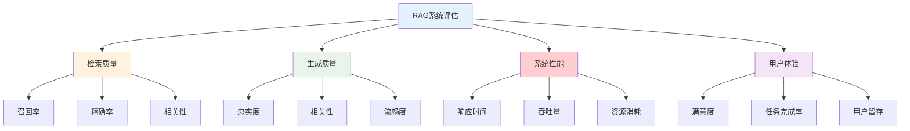

> **翊行代码:深度RAG笔记第8篇**：全面解析RAG系统评估体系，掌握科学的性能评估方法

"你的RAG系统效果怎么样？"这可能是每个RAG开发者最常被问到的问题。但要回答这个问题，并不像看起来那么简单。

传统机器学习模型有明确的精确率、召回率等指标，但RAG系统涉及检索、生成、知识融合等多个环节，每个环节都需要不同的评估维度。更复杂的是，RAG的最终目标是帮助用户解决问题，这涉及到主观的用户体验评估。

今天我们深入探讨RAG系统的科学评估方法，看看如何建立完整的评估体系。

## RAG评估的复杂性

### 多维度评估挑战

RAG系统的评估不是单一指标可以衡量的，它涉及多个维度：



### 评估方法分类

**自动化评估**：基于算法和指标的客观评估
**人工评估**：基于专家和用户的主观评估
**在线评估**：基于真实用户行为的评估
**离线评估**：基于测试数据集的评估

## 检索质量评估

### 传统检索指标

```python
class RetrievalEvaluator:
    def __init__(self):
        self.metrics = {}
    
    def evaluate_retrieval(self, retrieved_docs, relevant_docs, k=10):
        """检索质量评估"""
        # 1. Precision@K
        precision_at_k = self.calculate_precision_at_k(
            retrieved_docs[:k], relevant_docs
        )
        
        # 2. Recall@K  
        recall_at_k = self.calculate_recall_at_k(
            retrieved_docs[:k], relevant_docs
        )
        
        # 3. NDCG@K
        ndcg_at_k = self.calculate_ndcg_at_k(
            retrieved_docs[:k], relevant_docs
        )
        
        # 4. MRR (Mean Reciprocal Rank)
        mrr = self.calculate_mrr(retrieved_docs, relevant_docs)
        
        return {
            'precision@k': precision_at_k,
            'recall@k': recall_at_k,
            'ndcg@k': ndcg_at_k,
            'mrr': mrr
        }
    
    def calculate_precision_at_k(self, retrieved_docs, relevant_docs):
        """计算Precision@K"""
        relevant_retrieved = set(retrieved_docs) & set(relevant_docs)
        return len(relevant_retrieved) / len(retrieved_docs)
    
    def calculate_recall_at_k(self, retrieved_docs, relevant_docs):
        """计算Recall@K"""
        relevant_retrieved = set(retrieved_docs) & set(relevant_docs)
        return len(relevant_retrieved) / len(relevant_docs)
    
    def calculate_ndcg_at_k(self, retrieved_docs, relevant_docs):
        """计算NDCG@K"""
        # 理想排序的DCG
        ideal_dcg = self._calculate_ideal_dcg(relevant_docs)
        
        # 实际排序的DCG
        actual_dcg = self._calculate_dcg(retrieved_docs, relevant_docs)
        
        return actual_dcg / ideal_dcg if ideal_dcg > 0 else 0
```

### RAG特定检索指标

```python
class RAGRetrievalEvaluator:
    def __init__(self):
        self.context_analyzer = ContextAnalyzer()
        
    def evaluate_context_quality(self, query, retrieved_contexts):
        """上下文质量评估"""
        scores = {}
        
        # 1. 上下文相关性
        scores['context_relevance'] = self.assess_context_relevance(
            query, retrieved_contexts
        )
        
        # 2. 上下文覆盖度
        scores['context_coverage'] = self.assess_context_coverage(
            query, retrieved_contexts
        )
        
        # 3. 上下文多样性
        scores['context_diversity'] = self.assess_context_diversity(
            retrieved_contexts
        )
        
        # 4. 上下文一致性
        scores['context_consistency'] = self.assess_context_consistency(
            retrieved_contexts
        )
        
        return scores
    
    def assess_context_relevance(self, query, contexts):
        """评估上下文相关性"""
        relevance_scores = []
        
        for context in contexts:
            # 使用预训练模型计算语义相似度
            similarity = self.semantic_similarity(query, context)
            relevance_scores.append(similarity)
        
        return sum(relevance_scores) / len(relevance_scores)
```

## 生成质量评估

### 忠实度评估

忠实度（Faithfulness）衡量生成内容与检索到的上下文的一致性：

```python
class FaithfulnessEvaluator:
    def __init__(self):
        self.nli_model = NLIModel()  # 自然语言推理模型
        
    def evaluate_faithfulness(self, generated_answer, source_contexts):
        """评估答案忠实度"""
        # 1. 将答案分解为单独的声明
        statements = self.extract_statements(generated_answer)
        
        faithful_statements = 0
        total_statements = len(statements)
        
        for statement in statements:
            # 2. 检查每个声明是否能被上下文支持
            is_supported = self.is_statement_supported(statement, source_contexts)
            if is_supported:
                faithful_statements += 1
        
        # 3. 计算忠实度分数
        faithfulness_score = faithful_statements / total_statements
        
        return {
            'faithfulness_score': faithfulness_score,
            'total_statements': total_statements,
            'faithful_statements': faithful_statements,
            'unfaithful_statements': total_statements - faithful_statements
        }
    
    def is_statement_supported(self, statement, contexts):
        """检查声明是否被上下文支持"""
        for context in contexts:
            # 使用NLI模型判断蕴含关系
            entailment_score = self.nli_model.predict(context, statement)
            if entailment_score > 0.8:  # 高置信度的蕴含关系
                return True
        return False
```

### 答案相关性评估

```python
class AnswerRelevanceEvaluator:
    def __init__(self):
        self.question_generator = QuestionGenerator()
        self.similarity_model = SimilarityModel()
        
    def evaluate_answer_relevance(self, original_question, generated_answer):
        """评估答案相关性"""
        # 1. 基于生成的答案反向生成问题
        generated_questions = self.question_generator.generate_questions(
            generated_answer, num_questions=5
        )
        
        # 2. 计算原问题与生成问题的相似度
        similarities = []
        for gen_question in generated_questions:
            similarity = self.similarity_model.compute_similarity(
                original_question, gen_question
            )
            similarities.append(similarity)
        
        # 3. 计算平均相似度作为相关性分数
        relevance_score = sum(similarities) / len(similarities)
        
        return {
            'relevance_score': relevance_score,
            'generated_questions': generated_questions,
            'similarities': similarities
        }
```

### 上下文精确度评估

```python
class ContextPrecisionEvaluator:
    def __init__(self):
        self.relevance_classifier = RelevanceClassifier()
        
    def evaluate_context_precision(self, question, contexts, ground_truth_answer):
        """评估上下文精确度"""
        ranked_contexts = []
        
        for i, context in enumerate(contexts):
            # 判断上下文是否对回答问题有用
            is_useful = self.is_context_useful(question, context, ground_truth_answer)
            ranked_contexts.append({
                'context': context,
                'position': i + 1,
                'is_useful': is_useful
            })
        
        # 计算精确度
        useful_positions = [ctx['position'] for ctx in ranked_contexts if ctx['is_useful']]
        
        if not useful_positions:
            return 0.0
        
        # 使用排序位置加权的精确度
        precision_sum = 0
        for pos in useful_positions:
            precision_at_pos = len([p for p in useful_positions if p <= pos]) / pos
            precision_sum += precision_at_pos
        
        context_precision = precision_sum / len(useful_positions)
        
        return {
            'context_precision': context_precision,
            'useful_contexts': len(useful_positions),
            'total_contexts': len(contexts)
        }
```

## RAGAS评估框架

RAGAS (RAG Assessment) 是专门为RAG系统设计的评估框架：

```python
class RAGASEvaluator:
    def __init__(self):
        self.faithfulness_evaluator = FaithfulnessEvaluator()
        self.relevance_evaluator = AnswerRelevanceEvaluator()
        self.context_evaluator = ContextEvaluator()
        
    def comprehensive_evaluation(self, test_data):
        """RAGAS综合评估"""
        results = {
            'faithfulness': [],
            'answer_relevancy': [],
            'context_precision': [],
            'context_recall': []
        }
        
        for item in test_data:
            question = item['question']
            contexts = item['contexts']
            answer = item['answer']
            ground_truth = item['ground_truth']
            
            # 1. 忠实度评估
            faithfulness = self.faithfulness_evaluator.evaluate_faithfulness(
                answer, contexts
            )
            results['faithfulness'].append(faithfulness['faithfulness_score'])
            
            # 2. 答案相关性评估
            relevancy = self.relevance_evaluator.evaluate_answer_relevance(
                question, answer
            )
            results['answer_relevancy'].append(relevancy['relevance_score'])
            
            # 3. 上下文精确度评估
            precision = self.context_evaluator.evaluate_context_precision(
                question, contexts, ground_truth
            )
            results['context_precision'].append(precision['context_precision'])
            
            # 4. 上下文召回率评估
            recall = self.context_evaluator.evaluate_context_recall(
                question, contexts, ground_truth
            )
            results['context_recall'].append(recall['context_recall'])
        
        # 计算平均分数
        avg_scores = {
            metric: sum(scores) / len(scores) 
            for metric, scores in results.items()
        }
        
        return {
            'average_scores': avg_scores,
            'detailed_results': results
        }
```

## 自动化评估流程

### 评估数据集构建

```python
class EvaluationDatasetBuilder:
    def __init__(self):
        self.question_generator = QuestionGenerator()
        self.answer_generator = AnswerGenerator()
        
    def build_evaluation_dataset(self, knowledge_base, num_samples=1000):
        """构建评估数据集"""
        dataset = []
        
        # 1. 从知识库采样文档
        sampled_docs = self.sample_documents(knowledge_base, num_samples)
        
        for doc in sampled_docs:
            # 2. 生成基于文档的问题
            questions = self.question_generator.generate_from_document(doc)
            
            for question in questions:
                # 3. 生成标准答案
                ground_truth = self.answer_generator.generate_answer(
                    question, doc, use_ground_truth=True
                )
                
                # 4. 识别相关上下文
                relevant_contexts = self.identify_relevant_contexts(
                    question, knowledge_base
                )
                
                dataset.append({
                    'question': question,
                    'ground_truth': ground_truth,
                    'relevant_contexts': relevant_contexts,
                    'source_document': doc
                })
        
        return dataset
```

### 持续评估系统

```python
class ContinuousEvaluationSystem:
    def __init__(self):
        self.evaluator = RAGASEvaluator()
        self.performance_tracker = PerformanceTracker()
        
    def setup_continuous_evaluation(self, rag_system, evaluation_dataset):
        """设置持续评估系统"""
        # 1. 基线性能评估
        baseline_performance = self.evaluate_system(rag_system, evaluation_dataset)
        self.performance_tracker.set_baseline(baseline_performance)
        
        # 2. 设置定期评估
        self.schedule_regular_evaluation(rag_system, evaluation_dataset)
        
        # 3. 设置性能监控告警
        self.setup_performance_alerts()
        
    def evaluate_system(self, rag_system, dataset):
        """评估RAG系统"""
        test_results = []
        
        for item in dataset:
            # 系统生成回答
            result = rag_system.query(item['question'])
            
            # 添加评估所需信息
            test_item = {
                'question': item['question'],
                'answer': result['answer'],
                'contexts': result['contexts'],
                'ground_truth': item['ground_truth']
            }
            test_results.append(test_item)
        
        # RAGAS评估
        evaluation_results = self.evaluator.comprehensive_evaluation(test_results)
        
        return evaluation_results
    
    def performance_regression_detection(self, current_performance, baseline_performance):
        """性能回归检测"""
        regression_threshold = 0.05  # 5%的性能下降
        
        regressions = {}
        for metric, current_score in current_performance['average_scores'].items():
            baseline_score = baseline_performance['average_scores'][metric]
            
            if baseline_score - current_score > regression_threshold:
                regressions[metric] = {
                    'baseline': baseline_score,
                    'current': current_score,
                    'regression': baseline_score - current_score
                }
        
        return regressions
```

## 用户体验评估

### A/B测试框架

```python
class ABTestFramework:
    def __init__(self):
        self.user_tracker = UserTracker()
        self.metrics_collector = MetricsCollector()
        
    def setup_ab_test(self, control_system, treatment_system, traffic_split=0.5):
        """设置A/B测试"""
        test_config = {
            'control_system': control_system,
            'treatment_system': treatment_system,
            'traffic_split': traffic_split,
            'start_time': datetime.now(),
            'metrics': ['satisfaction_score', 'task_completion_rate', 'response_time']
        }
        
        return test_config
    
    def collect_user_feedback(self, user_id, query, response, system_type):
        """收集用户反馈"""
        feedback = {
            'user_id': user_id,
            'query': query,
            'response': response,
            'system_type': system_type,
            'timestamp': datetime.now(),
            'satisfaction_score': self.get_user_satisfaction(user_id),
            'task_completed': self.check_task_completion(user_id),
            'response_time': response.get('response_time', 0)
        }
        
        self.metrics_collector.record_feedback(feedback)
        return feedback
```

### 满意度评估

```python
class SatisfactionEvaluator:
    def __init__(self):
        self.feedback_analyzer = FeedbackAnalyzer()
        
    def calculate_satisfaction_metrics(self, feedback_data):
        """计算满意度指标"""
        metrics = {}
        
        # 1. 平均满意度分数
        satisfaction_scores = [f['satisfaction_score'] for f in feedback_data]
        metrics['avg_satisfaction'] = sum(satisfaction_scores) / len(satisfaction_scores)
        
        # 2. 任务完成率
        completed_tasks = [f for f in feedback_data if f['task_completed']]
        metrics['task_completion_rate'] = len(completed_tasks) / len(feedback_data)
        
        # 3. 净推荐值 (NPS)
        nps_scores = [f['nps_score'] for f in feedback_data if 'nps_score' in f]
        metrics['nps'] = self.calculate_nps(nps_scores)
        
        # 4. 用户留存率
        metrics['user_retention'] = self.calculate_retention_rate(feedback_data)
        
        return metrics
```

## 评估最佳实践

### 评估策略选择

```python
class EvaluationStrategy:
    @staticmethod
    def recommend_evaluation_approach(use_case, resources, timeline):
        """推荐评估方法"""
        recommendations = {}
        
        if use_case == 'research':
            recommendations['primary'] = 'comprehensive_offline_evaluation'
            recommendations['secondary'] = 'expert_human_evaluation'
        elif use_case == 'production':
            recommendations['primary'] = 'continuous_online_evaluation'
            recommendations['secondary'] = 'ab_testing'
        elif use_case == 'rapid_prototyping':
            recommendations['primary'] = 'automated_metrics'
            recommendations['secondary'] = 'sample_human_evaluation'
        
        return recommendations
```

### 评估结果解释

```python
class EvaluationResultInterpreter:
    def interpret_ragas_scores(self, scores):
        """解释RAGAS评分"""
        interpretation = {}
        
        # 忠实度解释
        faithfulness = scores['faithfulness']
        if faithfulness >= 0.9:
            interpretation['faithfulness'] = "优秀：生成内容高度忠实于源材料"
        elif faithfulness >= 0.7:
            interpretation['faithfulness'] = "良好：生成内容基本忠实，有少量偏差"
        else:
            interpretation['faithfulness'] = "需改进：生成内容存在较多不准确信息"
        
        # 相关性解释
        relevancy = scores['answer_relevancy']
        if relevancy >= 0.8:
            interpretation['relevancy'] = "优秀：答案高度相关"
        elif relevancy >= 0.6:
            interpretation['relevancy'] = "良好：答案基本相关"
        else:
            interpretation['relevancy'] = "需改进：答案相关性不足"
        
        return interpretation
```

## 小结

科学的评估体系是RAG系统持续改进的基础：

**多维度评估**：
- 检索质量：精确率、召回率、NDCG
- 生成质量：忠实度、相关性、流畅度
- 用户体验：满意度、任务完成率

**评估方法**：
- 自动化评估：快速、可重复
- 人工评估：主观、有深度
- 在线评估：真实、有业务价值

**持续改进**：
- 建立基线性能
- 监控性能变化
- 快速发现回归

通过建立完善的评估体系，我们可以科学地衡量RAG系统的性能，指导系统优化，确保为用户提供高质量的服务。

## 相关资源

本文是深度RAG笔记系列的第八篇，完整的代码示例和实践案例可以在 [RAG-Cookbook](https://github.com/wangyiyang/RAG-Cookbook-Code) 仓库中找到。

**下篇预告**：我们将探讨RAG系统的工程化实践，看看如何将RAG系统从原型推向生产环境！