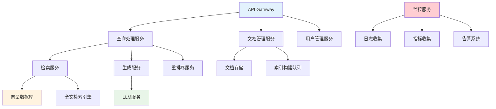

> **翊行代码:深度RAG笔记第9篇**：RAG系统的工程化部署与性能优化实践指南

从实验室的原型到生产环境的稳定运行，这中间有一道巨大的鸿沟。很多技术团队在这个阶段栽了跟头：原型跑得好好的，一到生产环境就各种问题频出。

RAG系统的工程化挑战尤其复杂，它不像传统的Web应用，涉及到向量数据库、机器学习模型、大规模文档处理等多个技术栈。每个环节都可能成为性能瓶颈或稳定性隐患。

今天我们深入探讨RAG系统的工程化实践，看看如何构建一个生产级的RAG服务。

## 系统架构设计

### 微服务架构拆分

生产级RAG系统通常采用微服务架构，将不同功能模块解耦：



### 核心服务设计

```python
# 查询处理服务
class QueryProcessingService:
    def __init__(self):
        self.retrieval_client = RetrievalServiceClient()
        self.generation_client = GenerationServiceClient()
        self.cache_client = CacheClient()
        
    async def process_query(self, query: str, user_context: dict):
        """处理用户查询"""
        # 1. 查询预处理
        processed_query = await self.preprocess_query(query)
        
        # 2. 缓存检查
        cache_key = self.generate_cache_key(processed_query, user_context)
        cached_result = await self.cache_client.get(cache_key)
        if cached_result:
            return cached_result
        
        # 3. 并行检索
        retrieval_tasks = [
            self.retrieval_client.semantic_search(processed_query),
            self.retrieval_client.keyword_search(processed_query),
        ]
        retrieval_results = await asyncio.gather(*retrieval_tasks)
        
        # 4. 结果融合
        fused_contexts = self.fuse_retrieval_results(retrieval_results)
        
        # 5. 生成答案
        answer = await self.generation_client.generate(
            query=processed_query,
            contexts=fused_contexts,
            user_context=user_context
        )
        
        # 6. 缓存结果
        await self.cache_client.set(cache_key, answer, ttl=3600)
        
        return answer

# 检索服务
class RetrievalService:
    def __init__(self):
        self.vector_db = VectorDatabase()
        self.search_engine = SearchEngine()
        self.reranker = Reranker()
        
    async def hybrid_search(self, query: str, top_k: int = 20):
        """混合检索"""
        # 并行执行多种检索策略
        tasks = [
            self.vector_db.similarity_search(query, top_k),
            self.search_engine.keyword_search(query, top_k),
        ]
        
        results = await asyncio.gather(*tasks)
        
        # 结果去重和融合
        combined_results = self.combine_and_deduplicate(results)
        
        # 重排序
        reranked_results = await self.reranker.rerank(query, combined_results)
        
        return reranked_results[:top_k]
```

## 性能优化策略

### 缓存策略优化

```python
class MultiLevelCache:
    def __init__(self):
        self.memory_cache = MemoryCache(max_size=10000)  # L1缓存
        self.redis_cache = RedisCache()                   # L2缓存
        self.persistent_cache = PersistentCache()         # L3缓存
        
    async def get(self, key: str):
        """多级缓存查询"""
        # L1: 内存缓存
        result = self.memory_cache.get(key)
        if result is not None:
            return result
            
        # L2: Redis缓存
        result = await self.redis_cache.get(key)
        if result is not None:
            self.memory_cache.set(key, result)  # 回填L1缓存
            return result
            
        # L3: 持久化缓存
        result = await self.persistent_cache.get(key)
        if result is not None:
            await self.redis_cache.set(key, result, ttl=3600)  # 回填L2缓存
            self.memory_cache.set(key, result)  # 回填L1缓存
            
        return result
    
    async def set(self, key: str, value: any, ttl: int = 3600):
        """多级缓存设置"""
        # 同时写入所有级别的缓存
        self.memory_cache.set(key, value)
        await self.redis_cache.set(key, value, ttl)
        await self.persistent_cache.set(key, value)

class SmartCacheStrategy:
    def __init__(self):
        self.query_analyzer = QueryAnalyzer()
        self.popularity_tracker = PopularityTracker()
        
    def determine_cache_strategy(self, query: str, user_context: dict):
        """智能缓存策略"""
        # 1. 查询类型分析
        query_type = self.query_analyzer.classify(query)
        
        # 2. 查询流行度分析
        popularity_score = self.popularity_tracker.get_popularity(query)
        
        # 3. 用户特征分析
        user_segment = self.analyze_user_segment(user_context)
        
        # 4. 决定缓存策略
        if query_type == "factual" and popularity_score > 0.8:
            return {
                'cache_level': 'L1',  # 热点查询放入内存缓存
                'ttl': 7200          # 较长的过期时间
            }
        elif query_type == "analytical" and user_segment == "enterprise":
            return {
                'cache_level': 'L2',  # 企业用户查询放入Redis
                'ttl': 1800
            }
        else:
            return {
                'cache_level': 'L3',  # 其他查询放入持久化缓存
                'ttl': 600
            }
```

### 异步处理优化

```python
class AsyncRAGProcessor:
    def __init__(self):
        self.thread_pool = ThreadPoolExecutor(max_workers=50)
        self.semaphore = asyncio.Semaphore(100)  # 限制并发数
        
    async def batch_process_queries(self, queries: List[str]):
        """批量处理查询"""
        async def process_single_query(query):
            async with self.semaphore:
                return await self.process_query(query)
        
        # 创建所有任务
        tasks = [process_single_query(query) for query in queries]
        
        # 批量执行，使用gather收集结果
        results = await asyncio.gather(*tasks, return_exceptions=True)
        
        # 处理异常
        processed_results = []
        for i, result in enumerate(results):
            if isinstance(result, Exception):
                logger.error(f"Query {queries[i]} failed: {result}")
                processed_results.append(None)
            else:
                processed_results.append(result)
        
        return processed_results
    
    async def streaming_response(self, query: str):
        """流式响应处理"""
        async def response_generator():
            # 1. 快速返回初始响应
            yield {"status": "processing", "message": "正在检索相关信息..."}
            
            # 2. 检索阶段
            contexts = await self.retrieve_contexts(query)
            yield {"status": "retrieved", "contexts_count": len(contexts)}
            
            # 3. 生成阶段（流式）
            async for chunk in self.generate_streaming(query, contexts):
                yield {"status": "generating", "content": chunk}
            
            # 4. 完成
            yield {"status": "completed"}
        
        return response_generator()
```

### 向量数据库优化

```python
class OptimizedVectorDB:
    def __init__(self):
        self.primary_index = HNSWIndex(ef_construction=200, M=16)
        self.backup_index = IVFIndex(nlist=1000)
        self.index_monitor = IndexMonitor()
        
    async def optimized_search(self, query_vector: np.ndarray, k: int = 10):
        """优化的向量搜索"""
        # 1. 智能索引选择
        if self.should_use_hnsw(query_vector):
            results = await self.primary_index.search(query_vector, k)
        else:
            results = await self.backup_index.search(query_vector, k)
        
        # 2. 结果质量检查
        if self.check_result_quality(results) < 0.7:
            # 回退到更全面的搜索
            results = await self.comprehensive_search(query_vector, k)
        
        return results
    
    def build_optimized_index(self, vectors: np.ndarray):
        """构建优化索引"""
        # 1. 数据预处理
        normalized_vectors = self.normalize_vectors(vectors)
        
        # 2. 索引参数自动调优
        optimal_params = self.auto_tune_parameters(normalized_vectors)
        
        # 3. 分批构建索引
        batch_size = 10000
        for i in range(0, len(normalized_vectors), batch_size):
            batch = normalized_vectors[i:i + batch_size]
            self.primary_index.add_batch(batch)
        
        # 4. 索引优化
        self.primary_index.optimize()
        
        return self.primary_index
```

## 可扩展性设计

### 水平扩展架构

```python
class ScalableRAGCluster:
    def __init__(self):
        self.load_balancer = LoadBalancer()
        self.service_registry = ServiceRegistry()
        self.auto_scaler = AutoScaler()
        
    def setup_cluster(self, initial_nodes: int = 3):
        """设置集群"""
        cluster_config = {
            'retrieval_nodes': initial_nodes,
            'generation_nodes': initial_nodes // 2,
            'cache_nodes': initial_nodes // 3,
        }
        
        # 部署服务节点
        for service_type, node_count in cluster_config.items():
            self.deploy_service_nodes(service_type, node_count)
        
        # 配置负载均衡
        self.configure_load_balancing()
        
        # 启动自动扩容
        self.auto_scaler.start_monitoring()
        
        return cluster_config
    
    def auto_scale_decision(self, metrics: dict):
        """自动扩容决策"""
        scaling_decisions = {}
        
        # 基于CPU使用率扩容
        if metrics['cpu_usage'] > 0.8:
            scaling_decisions['action'] = 'scale_out'
            scaling_decisions['target_nodes'] = int(metrics['current_nodes'] * 1.5)
        
        # 基于请求队列长度扩容
        elif metrics['queue_length'] > 100:
            scaling_decisions['action'] = 'scale_out'
            scaling_decisions['target_nodes'] = metrics['current_nodes'] + 2
        
        # 基于资源利用率缩容
        elif metrics['cpu_usage'] < 0.3 and metrics['current_nodes'] > 2:
            scaling_decisions['action'] = 'scale_in'
            scaling_decisions['target_nodes'] = max(2, metrics['current_nodes'] - 1)
        
        return scaling_decisions
```

### 数据分片策略

```python
class DataShardingManager:
    def __init__(self):
        self.sharding_strategy = ConsistentHashing()
        self.replication_factor = 3
        
    def distribute_documents(self, documents: List[Document]):
        """分布式存储文档"""
        for doc in documents:
            # 1. 计算分片键
            shard_key = self.calculate_shard_key(doc)
            
            # 2. 确定主分片和副本分片
            primary_shard = self.sharding_strategy.get_shard(shard_key)
            replica_shards = self.get_replica_shards(primary_shard)
            
            # 3. 并行写入主分片和副本
            write_tasks = [
                self.write_to_shard(primary_shard, doc, is_primary=True)
            ]
            write_tasks.extend([
                self.write_to_shard(shard, doc, is_primary=False) 
                for shard in replica_shards
            ])
            
            await asyncio.gather(*write_tasks)
    
    def smart_query_routing(self, query: str):
        """智能查询路由"""
        # 1. 分析查询特征
        query_features = self.analyze_query(query)
        
        # 2. 预测相关分片
        relevant_shards = self.predict_relevant_shards(query_features)
        
        # 3. 并行查询
        query_tasks = [
            self.query_shard(shard, query) 
            for shard in relevant_shards
        ]
        
        shard_results = await asyncio.gather(*query_tasks)
        
        # 4. 结果合并
        merged_results = self.merge_shard_results(shard_results)
        
        return merged_results
```

## 监控与运维

### 全方位监控系统

```python
class RAGMonitoringSystem:
    def __init__(self):
        self.metrics_collector = MetricsCollector()
        self.alert_manager = AlertManager()
        self.dashboard = MonitoringDashboard()
        
    def setup_monitoring(self):
        """设置监控系统"""
        # 1. 业务指标监控
        self.setup_business_metrics()
        
        # 2. 技术指标监控
        self.setup_technical_metrics()
        
        # 3. 告警规则配置
        self.configure_alerts()
        
        # 4. 仪表板配置
        self.setup_dashboards()
    
    def setup_business_metrics(self):
        """业务指标监控"""
        business_metrics = [
            'query_success_rate',      # 查询成功率
            'average_response_time',   # 平均响应时间
            'user_satisfaction_score', # 用户满意度
            'answer_quality_score',    # 答案质量分数
            'context_relevance_score'  # 上下文相关性分数
        ]
        
        for metric in business_metrics:
            self.metrics_collector.register_metric(metric)
    
    def setup_technical_metrics(self):
        """技术指标监控"""
        technical_metrics = [
            'cpu_usage',              # CPU使用率
            'memory_usage',           # 内存使用率
            'disk_io',                # 磁盘IO
            'network_throughput',     # 网络吞吐量
            'vector_db_query_time',   # 向量数据库查询时间
            'llm_inference_time',     # LLM推理时间
            'cache_hit_rate'          # 缓存命中率
        ]
        
        for metric in technical_metrics:
            self.metrics_collector.register_metric(metric)
    
    def configure_alerts(self):
        """配置告警规则"""
        alert_rules = [
            {
                'name': 'high_error_rate',
                'condition': 'error_rate > 0.05',
                'severity': 'critical',
                'notification': ['email', 'slack']
            },
            {
                'name': 'slow_response_time',
                'condition': 'avg_response_time > 5000',  # 5秒
                'severity': 'warning',
                'notification': ['slack']
            },
            {
                'name': 'low_cache_hit_rate',
                'condition': 'cache_hit_rate < 0.6',
                'severity': 'info',
                'notification': ['email']
            }
        ]
        
        for rule in alert_rules:
            self.alert_manager.add_rule(rule)

class PerformanceProfiler:
    def __init__(self):
        self.profiler = cProfile.Profile()
        self.memory_tracker = MemoryTracker()
        
    def profile_query_processing(self, query: str):
        """性能分析"""
        # 1. CPU性能分析
        self.profiler.enable()
        result = self.process_query(query)
        self.profiler.disable()
        
        # 2. 内存使用分析
        memory_usage = self.memory_tracker.get_memory_usage()
        
        # 3. 生成性能报告
        performance_report = {
            'cpu_profile': self.profiler.get_stats(),
            'memory_usage': memory_usage,
            'bottlenecks': self.identify_bottlenecks(),
            'optimization_suggestions': self.generate_optimization_suggestions()
        }
        
        return performance_report
```

### 故障处理机制

```python
class FaultToleranceManager:
    def __init__(self):
        self.circuit_breaker = CircuitBreaker()
        self.retry_handler = RetryHandler()
        self.fallback_handler = FallbackHandler()
        
    async def resilient_service_call(self, service_call, fallback_call=None):
        """弹性服务调用"""
        try:
            # 1. 断路器检查
            if self.circuit_breaker.is_open():
                if fallback_call:
                    return await fallback_call()
                else:
                    raise ServiceUnavailableError("Service is unavailable")
            
            # 2. 重试机制
            result = await self.retry_handler.execute_with_retry(
                service_call,
                max_retries=3,
                backoff_strategy='exponential'
            )
            
            # 3. 成功记录
            self.circuit_breaker.record_success()
            return result
            
        except Exception as e:
            # 4. 失败记录
            self.circuit_breaker.record_failure()
            
            # 5. 降级处理
            if fallback_call:
                logger.warning(f"Service call failed, using fallback: {e}")
                return await fallback_call()
            else:
                raise e

class HealthChecker:
    def __init__(self):
        self.health_checks = {}
        
    def register_health_check(self, name: str, check_func: callable):
        """注册健康检查"""
        self.health_checks[name] = check_func
    
    async def perform_health_check(self):
        """执行健康检查"""
        health_status = {
            'overall_status': 'healthy',
            'checks': {}
        }
        
        for name, check_func in self.health_checks.items():
            try:
                result = await check_func()
                health_status['checks'][name] = {
                    'status': 'healthy',
                    'details': result
                }
            except Exception as e:
                health_status['checks'][name] = {
                    'status': 'unhealthy',
                    'error': str(e)
                }
                health_status['overall_status'] = 'unhealthy'
        
        return health_status
```

## 成本优化

### 资源使用优化

```python
class ResourceOptimizer:
    def __init__(self):
        self.cost_analyzer = CostAnalyzer()
        self.resource_planner = ResourcePlanner()
        
    def optimize_compute_costs(self, usage_patterns: dict):
        """优化计算成本"""
        optimization_plan = {}
        
        # 1. 分析使用模式
        peak_hours = self.identify_peak_hours(usage_patterns)
        off_peak_hours = self.identify_off_peak_hours(usage_patterns)
        
        # 2. 动态资源调配
        optimization_plan['scaling_schedule'] = {
            'peak_hours': {
                'instances': usage_patterns['peak_load'] // 100,
                'instance_type': 'high_performance'
            },
            'off_peak_hours': {
                'instances': max(2, usage_patterns['base_load'] // 100),
                'instance_type': 'cost_optimized'
            }
        }
        
        # 3. 预留实例建议
        stable_workload = usage_patterns['stable_workload']
        if stable_workload > 0.7:
            optimization_plan['reserved_instances'] = {
                'count': int(usage_patterns['base_load'] // 100 * 0.8),
                'term': '1_year',
                'payment_option': 'partial_upfront'
            }
        
        return optimization_plan
    
    def optimize_storage_costs(self, data_access_patterns: dict):
        """优化存储成本"""
        storage_plan = {}
        
        # 1. 数据分层策略
        if data_access_patterns['cold_data_ratio'] > 0.6:
            storage_plan['tiering_strategy'] = {
                'hot_storage': '30%',    # 最近30天的数据
                'warm_storage': '40%',   # 30-90天的数据
                'cold_storage': '30%'    # 90天以上的数据
            }
        
        # 2. 压缩策略
        if data_access_patterns['read_write_ratio'] > 5:
            storage_plan['compression'] = {
                'algorithm': 'lz4',
                'expected_ratio': 0.3
            }
        
        return storage_plan
```

## 部署自动化

### CI/CD流水线

```yaml
# .github/workflows/rag-deploy.yml
name: RAG System Deployment

on:
  push:
    branches: [main]
  pull_request:
    branches: [main]

jobs:
  test:
    runs-on: ubuntu-latest
    steps:
      - uses: actions/checkout@v2
      
      - name: Setup Python
        uses: actions/setup-python@v2
        with:
          python-version: '3.9'
      
      - name: Install dependencies
        run: |
          pip install -r requirements.txt
          pip install -r requirements-test.txt
      
      - name: Run unit tests
        run: pytest tests/unit/
      
      - name: Run integration tests
        run: pytest tests/integration/
      
      - name: Run performance tests
        run: pytest tests/performance/

  build:
    needs: test
    runs-on: ubuntu-latest
    steps:
      - uses: actions/checkout@v2
      
      - name: Build Docker images
        run: |
          docker build -t rag-api:${{ github.sha }} .
          docker build -t rag-retrieval:${{ github.sha }} ./services/retrieval/
          docker build -t rag-generation:${{ github.sha }} ./services/generation/

  deploy:
    needs: build
    runs-on: ubuntu-latest
    if: github.ref == 'refs/heads/main'
    steps:
      - name: Deploy to staging
        run: |
          kubectl apply -f k8s/staging/
          kubectl set image deployment/rag-api rag-api=rag-api:${{ github.sha }}
      
      - name: Run smoke tests
        run: |
          python scripts/smoke_tests.py --environment staging
      
      - name: Deploy to production
        run: |
          kubectl apply -f k8s/production/
          kubectl set image deployment/rag-api rag-api=rag-api:${{ github.sha }}
```

### 基础设施即代码

```python
# infrastructure/terraform/main.tf
provider "aws" {
  region = var.aws_region
}

module "rag_cluster" {
  source = "./modules/rag-cluster"
  
  cluster_name = var.cluster_name
  node_count = var.node_count
  instance_type = var.instance_type
  
  vector_db_config = {
    instance_class = "db.r5.xlarge"
    storage_size = 1000
    backup_retention = 7
  }
  
  cache_config = {
    node_type = "cache.r5.large"
    num_cache_nodes = 3
  }
}

module "monitoring" {
  source = "./modules/monitoring"
  
  cluster_name = var.cluster_name
  alert_email = var.alert_email
}
```

## 小结

RAG系统的工程化是一个系统性工程，需要考虑多个维度：

**架构设计**：
- 微服务化拆分
- 可扩展性设计
- 容错机制建设

**性能优化**：
- 多级缓存策略
- 异步处理优化
- 资源使用优化

**运维保障**：
- 全方位监控
- 故障处理机制
- 成本优化

**部署自动化**：
- CI/CD流水线
- 基础设施即代码
- 蓝绿部署

通过系统性的工程化实践，我们可以构建出稳定、高效、可扩展的生产级RAG系统。

## 相关资源

本文是深度RAG笔记系列的第九篇，完整的代码示例和实践案例可以在 [RAG-Cookbook](https://github.com/wangyiyang/RAG-Cookbook-Code) 仓库中找到。

**下篇预告**：我们将探讨主流RAG框架LlamaIndex和LangChain的集成应用，看看如何利用成熟框架快速构建RAG系统！