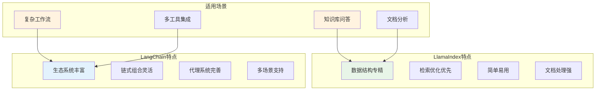

> **翊行代码:深度RAG笔记第10篇**：深入探讨主流RAG框架的特点与应用，掌握快速构建RAG系统的方法

在RAG技术快速发展的今天，两个框架脱颖而出：LlamaIndex和LangChain。它们为开发者提供了强大的工具链，让构建RAG系统变得前所未有的简单。

但是选择哪个框架？如何发挥它们的最大价值？如何避免框架绑定的陷阱？今天我们深入探讨这些问题，看看如何在实际项目中有效利用这些框架。

## 框架对比分析

### LlamaIndex vs LangChain



### 核心差异对比

| 维度 | LlamaIndex | LangChain |
|------|------------|-----------|
| **核心定位** | 专精于RAG和数据索引 | 通用LLM应用开发框架 |
| **学习曲线** | 相对简单，专注数据结构 | 较复杂，概念较多 |
| **数据处理** | 强大的数据连接器和索引 | 基础的文档加载和处理 |
| **检索能力** | 原生支持多种检索策略 | 需要额外配置和扩展 |
| **生态系统** | 专注但精深 | 广泛且丰富 |
| **扩展性** | 在RAG领域高度可扩展 | 在各种应用场景都可扩展 |

## LlamaIndex深度应用

### 核心架构理解

```python
from llama_index import (
    VectorStoreIndex,
    ServiceContext,
    StorageContext,
    load_index_from_storage
)
from llama_index.llms import OpenAI
from llama_index.embeddings import OpenAIEmbedding

class LlamaIndexRAG:
    def __init__(self, persist_dir="./storage"):
        self.persist_dir = persist_dir
        self.setup_service_context()
        self.index = None
        
    def setup_service_context(self):
        """配置服务上下文"""
        # 1. LLM配置
        llm = OpenAI(
            model="gpt-3.5-turbo",
            temperature=0.1,
            max_tokens=512
        )
        
        # 2. 嵌入模型配置
        embed_model = OpenAIEmbedding(
            model="text-embedding-ada-002",
            embed_batch_size=100
        )
        
        # 3. 服务上下文
        self.service_context = ServiceContext.from_defaults(
            llm=llm,
            embed_model=embed_model,
            chunk_size=512,
            chunk_overlap=50
        )
    
    def build_index(self, documents):
        """构建索引"""
        # 创建索引
        self.index = VectorStoreIndex.from_documents(
            documents,
            service_context=self.service_context
        )
        
        # 持久化存储
        self.index.storage_context.persist(persist_dir=self.persist_dir)
        
        return self.index
    
    def load_index(self):
        """加载已存在的索引"""
        storage_context = StorageContext.from_defaults(
            persist_dir=self.persist_dir
        )
        
        self.index = load_index_from_storage(
            storage_context,
            service_context=self.service_context
        )
        
        return self.index
    
    def query(self, question, similarity_top_k=3):
        """查询接口"""
        if self.index is None:
            raise ValueError("Index not built or loaded")
        
        # 创建查询引擎
        query_engine = self.index.as_query_engine(
            similarity_top_k=similarity_top_k,
            response_mode="compact"
        )
        
        # 执行查询
        response = query_engine.query(question)
        
        return {
            'answer': str(response),
            'source_nodes': [node.node.text for node in response.source_nodes],
            'metadata': [node.metadata for node in response.source_nodes]
        }
```

### 高级检索策略

```python
from llama_index.indices.composability import ComposableGraph
from llama_index.indices.keyword_table import KeywordTableIndex
from llama_index.query_engine import RetrieverQueryEngine
from llama_index.retrievers import VectorIndexRetriever, KeywordTableSimpleRetriever

class AdvancedLlamaIndexRAG:
    def __init__(self):
        self.service_context = self._setup_service_context()
        self.indices = {}
        
    def build_hybrid_index(self, documents):
        """构建混合索引"""
        # 1. 向量索引
        vector_index = VectorStoreIndex.from_documents(
            documents,
            service_context=self.service_context
        )
        
        # 2. 关键词索引
        keyword_index = KeywordTableIndex.from_documents(
            documents,
            service_context=self.service_context
        )
        
        # 3. 组合图索引
        graph = ComposableGraph.from_indices(
            KeywordTableIndex,
            [keyword_index, vector_index],
            index_summaries=["关键词索引", "向量索引"],
            service_context=self.service_context
        )
        
        self.indices = {
            'vector': vector_index,
            'keyword': keyword_index,
            'graph': graph
        }
        
        return self.indices
    
    def hybrid_query(self, question, alpha=0.7):
        """混合查询"""
        # 1. 向量检索
        vector_retriever = VectorIndexRetriever(
            index=self.indices['vector'],
            similarity_top_k=5
        )
        vector_nodes = vector_retriever.retrieve(question)
        
        # 2. 关键词检索
        keyword_retriever = KeywordTableSimpleRetriever(
            index=self.indices['keyword']
        )
        keyword_nodes = keyword_retriever.retrieve(question)
        
        # 3. 结果融合
        fused_nodes = self._fuse_retrieval_results(
            vector_nodes, keyword_nodes, alpha
        )
        
        # 4. 生成答案
        query_engine = RetrieverQueryEngine.from_args(
            retriever=self._create_fused_retriever(fused_nodes),
            service_context=self.service_context
        )
        
        response = query_engine.query(question)
        return response
    
    def _fuse_retrieval_results(self, vector_nodes, keyword_nodes, alpha):
        """融合检索结果"""
        # 实现RRF（倒数排名融合）算法
        node_scores = {}
        
        # 向量检索结果评分
        for i, node in enumerate(vector_nodes):
            node_scores[node.node_id] = alpha / (i + 1)
        
        # 关键词检索结果评分
        for i, node in enumerate(keyword_nodes):
            if node.node_id in node_scores:
                node_scores[node.node_id] += (1 - alpha) / (i + 1)
            else:
                node_scores[node.node_id] = (1 - alpha) / (i + 1)
        
        # 按分数排序
        sorted_nodes = sorted(
            node_scores.items(),
            key=lambda x: x[1],
            reverse=True
        )
        
        return sorted_nodes[:5]  # 返回top5
```

## LangChain深度应用

### 基础RAG实现

```python
from langchain.document_loaders import DirectoryLoader
from langchain.text_splitter import RecursiveCharacterTextSplitter
from langchain.embeddings import OpenAIEmbeddings
from langchain.vectorstores import Chroma
from langchain.llms import OpenAI
from langchain.chains import RetrievalQA
from langchain.prompts import PromptTemplate

class LangChainRAG:
    def __init__(self, persist_directory="./chroma_db"):
        self.persist_directory = persist_directory
        self.embeddings = OpenAIEmbeddings()
        self.llm = OpenAI(temperature=0.1)
        self.vectorstore = None
        self.qa_chain = None
        
    def load_and_process_documents(self, documents_path):
        """加载和处理文档"""
        # 1. 加载文档
        loader = DirectoryLoader(documents_path, glob="**/*.txt")
        documents = loader.load()
        
        # 2. 文档分割
        text_splitter = RecursiveCharacterTextSplitter(
            chunk_size=1000,
            chunk_overlap=200,
            separators=["\n\n", "\n", " ", ""]
        )
        texts = text_splitter.split_documents(documents)
        
        return texts
    
    def build_vectorstore(self, documents):
        """构建向量存储"""
        self.vectorstore = Chroma.from_documents(
            documents=documents,
            embedding=self.embeddings,
            persist_directory=self.persist_directory
        )
        self.vectorstore.persist()
        
        return self.vectorstore
    
    def load_vectorstore(self):
        """加载已存在的向量存储"""
        self.vectorstore = Chroma(
            persist_directory=self.persist_directory,
            embedding_function=self.embeddings
        )
        
        return self.vectorstore
    
    def setup_qa_chain(self, chain_type="stuff"):
        """设置问答链"""
        # 自定义提示模板
        prompt_template = """
        基于以下上下文信息回答问题。如果上下文中没有相关信息，请说"我不知道"。
        
        上下文：
        {context}
        
        问题：{question}
        
        答案：
        """
        
        PROMPT = PromptTemplate(
            template=prompt_template,
            input_variables=["context", "question"]
        )
        
        # 创建QA链
        self.qa_chain = RetrievalQA.from_chain_type(
            llm=self.llm,
            chain_type=chain_type,
            retriever=self.vectorstore.as_retriever(
                search_kwargs={"k": 3}
            ),
            chain_type_kwargs={"prompt": PROMPT},
            return_source_documents=True
        )
        
        return self.qa_chain
    
    def query(self, question):
        """查询接口"""
        if self.qa_chain is None:
            raise ValueError("QA chain not set up")
        
        result = self.qa_chain({"query": question})
        
        return {
            'answer': result['result'],
            'source_documents': [doc.page_content for doc in result['source_documents']],
            'metadata': [doc.metadata for doc in result['source_documents']]
        }
```

### 高级链式组合

```python
from langchain.chains import SequentialChain
from langchain.chains.llm import LLMChain
from langchain.memory import ConversationBufferMemory

class AdvancedLangChainRAG:
    def __init__(self):
        self.llm = OpenAI(temperature=0.1)
        self.memory = ConversationBufferMemory()
        self.setup_advanced_chains()
        
    def setup_advanced_chains(self):
        """设置高级链组合"""
        # 1. 查询理解链
        query_understanding_prompt = PromptTemplate(
            input_variables=["query"],
            template="""
            分析以下查询，提取关键信息：
            - 查询类型（事实性、分析性、对比性等）
            - 关键概念
            - 查询意图
            
            查询：{query}
            
            分析结果：
            """
        )
        
        self.query_understanding_chain = LLMChain(
            llm=self.llm,
            prompt=query_understanding_prompt,
            output_key="query_analysis"
        )
        
        # 2. 检索策略选择链
        retrieval_strategy_prompt = PromptTemplate(
            input_variables=["query_analysis"],
            template="""
            基于查询分析结果，选择最适合的检索策略：
            
            查询分析：{query_analysis}
            
            推荐策略：
            - semantic: 语义检索，适合概念性查询
            - keyword: 关键词检索，适合事实性查询
            - hybrid: 混合检索，适合复杂查询
            
            选择策略：
            """
        )
        
        self.retrieval_strategy_chain = LLMChain(
            llm=self.llm,
            prompt=retrieval_strategy_prompt,
            output_key="retrieval_strategy"
        )
        
        # 3. 答案生成链
        answer_generation_prompt = PromptTemplate(
            input_variables=["query", "context", "strategy"],
            template="""
            基于检索到的上下文和选择的策略生成答案：
            
            原始查询：{query}
            检索策略：{strategy}
            上下文信息：{context}
            
            请生成准确、相关且有用的答案：
            """
        )
        
        self.answer_generation_chain = LLMChain(
            llm=self.llm,
            prompt=answer_generation_prompt,
            output_key="answer"
        )
        
        # 4. 组合链
        self.overall_chain = SequentialChain(
            chains=[
                self.query_understanding_chain,
                self.retrieval_strategy_chain,
                self.answer_generation_chain
            ],
            input_variables=["query"],
            output_variables=["query_analysis", "retrieval_strategy", "answer"],
            verbose=True
        )
    
    def intelligent_query(self, question, vectorstore):
        """智能查询处理"""
        # 1. 执行链式处理
        chain_result = self.overall_chain({
            "query": question
        })
        
        # 2. 根据策略执行检索
        strategy = chain_result["retrieval_strategy"].strip().lower()
        
        if "semantic" in strategy:
            retriever = vectorstore.as_retriever(
                search_type="similarity",
                search_kwargs={"k": 5}
            )
        elif "keyword" in strategy:
            retriever = vectorstore.as_retriever(
                search_type="mmr",
                search_kwargs={"k": 5, "fetch_k": 10}
            )
        else:  # hybrid
            retriever = vectorstore.as_retriever(
                search_type="similarity_score_threshold",
                search_kwargs={"score_threshold": 0.7, "k": 5}
            )
        
        # 3. 执行检索
        relevant_docs = retriever.get_relevant_documents(question)
        context = "\n\n".join([doc.page_content for doc in relevant_docs])
        
        # 4. 最终答案生成
        final_answer = self.answer_generation_chain.run(
            query=question,
            context=context,
            strategy=strategy
        )
        
        return {
            'answer': final_answer,
            'query_analysis': chain_result["query_analysis"],
            'strategy_used': strategy,
            'source_documents': [doc.page_content for doc in relevant_docs]
        }
```

## 框架集成最佳实践

### 混合架构设计

```python
class HybridRAGFramework:
    def __init__(self):
        # LlamaIndex for data indexing
        self.llama_index_engine = LlamaIndexRAG()
        
        # LangChain for workflow orchestration
        self.langchain_engine = LangChainRAG()
        
        # 选择器
        self.framework_selector = FrameworkSelector()
        
    def determine_framework(self, query_type, data_type, complexity):
        """选择最适合的框架"""
        if query_type == "simple_retrieval" and data_type == "structured":
            return "llamaindex"
        elif complexity == "high" and "workflow" in query_type:
            return "langchain"
        else:
            return "hybrid"
    
    def process_query(self, question, context=None):
        """处理查询"""
        # 1. 分析查询特征
        query_features = self.analyze_query(question)
        
        # 2. 选择处理框架
        framework = self.determine_framework(
            query_features['type'],
            query_features['data_type'],
            query_features['complexity']
        )
        
        # 3. 执行查询
        if framework == "llamaindex":
            return self.llama_index_engine.query(question)
        elif framework == "langchain":
            return self.langchain_engine.query(question)
        else:
            return self.hybrid_query(question)
    
    def hybrid_query(self, question):
        """混合查询处理"""
        # 使用LlamaIndex进行检索
        retrieval_results = self.llama_index_engine.query(question)
        
        # 使用LangChain进行复杂推理
        langchain_result = self.langchain_engine.process_with_context(
            question, retrieval_results['answer']
        )
        
        return {
            'answer': langchain_result['answer'],
            'retrieval_sources': retrieval_results['source_nodes'],
            'reasoning_chain': langchain_result['reasoning']
        }
```

### 性能优化策略

```python
class OptimizedFrameworkIntegration:
    def __init__(self):
        self.cache = {}
        self.performance_monitor = PerformanceMonitor()
        
    def cached_query(self, framework_func, *args, **kwargs):
        """缓存查询结果"""
        cache_key = self.generate_cache_key(args, kwargs)
        
        if cache_key in self.cache:
            return self.cache[cache_key]
        
        # 性能监控
        start_time = time.time()
        result = framework_func(*args, **kwargs)
        execution_time = time.time() - start_time
        
        # 记录性能数据
        self.performance_monitor.record(
            framework=framework_func.__class__.__name__,
            execution_time=execution_time,
            cache_hit=False
        )
        
        # 缓存结果
        self.cache[cache_key] = result
        
        return result
    
    def adaptive_batch_processing(self, queries, batch_size=10):
        """自适应批处理"""
        results = []
        
        for i in range(0, len(queries), batch_size):
            batch = queries[i:i + batch_size]
            
            # 并行处理批次
            batch_results = asyncio.run(
                self.process_batch_async(batch)
            )
            
            results.extend(batch_results)
            
            # 动态调整批次大小
            avg_time = self.performance_monitor.get_avg_time()
            if avg_time > 5.0:  # 如果平均时间超过5秒
                batch_size = max(5, batch_size - 2)
            elif avg_time < 2.0:  # 如果平均时间少于2秒
                batch_size = min(20, batch_size + 2)
        
        return results
```

## 生态系统扩展

### 自定义组件开发

```python
# LlamaIndex自定义检索器
from llama_index.retrievers.base import BaseRetriever

class CustomHybridRetriever(BaseRetriever):
    def __init__(self, vector_retriever, keyword_retriever, fusion_alpha=0.7):
        self.vector_retriever = vector_retriever
        self.keyword_retriever = keyword_retriever
        self.fusion_alpha = fusion_alpha
        
    def _retrieve(self, query_bundle):
        """自定义检索逻辑"""
        # 向量检索
        vector_nodes = self.vector_retriever.retrieve(query_bundle)
        
        # 关键词检索
        keyword_nodes = self.keyword_retriever.retrieve(query_bundle)
        
        # 结果融合
        fused_nodes = self.fuse_results(vector_nodes, keyword_nodes)
        
        return fused_nodes

# LangChain自定义链
from langchain.chains.base import Chain

class CustomAnalysisChain(Chain):
    def __init__(self, llm, retriever):
        super().__init__()
        self.llm = llm
        self.retriever = retriever
        
    @property
    def input_keys(self):
        return ["query"]
    
    @property
    def output_keys(self):
        return ["analysis", "confidence"]
    
    def _call(self, inputs):
        query = inputs["query"]
        
        # 检索相关文档
        docs = self.retriever.get_relevant_documents(query)
        
        # 分析文档
        analysis = self.analyze_documents(docs, query)
        
        # 计算置信度
        confidence = self.calculate_confidence(analysis, docs)
        
        return {
            "analysis": analysis,
            "confidence": confidence
        }
```

## 部署与维护

### 容器化部署

```dockerfile
# Dockerfile for hybrid RAG system
FROM python:3.9-slim

WORKDIR /app

# Install dependencies
COPY requirements.txt .
RUN pip install -r requirements.txt

# Copy application code
COPY . .

# Environment variables
ENV LLAMAINDEX_CACHE_DIR=/app/cache/llamaindex
ENV LANGCHAIN_CACHE_DIR=/app/cache/langchain

# Create cache directories
RUN mkdir -p /app/cache/llamaindex /app/cache/langchain

# Expose port
EXPOSE 8000

# Start application
CMD ["uvicorn", "main:app", "--host", "0.0.0.0", "--port", "8000"]
```

### 监控与日志

```python
class FrameworkMonitor:
    def __init__(self):
        self.logger = logging.getLogger(__name__)
        self.metrics = defaultdict(list)
        
    def log_framework_usage(self, framework, operation, duration, success):
        """记录框架使用情况"""
        log_entry = {
            'timestamp': datetime.now(),
            'framework': framework,
            'operation': operation,
            'duration': duration,
            'success': success
        }
        
        self.logger.info(f"Framework usage: {log_entry}")
        self.metrics[framework].append(log_entry)
    
    def generate_performance_report(self):
        """生成性能报告"""
        report = {}
        
        for framework, entries in self.metrics.items():
            total_operations = len(entries)
            successful_operations = len([e for e in entries if e['success']])
            avg_duration = sum(e['duration'] for e in entries) / total_operations
            
            report[framework] = {
                'total_operations': total_operations,
                'success_rate': successful_operations / total_operations,
                'avg_duration': avg_duration
            }
        
        return report
```

## 小结

LlamaIndex和LangChain各有优势，在实际项目中的选择策略：

**选择LlamaIndex的场景**：
- 专注于RAG和文档问答
- 需要强大的数据索引能力
- 追求简单易用的API
- 对检索性能要求高

**选择LangChain的场景**：
- 需要复杂的工作流组合
- 要集成多种工具和服务
- 需要灵活的链式处理
- 构建复杂的AI应用

**混合使用策略**：
- 用LlamaIndex处理数据索引
- 用LangChain处理复杂逻辑
- 通过统一接口对外提供服务

合理选择和组合使用这些框架，可以大大提升RAG系统的开发效率和质量。

## 相关资源

本文是深度RAG笔记系列的第十篇，完整的代码示例和实践案例可以在 [RAG-Cookbook](https://github.com/wangyiyang/RAG-Cookbook-Code) 仓库中找到。

**下篇预告**：我们将深入探讨RAGAS评估系统，看看如何科学地评估和改进RAG系统的性能！