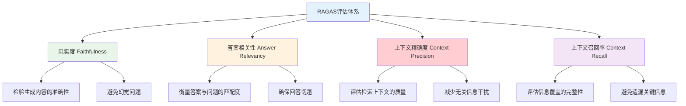

> **翊行代码:深度RAG笔记第11篇**：深入RAGAS评估框架，构建科学的RAG系统评估体系

"这个RAG系统效果怎么样？"面对这个问题，很多开发者只能凭感觉说"还不错"或者"有待改进"。缺乏科学的评估标准，就像盲人摸象一样，很难准确了解系统的真实水平。

RAGAS (RAG Assessment) 的出现改变了这种局面。它专门为RAG系统设计了一套完整的评估体系，让我们能够科学、客观地评估RAG系统的各个维度。

今天我们深入探讨RAGAS框架，看看如何用它构建完善的RAG评估体系。

## RAGAS框架核心理念

### 评估维度设计

RAGAS将RAG系统的评估分解为四个核心维度：



### 评估指标的科学基础

每个评估维度都有其深层的科学原理：

**忠实度（Faithfulness）**：基于自然语言推理（NLI）技术，检验生成内容是否能被检索到的上下文支持。

**答案相关性（Answer Relevancy）**：通过逆向问题生成，评估答案与原问题的语义相关性。

**上下文精确度（Context Precision）**：评估检索到的上下文片段中真正有用信息的比例。

**上下文召回率（Context Recall）**：评估检索系统是否遗漏了重要的相关信息。

## RAGAS实战应用

### 基础评估实现

```python
import asyncio
from ragas import evaluate
from ragas.metrics import (
    faithfulness,
    answer_relevancy,
    context_precision,
    context_recall
)
from datasets import Dataset

class RAGASEvaluator:
    def __init__(self):
        self.metrics = [
            faithfulness,
            answer_relevancy, 
            context_precision,
            context_recall
        ]
        
    def prepare_evaluation_dataset(self, test_cases):
        """准备评估数据集"""
        evaluation_data = {
            'question': [],
            'answer': [],
            'contexts': [],
            'ground_truths': []
        }
        
        for case in test_cases:
            evaluation_data['question'].append(case['question'])
            evaluation_data['answer'].append(case['generated_answer'])
            evaluation_data['contexts'].append(case['retrieved_contexts'])
            evaluation_data['ground_truths'].append(case['ground_truth'])
        
        return Dataset.from_dict(evaluation_data)
    
    async def comprehensive_evaluation(self, rag_system, test_questions):
        """全面评估RAG系统"""
        # 1. 生成评估数据
        test_cases = []
        for question in test_questions:
            # 获取RAG系统的回答和上下文
            result = rag_system.query(question['question'])
            
            test_case = {
                'question': question['question'],
                'generated_answer': result['answer'],
                'retrieved_contexts': result['contexts'],
                'ground_truth': question['expected_answer']
            }
            test_cases.append(test_case)
        
        # 2. 准备数据集
        dataset = self.prepare_evaluation_dataset(test_cases)
        
        # 3. 执行评估
        evaluation_result = evaluate(
            dataset=dataset,
            metrics=self.metrics
        )
        
        # 4. 分析结果
        analysis = self.analyze_results(evaluation_result)
        
        return {
            'scores': evaluation_result,
            'analysis': analysis,
            'recommendations': self.generate_recommendations(analysis)
        }
    
    def analyze_results(self, evaluation_result):
        """分析评估结果"""
        analysis = {}
        
        for metric_name, score in evaluation_result.items():
            if metric_name == 'faithfulness':
                analysis['faithfulness'] = self._analyze_faithfulness(score)
            elif metric_name == 'answer_relevancy':
                analysis['relevancy'] = self._analyze_relevancy(score)
            elif metric_name == 'context_precision':
                analysis['precision'] = self._analyze_precision(score)
            elif metric_name == 'context_recall':
                analysis['recall'] = self._analyze_recall(score)
        
        # 综合分析
        analysis['overall'] = self._overall_analysis(evaluation_result)
        
        return analysis
    
    def _analyze_faithfulness(self, score):
        """忠实度分析"""
        if score >= 0.9:
            return {
                'level': 'excellent',
                'description': '生成内容高度忠实于源材料，幻觉问题很少',
                'action': 'maintain_current_approach'
            }
        elif score >= 0.7:
            return {
                'level': 'good',
                'description': '生成内容基本忠实，但存在一些偏差',
                'action': 'improve_context_utilization'
            }
        else:
            return {
                'level': 'needs_improvement',
                'description': '生成内容存在较多不准确信息',
                'action': 'enhance_faithfulness_control'
            }
```

### 高级评估功能

```python
class AdvancedRAGASEvaluator:
    def __init__(self):
        self.base_evaluator = RAGASEvaluator()
        self.custom_metrics = {}
        
    def add_custom_metric(self, name, metric_func):
        """添加自定义评估指标"""
        self.custom_metrics[name] = metric_func
    
    def domain_specific_evaluation(self, rag_system, domain_test_set, domain_type):
        """领域特定评估"""
        # 根据领域调整评估策略
        if domain_type == 'legal':
            return self._legal_domain_evaluation(rag_system, domain_test_set)
        elif domain_type == 'medical':
            return self._medical_domain_evaluation(rag_system, domain_test_set)
        elif domain_type == 'technical':
            return self._technical_domain_evaluation(rag_system, domain_test_set)
        else:
            return self.base_evaluator.comprehensive_evaluation(
                rag_system, domain_test_set
            )
    
    def _legal_domain_evaluation(self, rag_system, test_set):
        """法律领域专门评估"""
        # 额外的法律专业指标
        legal_metrics = [
            self._legal_accuracy_metric,
            self._citation_accuracy_metric,
            self._legal_reasoning_metric
        ]
        
        results = []
        for test_case in test_set:
            result = rag_system.query(test_case['question'])
            
            # 基础RAGAS评估
            base_scores = self._evaluate_with_ragas(test_case, result)
            
            # 法律专业评估
            legal_scores = {}
            for metric in legal_metrics:
                legal_scores[metric.__name__] = metric(test_case, result)
            
            results.append({
                'base_scores': base_scores,
                'legal_scores': legal_scores,
                'case_id': test_case['id']
            })
        
        return self._aggregate_domain_results(results, 'legal')
    
    def _legal_accuracy_metric(self, test_case, result):
        """法律准确性指标"""
        # 检查法条引用的准确性
        cited_laws = self._extract_legal_citations(result['answer'])
        correct_citations = 0
        
        for citation in cited_laws:
            if self._verify_legal_citation(citation):
                correct_citations += 1
        
        return correct_citations / len(cited_laws) if cited_laws else 0
    
    def temporal_evaluation(self, rag_system, test_set, time_points):
        """时间序列评估"""
        temporal_results = {}
        
        for time_point in time_points:
            # 使用特定时间点的知识库状态
            rag_system.load_knowledge_base_at_time(time_point)
            
            # 执行评估
            evaluation_result = self.base_evaluator.comprehensive_evaluation(
                rag_system, test_set
            )
            
            temporal_results[time_point] = evaluation_result
        
        # 分析时间趋势
        trend_analysis = self._analyze_temporal_trends(temporal_results)
        
        return {
            'temporal_results': temporal_results,
            'trend_analysis': trend_analysis
        }
    
    def comparative_evaluation(self, rag_systems, test_set):
        """比较评估多个RAG系统"""
        comparative_results = {}
        
        for system_name, rag_system in rag_systems.items():
            evaluation_result = self.base_evaluator.comprehensive_evaluation(
                rag_system, test_set
            )
            comparative_results[system_name] = evaluation_result
        
        # 生成对比报告
        comparison_report = self._generate_comparison_report(comparative_results)
        
        return comparison_report
```

## 自动化评估流程

### 持续评估系统

```python
class ContinuousRAGASEvaluation:
    def __init__(self, rag_system):
        self.rag_system = rag_system
        self.evaluator = AdvancedRAGASEvaluator()
        self.performance_tracker = PerformanceTracker()
        self.alert_system = AlertSystem()
        
    def setup_continuous_evaluation(self, evaluation_schedule='daily'):
        """设置持续评估"""
        if evaluation_schedule == 'daily':
            schedule.every().day.at("02:00").do(self.run_evaluation)
        elif evaluation_schedule == 'weekly':
            schedule.every().week.do(self.run_evaluation)
        elif evaluation_schedule == 'hourly':
            schedule.every().hour.do(self.run_evaluation)
        
        # 启动调度器
        self._start_scheduler()
    
    def run_evaluation(self):
        """执行评估"""
        try:
            # 1. 获取测试集
            test_set = self._get_latest_test_set()
            
            # 2. 执行评估
            evaluation_result = self.evaluator.comprehensive_evaluation(
                self.rag_system, test_set
            )
            
            # 3. 记录结果
            self.performance_tracker.record_evaluation(evaluation_result)
            
            # 4. 检查性能回归
            regression_detected = self._check_performance_regression(
                evaluation_result
            )
            
            # 5. 发送告警
            if regression_detected:
                self.alert_system.send_alert(
                    "RAG系统性能回归",
                    evaluation_result
                )
            
            # 6. 生成报告
            self._generate_evaluation_report(evaluation_result)
            
        except Exception as e:
            self.alert_system.send_error_alert(
                "评估过程出错",
                str(e)
            )
    
    def _check_performance_regression(self, current_result):
        """检查性能回归"""
        historical_results = self.performance_tracker.get_recent_results(
            days=7
        )
        
        if not historical_results:
            return False
        
        # 计算平均基线性能
        baseline_scores = self._calculate_baseline_scores(historical_results)
        
        # 检查是否有显著下降
        regression_threshold = 0.05  # 5%的下降阈值
        
        for metric, current_score in current_result['scores'].items():
            baseline_score = baseline_scores.get(metric, 0)
            
            if baseline_score - current_score > regression_threshold:
                return True
        
        return False
    
    def adaptive_test_set_generation(self, user_queries):
        """自适应测试集生成"""
        # 1. 分析用户查询模式
        query_patterns = self._analyze_query_patterns(user_queries)
        
        # 2. 识别常见查询类型
        common_query_types = self._identify_common_types(query_patterns)
        
        # 3. 生成代表性测试用例
        test_cases = []
        for query_type in common_query_types:
            synthetic_cases = self._generate_synthetic_cases(query_type)
            test_cases.extend(synthetic_cases)
        
        # 4. 质量验证
        validated_cases = self._validate_test_cases(test_cases)
        
        return validated_cases
```

### 评估结果可视化

```python
class RAGASVisualization:
    def __init__(self):
        self.plotter = PlotGenerator()
        
    def create_evaluation_dashboard(self, evaluation_results):
        """创建评估仪表板"""
        dashboard = Dashboard()
        
        # 1. 总体性能雷达图
        radar_chart = self._create_radar_chart(evaluation_results)
        dashboard.add_component('radar_chart', radar_chart)
        
        # 2. 时间序列趋势图
        trend_chart = self._create_trend_chart(evaluation_results)
        dashboard.add_component('trend_chart', trend_chart)
        
        # 3. 详细分解图
        breakdown_chart = self._create_breakdown_chart(evaluation_results)
        dashboard.add_component('breakdown_chart', breakdown_chart)
        
        # 4. 改进建议
        recommendations = self._generate_visual_recommendations(evaluation_results)
        dashboard.add_component('recommendations', recommendations)
        
        return dashboard
    
    def _create_radar_chart(self, evaluation_results):
        """创建雷达图"""
        metrics = ['faithfulness', 'answer_relevancy', 'context_precision', 'context_recall']
        scores = [evaluation_results['scores'][metric] for metric in metrics]
        
        fig = go.Figure()
        
        fig.add_trace(go.Scatterpolar(
            r=scores,
            theta=metrics,
            fill='toself',
            name='Current Performance'
        ))
        
        fig.update_layout(
            polar=dict(
                radialaxis=dict(
                    visible=True,
                    range=[0, 1]
                )),
            showlegend=True,
            title="RAG System Performance Radar"
        )
        
        return fig
    
    def generate_improvement_heatmap(self, comparative_results):
        """生成改进热力图"""
        systems = list(comparative_results.keys())
        metrics = ['faithfulness', 'answer_relevancy', 'context_precision', 'context_recall']
        
        # 构建数据矩阵
        data_matrix = []
        for system in systems:
            row = [comparative_results[system]['scores'][metric] for metric in metrics]
            data_matrix.append(row)
        
        # 创建热力图
        fig = px.imshow(
            data_matrix,
            labels=dict(x="Metrics", y="Systems", color="Score"),
            x=metrics,
            y=systems,
            color_continuous_scale='RdYlGn',
            aspect="auto"
        )
        
        fig.update_layout(title="System Performance Comparison Heatmap")
        
        return fig
```

## 高级评估策略

### 人工评估集成

```python
class HumanEvaluationIntegration:
    def __init__(self):
        self.annotation_platform = AnnotationPlatform()
        self.quality_controller = QualityController()
        
    def setup_human_evaluation(self, evaluation_cases, annotator_count=3):
        """设置人工评估"""
        # 1. 创建标注任务
        annotation_tasks = []
        for case in evaluation_cases:
            task = {
                'id': case['id'],
                'question': case['question'],
                'generated_answer': case['answer'],
                'contexts': case['contexts'],
                'evaluation_criteria': {
                    'relevance': 'Rate the relevance of the answer (1-5)',
                    'accuracy': 'Rate the accuracy of the answer (1-5)',
                    'completeness': 'Rate the completeness of the answer (1-5)',
                    'clarity': 'Rate the clarity of the answer (1-5)'
                }
            }
            annotation_tasks.append(task)
        
        # 2. 分配给标注员
        self.annotation_platform.create_annotation_project(
            tasks=annotation_tasks,
            annotator_count=annotator_count,
            quality_requirements={
                'inter_annotator_agreement': 0.8,
                'completion_time_limit': 300  # 5分钟
            }
        )
        
        return annotation_tasks
    
    def collect_and_analyze_annotations(self, project_id):
        """收集和分析标注结果"""
        # 1. 获取标注结果
        annotations = self.annotation_platform.get_annotations(project_id)
        
        # 2. 质量控制
        filtered_annotations = self.quality_controller.filter_low_quality(
            annotations
        )
        
        # 3. 计算一致性
        agreement_scores = self._calculate_inter_annotator_agreement(
            filtered_annotations
        )
        
        # 4. 聚合评分
        aggregated_scores = self._aggregate_scores(filtered_annotations)
        
        return {
            'annotations': filtered_annotations,
            'agreement_scores': agreement_scores,
            'aggregated_scores': aggregated_scores,
            'quality_metrics': self._calculate_annotation_quality(annotations)
        }
    
    def combine_automatic_and_human_evaluation(self, ragas_results, human_results):
        """结合自动和人工评估"""
        combined_evaluation = {}
        
        # 1. 标准化分数
        normalized_ragas = self._normalize_scores(ragas_results, target_range=(1, 5))
        normalized_human = self._normalize_scores(human_results, target_range=(0, 1))
        
        # 2. 计算相关性
        correlation_analysis = self._analyze_correlation(
            normalized_ragas, normalized_human
        )
        
        # 3. 加权融合
        weights = {
            'automatic': 0.6,
            'human': 0.4
        }
        
        for metric in normalized_ragas.keys():
            if metric in normalized_human:
                combined_score = (
                    weights['automatic'] * normalized_ragas[metric] +
                    weights['human'] * normalized_human[metric]
                )
                combined_evaluation[metric] = combined_score
        
        return {
            'combined_scores': combined_evaluation,
            'correlation_analysis': correlation_analysis,
            'confidence_intervals': self._calculate_confidence_intervals(
                combined_evaluation
            )
        }
```

### 对抗性评估

```python
class AdversarialEvaluation:
    def __init__(self):
        self.attack_generator = AttackGenerator()
        self.robustness_tester = RobustnessTester()
        
    def generate_adversarial_test_cases(self, base_test_set):
        """生成对抗性测试用例"""
        adversarial_cases = []
        
        for base_case in base_test_set:
            # 1. 查询扰动
            perturbed_queries = self.attack_generator.generate_query_perturbations(
                base_case['question']
            )
            
            # 2. 上下文污染
            polluted_contexts = self.attack_generator.generate_context_pollution(
                base_case['contexts']
            )
            
            # 3. 组合攻击
            combined_attacks = self.attack_generator.generate_combined_attacks(
                base_case
            )
            
            adversarial_cases.extend([
                {'type': 'query_perturbation', 'cases': perturbed_queries},
                {'type': 'context_pollution', 'cases': polluted_contexts},
                {'type': 'combined_attack', 'cases': combined_attacks}
            ])
        
        return adversarial_cases
    
    def evaluate_robustness(self, rag_system, adversarial_cases):
        """评估系统鲁棒性"""
        robustness_results = {}
        
        for attack_type_group in adversarial_cases:
            attack_type = attack_type_group['type']
            attack_cases = attack_type_group['cases']
            
            type_results = []
            for attack_case in attack_cases:
                # 执行攻击
                result = rag_system.query(attack_case['perturbed_input'])
                
                # 评估攻击效果
                attack_success = self._evaluate_attack_success(
                    attack_case['expected_behavior'],
                    result
                )
                
                type_results.append({
                    'attack_case': attack_case,
                    'system_response': result,
                    'attack_success': attack_success
                })
            
            robustness_results[attack_type] = {
                'total_attacks': len(attack_cases),
                'successful_attacks': sum(r['attack_success'] for r in type_results),
                'robustness_score': 1 - (sum(r['attack_success'] for r in type_results) / len(attack_cases)),
                'detailed_results': type_results
            }
        
        return robustness_results
```

## 小结

RAGAS为RAG系统提供了科学、全面的评估框架：

**核心优势**：
- 四维评估体系，覆盖RAG系统关键性能
- 自动化评估，提高效率和一致性
- 可扩展架构，支持自定义指标

**实践价值**：
- 量化系统性能，指导优化方向
- 支持A/B测试，验证改进效果
- 持续监控，及时发现性能回归

**发展方向**：
- 集成人工评估，提高评估质量
- 对抗性评估，增强系统鲁棒性
- 领域适配，满足专业需求

通过RAGAS评估体系，我们可以建立起科学的RAG系统性能管理流程，确保系统持续改进和优化。

## 相关资源

本文是深度RAG笔记系列的第十一篇，完整的代码示例和实践案例可以在 [RAG-Cookbook](https://github.com/wangyiyang/RAG-Cookbook-Code) 仓库中找到。

**下篇预告**：我们将探讨RAG系统的隐私安全与联邦学习，看看如何在保护数据隐私的同时构建强大的RAG系统！