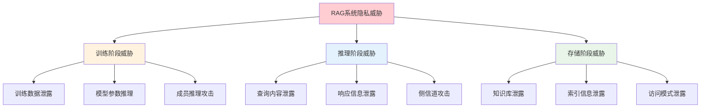

> **翊行代码:深度RAG笔记第12篇**：深入探讨RAG系统的隐私保护机制与联邦学习应用

在数据为王的时代，如何在保护用户隐私的前提下构建强大的RAG系统？如何让多个机构在不共享敏感数据的情况下联合训练RAG模型？

随着数据隐私法规的日益严格和用户隐私意识的不断提高，传统的数据集中处理模式面临着前所未有的挑战。联邦学习为RAG系统提供了新的可能性，让我们能够在保护隐私的同时实现知识共享。

今天我们深入探讨RAG系统中的隐私保护技术和联邦学习应用。

## 隐私威胁分析

### RAG系统的隐私风险



### 威胁模型分析

```python
class PrivacyThreatAnalyzer:
    def __init__(self):
        self.threat_types = {
            'membership_inference': '成员推理攻击',
            'property_inference': '属性推理攻击',
            'model_inversion': '模型逆向攻击',
            'data_extraction': '数据提取攻击'
        }
        
    def analyze_membership_inference_risk(self, model, training_data, test_queries):
        """分析成员推理攻击风险"""
        risk_scores = []
        
        for query in test_queries:
            # 计算模型对查询的置信度
            confidence = model.predict_confidence(query)
            
            # 检查是否能推断查询是否来自训练数据
            membership_probability = self._calculate_membership_probability(
                confidence, query
            )
            
            risk_scores.append(membership_probability)
        
        return {
            'average_risk': np.mean(risk_scores),
            'max_risk': np.max(risk_scores),
            'risk_distribution': self._analyze_risk_distribution(risk_scores)
        }
    
    def analyze_property_inference_risk(self, model, sensitive_properties):
        """分析属性推理攻击风险"""
        property_risks = {}
        
        for property_name, property_data in sensitive_properties.items():
            # 生成探测查询
            probe_queries = self._generate_property_probes(property_name)
            
            # 评估属性泄露风险
            leakage_score = self._evaluate_property_leakage(
                model, probe_queries, property_data
            )
            
            property_risks[property_name] = leakage_score
        
        return property_risks
    
    def generate_privacy_report(self, analysis_results):
        """生成隐私风险报告"""
        report = {
            'overall_risk_level': self._calculate_overall_risk(analysis_results),
            'critical_vulnerabilities': self._identify_critical_vulnerabilities(analysis_results),
            'mitigation_recommendations': self._generate_mitigation_recommendations(analysis_results)
        }
        
        return report
```

## 差分隐私技术

### 差分隐私原理

差分隐私通过在数据或模型输出中添加精心设计的噪声，确保单个数据记录的隐私：

```python
import numpy as np
from scipy import stats

class DifferentialPrivacyRAG:
    def __init__(self, epsilon=1.0, delta=1e-5):
        self.epsilon = epsilon  # 隐私预算
        self.delta = delta      # 失败概率
        self.privacy_accountant = PrivacyAccountant()
        
    def private_document_indexing(self, documents):
        """差分隐私文档索引"""
        # 1. 计算文档敏感度
        sensitivity = self._calculate_document_sensitivity(documents)
        
        # 2. 添加拉普拉斯噪声到词频统计
        noisy_term_frequencies = {}
        for doc in documents:
            terms = self._extract_terms(doc)
            for term in terms:
                true_frequency = terms.count(term)
                noise = np.random.laplace(0, sensitivity / self.epsilon)
                noisy_term_frequencies[term] = max(0, true_frequency + noise)
        
        # 3. 基于带噪声的统计信息构建索引
        private_index = self._build_index_from_noisy_stats(noisy_term_frequencies)
        
        # 4. 更新隐私预算
        self.privacy_accountant.spend_budget(self.epsilon, self.delta)
        
        return private_index
    
    def private_query_processing(self, query, knowledge_base):
        """差分隐私查询处理"""
        # 1. 分析查询敏感度
        query_sensitivity = self._analyze_query_sensitivity(query)
        
        # 2. 私有检索
        private_retrieval_results = self._private_retrieval(
            query, knowledge_base, query_sensitivity
        )
        
        # 3. 私有答案生成
        private_answer = self._private_generation(
            query, private_retrieval_results
        )
        
        return private_answer
    
    def _private_retrieval(self, query, knowledge_base, sensitivity):
        """差分隐私检索"""
        # 计算每个文档的相关性分数
        relevance_scores = []
        for doc in knowledge_base:
            true_score = self._calculate_relevance_score(query, doc)
            # 添加高斯噪声保护隐私
            noise = np.random.normal(0, sensitivity * np.sqrt(2 * np.log(1.25 / self.delta)) / self.epsilon)
            noisy_score = true_score + noise
            relevance_scores.append((doc, noisy_score))
        
        # 基于带噪声的分数排序
        sorted_docs = sorted(relevance_scores, key=lambda x: x[1], reverse=True)
        
        return [doc for doc, score in sorted_docs[:10]]  # 返回top-10
    
    def _private_generation(self, query, contexts):
        """差分隐私生成"""
        # 使用私有聚合技术生成答案
        candidate_answers = []
        
        for context in contexts:
            # 为每个上下文生成候选答案
            answer = self._generate_candidate_answer(query, context)
            candidate_answers.append(answer)
        
        # 私有投票选择最佳答案
        best_answer = self._private_voting(candidate_answers)
        
        return best_answer
    
    def _private_voting(self, candidates):
        """私有投票机制"""
        # 计算每个候选答案的质量分数
        quality_scores = [self._assess_answer_quality(ans) for ans in candidates]
        
        # 添加噪声到投票过程
        noisy_scores = []
        for score in quality_scores:
            noise = np.random.laplace(0, 1 / self.epsilon)
            noisy_scores.append(score + noise)
        
        # 选择得分最高的答案
        best_index = np.argmax(noisy_scores)
        return candidates[best_index]
```

### 隐私预算管理

```python
class PrivacyBudgetManager:
    def __init__(self, total_epsilon=10.0, total_delta=1e-3):
        self.total_epsilon = total_epsilon
        self.total_delta = total_delta
        self.spent_epsilon = 0.0
        self.spent_delta = 0.0
        self.operations_log = []
        
    def allocate_budget(self, operation_name, required_epsilon, required_delta):
        """分配隐私预算"""
        if self.spent_epsilon + required_epsilon > self.total_epsilon:
            raise PrivacyBudgetExhaustedError("隐私预算不足")
        
        if self.spent_delta + required_delta > self.total_delta:
            raise PrivacyBudgetExhaustedError("δ预算不足")
        
        # 分配预算
        self.spent_epsilon += required_epsilon
        self.spent_delta += required_delta
        
        # 记录操作
        self.operations_log.append({
            'operation': operation_name,
            'epsilon': required_epsilon,
            'delta': required_delta,
            'timestamp': datetime.now()
        })
        
        return {
            'allocated_epsilon': required_epsilon,
            'allocated_delta': required_delta,
            'remaining_epsilon': self.total_epsilon - self.spent_epsilon,
            'remaining_delta': self.total_delta - self.spent_delta
        }
    
    def adaptive_budget_allocation(self, operations_queue):
        """自适应预算分配"""
        # 根据操作重要性和剩余预算动态分配
        sorted_operations = sorted(
            operations_queue, 
            key=lambda x: x['priority'], 
            reverse=True
        )
        
        allocation_plan = []
        remaining_epsilon = self.total_epsilon - self.spent_epsilon
        
        for operation in sorted_operations:
            # 根据剩余预算调整分配策略
            if operation['priority'] == 'high':
                allocated_epsilon = min(operation['requested_epsilon'], remaining_epsilon * 0.3)
            elif operation['priority'] == 'medium':
                allocated_epsilon = min(operation['requested_epsilon'], remaining_epsilon * 0.2)
            else:
                allocated_epsilon = min(operation['requested_epsilon'], remaining_epsilon * 0.1)
            
            if allocated_epsilon > 0:
                allocation_plan.append({
                    'operation': operation['name'],
                    'allocated_epsilon': allocated_epsilon,
                    'requested_epsilon': operation['requested_epsilon']
                })
                remaining_epsilon -= allocated_epsilon
        
        return allocation_plan
```

## 联邦学习RAG

### 联邦RAG架构

```python
class FederatedRAGSystem:
    def __init__(self, client_id, coordinator_address):
        self.client_id = client_id
        self.coordinator = FederatedCoordinator(coordinator_address)
        self.local_model = LocalRAGModel()
        self.secure_aggregator = SecureAggregator()
        
    def federated_training_round(self, local_data, global_round):
        """联邦训练轮次"""
        # 1. 从协调器获取全局模型
        global_model_params = self.coordinator.get_global_model(global_round)
        
        # 2. 更新本地模型
        self.local_model.update_parameters(global_model_params)
        
        # 3. 本地训练
        local_updates = self._local_training(local_data)
        
        # 4. 安全聚合本地更新
        encrypted_updates = self.secure_aggregator.encrypt_updates(local_updates)
        
        # 5. 发送到协调器
        self.coordinator.submit_updates(self.client_id, encrypted_updates)
        
        return local_updates
    
    def _local_training(self, local_data):
        """本地训练过程"""
        # 1. 数据预处理
        processed_data = self._preprocess_local_data(local_data)
        
        # 2. 本地梯度计算
        gradients = self.local_model.compute_gradients(processed_data)
        
        # 3. 差分隐私保护
        private_gradients = self._apply_differential_privacy(gradients)
        
        return private_gradients
    
    def _apply_differential_privacy(self, gradients):
        """应用差分隐私保护"""
        private_gradients = {}
        
        for param_name, gradient in gradients.items():
            # 计算梯度敏感度
            sensitivity = self._calculate_gradient_sensitivity(gradient)
            
            # 添加高斯噪声
            noise = np.random.normal(
                0, 
                sensitivity * np.sqrt(2 * np.log(1.25 / self.delta)) / self.epsilon,
                gradient.shape
            )
            
            private_gradients[param_name] = gradient + noise
        
        return private_gradients
    
    def collaborative_knowledge_construction(self, participants):
        """协作知识构建"""
        # 1. 知识图谱对齐
        aligned_graphs = self._align_knowledge_graphs(participants)
        
        # 2. 安全多方计算
        joint_embeddings = self._secure_multiparty_embedding_learning(aligned_graphs)
        
        # 3. 隐私保护知识融合
        fused_knowledge = self._private_knowledge_fusion(joint_embeddings)
        
        return fused_knowledge

class FederatedCoordinator:
    def __init__(self):
        self.participants = {}
        self.global_model = GlobalRAGModel()
        self.aggregator = FederatedAveraging()
        
    def register_participant(self, client_id, client_info):
        """注册参与者"""
        self.participants[client_id] = {
            'info': client_info,
            'status': 'active',
            'contribution_history': []
        }
    
    def coordinate_training_round(self, round_number):
        """协调训练轮次"""
        # 1. 选择参与者
        selected_participants = self._select_participants()
        
        # 2. 分发全局模型
        for participant_id in selected_participants:
            self._send_global_model(participant_id, round_number)
        
        # 3. 收集本地更新
        local_updates = self._collect_local_updates(selected_participants)
        
        # 4. 聚合更新
        aggregated_updates = self.aggregator.aggregate(local_updates)
        
        # 5. 更新全局模型
        self.global_model.apply_updates(aggregated_updates)
        
        return self.global_model
    
    def _select_participants(self, selection_ratio=0.3):
        """选择参与者"""
        active_participants = [
            pid for pid, info in self.participants.items() 
            if info['status'] == 'active'
        ]
        
        # 随机选择或基于贡献度选择
        num_selected = max(1, int(len(active_participants) * selection_ratio))
        selected = np.random.choice(active_participants, num_selected, replace=False)
        
        return selected.tolist()
```

### 同态加密应用

```python
class HomomorphicEncryptionRAG:
    def __init__(self):
        self.he_scheme = HomomorphicEncryption()
        self.public_key, self.private_key = self.he_scheme.generate_keys()
        
    def encrypted_similarity_computation(self, query_embedding, document_embeddings):
        """加密相似度计算"""
        # 1. 加密查询嵌入
        encrypted_query = self.he_scheme.encrypt(query_embedding, self.public_key)
        
        # 2. 计算加密相似度
        encrypted_similarities = []
        for doc_embedding in document_embeddings:
            encrypted_doc = self.he_scheme.encrypt(doc_embedding, self.public_key)
            
            # 同态点积计算
            encrypted_similarity = self.he_scheme.dot_product(
                encrypted_query, encrypted_doc
            )
            encrypted_similarities.append(encrypted_similarity)
        
        return encrypted_similarities
    
    def encrypted_retrieval(self, encrypted_similarities, threshold):
        """加密检索"""
        # 1. 加密阈值
        encrypted_threshold = self.he_scheme.encrypt(threshold, self.public_key)
        
        # 2. 同态比较
        retrieved_indices = []
        for i, enc_sim in enumerate(encrypted_similarities):
            # 同态比较操作
            comparison_result = self.he_scheme.compare(enc_sim, encrypted_threshold)
            
            # 注意：实际实现中需要使用安全多方计算来处理比较结果
            if comparison_result:  # 这里简化了解密过程
                retrieved_indices.append(i)
        
        return retrieved_indices
    
    def secure_aggregation(self, encrypted_updates_list):
        """安全聚合"""
        # 同态加法聚合多个加密更新
        aggregated_update = encrypted_updates_list[0]
        
        for encrypted_update in encrypted_updates_list[1:]:
            aggregated_update = self.he_scheme.add(
                aggregated_update, encrypted_update
            )
        
        # 平均化（除法在同态加密中较复杂，这里简化）
        num_participants = len(encrypted_updates_list)
        averaged_update = self.he_scheme.multiply_by_scalar(
            aggregated_update, 1.0 / num_participants
        )
        
        return averaged_update
```

## 安全多方计算

### MPC协议实现

```python
class SecureMultipartyRAG:
    def __init__(self, party_id, num_parties):
        self.party_id = party_id
        self.num_parties = num_parties
        self.secret_sharing = SecretSharing(num_parties)
        
    def secure_document_matching(self, local_documents, target_query):
        """安全文档匹配"""
        # 1. 秘密分享本地文档特征
        document_shares = []
        for doc in local_documents:
            doc_features = self._extract_features(doc)
            shares = self.secret_sharing.share_secret(doc_features)
            document_shares.append(shares)
        
        # 2. 秘密分享查询特征
        query_features = self._extract_features(target_query)
        query_shares = self.secret_sharing.share_secret(query_features)
        
        # 3. 安全相似度计算
        similarity_shares = []
        for doc_shares in document_shares:
            sim_shares = self._secure_similarity_computation(
                query_shares, doc_shares
            )
            similarity_shares.append(sim_shares)
        
        # 4. 安全排序和选择
        top_k_shares = self._secure_top_k_selection(similarity_shares, k=5)
        
        return top_k_shares
    
    def _secure_similarity_computation(self, query_shares, doc_shares):
        """安全相似度计算"""
        # 使用秘密分享进行点积计算
        dot_product_shares = self.secret_sharing.secure_dot_product(
            query_shares, doc_shares
        )
        
        # 计算模长（需要安全平方根，这里简化）
        query_norm_shares = self.secret_sharing.secure_norm(query_shares)
        doc_norm_shares = self.secret_sharing.secure_norm(doc_shares)
        
        # 安全除法计算余弦相似度
        similarity_shares = self.secret_sharing.secure_division(
            dot_product_shares,
            self.secret_sharing.secure_multiplication(
                query_norm_shares, doc_norm_shares
            )
        )
        
        return similarity_shares
    
    def _secure_top_k_selection(self, similarity_shares_list, k):
        """安全Top-K选择"""
        # 实现安全排序算法
        sorted_indices = self.secret_sharing.secure_sort(similarity_shares_list)
        
        # 返回前K个
        return sorted_indices[:k]
    
    def collaborative_embedding_learning(self, local_embeddings):
        """协作嵌入学习"""
        # 1. 安全梯度计算
        local_gradients = self._compute_local_gradients(local_embeddings)
        
        # 2. 秘密分享梯度
        gradient_shares = []
        for gradient in local_gradients:
            shares = self.secret_sharing.share_secret(gradient)
            gradient_shares.append(shares)
        
        # 3. 安全聚合
        aggregated_gradient_shares = self.secret_sharing.secure_sum(
            gradient_shares
        )
        
        # 4. 安全更新
        updated_embeddings = self._secure_gradient_update(
            local_embeddings, aggregated_gradient_shares
        )
        
        return updated_embeddings
```

### 可验证计算

```python
class VerifiableRAGComputation:
    def __init__(self):
        self.zk_system = ZeroKnowledgeSystem()
        self.verification_key = None
        self.proving_key = None
        
    def setup_verification_system(self, computation_circuit):
        """设置验证系统"""
        self.proving_key, self.verification_key = self.zk_system.setup(
            computation_circuit
        )
    
    def generate_retrieval_proof(self, query, retrieved_documents, knowledge_base):
        """生成检索证明"""
        # 1. 构建检索电路
        retrieval_circuit = self._build_retrieval_circuit(
            query, retrieved_documents, knowledge_base
        )
        
        # 2. 生成零知识证明
        proof = self.zk_system.prove(
            retrieval_circuit,
            self.proving_key,
            private_inputs={
                'knowledge_base': knowledge_base,
                'similarity_scores': self._compute_similarity_scores(query, knowledge_base)
            },
            public_inputs={
                'query_hash': self._hash_query(query),
                'retrieved_doc_hashes': [self._hash_document(doc) for doc in retrieved_documents]
            }
        )
        
        return proof
    
    def verify_retrieval_correctness(self, proof, public_inputs):
        """验证检索正确性"""
        is_valid = self.zk_system.verify(
            proof,
            self.verification_key,
            public_inputs
        )
        
        return is_valid
    
    def _build_retrieval_circuit(self, query, retrieved_docs, knowledge_base):
        """构建检索电路"""
        circuit = Circuit()
        
        # 定义约束：检索到的文档确实是相似度最高的K个
        for i, doc in enumerate(retrieved_docs):
            doc_similarity = circuit.similarity_constraint(query, doc)
            
            # 约束：该文档的相似度高于未检索的文档
            for other_doc in knowledge_base:
                if other_doc not in retrieved_docs:
                    other_similarity = circuit.similarity_constraint(query, other_doc)
                    circuit.add_constraint(doc_similarity >= other_similarity)
        
        return circuit
```

## 隐私保护评估

### 隐私度量方法

```python
class PrivacyMetrics:
    def __init__(self):
        self.metrics = {
            'differential_privacy': self._measure_dp_privacy,
            'k_anonymity': self._measure_k_anonymity,
            'l_diversity': self._measure_l_diversity,
            'mutual_information': self._measure_mutual_information
        }
    
    def comprehensive_privacy_evaluation(self, rag_system, test_data):
        """综合隐私评估"""
        evaluation_results = {}
        
        for metric_name, metric_func in self.metrics.items():
            try:
                metric_score = metric_func(rag_system, test_data)
                evaluation_results[metric_name] = {
                    'score': metric_score,
                    'status': self._interpret_score(metric_name, metric_score)
                }
            except Exception as e:
                evaluation_results[metric_name] = {
                    'error': str(e),
                    'status': 'failed'
                }
        
        return evaluation_results
    
    def _measure_dp_privacy(self, rag_system, test_data):
        """测量差分隐私程度"""
        epsilon_estimates = []
        
        # 使用相邻数据集测试
        for i in range(len(test_data) - 1):
            dataset1 = test_data[:i] + test_data[i+1:]  # 移除第i个记录
            dataset2 = test_data  # 原始数据集
            
            # 计算输出分布的差异
            output_diff = self._compare_output_distributions(
                rag_system, dataset1, dataset2
            )
            
            # 估计epsilon值
            estimated_epsilon = math.log(output_diff) if output_diff > 0 else float('inf')
            epsilon_estimates.append(estimated_epsilon)
        
        return min(epsilon_estimates)  # 最严格的隐私保证
    
    def _measure_k_anonymity(self, rag_system, test_data):
        """测量k-匿名性"""
        # 分析查询模式的匿名化程度
        query_patterns = self._extract_query_patterns(test_data)
        
        anonymity_levels = []
        for pattern in query_patterns:
            similar_patterns = self._find_similar_patterns(pattern, query_patterns)
            anonymity_levels.append(len(similar_patterns))
        
        return min(anonymity_levels)  # 最小匿名集大小
    
    def _measure_mutual_information(self, rag_system, sensitive_attributes):
        """测量互信息泄露"""
        total_mi = 0
        
        for attribute in sensitive_attributes:
            # 计算属性与模型输出的互信息
            mi = self._calculate_mutual_information(
                attribute, rag_system.get_outputs()
            )
            total_mi += mi
        
        return total_mi
    
    def generate_privacy_report(self, evaluation_results):
        """生成隐私报告"""
        report = {
            'overall_privacy_score': self._calculate_overall_score(evaluation_results),
            'privacy_strengths': [],
            'privacy_weaknesses': [],
            'recommendations': []
        }
        
        for metric, result in evaluation_results.items():
            if result['status'] == 'strong':
                report['privacy_strengths'].append(metric)
            elif result['status'] == 'weak':
                report['privacy_weaknesses'].append(metric)
                report['recommendations'].append(
                    self._get_improvement_recommendation(metric)
                )
        
        return report
```

## 实际部署考虑

### 性能与隐私平衡

```python
class PrivacyPerformanceOptimizer:
    def __init__(self):
        self.privacy_cost_model = PrivacyCostModel()
        self.performance_model = PerformanceModel()
        
    def optimize_privacy_performance_tradeoff(self, privacy_requirements, performance_requirements):
        """优化隐私-性能权衡"""
        # 1. 定义优化目标
        def objective_function(config):
            privacy_cost = self.privacy_cost_model.evaluate(config)
            performance_cost = self.performance_model.evaluate(config)
            
            # 多目标优化：最小化隐私代价和性能损失
            return privacy_cost + performance_cost
        
        # 2. 定义约束条件
        constraints = [
            lambda config: self._check_privacy_constraints(config, privacy_requirements),
            lambda config: self._check_performance_constraints(config, performance_requirements)
        ]
        
        # 3. 执行优化
        optimal_config = self._pareto_optimization(objective_function, constraints)
        
        return optimal_config
    
    def adaptive_privacy_budget_allocation(self, query_stream):
        """自适应隐私预算分配"""
        budget_allocation = {}
        
        for query in query_stream:
            # 分析查询重要性
            importance_score = self._assess_query_importance(query)
            
            # 基于重要性分配预算
            if importance_score > 0.8:
                allocated_epsilon = 0.5
            elif importance_score > 0.5:
                allocated_epsilon = 0.3
            else:
                allocated_epsilon = 0.1
            
            budget_allocation[query.id] = allocated_epsilon
        
        return budget_allocation
```

## 小结

隐私保护与联邦学习为RAG系统提供了新的发展方向：

**隐私保护技术**：
- 差分隐私：提供量化的隐私保证
- 同态加密：支持加密数据上的计算
- 安全多方计算：实现无需信任的协作

**联邦学习优势**：
- 数据不出域：保护数据主权
- 协作学习：提升模型性能
- 合规友好：满足隐私法规要求

**实践挑战**：
- 性能开销：隐私保护带来计算和通信成本
- 技术复杂性：需要专业的密码学知识
- 标准化缺失：缺乏统一的实施标准

随着隐私保护技术的不断成熟，我们有理由相信，隐私友好的RAG系统将成为未来的主流趋势。

## 相关资源

本文是深度RAG笔记系列的第十二篇，完整的代码示例和实践案例可以在 [RAG-Cookbook](https://github.com/wangyiyang/RAG-Cookbook-Code) 仓库中找到。

**下篇预告**：我们将探讨RAG系统的性能优化与缓存压缩技术，看看如何构建高效的生产级RAG系统！