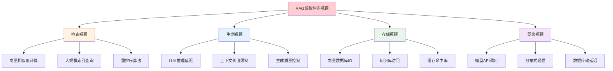

> **翊行代码:深度RAG笔记第13篇**：深入RAG系统性能优化策略，掌握缓存与压缩的核心技术

在生产环境中，RAG系统面临着严峻的性能挑战：用户期待毫秒级的响应时间，但系统需要处理海量文档检索、复杂的语义计算和大规模模型推理。如何在保证质量的前提下，让RAG系统跑得更快、用得更少？

今天我们深入探讨RAG系统的性能优化技术，从缓存策略到压缩算法，从内存管理到并发优化，全方位提升系统性能。

## 性能瓶颈分析

### 系统性能剖析



### 性能指标监控

```python
import time
import psutil
import threading
from collections import defaultdict

class PerformanceProfiler:
    def __init__(self):
        self.metrics = defaultdict(list)
        self.start_times = {}
        self.resource_monitor = ResourceMonitor()
        
    def start_timing(self, operation_name):
        """开始计时"""
        self.start_times[operation_name] = time.time()
        
    def end_timing(self, operation_name):
        """结束计时"""
        if operation_name in self.start_times:
            duration = time.time() - self.start_times[operation_name]
            self.metrics[operation_name].append(duration)
            del self.start_times[operation_name]
            return duration
        return None
    
    def profile_rag_pipeline(self, rag_system, queries):
        """性能剖析RAG流水线"""
        pipeline_metrics = {}
        
        for query in queries:
            query_metrics = {}
            
            # 1. 查询预处理
            self.start_timing('query_preprocessing')
            processed_query = rag_system.preprocess_query(query)
            query_metrics['preprocessing'] = self.end_timing('query_preprocessing')
            
            # 2. 检索阶段
            self.start_timing('retrieval')
            retrieval_results = rag_system.retrieve(processed_query)
            query_metrics['retrieval'] = self.end_timing('retrieval')
            
            # 3. 重排序
            self.start_timing('reranking')
            reranked_results = rag_system.rerank(processed_query, retrieval_results)
            query_metrics['reranking'] = self.end_timing('reranking')
            
            # 4. 生成阶段
            self.start_timing('generation')
            answer = rag_system.generate(processed_query, reranked_results)
            query_metrics['generation'] = self.end_timing('generation')
            
            # 5. 资源使用监控
            query_metrics['memory_usage'] = self.resource_monitor.get_memory_usage()
            query_metrics['cpu_usage'] = self.resource_monitor.get_cpu_usage()
            
            pipeline_metrics[query] = query_metrics
        
        return self.analyze_pipeline_performance(pipeline_metrics)
    
    def analyze_pipeline_performance(self, pipeline_metrics):
        """分析流水线性能"""
        analysis = {
            'avg_total_time': 0,
            'bottleneck_stages': [],
            'resource_utilization': {},
            'optimization_recommendations': []
        }
        
        # 计算各阶段平均时间
        stage_times = defaultdict(list)
        for query_metrics in pipeline_metrics.values():
            for stage, duration in query_metrics.items():
                if isinstance(duration, (int, float)):
                    stage_times[stage].append(duration)
        
        avg_stage_times = {
            stage: sum(times) / len(times) 
            for stage, times in stage_times.items()
        }
        
        # 识别瓶颈
        max_time_stage = max(avg_stage_times.items(), key=lambda x: x[1])
        analysis['bottleneck_stages'] = [max_time_stage[0]]
        
        # 生成优化建议
        if max_time_stage[0] == 'retrieval':
            analysis['optimization_recommendations'].append(
                "考虑优化向量检索算法或增加缓存"
            )
        elif max_time_stage[0] == 'generation':
            analysis['optimization_recommendations'].append(
                "考虑模型量化或使用更快的生成策略"
            )
        
        return analysis

class ResourceMonitor:
    def __init__(self):
        self.process = psutil.Process()
        
    def get_memory_usage(self):
        """获取内存使用情况"""
        memory_info = self.process.memory_info()
        return {
            'rss': memory_info.rss / 1024 / 1024,  # MB
            'vms': memory_info.vms / 1024 / 1024   # MB
        }
    
    def get_cpu_usage(self):
        """获取CPU使用率"""
        return self.process.cpu_percent()
    
    def get_disk_io(self):
        """获取磁盘IO"""
        io_counters = self.process.io_counters()
        return {
            'read_bytes': io_counters.read_bytes,
            'write_bytes': io_counters.write_bytes
        }
```

## 多层缓存策略

### 智能缓存架构

```python
import hashlib
import json
import redis
from typing import Any, Optional
from abc import ABC, abstractmethod

class CacheLayer(ABC):
    @abstractmethod
    def get(self, key: str) -> Optional[Any]:
        pass
    
    @abstractmethod
    def set(self, key: str, value: Any, ttl: int = 3600) -> bool:
        pass
    
    @abstractmethod
    def delete(self, key: str) -> bool:
        pass

class MemoryCache(CacheLayer):
    def __init__(self, max_size: int = 1000):
        self.cache = {}
        self.access_order = []
        self.max_size = max_size
        
    def get(self, key: str) -> Optional[Any]:
        if key in self.cache:
            # LRU更新访问顺序
            self.access_order.remove(key)
            self.access_order.append(key)
            return self.cache[key]
        return None
    
    def set(self, key: str, value: Any, ttl: int = 3600) -> bool:
        if len(self.cache) >= self.max_size and key not in self.cache:
            # 删除最久未使用的项
            lru_key = self.access_order.pop(0)
            del self.cache[lru_key]
        
        self.cache[key] = value
        if key not in self.access_order:
            self.access_order.append(key)
        
        return True
    
    def delete(self, key: str) -> bool:
        if key in self.cache:
            del self.cache[key]
            self.access_order.remove(key)
            return True
        return False

class RedisCache(CacheLayer):
    def __init__(self, host='localhost', port=6379, db=0):
        self.redis_client = redis.Redis(host=host, port=port, db=db)
        
    def get(self, key: str) -> Optional[Any]:
        try:
            value = self.redis_client.get(key)
            if value:
                return json.loads(value.decode('utf-8'))
        except Exception:
            return None
        return None
    
    def set(self, key: str, value: Any, ttl: int = 3600) -> bool:
        try:
            serialized_value = json.dumps(value, default=str)
            return self.redis_client.setex(key, ttl, serialized_value)
        except Exception:
            return False
    
    def delete(self, key: str) -> bool:
        try:
            return bool(self.redis_client.delete(key))
        except Exception:
            return False

class MultiLevelCache:
    def __init__(self):
        self.l1_cache = MemoryCache(max_size=1000)  # 内存缓存
        self.l2_cache = RedisCache()                # Redis缓存
        self.cache_stats = {
            'l1_hits': 0,
            'l2_hits': 0,
            'misses': 0
        }
        
    def get(self, key: str) -> Optional[Any]:
        # L1缓存查找
        value = self.l1_cache.get(key)
        if value is not None:
            self.cache_stats['l1_hits'] += 1
            return value
        
        # L2缓存查找
        value = self.l2_cache.get(key)
        if value is not None:
            self.cache_stats['l2_hits'] += 1
            # 回填L1缓存
            self.l1_cache.set(key, value)
            return value
        
        self.cache_stats['misses'] += 1
        return None
    
    def set(self, key: str, value: Any, ttl: int = 3600):
        # 同时写入两级缓存
        self.l1_cache.set(key, value, ttl)
        self.l2_cache.set(key, value, ttl)
    
    def generate_cache_key(self, query: str, context: dict = None) -> str:
        """生成缓存键"""
        key_data = {
            'query': query,
            'context': context or {}
        }
        key_string = json.dumps(key_data, sort_keys=True)
        return hashlib.md5(key_string.encode()).hexdigest()
    
    def get_cache_stats(self):
        """获取缓存统计"""
        total_requests = sum(self.cache_stats.values())
        if total_requests == 0:
            return {'hit_rate': 0, 'l1_rate': 0, 'l2_rate': 0}
        
        return {
            'hit_rate': (self.cache_stats['l1_hits'] + self.cache_stats['l2_hits']) / total_requests,
            'l1_rate': self.cache_stats['l1_hits'] / total_requests,
            'l2_rate': self.cache_stats['l2_hits'] / total_requests
        }

class SmartRAGCache:
    def __init__(self):
        self.multi_cache = MultiLevelCache()
        self.cache_warmer = CacheWarmer()
        self.invalidation_manager = CacheInvalidationManager()
        
    def cached_retrieval(self, rag_system, query: str, context: dict = None):
        """缓存检索结果"""
        cache_key = self.multi_cache.generate_cache_key(query, context)
        
        # 尝试从缓存获取
        cached_result = self.multi_cache.get(cache_key)
        if cached_result is not None:
            return cached_result
        
        # 缓存未命中，执行检索
        result = rag_system.retrieve(query, context)
        
        # 存储到缓存
        cache_ttl = self._determine_cache_ttl(query, result)
        self.multi_cache.set(cache_key, result, cache_ttl)
        
        return result
    
    def _determine_cache_ttl(self, query: str, result: dict) -> int:
        """智能确定缓存TTL"""
        # 基于查询类型和结果质量确定TTL
        base_ttl = 3600  # 1小时
        
        # 高质量结果延长TTL
        if result.get('confidence', 0) > 0.9:
            return base_ttl * 2
        
        # 实时性要求高的查询缩短TTL
        if self._is_time_sensitive(query):
            return base_ttl // 2
        
        return base_ttl
    
    def warm_cache(self, popular_queries: list):
        """缓存预热"""
        return self.cache_warmer.warm_cache(popular_queries)

class CacheWarmer:
    def __init__(self, rag_system):
        self.rag_system = rag_system
        
    def warm_cache(self, popular_queries: list):
        """预热缓存"""
        warmed_count = 0
        
        for query in popular_queries:
            try:
                # 预执行热门查询
                result = self.rag_system.retrieve(query)
                warmed_count += 1
            except Exception as e:
                print(f"缓存预热失败: {query}, 错误: {e}")
                
        return warmed_count
```

## 向量压缩技术

### 量化压缩算法

```python
import numpy as np
from sklearn.cluster import KMeans
from typing import Tuple

class VectorCompressor:
    def __init__(self, compression_method='pq'):
        self.compression_method = compression_method
        self.codebooks = None
        self.centroids = None
        
    def product_quantization(self, vectors: np.ndarray, num_subvectors: int = 8, 
                           num_centroids: int = 256) -> Tuple[np.ndarray, dict]:
        """乘积量化压缩"""
        n_vectors, dimension = vectors.shape
        subvector_dim = dimension // num_subvectors
        
        # 分割向量为子向量
        subvectors = vectors.reshape(n_vectors, num_subvectors, subvector_dim)
        
        # 为每个子向量空间训练码本
        codebooks = []
        compressed_codes = np.zeros((n_vectors, num_subvectors), dtype=np.uint8)
        
        for i in range(num_subvectors):
            # K-means聚类生成码本
            kmeans = KMeans(n_clusters=num_centroids, random_state=42)
            codes = kmeans.fit_predict(subvectors[:, i, :])
            
            codebooks.append(kmeans.cluster_centers_)
            compressed_codes[:, i] = codes
        
        compression_info = {
            'codebooks': codebooks,
            'num_subvectors': num_subvectors,
            'subvector_dim': subvector_dim,
            'compression_ratio': self._calculate_compression_ratio(
                vectors.nbytes, compressed_codes.nbytes + sum(cb.nbytes for cb in codebooks)
            )
        }
        
        return compressed_codes, compression_info
    
    def decompress_pq(self, compressed_codes: np.ndarray, compression_info: dict) -> np.ndarray:
        """乘积量化解压缩"""
        codebooks = compression_info['codebooks']
        num_subvectors = compression_info['num_subvectors']
        subvector_dim = compression_info['subvector_dim']
        
        n_vectors = compressed_codes.shape[0]
        dimension = num_subvectors * subvector_dim
        
        # 重构向量
        reconstructed = np.zeros((n_vectors, dimension))
        
        for i in range(num_subvectors):
            start_idx = i * subvector_dim
            end_idx = (i + 1) * subvector_dim
            
            codes = compressed_codes[:, i]
            reconstructed[:, start_idx:end_idx] = codebooks[i][codes]
        
        return reconstructed
    
    def scalar_quantization(self, vectors: np.ndarray, num_bits: int = 8) -> Tuple[np.ndarray, dict]:
        """标量量化"""
        # 计算量化参数
        min_vals = np.min(vectors, axis=0)
        max_vals = np.max(vectors, axis=0)
        
        # 量化级别
        num_levels = 2 ** num_bits
        scales = (max_vals - min_vals) / (num_levels - 1)
        
        # 量化
        quantized = np.round((vectors - min_vals) / scales).astype(np.uint8)
        
        compression_info = {
            'min_vals': min_vals,
            'scales': scales,
            'num_bits': num_bits,
            'compression_ratio': self._calculate_compression_ratio(
                vectors.nbytes, quantized.nbytes + min_vals.nbytes + scales.nbytes
            )
        }
        
        return quantized, compression_info
    
    def decompress_scalar(self, quantized: np.ndarray, compression_info: dict) -> np.ndarray:
        """标量量化解压缩"""
        min_vals = compression_info['min_vals']
        scales = compression_info['scales']
        
        return quantized.astype(np.float32) * scales + min_vals
    
    def adaptive_compression(self, vectors: np.ndarray, target_compression_ratio: float = 0.25):
        """自适应压缩"""
        methods = [
            ('pq', self.product_quantization),
            ('scalar_8bit', lambda v: self.scalar_quantization(v, 8)),
            ('scalar_4bit', lambda v: self.scalar_quantization(v, 4))
        ]
        
        best_method = None
        best_ratio = 0
        best_result = None
        
        for method_name, method_func in methods:
            try:
                compressed, info = method_func(vectors)
                ratio = info['compression_ratio']
                
                if ratio >= target_compression_ratio and ratio > best_ratio:
                    best_method = method_name
                    best_ratio = ratio
                    best_result = (compressed, info)
                    
            except Exception as e:
                print(f"压缩方法 {method_name} 失败: {e}")
        
        return best_result, best_method
    
    def _calculate_compression_ratio(self, original_size: int, compressed_size: int) -> float:
        """计算压缩比"""
        return 1 - (compressed_size / original_size)

class CompressedVectorIndex:
    def __init__(self, compressor: VectorCompressor):
        self.compressor = compressor
        self.compressed_vectors = None
        self.compression_info = None
        self.original_norms = None
        
    def build_index(self, vectors: np.ndarray):
        """构建压缩索引"""
        # 标准化向量
        norms = np.linalg.norm(vectors, axis=1)
        normalized_vectors = vectors / norms[:, np.newaxis]
        
        # 压缩向量
        self.compressed_vectors, self.compression_info = \
            self.compressor.adaptive_compression(normalized_vectors)
        
        self.original_norms = norms
        
        return self.compression_info
    
    def approximate_search(self, query_vector: np.ndarray, k: int = 10) -> list:
        """近似搜索"""
        # 标准化查询向量
        query_norm = np.linalg.norm(query_vector)
        normalized_query = query_vector / query_norm
        
        # 在压缩空间中计算相似度
        if self.compression_info['method'] == 'pq':
            similarities = self._pq_similarity_search(normalized_query)
        else:
            # 解压缩后计算相似度
            decompressed = self.compressor.decompress_scalar(
                self.compressed_vectors, self.compression_info
            )
            similarities = np.dot(decompressed, normalized_query)
        
        # 返回top-k结果
        top_indices = np.argsort(similarities)[-k:][::-1]
        
        return [(idx, similarities[idx]) for idx in top_indices]
    
    def _pq_similarity_search(self, query_vector: np.ndarray) -> np.ndarray:
        """乘积量化空间中的相似度搜索"""
        codebooks = self.compression_info['codebooks']
        num_subvectors = self.compression_info['num_subvectors']
        subvector_dim = self.compression_info['subvector_dim']
        
        # 分割查询向量
        query_subvectors = query_vector.reshape(num_subvectors, subvector_dim)
        
        # 计算查询与每个码本的距离表
        distance_tables = []
        for i, (query_sub, codebook) in enumerate(zip(query_subvectors, codebooks)):
            distances = np.dot(codebook, query_sub)
            distance_tables.append(distances)
        
        # 计算总相似度
        similarities = np.zeros(self.compressed_vectors.shape[0])
        for i in range(len(similarities)):
            sim = 0
            for j in range(num_subvectors):
                code = self.compressed_vectors[i, j]
                sim += distance_tables[j][code]
            similarities[i] = sim
        
        return similarities
```

## 并发优化策略

### 异步处理架构

```python
import asyncio
import aiohttp
import threading
from concurrent.futures import ThreadPoolExecutor, as_completed
from queue import Queue

class AsyncRAGProcessor:
    def __init__(self, max_concurrent_requests: int = 100):
        self.max_concurrent_requests = max_concurrent_requests
        self.semaphore = asyncio.Semaphore(max_concurrent_requests)
        self.executor = ThreadPoolExecutor(max_workers=50)
        
    async def batch_process_queries(self, queries: list):
        """批量异步处理查询"""
        async def process_single_query(query):
            async with self.semaphore:
                return await self._async_query_processing(query)
        
        # 创建所有任务
        tasks = [process_single_query(query) for query in queries]
        
        # 并发执行
        results = await asyncio.gather(*tasks, return_exceptions=True)
        
        # 处理异常
        processed_results = []
        for i, result in enumerate(results):
            if isinstance(result, Exception):
                processed_results.append({
                    'query': queries[i],
                    'error': str(result),
                    'success': False
                })
            else:
                processed_results.append({
                    'query': queries[i],
                    'result': result,
                    'success': True
                })
        
        return processed_results
    
    async def _async_query_processing(self, query: str):
        """异步查询处理"""
        # 1. 异步检索
        retrieval_task = asyncio.create_task(self._async_retrieval(query))
        
        # 2. 并行处理其他任务
        preprocessing_task = asyncio.create_task(self._async_preprocessing(query))
        
        # 等待检索完成
        retrieval_results = await retrieval_task
        processed_query = await preprocessing_task
        
        # 3. 异步生成
        generation_result = await self._async_generation(processed_query, retrieval_results)
        
        return generation_result
    
    async def _async_retrieval(self, query: str):
        """异步检索"""
        # 使用线程池执行CPU密集型操作
        loop = asyncio.get_event_loop()
        return await loop.run_in_executor(
            self.executor, 
            self._cpu_intensive_retrieval, 
            query
        )
    
    async def _async_generation(self, query: str, contexts: list):
        """异步生成"""
        # 异步调用外部API
        async with aiohttp.ClientSession() as session:
            payload = {
                'query': query,
                'contexts': contexts
            }
            
            async with session.post('http://llm-api/generate', json=payload) as response:
                if response.status == 200:
                    return await response.json()
                else:
                    raise Exception(f"API调用失败: {response.status}")
    
    def _cpu_intensive_retrieval(self, query: str):
        """CPU密集型检索操作"""
        # 这里执行向量相似度计算等CPU密集型操作
        # 模拟检索过程
        import time
        time.sleep(0.1)  # 模拟计算时间
        return [f"document_{i}" for i in range(5)]

class ParallelIndexBuilder:
    def __init__(self, num_workers: int = 4):
        self.num_workers = num_workers
        self.executor = ThreadPoolExecutor(max_workers=num_workers)
        
    def parallel_document_processing(self, documents: list):
        """并行文档处理"""
        # 分割文档为批次
        batch_size = len(documents) // self.num_workers
        document_batches = [
            documents[i:i + batch_size] 
            for i in range(0, len(documents), batch_size)
        ]
        
        # 并行处理每个批次
        futures = []
        for batch in document_batches:
            future = self.executor.submit(self._process_document_batch, batch)
            futures.append(future)
        
        # 收集结果
        processed_documents = []
        for future in as_completed(futures):
            try:
                batch_results = future.result()
                processed_documents.extend(batch_results)
            except Exception as e:
                print(f"批次处理失败: {e}")
        
        return processed_documents
    
    def _process_document_batch(self, document_batch: list):
        """处理文档批次"""
        processed_batch = []
        
        for document in document_batch:
            try:
                # 文档预处理
                processed_doc = self._preprocess_document(document)
                
                # 向量化
                embedding = self._generate_embedding(processed_doc)
                
                processed_batch.append({
                    'document': processed_doc,
                    'embedding': embedding,
                    'metadata': document.get('metadata', {})
                })
                
            except Exception as e:
                print(f"文档处理失败: {e}")
        
        return processed_batch
    
    def parallel_index_construction(self, processed_documents: list):
        """并行索引构建"""
        # 分割文档嵌入
        embeddings = [doc['embedding'] for doc in processed_documents]
        
        # 并行构建不同类型的索引
        index_futures = {
            'hnsw': self.executor.submit(self._build_hnsw_index, embeddings),
            'ivf': self.executor.submit(self._build_ivf_index, embeddings),
            'flat': self.executor.submit(self._build_flat_index, embeddings)
        }
        
        # 收集索引结果
        indices = {}
        for index_type, future in index_futures.items():
            try:
                indices[index_type] = future.result()
            except Exception as e:
                print(f"{index_type}索引构建失败: {e}")
        
        return indices

class StreamingProcessor:
    def __init__(self):
        self.processing_queue = Queue()
        self.result_queue = Queue()
        self.worker_threads = []
        self.stop_flag = threading.Event()
        
    def start_streaming_processing(self, num_workers: int = 4):
        """启动流式处理"""
        for i in range(num_workers):
            worker = threading.Thread(
                target=self._streaming_worker,
                args=(f"worker_{i}",)
            )
            worker.start()
            self.worker_threads.append(worker)
    
    def _streaming_worker(self, worker_name: str):
        """流式处理工作线程"""
        while not self.stop_flag.is_set():
            try:
                # 从队列获取任务
                task = self.processing_queue.get(timeout=1)
                
                # 处理任务
                result = self._process_streaming_task(task)
                
                # 放入结果队列
                self.result_queue.put({
                    'worker': worker_name,
                    'task_id': task['id'],
                    'result': result,
                    'timestamp': time.time()
                })
                
                self.processing_queue.task_done()
                
            except Exception as e:
                if not self.stop_flag.is_set():
                    print(f"工作线程 {worker_name} 错误: {e}")
    
    def add_streaming_task(self, task: dict):
        """添加流式任务"""
        self.processing_queue.put(task)
    
    def get_streaming_result(self, timeout: float = 1.0):
        """获取流式结果"""
        try:
            return self.result_queue.get(timeout=timeout)
        except:
            return None
    
    def stop_streaming_processing(self):
        """停止流式处理"""
        self.stop_flag.set()
        for worker in self.worker_threads:
            worker.join()
```

## 内存优化技术

### 智能内存管理

```python
import gc
import sys
import weakref
from typing import Dict, Any
import numpy as np

class MemoryOptimizer:
    def __init__(self):
        self.memory_pools = {}
        self.weak_references = weakref.WeakValueDictionary()
        self.gc_threshold = 0.8  # 80%内存使用率触发GC
        
    def create_memory_pool(self, pool_name: str, initial_size: int = 1000):
        """创建内存池"""
        self.memory_pools[pool_name] = {
            'available': [],
            'in_use': set(),
            'total_created': 0,
            'max_size': initial_size * 2
        }
    
    def get_from_pool(self, pool_name: str, item_factory):
        """从内存池获取对象"""
        pool = self.memory_pools.get(pool_name)
        if not pool:
            raise ValueError(f"内存池 {pool_name} 不存在")
        
        # 尝试复用已有对象
        if pool['available']:
            item = pool['available'].pop()
            pool['in_use'].add(id(item))
            return item
        
        # 创建新对象
        if pool['total_created'] < pool['max_size']:
            item = item_factory()
            pool['total_created'] += 1
            pool['in_use'].add(id(item))
            return item
        
        # 内存池已满，触发垃圾回收
        self._force_gc()
        
        # 再次尝试获取
        if pool['available']:
            item = pool['available'].pop()
            pool['in_use'].add(id(item))
            return item
        
        # 最后resort：创建临时对象
        return item_factory()
    
    def return_to_pool(self, pool_name: str, item):
        """归还对象到内存池"""
        pool = self.memory_pools.get(pool_name)
        if not pool:
            return
        
        item_id = id(item)
        if item_id in pool['in_use']:
            pool['in_use'].remove(item_id)
            # 清理对象状态
            self._reset_object(item)
            pool['available'].append(item)
    
    def _reset_object(self, obj):
        """重置对象状态"""
        if hasattr(obj, 'reset'):
            obj.reset()
        elif hasattr(obj, 'clear'):
            obj.clear()
    
    def monitor_memory_usage(self):
        """监控内存使用"""
        memory_info = {
            'total_memory': self._get_total_memory(),
            'used_memory': self._get_used_memory(),
            'available_memory': self._get_available_memory(),
            'gc_count': gc.get_count()
        }
        
        usage_ratio = memory_info['used_memory'] / memory_info['total_memory']
        
        if usage_ratio > self.gc_threshold:
            self._force_gc()
            memory_info['gc_triggered'] = True
        
        return memory_info
    
    def _force_gc(self):
        """强制垃圾回收"""
        collected = gc.collect()
        return collected
    
    def optimize_numpy_arrays(self, arrays: list):
        """优化NumPy数组内存使用"""
        optimized_arrays = []
        
        for arr in arrays:
            # 检查是否可以使用更小的数据类型
            if arr.dtype == np.float64:
                # 尝试转换为float32
                arr_f32 = arr.astype(np.float32)
                if np.allclose(arr, arr_f32):
                    optimized_arrays.append(arr_f32)
                    continue
            
            # 检查数组是否稀疏
            if self._is_sparse(arr):
                sparse_arr = self._convert_to_sparse(arr)
                optimized_arrays.append(sparse_arr)
            else:
                optimized_arrays.append(arr)
        
        return optimized_arrays
    
    def _is_sparse(self, arr: np.ndarray, threshold: float = 0.1) -> bool:
        """检查数组是否稀疏"""
        non_zero_ratio = np.count_nonzero(arr) / arr.size
        return non_zero_ratio < threshold
    
    def _convert_to_sparse(self, arr: np.ndarray):
        """转换为稀疏表示"""
        from scipy.sparse import csr_matrix
        return csr_matrix(arr)

class LazyLoader:
    def __init__(self):
        self.loaded_objects = {}
        self.loading_functions = {}
        
    def register_lazy_object(self, name: str, loading_func, *args, **kwargs):
        """注册延迟加载对象"""
        self.loading_functions[name] = (loading_func, args, kwargs)
    
    def get_object(self, name: str):
        """获取对象（延迟加载）"""
        if name not in self.loaded_objects:
            if name not in self.loading_functions:
                raise ValueError(f"未注册的对象: {name}")
            
            loading_func, args, kwargs = self.loading_functions[name]
            self.loaded_objects[name] = loading_func(*args, **kwargs)
        
        return self.loaded_objects[name]
    
    def unload_object(self, name: str):
        """卸载对象释放内存"""
        if name in self.loaded_objects:
            del self.loaded_objects[name]
            gc.collect()

class MemoryEfficientRAG:
    def __init__(self):
        self.memory_optimizer = MemoryOptimizer()
        self.lazy_loader = LazyLoader()
        
        # 创建内存池
        self.memory_optimizer.create_memory_pool('embeddings', 1000)
        self.memory_optimizer.create_memory_pool('contexts', 500)
        
    def memory_efficient_retrieval(self, query: str, knowledge_base_path: str):
        """内存高效的检索"""
        # 延迟加载知识库
        if 'knowledge_base' not in self.lazy_loader.loaded_objects:
            self.lazy_loader.register_lazy_object(
                'knowledge_base',
                self._load_knowledge_base,
                knowledge_base_path
            )
        
        knowledge_base = self.lazy_loader.get_object('knowledge_base')
        
        # 使用内存池处理嵌入
        query_embedding = self.memory_optimizer.get_from_pool(
            'embeddings',
            lambda: self._compute_embedding(query)
        )
        
        try:
            # 批量处理减少内存峰值
            similarities = self._batch_similarity_computation(
                query_embedding, knowledge_base
            )
            
            # 获取top-k结果
            top_indices = np.argsort(similarities)[-10:][::-1]
            
            return [knowledge_base[i] for i in top_indices]
            
        finally:
            # 归还对象到内存池
            self.memory_optimizer.return_to_pool('embeddings', query_embedding)
    
    def _batch_similarity_computation(self, query_embedding, knowledge_base, batch_size=1000):
        """批量计算相似度"""
        similarities = []
        
        for i in range(0, len(knowledge_base), batch_size):
            batch = knowledge_base[i:i + batch_size]
            batch_embeddings = np.array([doc['embedding'] for doc in batch])
            
            # 计算批次相似度
            batch_similarities = np.dot(batch_embeddings, query_embedding)
            similarities.extend(batch_similarities)
            
            # 清理批次数据
            del batch_embeddings
            gc.collect()
        
        return np.array(similarities)
```

## 性能监控与调优

### 实时性能监控

```python
import time
import psutil
import threading
from collections import deque
import matplotlib.pyplot as plt

class RealTimePerformanceMonitor:
    def __init__(self, window_size: int = 100):
        self.window_size = window_size
        self.metrics = {
            'response_times': deque(maxlen=window_size),
            'memory_usage': deque(maxlen=window_size),
            'cpu_usage': deque(maxlen=window_size),
            'cache_hit_rates': deque(maxlen=window_size),
            'throughput': deque(maxlen=window_size)
        }
        self.monitoring_thread = None
        self.stop_monitoring = threading.Event()
        
    def start_monitoring(self, rag_system, interval: float = 1.0):
        """启动实时监控"""
        self.monitoring_thread = threading.Thread(
            target=self._monitoring_loop,
            args=(rag_system, interval)
        )
        self.monitoring_thread.start()
    
    def _monitoring_loop(self, rag_system, interval: float):
        """监控循环"""
        while not self.stop_monitoring.is_set():
            try:
                # 收集系统指标
                memory_usage = psutil.virtual_memory().percent
                cpu_usage = psutil.cpu_percent()
                
                # 收集应用指标
                cache_hit_rate = getattr(rag_system, 'get_cache_hit_rate', lambda: 0)()
                
                # 更新指标
                self.metrics['memory_usage'].append(memory_usage)
                self.metrics['cpu_usage'].append(cpu_usage)
                self.metrics['cache_hit_rates'].append(cache_hit_rate)
                
                # 检查异常情况
                self._check_performance_anomalies()
                
                time.sleep(interval)
                
            except Exception as e:
                print(f"监控错误: {e}")
    
    def record_request_metrics(self, response_time: float, success: bool):
        """记录请求指标"""
        self.metrics['response_times'].append(response_time)
        
        # 计算吞吐量
        current_time = time.time()
        recent_requests = [t for t in self.metrics.get('request_times', []) 
                          if current_time - t < 60]  # 最近1分钟
        throughput = len(recent_requests) / 60
        self.metrics['throughput'].append(throughput)
    
    def _check_performance_anomalies(self):
        """检查性能异常"""
        # 检查响应时间异常
        if len(self.metrics['response_times']) > 10:
            recent_times = list(self.metrics['response_times'])[-10:]
            avg_time = sum(recent_times) / len(recent_times)
            
            if avg_time > 5.0:  # 5秒阈值
                self._trigger_alert("响应时间异常", f"平均响应时间: {avg_time:.2f}秒")
        
        # 检查内存使用异常
        if len(self.metrics['memory_usage']) > 5:
            recent_memory = list(self.metrics['memory_usage'])[-5:]
            avg_memory = sum(recent_memory) / len(recent_memory)
            
            if avg_memory > 90:  # 90%阈值
                self._trigger_alert("内存使用异常", f"平均内存使用: {avg_memory:.1f}%")
    
    def _trigger_alert(self, alert_type: str, message: str):
        """触发告警"""
        print(f"性能告警 - {alert_type}: {message}")
        # 这里可以集成告警系统
    
    def generate_performance_report(self):
        """生成性能报告"""
        report = {}
        
        for metric_name, values in self.metrics.items():
            if values:
                report[metric_name] = {
                    'avg': sum(values) / len(values),
                    'min': min(values),
                    'max': max(values),
                    'current': values[-1] if values else 0
                }
        
        return report
    
    def visualize_metrics(self):
        """可视化指标"""
        fig, axes = plt.subplots(2, 2, figsize=(12, 8))
        
        # 响应时间
        if self.metrics['response_times']:
            axes[0, 0].plot(list(self.metrics['response_times']))
            axes[0, 0].set_title('响应时间')
            axes[0, 0].set_ylabel('秒')
        
        # 内存使用
        if self.metrics['memory_usage']:
            axes[0, 1].plot(list(self.metrics['memory_usage']))
            axes[0, 1].set_title('内存使用率')
            axes[0, 1].set_ylabel('%')
        
        # CPU使用
        if self.metrics['cpu_usage']:
            axes[1, 0].plot(list(self.metrics['cpu_usage']))
            axes[1, 0].set_title('CPU使用率')
            axes[1, 0].set_ylabel('%')
        
        # 缓存命中率
        if self.metrics['cache_hit_rates']:
            axes[1, 1].plot(list(self.metrics['cache_hit_rates']))
            axes[1, 1].set_title('缓存命中率')
            axes[1, 1].set_ylabel('%')
        
        plt.tight_layout()
        plt.show()
        
        return fig

class AutoTuner:
    def __init__(self, rag_system):
        self.rag_system = rag_system
        self.performance_history = []
        
    def auto_tune_parameters(self, tuning_goals: dict):
        """自动调优参数"""
        current_params = self._get_current_parameters()
        best_params = current_params.copy()
        best_score = self._evaluate_performance(tuning_goals)
        
        # 参数搜索空间
        param_space = {
            'cache_size': [1000, 2000, 5000, 10000],
            'batch_size': [16, 32, 64, 128],
            'num_workers': [2, 4, 8, 16],
            'compression_ratio': [0.1, 0.25, 0.5, 0.75]
        }
        
        # 贪心搜索
        improved = True
        while improved:
            improved = False
            
            for param_name, param_values in param_space.items():
                for param_value in param_values:
                    # 尝试新参数值
                    test_params = best_params.copy()
                    test_params[param_name] = param_value
                    
                    self._apply_parameters(test_params)
                    score = self._evaluate_performance(tuning_goals)
                    
                    if score > best_score:
                        best_score = score
                        best_params = test_params
                        improved = True
        
        # 应用最佳参数
        self._apply_parameters(best_params)
        
        return {
            'best_parameters': best_params,
            'performance_score': best_score,
            'improvement': best_score - self._evaluate_performance(tuning_goals, current_params)
        }
    
    def _evaluate_performance(self, goals: dict, params: dict = None) -> float:
        """评估性能"""
        if params:
            self._apply_parameters(params)
        
        # 运行基准测试
        benchmark_results = self._run_benchmark()
        
        # 计算综合得分
        score = 0
        for goal_name, target_value in goals.items():
            actual_value = benchmark_results.get(goal_name, 0)
            
            if goal_name == 'response_time':
                # 响应时间越低越好
                score += max(0, (target_value - actual_value) / target_value)
            else:
                # 其他指标越高越好
                score += min(1, actual_value / target_value)
        
        return score / len(goals)
```

## 小结

RAG系统的性能优化是一个系统性工程，需要从多个维度协同优化：

**缓存策略**：
- 多级缓存架构，提升命中率
- 智能TTL管理，平衡实时性
- 预热机制，减少冷启动时间

**压缩技术**：
- 向量量化，降低存储成本
- 自适应压缩，平衡精度与效率
- 近似搜索，加速检索过程

**并发优化**：
- 异步处理，提升吞吐量
- 并行索引构建，缩短构建时间
- 流式处理，降低延迟

**内存管理**：
- 对象池化，减少GC压力
- 延迟加载，按需分配资源
- 批量处理，优化内存使用

通过系统性的性能优化，可以让RAG系统在保证质量的同时，实现毫秒级响应和大规模并发处理能力。

## 相关资源

本文是深度RAG笔记系列的第十三篇，完整的代码示例和实践案例可以在 [RAG-Cookbook](https://github.com/wangyiyang/RAG-Cookbook-Code) 仓库中找到。

**下篇预告**：我们将探讨Corrective RAG和Self-RAG等先进技术，看看如何让RAG系统具备自主纠错和持续改进的能力！