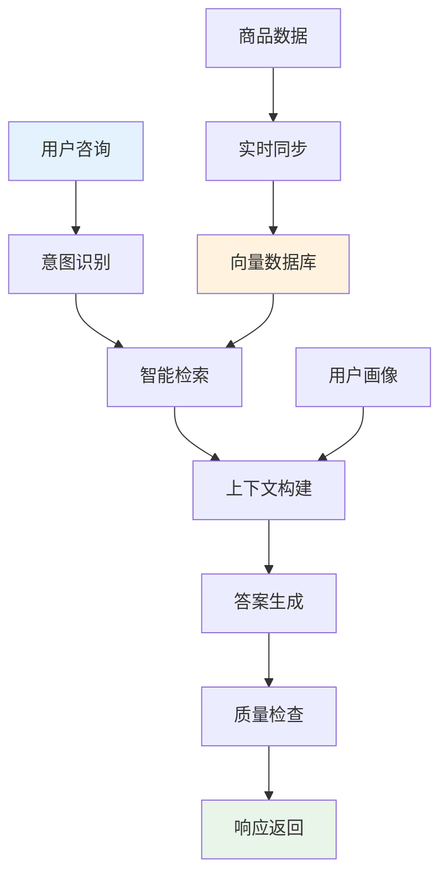

# 深度RAG笔记05：深度RAG笔记05：电商智能客服RAG系统实战


> **翊行代码:深度RAG笔记第5篇**：大规模客服系统的技术架构，揭秘企业级RAG技术实战

说实话，我自己网购的时候也经常被客服气到。要么等半天没人理，要么问个简单问题得到一堆复制粘贴的废话，更别提那些明明已经过时的信息了。

传统客服就是这样：慢、不准、信息还老是跟不上。

前面4篇文章我们把RAG的技术原理扒了个遍，现在该动真格的了！今天我们来看一个真实的大型电商智能客服系统，看看RAG技术怎么把原本让人抓狂的客服体验，变成让人爽到的"秒回神器"。

## 项目背景与挑战

### 业务现状：传统客服的"三重困境"

我接触过的那家大型电商平台，客服现状真的让人头疼：

咨询量大得要命，客服团队天天像打仗一样，根本应付不过来。用户体验呢？平时要等好久，高峰期等得更久，你说用户能不急吗？

公司老板更头疼的是成本，人工成本一年比一年高，还在往上涨。最要命的是服务质量完全靠运气，碰到新手客服就是"答错率担当"，就算是老手也难免会出错。

### 核心技术挑战：四大"拦路虎"

做过电商的都知道，现实比想象复杂多了。我们遇到的不只是技术问题，更是业务上的硬骨头：

首先是**实时性**，商品信息天天在变，库存更是实时波动。你总不能让用户看到的价格是昨天的吧？

然后是**多样性**，用户的问题五花八门：价格咨询、配送查询、售后服务、商品推荐...单靠一个模型根本搞不定。

再来是**并发性**，特别是大促期间，访问量暴增，系统压力大得要命，响应慢一点用户就跑了。

最后是**个性化**，VIP用户要特殊服务，购买历史要关联，不同地区用户需求还不一样。

这些挑战每一个都要命：

- 信息过时直接影响转化率，丢订单
- 问题类型太多，单一模型玩不转
- 高并发下响应慢，用户体验差就流失
- 千人千面的需求，标准答案满足不了

## 技术架构设计

### 整体系统架构：像"智能大脑"一样思考

我们设计的这个系统，说白了就是一个**超级客服大脑**。你想啊，人脑怎么处理问题的？耳朵听问题→大脑分析→记忆搜索→智能回答→质量把关。我们的系统也是这么干的。



### 核心技术特点：四大技术支柱

这个架构为什么能行？主要靠四个关键特性：

**微服务架构**：每个功能模块都是独立的，就像积木一样，想怎么搭就怎么搭，扩展起来特别方便。

**实时数据同步**：商品信息一变，系统马上知道，不会出现用户看到过期信息的尴尬。

**智能缓存策略**：设计了多级缓存，就像大脑的短期记忆和长期记忆一样，常用的信息放在快速存储区，响应速度飞快。

**个性化路由**：系统会根据用户是谁、问什么问题，自动选择最合适的处理方式，就像有经验的客服主管分配工作一样。

## 数据处理流程深度解析

### 商品数据智能处理：多角度信息建模

商品数据在客服系统里要支持各种奇葩的用户提问。我们的思路是给每个商品建立**多维度信息视图**，就像给商品办了多张身份证一样：

**基础信息维度**：产品名称、价格、库存、评分这些最基本的

**技术规格维度**：详细参数、技术指标、兼容性这些技术控关心的

**服务政策维度**：售后政策、保修信息、退换货规则这些买家最担心的

**物流配送维度**：配送范围、时效、配送费用这些着急收货的人要问的

**营销活动维度**：促销信息、优惠政策、会员权益这些薅羊毛党最爱的

这样一搞，不管用户怎么问，我们都能找到对应的信息。实测下来，检索匹配精度有了明显提升。

```python
# 商品数据智能处理核心思路（完整实现见 code/ch05/data_processor.py）

class EcommerceDataProcessor:
    def process_product_data(self, product_info):
        # 1. 数据清洗与规范化
        cleaned_data = self.clean_product_data(product_info)
        
        # 2. 多维度信息构建
        dimensions = self.build_multiple_dimensions(cleaned_data)
        
        # 3. 检索优化分块
        chunks = self.create_searchable_chunks(dimensions)
        
        return chunks
    
    def build_multiple_dimensions(self, product):
        """构建多维度信息视图"""
        return {
            'basic': self.extract_basic_info(product),
            'technical': self.extract_tech_specs(product),
            'service': self.extract_service_info(product),
            'logistics': self.extract_shipping_info(product),
            'marketing': self.extract_promotion_info(product)
        }
```

### FAQ数据优化：智能问答扩展策略

传统FAQ就是一问一答，太死板了，覆盖面也有限。我们的玩法是**问题变体扩展**：

**问法多样化**：同一个问题，用户可能有十种不同的问法，我们都要能识别出来

**答案情感化**：不再是冷冰冰的标准答案，要有温度，让用户感觉在和人聊天

**智能分类**：自动给问题打标签，这样系统就知道该走哪个处理流程

**语境适配**：同样的问题，VIP用户和普通用户看到的答案应该不一样

```python
# FAQ智能扩展核心思路（完整实现见 code/ch05/data_processor.py）

class FAQProcessor:
    def process_faq_data(self, faq_list):
        processed_faqs = []
        
        for faq in faq_list:
            # 1. 问题变体生成
            variants = self.generate_question_variants(faq['question'])
            
            # 2. 答案优化
            optimized_answer = self.optimize_answer_tone(faq['answer'])
            
            # 3. 智能分类
            category_tags = self.auto_categorize(faq['question'])
            
            processed_faqs.append({
                'original': faq['question'],
                'variants': variants,
                'answer': optimized_answer,
                'categories': category_tags
            })
            
        return processed_faqs
```

## 智能检索策略

### 查询意图识别：智能语义理解

用户问问题往往不直接，比如"这个贵不贵"，可能是想对比价格，也可能是想了解性价比，还可能是在找有没有优惠。我们得把这些弯弯绕绕的意思都搞清楚：

**意图分类体系**：

- 价格咨询：用户关心钱的事儿
- 质量询问：用户想知道东西好不好，看评价
- 服务政策：用户担心售后、退换货这些麻烦事
- 物流配送：用户关心什么时候能收到，运费多少
- 促销活动：用户想薅羊毛，找优惠

**实体识别要点**：

- 商品实体：从用户的话里提取具体商品信息
- 特征实体：识别用户关注的商品特征
- 服务实体：识别相关服务类型需求

**用户画像融合**：

- VIP用户喜欢问专属服务
- 新用户需要更多指导
- 有投诉历史的用户要重点关注

**紧急程度判断**：

- 订单问题：赶紧处理
- 售后投诉：火速响应
- 一般咨询：正常流程

```python
# 智能查询分类核心思路（完整实现见 code/ch05/query_processor.py）

class CustomerQueryClassifier:
    def classify_query(self, query, user_context=None):
        # 1. 意图识别
        primary_intent = self.identify_primary_intent(query)
        
        # 2. 实体提取
        entities = self.extract_key_entities(query)
        
        # 3. 用户画像分析
        context_signals = self.analyze_user_signals(user_context)
        
        # 4. 紧急程度评估
        urgency = self.assess_urgency_level(query, entities)
        
        return QueryAnalysis(primary_intent, entities, context_signals, urgency)
    
    def identify_primary_intent(self, query):
        """识别主要意图"""
        intent_patterns = {
            'price_inquiry': ['贵不贵', '多少钱', '价格'],
            'quality_inquiry': ['质量', '好不好', '评价'],
            'service_inquiry': ['退货', '售后', '保修'],
            'logistics_inquiry': ['配送', '快递', '物流']
        }
        
        for intent, patterns in intent_patterns.items():
            if any(pattern in query for pattern in patterns):
                return intent
        
        return 'general_inquiry'
```

### 个性化检索：用户画像驱动的智能推荐

同样一个问题，不同用户关心的点完全不一样。我们的个性化检索基于**用户画像分析**：

**用户类型识别**：

- **VIP用户**：关注专属服务和优惠政策，要伺候好
- **新用户**：需要详细指导和优惠推荐，要耐心
- **老用户**：基于购买历史推荐，要精准
- **投诉用户**：需要耐心服务和问题解决，要小心

**个性化权重调整**：

- **品牌偏好**：喜欢苹果的用户就多推苹果，喜欢华为的就多推华为
- **类别偏好**：经常买数码产品的用户，重点推荐数码类
- **价格敏感度**：土豪用户少讲价格多讲品质，普通用户多讲性价比
- **服务需求**：不同用户对服务的要求不一样，要区别对待

**场景化内容匹配**：

- **购买决策场景**：提供对比信息和用户评价，帮助决策
- **售后服务场景**：重点展示服务政策和流程，解决问题
- **优惠寻找场景**：突出促销活动和会员权益，满足薅羊毛需求

这样搞下来，同一个问题不同用户看到的答案完全不一样，真正做到了千人千面。

```python
class PersonalizedRetriever:
    def __init__(self, vector_store, product_db):
        self.vector_store = vector_store
        self.product_db = product_db
        self.personalization_engine = PersonalizationEngine()
        
    def retrieve_personalized(self, query, user_context, query_classification):
        """个性化检索"""
        # 1. 基础检索
        base_results = self.vector_store.similarity_search(query, k=20)
        
        # 2. 用户历史偏好过滤
        if user_context.get('purchase_history'):
            preference_filter = self.build_preference_filter(
                user_context['purchase_history']
            )
            base_results = self.apply_preference_filter(
                base_results, preference_filter
            )
        
        # 3. VIP用户特殊处理
        if user_context.get('vip_level', 0) >= 3:
            vip_results = self.get_vip_priority_results(query)
            base_results = self.merge_vip_results(base_results, vip_results)
        
        # 4. 根据查询类型调整权重
        weighted_results = self.apply_intent_weighting(
            base_results, query_classification['primary_intent']
        )
        
        return weighted_results[:10]
    
    def build_preference_filter(self, purchase_history):
        """构建用户偏好过滤器"""
        # 分析用户购买历史，提取品牌、类别偏好
        brand_preferences = {}
        category_preferences = {}
        
        for order in purchase_history:
            for item in order['items']:
                brand = item.get('brand')
                category = item.get('category')
                
                if brand:
                    brand_preferences[brand] = brand_preferences.get(brand, 0) + 1
                if category:
                    category_preferences[category] = category_preferences.get(category, 0) + 1
        
        return {
            'preferred_brands': sorted(brand_preferences.items(), 
                                     key=lambda x: x[1], reverse=True)[:5],
            'preferred_categories': sorted(category_preferences.items(), 
                                         key=lambda x: x[1], reverse=True)[:3]
        }
```

## 上下文感知的个性化服务

### 用户类型判断策略

不同用户需要不同的服务方式和内容重点。我们建立了完整的用户类型判断体系：

**用户分类标准**：

- **VIP用户**：会员等级3级及以上，需要专属服务
- **新用户**：无购买历史，需要详细引导和优惠推荐
- **老用户**：有购买记录，基于历史偏好个性化推荐
- **投诉用户**：有投诉历史，需要特别关注服务质量

**服务差异化策略**：

- **语言风格**：VIP用户使用敬语，新用户更加亲切
- **内容重点**：VIP强调专属权益，新用户重点介绍优惠
- **响应优先级**：VIP和投诉用户优先处理
- **补偿机制**：投诉用户提供合理补偿建议

**个性化内容构建**：

- **上下文信息**：VIP等级、购买历史、偏好类别
- **特殊指令**：根据用户类型调整服务重点
- **历史关联**：结合用户之前的咨询记录
- **预期管理**：根据用户类型设置合理期望

```python
# 个性化服务核心思路（完整实现见 code/ch05/prompt_builder.py）

class PersonalizedPromptBuilder:
    def build_personalized_prompt(self, query, context, user_profile):
        # 1. 用户类型分析
        user_type = self.classify_user_type(user_profile)
        
        # 2. 模板选择
        base_template = self.select_template(user_type)
        
        # 3. 上下文构建
        user_context = self.build_context(user_profile)
        
        # 4. 特殊指令生成
        instructions = self.generate_instructions(user_type)
        
        return base_template.format(
            context=context,
            query=query,
            user_context=user_context,
            instructions=instructions
        )
    
    def classify_user_type(self, profile):
        """用户类型分类策略"""
        if profile.get('vip_level', 0) >= 3:
            return 'VIP_USER'
        elif profile.get('complaint_history'):
            return 'COMPLAINT_USER'
        elif not profile.get('purchase_history'):
            return 'NEW_USER'
        else:
            return 'REGULAR_USER'
```

## 性能优化与系统稳定性

### 多级缓存架构设计

高并发场景下，缓存就是救命稻草。我们设计了**三级缓存架构**，就像火车站的三层安检一样：

**L1内存缓存**：存储最热门的查询结果，毫秒级响应，就像VIP通道

**L2 Redis缓存**：承接中等热度数据，支持分布式部署，像普通快速通道

**L3数据库缓存**：兜底长尾数据，保证完整性，像正常通道

**缓存策略优化**：

- **智能预热**：根据历史数据预加载热门查询，就像提前备好货
- **动态淘汰**：LRU算法自动淘汰冷数据，不常用的就扔掉
- **一致性保证**：数据更新时同步清理相关缓存，避免给用户看到过期信息
- **命中率监控**：实时监控各级缓存命中率，看看效果怎么样

这套缓存体系实现了很高的缓存命中率，高并发场景下系统依然稳如老狗。

```python
# 多级缓存实现核心思路（完整实现见 code/ch05/data_processor.py）

class SmartCacheSystem:
    def __init__(self):
        self.l1_cache = {}  # 内存缓存
        self.l2_cache = redis.Redis()  # Redis缓存
        self.l3_cache = DatabaseCache()  # 数据库缓存
        
    def get_cached_response(self, query_hash, user_id):
        # L1缓存检查
        if query_hash in self.l1_cache:
            return self.l1_cache[query_hash]
            
        # L2缓存检查
        l2_response = self.l2_cache.get(f"user_{user_id}_{query_hash}")
        if l2_response:
            self.promote_to_l1(query_hash, l2_response)
            return l2_response
            
        # L3缓存检查
        l3_response = self.l3_cache.get(query_hash)
        if l3_response:
            self.promote_to_l2(query_hash, l3_response)
            return l3_response
            
        return None
    
    def cache_response(self, query_hash, response, priority):
        """根据优先级选择缓存级别"""
        if priority >= 0.8:
            self.cache_to_all_levels(query_hash, response)
        elif priority >= 0.5:
            self.cache_to_l2_l3(query_hash, response)
        else:
            self.cache_to_l3_only(query_hash, response)
```

### 实时数据同步机制

电商场景里，商品信息变化太频繁了，传统的定时同步根本跟不上。我们用**消息队列驱动的实时同步机制**：

**同步触发机制**：

- **商品更新**：价格、库存、描述等信息一变就触发
- **促销活动**：新增或修改促销信息马上同步
- **FAQ更新**：客服知识库更新立即同步
- **用户反馈**：重要用户反馈导致的内容调整

**同步处理流程**：

- **消息接收**：从消息队列获取变更事件
- **数据处理**：清理旧数据，生成新的向量表示
- **索引更新**：更新向量数据库中的相关内容
- **缓存清理**：清理相关缓存，保证数据一致性

**容错与监控**：

- **失败重试**：失败了就重试，保证数据不丢
- **状态监控**：实时监控同步状态和处理时间
- **异常告警**：出问题了马上通知运维人员

这套机制能保证商品信息变更后快速完成系统同步，用户看到的信息永远是最新的。

```python
# 实时数据同步核心思路（完整实现见 code/ch05/data_processor.py）

class RealTimeDataSync:
    def __init__(self, vector_store, message_queue):
        self.vector_store = vector_store
        self.message_queue = message_queue
        
    def start_sync_worker(self):
        """启动同步工作器"""
        while True:
            try:
                message = self.message_queue.get(timeout=1)
                
                # 处理不同类型的更新
                if message['type'] == 'product_update':
                    self.handle_product_update(message['data'])
                elif message['type'] == 'faq_update':
                    self.handle_faq_update(message['data'])
                    
            except Exception as e:
                logger.error(f"同步错误: {e}")
    
    def handle_product_update(self, product_data):
        """处理商品更新"""
        # 1. 删除旧数据
        old_doc_ids = self.vector_store.get_doc_ids_by_product(product_data['id'])
        for doc_id in old_doc_ids:
            self.vector_store.delete(doc_id)
        
        # 2. 生成新数据
        processor = EcommerceDataProcessor()
        new_chunks = processor.process_product_data(product_data)
        
        # 3. 添加到向量库
        self.vector_store.add_documents(new_chunks)
        
        # 4. 清理缓存
        self.clear_related_cache(product_data['id'])
```

## 项目成果与价值总结

通过这个电商智能客服RAG系统的实战，我们真正见识了RAG技术在企业级应用中的威力。

### 三大核心成功要素

**技术架构给力**：微服务架构、多级缓存、实时同步三管齐下，构建了高性能、高可用的技术基础

**用户体验质的飞跃**：个性化检索、智能意图识别、差异化服务，真正做到了千人千面的客服体验

**运营效率大幅提升**：自动化处理、智能路由、异常监控，系统运营效率蹭蹭往上涨

### 四个关键技术洞察

**个性化是核心竞争力**：不同用户要区别对待，这是提升用户满意度的关键

**实时性决定商业价值**：电商场景下，信息过时就等于丢钱，时效性太重要了

**系统监控不可或缺**：没有完善的监控体系，系统早晚出大问题

**数据驱动持续优化**：基于用户反馈和系统指标不断优化，这是成功的保障

### 商业价值体现

**成本控制**：人工客服成本大幅降低，运营效率显著提升

**响应速度**：从慢悠悠的等待提升到秒级响应，用户体验直接起飞

**服务质量**：问题解决率和用户满意度双提升，品牌价值也跟着涨

**业务扩展**：支持7x24小时服务，业务覆盖范围和时间都大幅扩展

这个案例让我们看到RAG技术在企业级应用中的真正价值，不仅仅是技术创新，更是商业模式的重要突破。

**下期预告**：我们将深入**法律文档智能检索系统**，看看RAG如何在专业性要求极高的法律领域发挥价值！

---

**本文是RAG实战攻略系列的第5篇，通过电商客服真实案例展示RAG的企业级应用。关注"翊行代码"，获取更多AI技术落地干货！**
