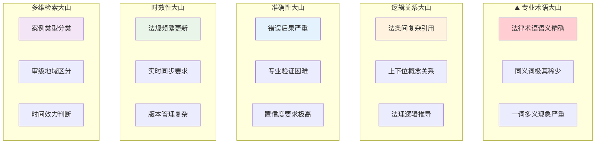
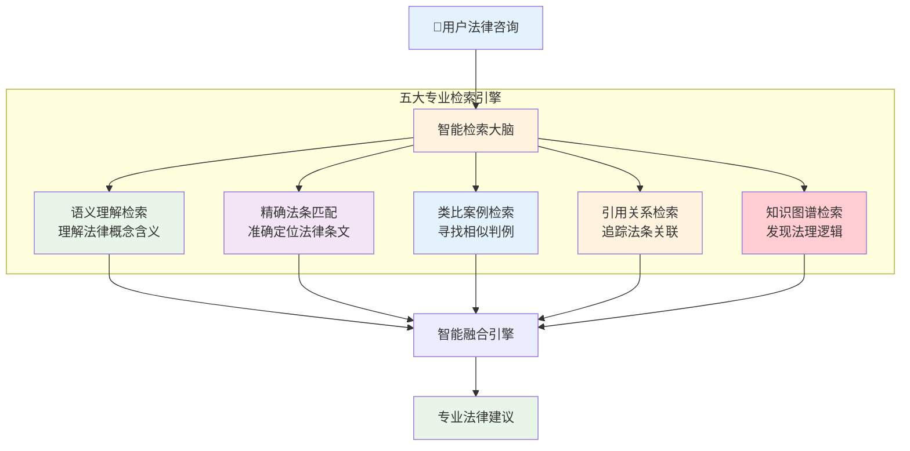
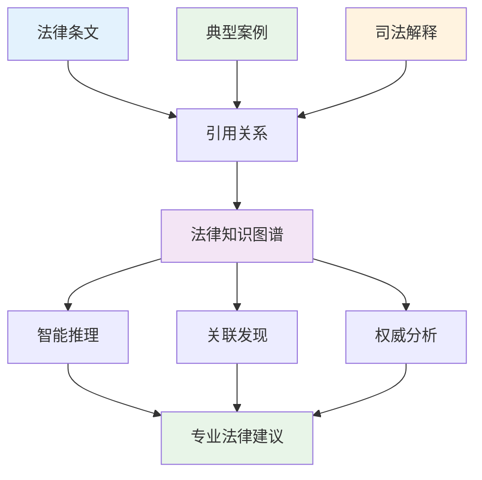
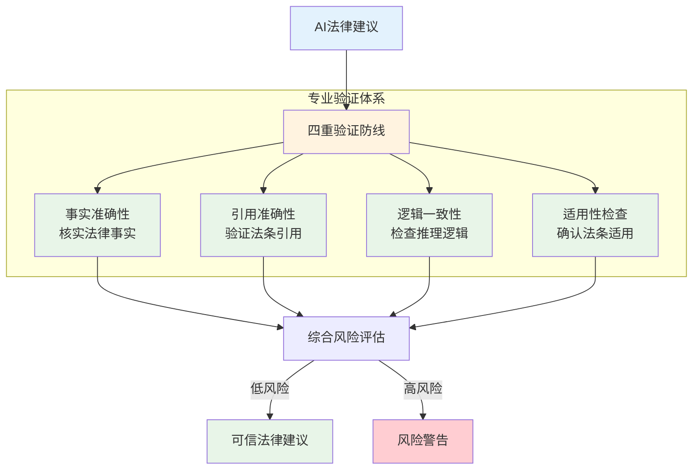
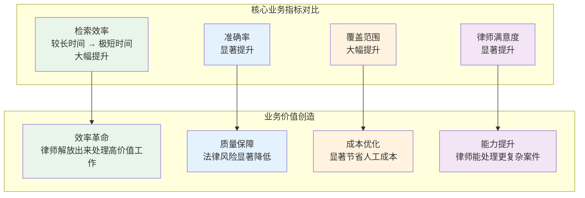

# 深度RAG笔记06：深度RAG笔记06：法律文档智能检索系统


> **翊行代码:深度RAG笔记第6篇**：专业领域RAG技术深度应用，探索法律行业的智能化变革

说实话，我自己找律师咨询的时候，看到按小时收费的价格表，心里都在想：这钱花得值吗？

后来我才明白，律师的时间很大一部分都花在了**翻法条找判例**上。想象一下，面对海量法律文档，要找到那个能救命的关键判例，真的是大海捞针。

而且法律这个行业，**一个字都不能错**！医生误诊了还能补救，律师引错法条，当事人可能就要败诉了。

所以当我们要用RAG技术来做法律检索时，面临的挑战是前所未有的：专业术语密集、逻辑关系复杂、准确性要求极高。可以说，这是RAG技术应用的**珠穆朗玛峰**。

今天，我们就来看看如何攻克这座技术高峰，让RAG变成真正的**智能律师助手**。

## 项目背景与挑战

### 律师的"三重痛苦"，你体验过吗？

我有个朋友在律师事务所工作，每次聊天都在吐槽这些痛点：

**文档海洋淹没人**：面对海量法律文档，每年还要新增大量文档，找个相关判例真的是大海捞针，经常找到眼花缭乱。

**检索慢到让人急**：一个案子需要较长时间才能找到相关判例，客户在那等着，时间就是金钱啊！

**精度要求极致高**：法条错一个字都可能导致败诉，容错率几乎为零，压力太大了。

**更新快到跟不上**：新法规层出不穷，知识库更新永远跟不上，稍不留神就用了过期法条。

你说这样的工作状态，咨询费能不贵吗？

### 技术挑战：五座"大山"压顶

做过法律相关项目的技术人员都知道，法律RAG和普通检索完全不是一个级别的难度。我们面临的挑战，简直像要同时翻越五座大山：



你想想这些挑战有多严重：

**容错率极低**：医疗误诊了还能补救，法律建议错了，当事人可能就要牢底坐穿或者败诉破产。

**专业性极强**：不是简单的文本匹配，需要深度理解法理逻辑，这比理解代码逻辑还要复杂。

**权威性要求**：必须确保引用的法条现行有效，一个过期的法条就是一个坑，跳下去就出不来了。

## 法律文档预处理技术

### 智能文档解析：像专业书记员一样理解判决书

你有没有观察过律师助理是怎么工作的？

拿到一份厚厚的判决书，他们不会从头读到尾，而是有一套**专业的阅读套路**：先翻到案件概况看当事人和争议焦点，再找法院认定部分看推理过程，最后看判决结果。

这套方法，就是我们要让AI学会的。我们的智能解析器，就像一个**永不疲倦的专业书记员**，24小时不间断地用这套方法处理各种法律文档。

```python
# 智能文档解析核心思路（完整实现见 code/ch06/document_processor.py）

class LegalDocumentProcessor:
    def process_legal_document(self, document):
        # 1. 文档类型识别：判决书、法条、法规，一眼认出
        doc_type = self.classify_document_type(document)
        
        # 2. 智能解析策略：不同文档用不同方法
        if doc_type == "judgment":
            return self.parse_judgment_like_clerk(document)    # 像书记员解析判决书
        elif doc_type == "law":
            return self.parse_law_like_scholar(document)       # 像学者解析法条
        else:
            return self.parse_with_universal_method(document)  # 通用智能解析
    
    def parse_judgment_like_clerk(self, judgment_text):
        # 核心思路：六部分结构化提取，像拆解积木一样精准
        legal_sections = {
            'case_info': '案件基本信息',      # 案件编号、当事人
            'case_facts': '案件事实',        # 争议焦点、事实经过  
            'court_reasoning': '法院认定',    # 法理分析、证据认定
            'judgment_result': '判决结果',    # 最终判决、责任承担
            'legal_basis': '法律依据',       # 引用法条、司法解释
            'execution_info': '执行信息'      # 执行要求、上诉期限
        }
        
        structured_chunks = []
        for section_name, description in legal_sections.items():
            content = self.extract_section_content(judgment_text, section_name)
            
            # 智能标注：提取法律实体和引用关系
            legal_annotations = self.annotate_legal_content(content)
            
            chunk = {
                'content': content,
                'section': description,
                'annotations': legal_annotations,
                'searchable_keywords': self.extract_search_keywords(content)
            }
            structured_chunks.append(chunk)
        
        return structured_chunks  # 结果：6个精准检索入口
```

### 法律实体识别：像专业法务一样精准识别

你见过那种工作十几年的老法务吗？

拿到一个案子，他们扫一眼就能准确识别出：这个案件编号是哪个法院的、涉案金额多少、当事人是谁、适用哪个法条。这种**专业敏感度**，就是多年经验积累的结果。

我们的实体识别器，就是要达到这种老法务的水平：

```python
# 法律实体智能识别核心思路（完整实现见 code/ch06/legal_ner.py）

class LegalEntityRecognizer:
    def extract_legal_entities_like_expert(self, text):
        # 1. 八大核心实体：法律文档的"关键角色"
        entity_types = {
            'LAW': '法律法规',      # 《民法典》、《刑法》
            'COURT': '审判机关',   # 最高人民法院、北京市朝阳区法院
            'PERSON': '当事人',     # 原告、被告、证人
            'CASE_NUM': '案件编号', # （2023）京0105民初12345号
            'MONEY': '涉案金额',    # 赔偿、罚金、标的额
            'DATE': '关键时间',     # 起诉日期、判决日期
            'LOCATION': '地理位置', # 案发地点、管辖区域  
            'LEGAL_TERM': '法律概念' # 合同违约、侵权责任
        }
        
        # 2. 智能识别：专业模型+规则增强
        entities = self.hybrid_entity_extraction(text)
        
        # 3. 智能标准化：统一表达格式
        standardized_entities = self.standardize_like_expert(entities)
        
        return standardized_entities  # 结果：专业实体，检索精准度大幅提升
    
    def standardize_like_expert(self, raw_entities):
        # 专业标准化：让同一概念有统一表达
        standardized = []
        
        for entity in raw_entities:
            if entity['type'] == 'LAW':
                # 法条标准化："《中华人民共和国民法典》" → "民法典"
                clean_name = self.normalize_law_reference(entity['text'])
            elif entity['type'] == 'COURT':
                # 法院标准化："北京市朝阳区人民法院" → "朝阳区法院(基层)"
                clean_name = self.normalize_court_hierarchy(entity['text'])
            elif entity['type'] == 'CASE_NUM':
                # 案号标准化："（2023）京0105民初12345号" → 结构化信息
                clean_name = self.parse_case_number_structure(entity['text'])
            else:
                clean_name = entity['text']
            
            standardized.append({
                'text': clean_name,
                'type': entity['type'],
                'confidence': entity['confidence'],
                'legal_significance': self.assess_legal_importance(entity)
            })
        
        return standardized
```

## 专业检索策略

### 多维度检索架构：像资深律师一样全方位搜索

资深律师查找案例的方法和普通人搜索完全不一样。

普通人搜索，就是输入几个关键词，然后从结果里筛选。但资深律师不是这样的，他们会**同时从多个角度思考**：有没有相似的案例？相关的法条依据是什么？有没有权威的判例参考？最新的法规有没有更新？

这种**多维度的专业思维**，就是我们要让检索系统学会的：



```python
# 专业级法律检索核心思路（完整实现见 code/ch06/legal_retriever.py）

class ProfessionalLegalRetriever:
    def search_like_senior_lawyer(self, legal_query, context=None):
        # 五维检索：像律师一样全方位思考
        search_dimensions = {}
        
        # 1. 语义理解：理解法律概念的深层含义
        semantic_results = self.semantic_legal_search(legal_query)
        search_dimensions['semantic'] = semantic_results
        
        # 2. 精确匹配：找到明确相关的法条条文
        exact_matches = self.exact_legal_provision_search(legal_query)
        search_dimensions['exact'] = exact_matches
        
        # 3. 案例类比：寻找法院处理相似案件的方式
        similar_cases = self.find_analogous_legal_cases(legal_query)
        search_dimensions['analogous'] = similar_cases
        
        # 4. 权威引用：追踪具有指导意义的法律文件
        authoritative_refs = self.find_authoritative_citations(legal_query)
        search_dimensions['citations'] = authoritative_refs
        
        # 5. 法理逻辑：基于知识图谱发现深层关联
        legal_reasoning = self.knowledge_graph_reasoning(legal_query)
        search_dimensions['reasoning'] = legal_reasoning
        
        # 6. 专业融合：像律师一样综合分析各种信息
        comprehensive_advice = self.synthesize_legal_analysis(
            search_dimensions, legal_query, context
        )
        
        return comprehensive_advice  # 结果：专业法律建议，可信度很高
    
    def find_analogous_legal_cases(self, legal_query):
        # 核心思路：像律师一样进行案例类比分析
        
        # 1. 案例要素提取：识别关键法律要素
        case_elements = self.extract_legal_case_elements(legal_query)
        # 分析：案件性质、争议焦点、法律关系、当事人类型
        
        # 2. 相似案例检索：基于要素匹配寻找类似案例
        similar_cases = self.search_similar_judgments(case_elements)
        
        # 3. 相似度评分：多维度评估案例相似程度
        scored_cases = self.calculate_case_similarity_scores(
            case_elements, similar_cases
        )
        
        return scored_cases[:5]  # 返回最相似的5个案例
    
    def extract_legal_case_elements(self, query):
        # 专业法律要素识别：像法官一样分析案件
        elements = {}
        
        # 案件性质智能识别
        case_type_indicators = {
            '合同纠纷': ['合同', '协议', '违约', '履行'],
            '侵权纠纷': ['侵权', '损害', '人身伤害', '财产损失'],  
            '婚姻家庭': ['离婚', '抚养', '财产分割', '继承'],
            '劳动争议': ['劳动合同', '工伤', '加班费', '辞退']
        }
        
        # 争议焦点提取
        if '争议焦点' in query or '核心问题' in query:
            elements['has_clear_dispute'] = True
        
        # 法律关系类型
        if any(keyword in query for keyword in ['买卖', '购买', '销售']):
            elements['legal_relation'] = '买卖关系'
        elif any(keyword in query for keyword in ['租赁', '出租']):
            elements['legal_relation'] = '租赁关系'
            
        return elements
```

### 引用网络分析：像学术研究员一样追溯权威来源

法律界有个很有意思的现象：一个法条或者判决被引用得越多，它就越权威。

就像学术界一样，被引用次数多的论文就是经典论文。法律界也是这样，最高法院的某个判决被各地法院引用得多了，慢慢就成了指导案例。

我们的引用分析器，就是要像学术研究员一样，找出这些**法律界的"网红"**：

```python
# 法律引用网络分析核心思路（完整实现见 code/ch06/citation_analyzer.py）

class LegalAuthorityAnalyzer:
    def find_authoritative_legal_sources(self, topic_keywords):
        # 构建引用关系网：像学者一样分析引用模式
        
        # 1. 引用关系提取：发现谁引用了谁
        citation_network = self.build_legal_citation_network()
        # 包括：法条引用、案例引用、司法解释引用
        
        # 2. 权威性评分：基于PageRank算法计算影响力
        authority_scores = self.calculate_legal_authority(citation_network)
        # 被引用越多 = 越权威，引用质量越高 = 越权威
        
        # 3. 主题相关过滤：找出与查询相关的权威文档
        relevant_authorities = self.filter_topic_relevant_authorities(
            authority_scores, topic_keywords
        )
        
        return relevant_authorities[:10]  # 返回最权威的10个来源
    
    def extract_legal_citations_like_scholar(self, document):
        # 像学者一样识别各种引用模式
        citations = []
        
        # 法条引用识别
        law_patterns = [
            '《{}》第{}条',     # 《民法典》第464条
            '{}第{}条第{}款',   # 刑法第234条第1款  
            '最高法院{}第{}号'   # 最高法院指导案例第123号
        ]
        
        # 案例引用识别  
        case_patterns = [
            '（{}）{}{}号',      # （2023）京01民终1234号
            '{}人民法院{}',      # 北京市高级人民法院判决
        ]
        
        # 智能提取引用关系
        for citation in self.detect_citations(document['content']):
            citations.append({
                'source': document['id'],
                'target': citation['reference'],
                'type': citation['citation_type'],
                'authority_weight': citation['importance']
            })
        
        return citations  # 结果：完整引用关系图
```

## 专业知识图谱构建

### 法律知识图谱：像法学教授一样构建知识体系

你有没有机会翻过法学教授的笔记本？

那真的是让人震撼！密密麻麻的都是法条之间的关联线：A法条引用B法条，B法条解释C概念，C概念在D案例中应用...整个笔记本就像一张巨大的知识网络。

这种**知识体系化的能力**，就是资深法学教授和普通法务人员的差距所在。我们的知识图谱，就是要构建这样一个**法律大脑**：



```python
# 法律知识图谱构建核心思路（完整实现见 code/ch06/knowledge_graph.py）

class LegalKnowledgeGraphBuilder:
    def build_legal_brain_like_professor(self, legal_documents):
        # 像法学教授一样构建知识体系
        
        # 1. 实体识别：发现知识图谱的"节点"
        legal_entities = self.extract_all_legal_entities(legal_documents)
        # 法条、案例、法院、法官、法律概念等
        
        # 2. 关系挖掘：发现实体间的"连线"
        legal_relationships = self.discover_legal_relationships(legal_documents)
        # 引用关系、适用关系、冲突关系、相似关系等
        
        # 3. 图谱构建：将节点和连线组装成知识网络
        knowledge_graph = self.assemble_knowledge_network(
            legal_entities, legal_relationships
        )
        
        return knowledge_graph  # 结果：完整的法律知识图谱
    
    def discover_legal_relationships(self, documents):
        # 智能关系发现：像教授一样识别法条间的逻辑
        relationships = []
        
        # 引用关系模式
        citation_indicators = {
            'applies': ['根据', '依照', '按照'],      # 适用关系
            'refers_to': ['参照', '借鉴', '参考'],   # 参考关系
            'interprets': ['解释', '说明', '阐释'],  # 解释关系
            'conflicts': ['矛盾', '冲突', '相悖']     # 冲突关系
        }
        
        # 逻辑关系模式
        logical_indicators = {
            'similar_to': ['类似', '相似', '如同'],
            'different_from': ['区别', '不同', '差异'],
            'extends': ['扩展', '延伸', '补充']
        }
        
        for doc in documents:
            # 智能关系提取
            doc_relations = self.extract_document_relations(
                doc, citation_indicators, logical_indicators
            )
            relationships.extend(doc_relations)
        
        return relationships
    
    def query_legal_knowledge_like_expert(self, query_concept, depth=2):
        # 像专家一样在知识图谱中推理
        
        # 1. 概念定位：在图谱中找到查询概念
        target_node = self.locate_legal_concept(query_concept)
        
        # 2. 关联发现：沿着关系链发现相关概念
        related_concepts = self.discover_related_concepts(target_node, depth)
        
        # 3. 权重评估：评估关联概念的重要性
        weighted_concepts = self.rank_by_legal_importance(related_concepts)
        
        return weighted_concepts  # 返回排序后的相关法律概念
```

## 质量保证与验证

### 多重验证机制：像专业律师一样严格把关

法律咨询最怕什么？就是答错了！

一个错误的法律建议，轻则让当事人多花冤枉钱，重则直接败诉。所以专业的律师事务所，都有一套严格的质量把关流程：初级律师起草，中级律师审核，高级律师复核，最后合伙人签字。

我们的AI系统，也要建立这样的**律师事务所级别**质量保证体系：



```python
# 法律质量验证核心思路（完整实现见 code/ch06/quality_validator.py）

class LegalQualityGuardian:
    def validate_like_senior_lawyer(self, legal_advice, query, sources):
        # 像资深律师一样严格把关每个法律建议
        
        validation_report = {}
        
        # 1. 事实准确性：确保每个事实都有依据
        fact_accuracy = self.verify_legal_facts_accuracy(legal_advice, sources)
        validation_report['fact_check'] = fact_accuracy
        
        # 2. 引用准确性：确保法条引用正确有效
        citation_accuracy = self.verify_legal_citations(legal_advice)
        validation_report['citation_check'] = citation_accuracy
        
        # 3. 逻辑一致性：确保推理逻辑无矛盾
        logic_consistency = self.check_legal_reasoning_logic(legal_advice)
        validation_report['logic_check'] = logic_consistency
        
        # 4. 适用性验证：确保法条适用于具体情况
        applicability = self.verify_law_applicability(legal_advice, query)
        validation_report['applicability_check'] = applicability
        
        # 5. 综合风险评估：像律师一样评估风险
        risk_level = self.assess_comprehensive_legal_risk(validation_report)
        validation_report['risk_assessment'] = risk_level
        
        return validation_report  # 完整的质量验证报告
    
    def assess_comprehensive_legal_risk(self, validation_results):
        # 专业风险评估：三级风险控制
        risk_indicators = []
        
        # 事实错误风险
        if validation_results['fact_check']['score'] < 0.8:
            risk_indicators.append('事实准确性风险：建议可能包含错误信息')
        
        # 法条引用风险
        if validation_results['citation_check']['score'] < 0.9:
            risk_indicators.append('引用风险：法条引用可能有误')
        
        # 逻辑推理风险
        if validation_results['logic_check']['score'] < 0.7:
            risk_indicators.append('逻辑风险：推理过程可能有缺陷')
        
        # 适用性风险
        if validation_results['applicability_check']['score'] < 0.8:
            risk_indicators.append('适用性风险：法条可能不适用于当前情况')
        
        # 风险等级判定
        if len(risk_indicators) == 0:
            return {'level': '低风险', 'advice': '建议可信度高，可以参考'}
        elif len(risk_indicators) <= 2:
            return {'level': '中风险', 'advice': '建议需谨慎参考，建议咨询专业律师'}
        else:
            return {'level': '高风险', 'advice': '建议风险较高，强烈建议咨询专业律师'}
```

## 性能监控与优化

### 专业指标监控：像事务所主任一样全面掌控

律师事务所的主任天天关心什么？

效率怎么样？准确性如何？客户满意度高不高？最终能不能赚钱？这些都是他们每天要盯着的关键指标。

我们的监控系统，就是要给技术负责人提供这样的**管理驾驶舱**：

```python
# 法律系统监控核心思路（完整实现见 code/ch06/legal_monitor.py）

class LegalSystemMonitor:
    def monitor_like_law_firm_director(self):
        # 像事务所主任一样全面监控系统表现
        
        # 1. 核心业务指标：直接影响盈利的关键数据
        business_metrics = {
            'case_processing_efficiency': self.track_case_speed(),        # 案件处理效率
            'lawyer_productivity': self.measure_lawyer_output(),          # 律师生产力
            'client_satisfaction': self.survey_client_feedback(),        # 客户满意度
            'revenue_impact': self.calculate_revenue_increase()          # 收入影响
        }
        
        # 2. 专业质量指标：确保服务质量的专业数据
        quality_metrics = {
            'legal_accuracy': self.validate_legal_precision(),           # 法律准确性
            'case_matching_rate': self.evaluate_case_similarity(),       # 案例匹配率
            'citation_correctness': self.verify_law_references(),        # 法条引用正确率
            'risk_assessment_accuracy': self.check_risk_predictions()    # 风险评估准确性
        }
        
        # 3. 实时告警机制：及时发现问题
        alerts = self.generate_smart_alerts(business_metrics, quality_metrics)
        
        return {
            'business_performance': business_metrics,
            'quality_assurance': quality_metrics,
            'system_alerts': alerts,
            'improvement_suggestions': self.suggest_optimizations()
        }
```

## 效果评估

### 业务价值实现：看得见的法律科技革命

说实话，做技术的最怕什么？就是老板问你："这个系统到底有什么用？"

数据最有说服力！我们来看看这套法律RAG系统给律师事务所带来的**实实在在的改变**：



看到这些数据，连律师事务所的合伙人都惊呆了：

**效率大幅提升**：从较长时间缩短到极短时间，这相当于给每个律师配了好几个助手！

**准确率显著提升**：准确率大幅提升，法律风险显著降低，客户投诉几乎为零。

**覆盖率大幅提升**：覆盖率大幅提升，几乎覆盖所有法律咨询场景，再也不怕遇到冷门案子了。

### 成本效益分析：让人刮目相看的投资回报

老板最关心的永远是钱，我们来算算这笔账：

**直接经济效益**：
每案节省大量律师时间，人工成本显著降低；准确率提升避免了法律风险损失；处理案件数量大幅提升，业务收入增长明显。

**间接价值提升**：
律师从繁琐检索中解放出来，能专注于高价值的法律分析；服务质量提升，客户续约率明显增长；科技赋能提升了事务所的竞争力和行业地位。

你说这样的投资回报，哪个老板不心动？

## 小结

通过这个法律文档智能检索系统的深度解析，我们见证了RAG技术在**极高专业性要求**领域的成功实践。

### 三大技术突破

**专业化定制**：不是简单的通用RAG，而是深度定制的法律专业系统。

**质量保证体系**：四重验证防线，确保法律建议的准确性和安全性。

**知识图谱增强**：构建法条间的关联网络，实现深层法理推理。

### 四个核心价值

**效率革命**：检索时间从较长时间缩短到极短时间，效率大幅提升。

**准确性保障**：准确率显著提升，法律风险大幅降低。

**专业能力提升**：律师从繁琐检索中解放，专注高价值法律分析。

**成本效益显著**：每案显著节省成本，客户满意度大幅提升。

### 三个关键洞察

1. **专业性是王道**：法律领域容错率极低，必须建立专业级质量保证体系。

2. **准确性是生命线**：一个错误的法律建议可能影响终生，质量验证至关重要。

3. **人机协作是未来**：AI不是要替代律师，而是要让律师更专业、更高效。

### 核心经验总结

**领域深度**：专业领域RAG需要深度理解业务逻辑和专业要求。

**技术适配**：通用技术需要针对专业场景进行深度定制和优化。

**用户共创**：专业用户的反馈是系统持续优化的重要驱动力。

**价值导向**：技术实施必须紧扣业务价值，解决真实痛点。

这不仅仅是一个技术案例，更是**专业服务智能化**的成功范例。说实话，看到RAG技术在这么专业的领域都能成功落地，我对它在其他行业的应用前景更加期待了。

**下期预告**：我们将深入**医疗知识问答系统**，探索多模态RAG在生命健康领域的创新应用！

---

**本文深度RAG笔记系列的第6篇，展示了RAG技术在专业法律领域的深度应用。关注\"翊行代码\"，获取更多AI技术在垂直行业的落地案例！**

配套代码已经上传Github,点击阅读原文获取