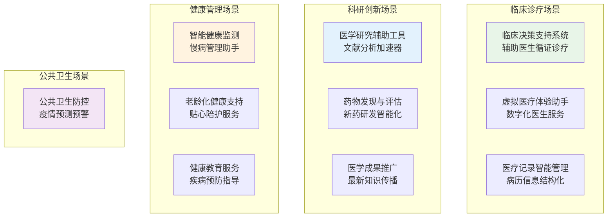
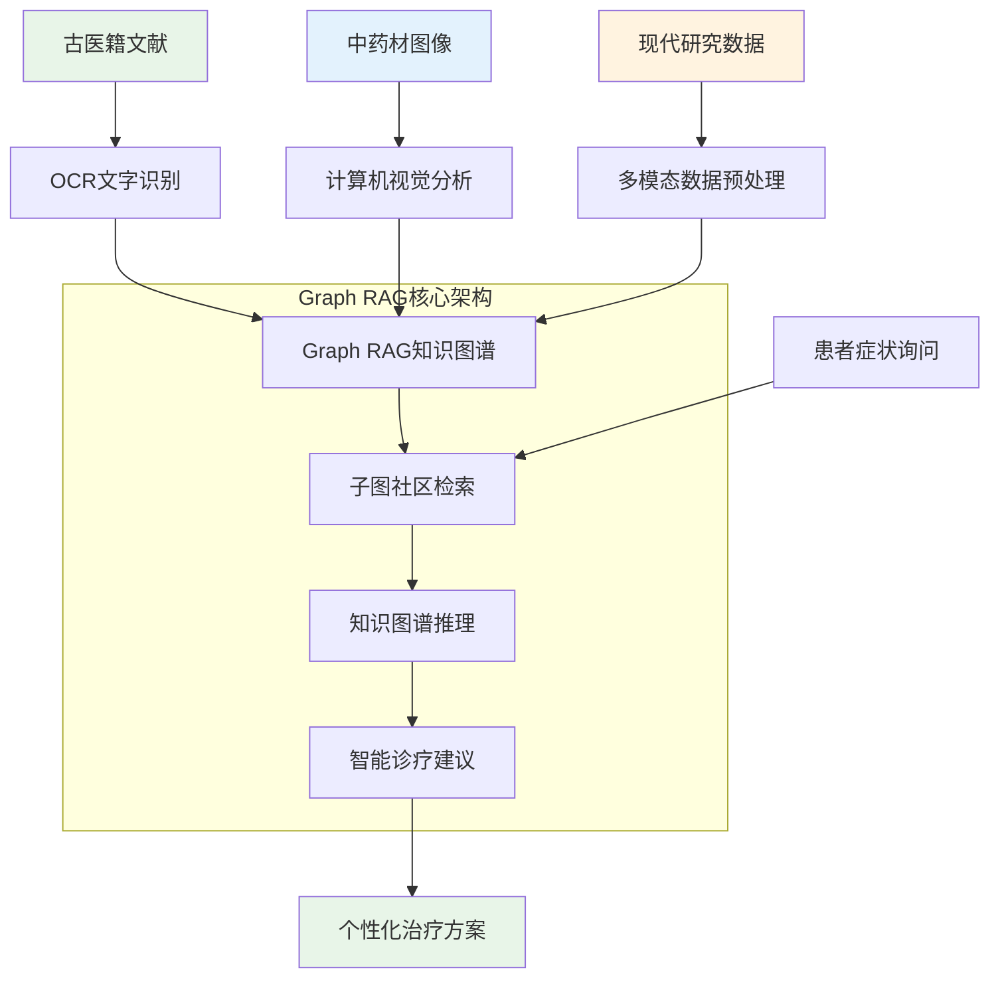
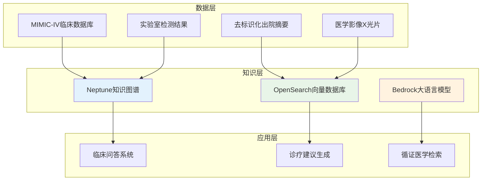

# 深度RAG笔记07：深度RAG笔记07：RAG+AI Agent在医疗行业的十大落地案例


> **翊行代码:深度RAG笔记第7篇**：从前沿技术到实际落地，解密RAG+AI Agent如何变革医疗行业

说实话，我上次拿着体检报告坐在医院走廊里，那种心情真是五味杂陈。

看着那些密密麻麻的数字和专业术语，心里想着：这些到底是什么意思？网上搜索吧，越看越害怕；不搜吧，心里又放不下。排队等医生？人山人海，等到花儿都谢了。

医疗健康这个领域，真的是让人又爱又恨。每个人都关心，但也是最复杂、最专业、最不容出错的领域。电商客服答错了，顶多损失几百块；医疗建议出错了，那可能真的要命！

这两年RAG+AI Agent技术在医疗领域的突破真的让人眼前一亮。从云南白药的中医诊疗系统，到日本的医药术语映射，再到AWS的临床决策引擎，这些真实的落地案例证明了一个道理：技术真的在改变医疗。

今天我们就来深度解析RAG+AI Agent在医疗行业的十大创新应用，看看这些前沿技术如何在救死扶伤的一线发光发热。

## RAG+AI Agent医疗应用全景：十大创新场景

做过医疗AI项目的人都知道，这个领域的挑战真的比珠峰还要险峻。因为每一个都关乎生命安全，容不得半点马虎。

但也正是这种高门槛，让RAG+AI Agent技术在医疗领域展现出了惊人的价值。我们来看看这十大应用场景：



### 1. 临床决策支持：医生的智能大脑

你想过医生是怎么做诊断的吗？

我有个朋友是主治医师，他跟我说，每次接诊都像在破案。要结合患者症状、检查结果、病史资料，还要考虑最新的诊疗指南，这个过程真的很考验医生的综合能力。

RAG+AI Agent在这里就像给医生配了个"超级大脑"，能实时检索最新文献、分析相似病例、给出循证建议。

### 2. 虚拟医疗体验：24小时在线的数字医生

现在很多医院都在试点虚拟医疗助手，患者通过手机就能获得初步诊断建议。这不是简单的聊天机器人，而是真正"懂医学"的智能系统。

它能理解你的症状描述，调取相关医学知识，给出专业的健康指导。虽然不能替代医生，但能有效缓解"看病难"的问题。

### 3. 医学研究加速器：从人工翻文献到智能找答案

搞科研的医生最头疼什么？翻文献！

几万篇论文里找到需要的信息，传统方式可能要花几个月。现在有了RAG+AI Agent，输入研究问题，系统就能快速检索、分析、总结相关文献，效率提升真的很明显。

### 4. 医疗记录智能管理：让每份病历都开口说话

医院的病历堆积如山，里面蕴含着丰富的医学信息，但人工整理太费时费力。

智能管理系统能自动提取关键信息，建立患者画像，发现潜在的诊疗模式，让这些"沉睡"的数据真正发挥价值。

### 5. 药物发现革命：AI助力新药研发

新药研发周期长、成本高、风险大。RAG+AI Agent能分析分子结构、预测药物活性、评估毒性风险，大幅提升研发效率。

有些制药公司已经在用这套技术筛选候选药物，成功率比传统方法有了明显提升。

### 6. 智能健康监测：你的私人健康管家

现在可穿戴设备越来越普及，产生了海量的健康数据。RAG+AI Agent能分析这些数据，发现异常模式，提供个性化健康建议。

特别是对慢性病患者，这种持续监测和智能预警真的很有价值。

### 7. 医学成果推广：让最新研究快速惠及临床

医学进步很快，但新成果传播到临床往往需要很长时间。智能推广系统能根据医生的专业背景，主动推送相关的最新研究，让好技术更快地造福患者。

### 8. 公共卫生防控：疫情预测的千里眼

新冠疫情让我们认识到疫情预测的重要性。RAG+AI Agent能分析多源数据，识别疫情传播模式，为公共卫生决策提供有力支撑。

### 9. 老龄化健康支持：温暖的数字陪伴

人口老龄化是全球性挑战。智能健康支持系统能为老年人提供用药提醒、健康监测、紧急呼叫等服务，让老人在家也能享受专业的健康照护。

### 10. 健康教育服务：人人都有的健康顾问

很多疾病其实可以预防，但缺乏有效的健康教育。AI健康顾问能根据个人情况，提供个性化的健康知识和预防建议，真正做到治未病。

## 三大典型落地案例深度剖析

理论说得再好，不如实际案例来得有说服力。我们来看看三个真实的成功案例，看看RAG+AI Agent是如何在医疗行业落地生根的。

### 案例一：云南白药Graph RAG中医诊疗系统

说到中医数字化，云南白药可以说是开了个好头。

他们用Graph RAG技术，把千年中医药智慧和现代AI完美结合，构建了一套智能中医诊疗系统。



**技术创新点**：

他们最大的突破是用Graph RAG解决了中医知识的复杂关联问题。中医讲究辨证论治，同一个症状在不同体质的人身上，治疗方案可能完全不同。

传统RAG很难处理这种复杂的多跳推理，但Graph RAG通过子图检索和知识社区划分，能精准找到相关的诊疗模式。

**实际效果**：

数据标注效率大幅提升，这个变化真的很惊人。原来需要专家手工标注几个月的数据，现在几天就能完成。

更重要的是，基层医疗机构用了这套系统后，复杂问答的准确率有了明显提升，直接带来了千万级的营销收益。

### 案例二：Yuimedi医药术语智能映射系统

日本株式会社Yuimedi和爱媛大学合作开发的这个项目，专门解决医药术语标准化问题。

你可能不知道，同一个药品在不同国家、不同标准下，名称可能完全不同。这种术语混乱严重影响了国际医学交流。

```python
# Yuimedi术语映射核心流程（简化版本）
class MedicalTermMapper:
    def intelligent_mapping(self, japanese_drug_name):
        # 1. 多语言翻译：日文 → 英文标准名
        english_name = self.translate_to_normalized_name(japanese_drug_name)
        
        # 2. BioBERT向量化：提取语义特征
        drug_embedding = self.extract_biobert_embedding(english_name)
        
        # 3. RAG检索：找到候选映射项
        candidates = self.rag_retrieve_similar_terms(drug_embedding)
        
        # 4. LLM质量评估：智能筛选最佳匹配
        best_match = self.llm_evaluate_candidates(candidates, japanese_drug_name)
        
        return best_match
```

**核心技术亮点**：

他们的创新在于三层智能匹配：BioBERT处理语义相似性，RAG检索扩大搜索范围，LLM进行质量把关。

这样既能处理表记差异（比如阿司匹林和阿斯匹林），又能解决浓度规格不同的问题。

**商业价值**：

系统不仅提升了映射精度，还把结果以开源数据集的形式发布，推动了整个行业的标准化进程。这种开源共享的理念真的值得点赞。

### 案例三：AWS智能临床决策引擎

AWS在医疗RAG领域的布局一直很有前瞻性，他们提供的这套解决方案，技术架构特别值得学习。



**架构设计精髓**：

AWS的设计思路很清晰：用Neptune管理复杂的医学知识关系，用OpenSearch处理大规模向量检索，用Bedrock提供强大的生成能力。

最关键的是，他们实现了时序EHR检索，能根据患者的病情发展轨迹，找到最相关的历史案例。

**临床验证效果**：

在真实临床试验中，这套系统输出的诊疗建议，真阳性率明显高于传统的纯生成模型。而且误报率也有了大幅下降，这对临床应用来说特别重要。

## 核心技术实现解析

看完这些成功案例，你可能会问：这些系统到底是怎么实现的？

让我们深入技术细节，看看RAG+AI Agent在医疗领域的核心技术架构。

### 多模态医疗数据融合

医疗数据的复杂性在于它的多样性：文本、图像、数值、时间序列，每种都有不同的特征。

```python
# 多模态医疗数据融合核心架构
class MedicalMultimodalFusion:
    def fuse_patient_data(self, patient_case):
        # 文本数据：病历、症状描述
        text_features = self.process_medical_text(patient_case['clinical_notes'])
        
        # 图像数据：CT、MRI、X光片
        image_features = self.process_medical_images(patient_case['medical_images'])
        
        # 数值数据：检验指标、生命体征
        numeric_features = self.process_lab_results(patient_case['lab_data'])
        
        # 多模态特征融合
        fused_representation = self.multimodal_fusion(
            text_features, image_features, numeric_features
        )
        
        return fused_representation
```

### 医学知识图谱构建

医学知识图谱的构建比一般领域更加复杂，因为医学概念之间的关系错综复杂。

疾病和症状的关系、药物和适应症的关系、治疗方法和禁忌症的关系，这些都需要精确建模。

### 安全检查与质量控制

医疗AI最重要的是什么？安全！

每个AI建议都必须经过严格的安全检查：

- **禁忌症检查**：确保推荐的药物不与患者过敏史冲突
- **药物相互作用**：避免联合用药风险
- **剂量合理性**：根据患者年龄、体重、肾功能调整剂量
- **医学逻辑性**：保证诊断和治疗的逻辑一致性

```python
# 医疗安全检查核心流程
class MedicalSafetyChecker:
    def comprehensive_safety_check(self, medical_advice, patient_profile):
        safety_issues = []
        
        # 过敏史检查
        allergy_risks = self.check_allergy_contraindications(
            medical_advice, patient_profile['allergies']
        )
        
        # 药物相互作用检查
        interaction_risks = self.check_drug_interactions(
            medical_advice, patient_profile['current_medications']
        )
        
        # 剂量安全性检查
        dosage_risks = self.validate_dosage_safety(
            medical_advice, patient_profile
        )
        
        return {
            'safety_score': self.calculate_overall_safety_score(),
            'risk_alerts': safety_issues,
            'recommendations': self.generate_safety_recommendations()
        }
```

## 技术选型与最佳实践

基于这些成功案例，我们能总结出一些医疗RAG系统的技术选型建议：

### 数据处理层面

**文本处理**：医学领域专用的预训练模型效果明显更好，比如BioBERT、ClinicalBERT等。

**图像处理**：不同影像类型需要专门的模型，CT用一套，MRI用一套，不能混用。

**知识图谱**：推荐使用Neo4j或Amazon Neptune，对医学概念的复杂关系支持比较好。

### 检索增强层面

**向量数据库**：Elasticsearch、Pinecone、Chroma都不错，关键是要支持混合检索。

**重排序模型**：医学领域的重排序特别重要，建议用domain-specific的模型。

### 生成控制层面

**模型选择**：GPT-4、Claude在医学推理上表现较好，但一定要做安全检查。

**提示工程**：医学提示需要特别谨慎，要明确告知模型不能给出确诊建议。

## 隐私保护与合规实施

医疗数据的敏感性决定了隐私保护的重要性。

### 数据脱敏策略

```python
# 医疗数据脱敏实现
class MedicalDataAnonymizer:
    def anonymize_patient_data(self, medical_text):
        # 姓名脱敏
        text = re.sub(r'患者([^，。；\s]{2,4})', '患者XX', medical_text)
        
        # 身份证号脱敏  
        text = re.sub(r'\d{17}[\dX]', '身份证号[已脱敏]', text)
        
        # 具体地址脱敏
        text = re.sub(r'(住址|地址)[:：]([^，。；\n]+)', r'\1: [已脱敏]', text)
        
        return text
```

### 合规要求

医疗AI系统必须符合HIPAA、GDPR等法规要求，这不是可选项，而是必须项。

数据存储、传输、处理的每个环节都要有完善的安全保障。

## 效果评估与持续优化

### 评估指标体系

医疗RAG系统的评估不能只看技术指标，更要看实际临床效果：

- **准确性指标**：诊断建议的准确率、召回率
- **安全性指标**：误诊率、漏诊率、安全事件数
- **效率指标**：响应时间、医生工作效率提升
- **满意度指标**：医生使用满意度、患者体验评分

### 持续学习机制

医学知识更新很快，系统必须有持续学习的能力：

```python
# 医疗系统持续学习框架
class MedicalSystemLearning:
    def continuous_improvement(self):
        # 收集医生反馈
        doctor_feedback = self.collect_professional_feedback()
        
        # 跟踪患者结果
        patient_outcomes = self.track_treatment_results()
        
        # 发现改进机会
        improvement_areas = self.analyze_performance_gaps()
        
        # 更新知识库
        self.update_medical_knowledge_base()
        
        return self.generate_improvement_report()
```

## 落地启示与未来趋势

通过这些真实案例的深度分析，我们可以得出几个重要启示：

### 技术落地要点

**多源数据集成是基础**：医疗RAG系统必须能处理多种数据源，构建完善的数据质量保障体系。

**知识图谱是关键**：医学概念之间的复杂关联，需要知识图谱来建模，支撑复杂推理。

**安全保障是底线**：医疗AI的容错率必须接近零，安全检查和质量控制不能马虎。

**持续学习是必须**：医学知识更新很快，系统必须有快速学习新知识的能力。

### 发展趋势展望

**个性化医疗**：基于基因组学、蛋白质组学的精准医疗将是重要方向。

**实时预警**：结合IoT设备，实现24小时健康监测和智能预警。

**远程诊疗**：让优质医疗资源通过AI技术下沉到基层。

**智能科研助手**：加速医学研究，缩短从实验室到临床的转化周期。

## 小结

RAG+AI Agent在医疗行业的应用，真的让我们看到了技术改变生活的无限可能。

从云南白药的中医智能化，到Yuimedi的术语标准化，再到AWS的临床决策支持，这些成功案例告诉我们：

**技术不是万能的，但用对了就是神奇的。**

医疗领域的特殊性决定了技术应用的谨慎性，但也正是这种高要求，让每一个成功的案例都显得弥足珍贵。

当RAG+AI Agent真正融入医疗流程，它们不是要替代医生，而是要让医生更专业、更高效、更精准。

让技术真正服务于人类健康，这可能是我们这代技术人最有意义的事业。

**下期预告**：我们将深入企业落地实战，探讨RAG项目规划与技术选型的实战要点，看看如何把这些前沿技术真正用起来！

---

**本文是RAG实战攻略系列的第7篇，深度解析了RAG+AI Agent在医疗行业的十大落地案例。关注"翊行代码"，获取更多前沿AI技术的专业解析！**

配套代码已经上传Github,点击阅读原文获取