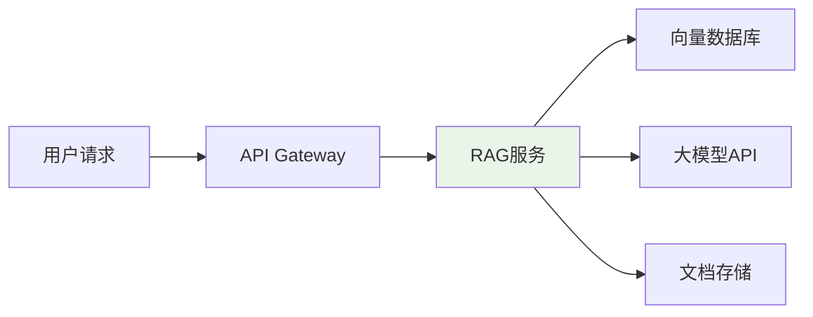
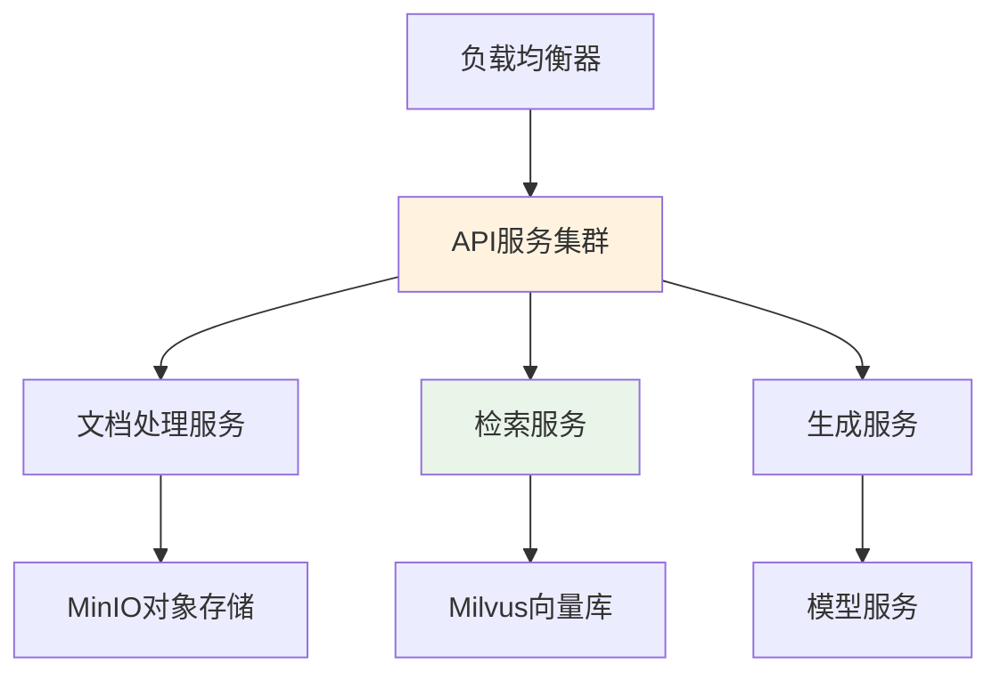
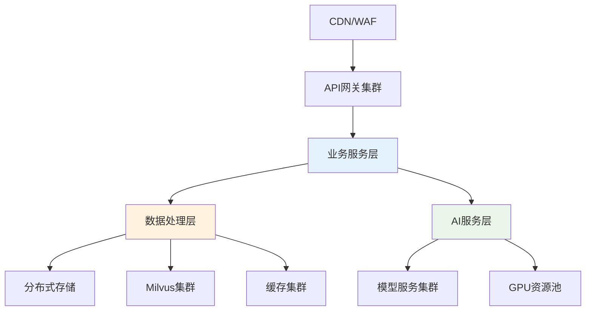
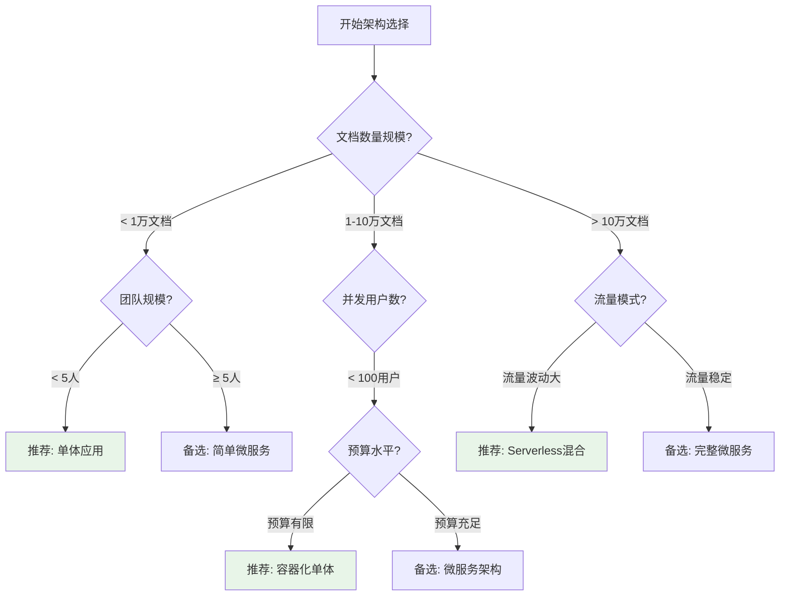

## 深度RAG笔记08：深度RAG笔记08：企业级RAG项目规划与技术选型实战指南

> **翊行代码:深度RAG笔记第8篇**：从技术研究到企业落地的完整决策框架，掌握RAG项目成功实施的关键要素

你花了几个月时间学RAG技术，终于搞懂了向量数据库、嵌入模型这些概念，老板让你负责公司的智能问答项目，你却发现——**根本不知道从哪下手**。

选Milvus还是Pinecone？团队需要几个人？预算要准备多少？这些问题没人教过你，网上的教程都是讲技术原理，真正要在公司落地时，你发现自己两眼一抹黑。

说实话，我见过太多这样的情况了。技术学得很扎实，一到项目规划就懵圈。很多团队花了几十万预算，最后项目黄了，老板气到不行，团队也士气低落。

**问题出在哪？缺乏系统性的项目规划方法**。

今天我们就来聊聊，如何从零开始规划一个真正能成功的企业级RAG项目。从业务分析到技术选型，从团队组建到风险控制，给你一套完整的决策框架。

## 项目前期准备

### 业务需求深度分析

我见过一个团队，花了三个月时间做了个"智能客服机器人"，结果上线后发现客户根本不爱用，还是喜欢找人工客服。为什么？**没搞清楚用户真正的痛点**。

用户要的不是"智能对话"，而是"快速解决问题"。机器人回答虽然快，但经常答非所问，用户试了几次就放弃了。

这就是典型的**伪需求**。技术很炫酷，但不解决真问题。

#### 四步诊断法

我总结了一套"四步诊断法"，帮你找到业务的真痛点：

**第一步：症状识别**

别听业务方说"我们需要个AI助手"，要深挖背后的症状：

- **效率症状**：查个技术文档要翻半天，专家天天回答重复问题
- **管理症状**：知识散落在各个系统，更新了半天没人知道
- **体验症状**：客户找个信息要转三个部门，投诉一大堆

**第二步：指标量化**

用数据说话，不要拍脑袋：

- **效率指标**：平均查询时间是多少？专家花多少时间做重复工作？
- **管理指标**：知识利用率有多低？更新周期有多长？
- **体验指标**：用户满意度评分？问题解决率？

**第三步：成本核算**

算笔账，看看现状到底"烧"了多少钱：

- **人工成本**：专家时薪按500元算，一天回答20个重复问题，一年就是几十万
- **机会成本**：专家本该做更有价值的事，却在做"复读机"工作
- **流失成本**：客户体验差导致的流失，损失更大

**第四步：价值预期**

RAG能带来什么具体改善？

- **效率提升**：查询时间从30分钟降到3分钟
- **成本节省**：专家时间释放出来做更有价值的工作
- **体验改善**：24小时随时可查，准确率大幅提升

#### ROI评估：算清楚账再开工

很多老板一听要花几十万做个AI项目，第一反应就是"值得吗？"你得用数据说服他。

我们来算笔具体的账。以一个中型企业为例：

**成本投入分析**：

一个中型企业RAG项目的投入主要包括三块：人员成本是大头，项目经理、AI工程师、数据工程师的6个月要花不少钱；技术成本包括云服务器和API调用费，一年下来也是一笔不小的开支；基础设施如向量数据库和监控系统是一次性投入。第一年总投入相当可观。

**收益分析**：

我们来算算这笔账。假设一个公司有数十个技术专家，每天都要花时间回答重复性问题。这部分人工成本节省非常可观，一年能节省数百万。更重要的是，专家时间释放后能承接更多高价值项目，增收潜力很大。客户体验提升带来的间接价值虽然难以精确量化，但影响很深远。

**投资回报评估**：

综合考虑成本节省和增收潜力，这样的项目通常都有很高的投资回报率，大部分情况下第一年就能回本，这笔账从商业角度来说还是很划算的。

### 技术可行性评估：数据是成败关键

说实话，我见过太多项目败在数据上。技术架构设计得很漂亮，结果数据一团糟，RAG系统答出来的东西牛头不对马嘴。

**数据就像食材，再好的厨师也做不出好菜如果食材烂了**。

#### 数据现状"体检"清单

在动手之前，先给你的数据做个全面体检：

#### 第一步：规模评估

看看你有多少"家底"：

- **文档数量**：少于1万算小规模，够做MVP；1-10万算中规模，可以支撑业务；超过10万算大规模，需要考虑性能问题
- **数据总量**：GB级别比较轻松，TB级别需要认真考虑存储方案，PB级别就需要大数据架构了
- **增长速度**：如果数据增长很快，要提前考虑扩容方案

#### 第二步：质量检查

这是最容易踩坑的地方：

- **完整性检查**：有多少文档缺标题？多少段落是空白？这些都会影响检索效果
- **格式一致性**：同样的信息，有的用PDF，有的用Word，有的是扫描件，处理起来就麻烦了
- **重复数据**：很多公司的文档重复率超过30%，不清理的话会严重影响检索质量
- **时效性**：有些文档已经过期了还在用，RAG给出过时信息就尴尬了

#### 第三步：可访问性评估

技术实现角度的考虑：

- **数据位置**：是在本地服务器、云端还是各个业务系统里？数据越分散，集成越复杂
- **权限控制**：哪些数据可以公开？哪些需要权限控制？这直接影响架构设计
- **API接口**：现有系统有没有标准接口？没有的话可能需要开发数据采集模块

#### 数据质量评估标准

- **80分以上**：数据质量不错，可以直接开始原型开发
- **60-80分**：需要一些清洗工作，但不影响项目进度
- **60分以下**：建议先花时间整理数据，否则后面会很痛苦

## 技术架构设计决策

说到技术选型，很多人都有"选择恐惧症"。Milvus、Pinecone、Weaviate...这么多选择，到底选哪个？

我的建议是：**别想着一步到位，从需求出发**。

### 向量数据库选型：从小到大的成长路径

经过这几年的实践，我总结了一套"成长路径"选型法：

#### 起步阶段：免费方案快速验证

**如果你是个人学习或者做技术评估**，推荐从Zilliz Cloud开始：

- **为什么选它**：每月200万向量免费额度，够你折腾一阵子了
- **适用场景**：个人学习、原型验证、小规模测试
- **注意事项**：7天不用会自动挂起，但数据不丢失，一键就能恢复

我见过很多团队就是从Zilliz Cloud的免费版本开始，先把RAG流程跑通，确认可行性后再考虑升级。

**本地开发推荐Chroma**：

- **为什么选它**：纯Python实现，pip install就能用，零配置
- **适用场景**：本地开发测试、快速原型、小数据集
- **优势**：嵌入式设计，代码简单，调试方便

#### 中等规模：企业级部署

**数据量在10万-100万向量的话**，有两个主流选择：

**预算充足选Pinecone**：

- **核心优势**：全托管，零运维，性能稳定
- **适用团队**：缺乏运维能力，需要快速上线
- **成本考虑**：按量付费，初期成本可控，后期可能较贵

**技术实力强选Milvus**：

- **核心优势**：开源免费，性能卓越，完全可控
- **适用团队**：有专业运维，对成本敏感，长期规划
- **技术要求**：需要懂Kubernetes，有容器化经验

#### 大规模：企业级集群

**超过100万向量，必须考虑分布式架构**：

**Milvus集群是王道**：

- **扩展能力**：轻松支持十亿级向量
- **性能表现**：毫秒级查询，支持高并发
- **成本优势**：相比云服务节省60-80%

**Pinecone适合土豪**：

- **无脑部署**：完全托管，自动扩容
- **成本考虑**：大规模使用成本很高，但省心省力

#### Milvus 2024年实战表现：为什么它是企业首选

做过RAG项目的都知道，向量数据库的性能直接决定用户体验。查询慢了，用户等得不耐烦；并发撑不住，系统就崩了。

**Milvus的核心优势在哪？**

**分布式架构**：这是它最大的杀手锏。其他很多向量数据库都是单机版起家，后来硬塞进分布式能力，架构上有先天缺陷。Milvus从第一天就是为分布式设计的。

**GPU加速**：如果你有NVIDIA的GPU，性能提升是真的明显。我们测试过，同样的查询任务，GPU加速后响应时间能降低一个数量级。

**多索引算法**：支持IVF、HNSW等多种索引策略，可以根据数据特点和查询模式选择最优方案。特别是HNSW算法，通过构建多层导航图实现了O(logN)的查询复杂度，在百万级向量中仍能保持毫秒级响应（我们在[深度RAG笔记02：数据索引与向量化技术](深度RAG笔记02.md)中详细分析过HNSW的技术原理），这是Milvus在大规模应用中表现优异的关键原因。

**真实性能数据**：

我们在生产环境的实测经验显示：

- **查询延迟**：绝大部分查询都能在毫秒级完成
- **并发能力**：单集群能支持很高的QPS
- **扩展性**：从小规模集群扩展到大规模，性能线性增长
- **成本效益**：相比商业云服务能节省大量运营成本

**什么情况下选Milvus？**

- 数据量超过100万向量
- 对查询性能要求高（毫秒级响应）
- 需要支持高并发访问
- 团队有一定的运维能力
- 长期成本控制很重要

**核心建议**：

- **学习阶段**：Zilliz Cloud（免费额度，功能完整）
- **开发阶段**：Chroma（本地部署，调试方便）
- **生产环境**：Milvus（性能优异，成本可控）
- **快速上线**：Pinecone（零运维，按需付费）

### 嵌入模型选择：性能与成本的平衡

向量数据库选好了，接下来就是嵌入模型。这直接影响检索的准确性。

#### 主流选择对比

**中文场景首选BGE-Large-ZH**：

- **性能表现**：在中文检索任务上表现最好
- **成本优势**：完全免费，本地部署
- **适用场景**：中文为主的企业应用

**多语言场景选OpenAI ada-002**：

- **语言支持**：支持100+种语言
- **文档长度**：支持8K tokens，适合长文档
- **成本考虑**：按token计费，大规模使用成本较高

**预算敏感选Sentence-Transformers**：

- **开源免费**：完全免费，可本地部署
- **性能平衡**：在多数场景下表现不错
- **技术门槛**：需要一定的技术能力进行调优

### 系统架构设计：从简单到复杂的演进路径

选好了核心组件，接下来就是系统架构设计。很多人一上来就想搞微服务、分布式，其实大可不必。

**我的建议是分阶段演进**：

#### 第一阶段：单体架构快速验证

**适用场景**：MVP验证、小团队快速试错

**技术栈推荐**：

- **后端**：Python + FastAPI + SQLite
- **向量库**：Chroma（嵌入式部署）
- **模型**：OpenAI API 或本地Ollama
- **部署**：单机Docker容器

**优势**：开发快、部署简单、调试容易
**适用规模**：< 1万文档，< 50并发用户

#### 第二阶段：模块化部署扩展能力

**适用场景**：中等规模生产环境

**技术栈升级**：

- **服务拆分**：文档处理、检索、生成独立部署
- **检索策略升级**：从单一向量检索升级为混合检索（向量+关键词），我们在[深度RAG笔记03：智能检索核心技术](深度RAG笔记03.md)中分析过混合检索如何通过BM25和Dense Retrieval的优势互补，显著提升检索准确性
- **数据库**：PostgreSQL + Milvus
- **消息队列**：Redis 或 RabbitMQ
- **部署**：Docker Compose 或 K8s

**适用规模**：1-10万文档，100-500并发用户

#### 第三阶段：企业级分布式架构

**适用场景**：大规模企业应用，高可用要求

**企业级特性**：

- **高可用设计**：多活部署，故障自动切换
- **弹性扩容**：基于K8s的自动扩缩容
- **监控告警**：全链路监控，智能告警
- **安全合规**：数据加密，权限控制，审计日志。参考我们在[深度RAG笔记07：RAG+AI Agent在医疗行业的十大落地案例](深度RAG笔记07.md)中的安全实践，包括数据脱敏策略、HIPAA合规要求、隐私保护机制等，这些安全标准对企业级RAG项目同样重要

**适用规模**：> 10万文档，> 1000并发用户

**关键考虑因素**：

- **性能要求**：毫秒级响应，万级并发
- **可靠性要求**：99.9%可用性，数据零丢失
- **安全要求**：数据隔离，权限管控，合规审计
- **成本控制**：资源利用率，运维效率

#### 嵌入模型选择策略

**主流嵌入模型对比分析**：

**OpenAI ada-002模型**：性能评分很高，支持100多种语言，文档长度可达8K tokens，适合通用场景和多语言支持需求，按token计费。

**BGE-Large-ZH模型**：在中文场景下性能表现最佳，完全免费开源，支持中英文，文档长度512 tokens，是中文优化的最佳选择。

**Sentence-Transformers模型**：性能表现均衡，完全免费开源，支持中英文，文档长度512 tokens，能很好平衡性能与成本。

#### 中文为主的业务场景

如果你的业务主要面向中文用户，我强烈建议选择BGE-Large-ZH。这个模型专门针对中文进行了优化，而且完全免费，性能表现非常出色。如果需要多语言兼容，可以考虑OpenAI ada-002作为备选。

#### 多语言国际化场景

面向国际市场的话，OpenAI ada-002是最佳选择，它对100多种语言的支持最全面。如果预算有限，Sentence-Transformers也是不错的开源免费选择。

#### 预算敏感的场景

如果成本控制是主要考虑因素，建议优先选择BGE-Large-ZH或Sentence-Transformers，这两个都是完全免费的开源模型。要避免使用OpenAI ada-002，因为它是按量付费的。

#### 长文档处理场景

如果你需要处理比较长的文档，OpenAI ada-002支持8K以上的tokens，是最好的选择。需要注意的是，大部分开源模型都有512 tokens的长度限制。

#### 性能优先场景

追求最佳性能的话，中文场景下BGE-Large-ZH表现最优，通用场景下OpenAI ada-002性能稳定可靠。

**实际选择建议**：

对于不同规模的团队，我的建议是：初创团队用BGE-Large-ZH，免费且高性能；中小企业根据语言需求在BGE和ada-002之间选择；大型企业建议用OpenAI ada-002，稳定性和技术支持更好；技术实力强的团队可以考虑Sentence-Transformers，可以进行深度定制优化。

### 系统架构模式选择

#### 部署架构对比

**架构模式对比分析**：

**单体应用**：部署简单，开发容易，适合小规模试点项目，实施复杂度较低。

**微服务架构**：模块化设计，容易扩展，适合企业级长期项目，但实施复杂度较高。

**Serverless架构**：自动扩缩容，按需付费，特别适合流量波动大的应用，实施复杂度中等。

**混合架构**：能平衡性能和复杂度，适合中大型企业应用，但实施复杂度最高。

#### 架构选择决策流程图

📋 **架构选择详细建议**：

#### 单体应用：小团队快速启动

如果你的团队不到5人，文档数量在1万以下，我强烈建议从单体应用开始。技术栈选择Python FastAPI + SQLite + 本地向量库就够了。这种方案的优势是开发快速、部署简单、调试容易，特别适合快速验证想法。需要注意的是扩展性有限，要提前规划好升级路径。

#### 容器化单体：中等规模经济选择

面对1-10万文档，100以下并发用户，预算又比较有限的情况，容器化单体是很好的选择。用Docker + Python + PostgreSQL + Redis的技术栈，成本可控，运维相对简单，性能也够稳定。而且可以平滑升级到微服务架构，给未来留下了扩展空间。

#### 微服务架构：企业级标准方案

超过10万文档，100以上并发用户，团队也比较成熟的话，微服务架构就是标准选择了。用K8s + API网关 + 服务注册发现的技术栈，具备高可扩展性，模块独立，技术栈也很灵活。我们在[深度RAG笔记05：电商智能客服RAG系统实战](深度RAG笔记05.md)中详细分析过微服务架构的优势，通过文档处理、检索、生成服务的独立部署，实现了高并发下的稳定响应和弹性扩容。不过要注意复杂度比较高，需要专业的运维团队。

#### Serverless混合：流量波动优化

如果你面对的是大规模数据，而且流量波动特别明显，Serverless混合架构就很合适。用腾讯云、阿里云的Serverless + API Gateway + 云数据库，自动扩缩容，按需付费，运维成本很低。不过要考虑冷启动延迟和供应商锁定的风险。

## 团队组建与预算规划

### 团队配置：人员不在多，在精

很多公司一听做AI项目，就想搞个大团队，恨不得把所有相关的人都拉进来。其实RAG项目真正需要的核心人员不多，**关键是要精**。

#### 核心团队配置（5-7人足够）

**技术核心（3-4人）**：

- **项目负责人**（1人）：既懂技术又懂业务，能协调各方资源
- **AI工程师**（1-2人）：负责RAG系统开发，熟悉LangChain/LlamaIndex
- **数据工程师**（1人）：负责数据处理和ETL流程

**业务支撑（2-3人）**：

- **领域专家**（1-2人）：提供业务知识，验证系统效果
- **前端工程师**（1人）：开发用户界面（如果需要的话）

**别一开始就招运维工程师**，除非你的规模真的很大。前期用云服务，等系统稳定了再考虑专门的运维。

#### 技能要求清单

**项目负责人必备技能**：

- 有过AI项目经验（不一定是RAG，机器学习、NLP都行）
- 能看懂代码，能和技术团队顺畅沟通
- 项目管理能力，能控制进度和风险

**AI工程师核心技能**：

- Python开发经验，熟悉机器学习库
- 向量数据库使用经验（Milvus、Pinecone等）
- LLM应用开发经验（提示工程、API调用）

**数据工程师关键能力**：

- 数据清洗和预处理经验
- 熟悉SQL和数据库操作
- 了解数据安全和隐私保护

## 风险控制：避开常见的坑

做RAG项目有几个经典的坑，很多团队都会踩。提前知道这些风险，就能避免项目翻车。

### 最常见的四大风险

#### 数据质量风险：最容易忽视，影响最大

**风险表现**：

- 文档格式不统一，解析出来的文本乱七八糟
- 重复数据太多，检索结果都是重复内容
- 过期数据没清理，系统给出过时信息

**预防措施**：

- **数据清洗标准化**：建立文档预处理流程，统一格式
- **质量监控体系**：定期检查数据质量，及时发现问题。我们在[深度RAG笔记06：法律文档智能检索系统](深度RAG笔记06.md)中实践了四重验证机制（事实准确性、引用准确性、逻辑一致性、适用性检查），这套质量管控体系同样适用于企业级RAG项目
- **版本管理机制**：建立文档版本控制，及时更新过期内容

**应急方案**：准备数据修复工具，发现问题能快速修复

#### 性能风险：用户体验的杀手

**风险表现**：

- 查询响应时间超过5秒，用户直接放弃
- 并发用户一多，系统就卡死

**预防措施**：

- **性能基准测试**：上线前做好压力测试
- **缓存策略设计**：常见查询做缓存，提升响应速度
- **扩容预案制定**：流量增长时能快速扩容

**应急方案**：降级策略，保证核心功能可用

#### 团队技能风险：技术门槛的挑战

**风险表现**：

- 团队对RAG技术不熟悉，开发效率低
- 关键人员离职，项目停摆

**预防措施**：

- **技能培训计划**：项目开始前做好技术培训
- **知识文档积累**：关键技术点做好文档记录
- **外部支持准备**：建立外部专家支持渠道

**应急方案**：关键岗位准备备选人员或外部顾问

## 成功指标定义：量化项目价值

做项目一定要有明确的成功标准，不然怎么知道做得好不好？我总结了一套简单实用的指标体系。

### 业务指标：真正解决了什么问题

**效率提升**：

- **查询处理时间**：从30分钟缩短到3分钟
- **专家时间释放**：每天节省2小时重复工作

**用户体验**：

- **用户满意度**：4分以上（5分制）
- **使用率**：60%以上员工主动使用

**成本效益**：

- **ROI回报率**：第一年投资回报率300%以上
- **成本节省**：人工成本降低50%以上

### 阶段性里程碑

**第1个月**：MVP上线，基本功能可用
**第3个月**：核心功能完善，用户开始使用
**第6个月**：系统稳定运行，达到预期效果

## 实施时间线：6个月落地计划

项目规划要现实，不能太激进也不能太保守。我建议分三个阶段，每阶段2个月。

### 第一阶段：MVP验证（第1-2个月）

**目标**：快速验证技术可行性，搭建基础框架

**主要任务**：

- **数据准备**：收集和清洗核心数据集
- **技术选型**：确定向量数据库、模型等技术栈
- **基础开发**：实现核心的检索和生成功能
- **原型测试**：小范围内测，验证效果

**交付成果**：能demo的MVP系统，核心功能可用

### 第二阶段：功能完善（第3-4个月）

**目标**：完善系统功能，准备生产部署

**主要任务**：

- **功能扩展**：增加用户界面、权限管理等
- **性能优化**：缓存、并发处理、响应速度优化
- **安全加固**：数据安全、访问控制、审计日志
- **压力测试**：模拟生产环境负载测试

**交付成果**：功能完整的系统，可以小规模上线

### 第三阶段：生产部署（第5-6个月）

**目标**：正式上线，稳定运行

**主要任务**：

- **生产部署**：搭建生产环境，数据迁移
- **用户培训**：培训最终用户，制作使用文档
- **监控完善**：完善监控告警，建立运维体系
- **效果评估**：收集用户反馈，评估项目效果

**交付成果**：稳定运行的生产系统，达到预期目标

### 关键控制点

**第2个月检查**：MVP可演示，核心功能验证通过
**第4个月检查**：功能完整，性能达标，可以上线
**第6个月检查**：系统稳定运行，用户满意度达标

## 总结

做企业级RAG项目，最怕的就是没有章法，东一榔头西一棒槌。我见过太多项目就是因为前期规划不充分，后期各种问题爆发。

**关键成功要素**：

- **需求分析要深入**：找到真问题，算清楚ROI账
- **技术选型要务实**：从小到大，分阶段演进
- **团队配置要精简**：核心人员要精，支撑人员要够
- **风险控制要前置**：提前识别风险，准备应对方案
- **目标设定要量化**：技术指标+业务指标，可衡量可验证

**我的建议**：

**别追求一步到位**。先搞个MVP验证可行性，再逐步完善功能。很多公司一上来就想搞个完美的系统，结果开发了大半年，最后发现根本不是用户想要的。

**数据质量是关键**。技术再先进，数据质量不行也白搭。在技术选型之前，先把数据整理好。

**团队能力要匹配**。RAG项目的技术门槛不低，如果团队技能不够，建议先培训或者找外部支持。

有了这套规划方法，你就能大大提高RAG项目的成功率。记住，**成功的项目都是规划出来的，不是临时抱佛脚**。

下一篇我们会聊聊RAG项目的部署和运维，敬请期待！

**本文是深度RAG笔记第8篇，专注企业级项目规划与技术选型。关注翊行代码，一起深入RAG技术栈！**
