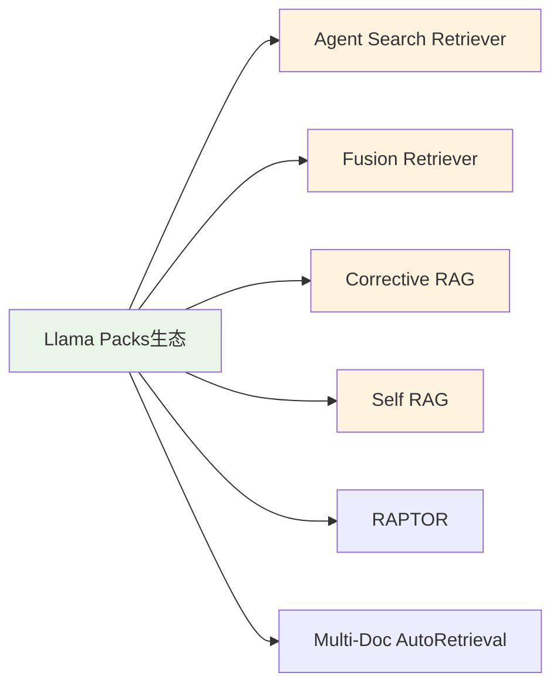
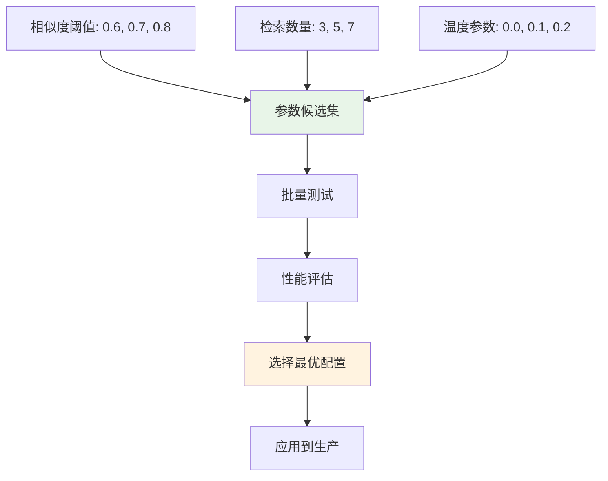
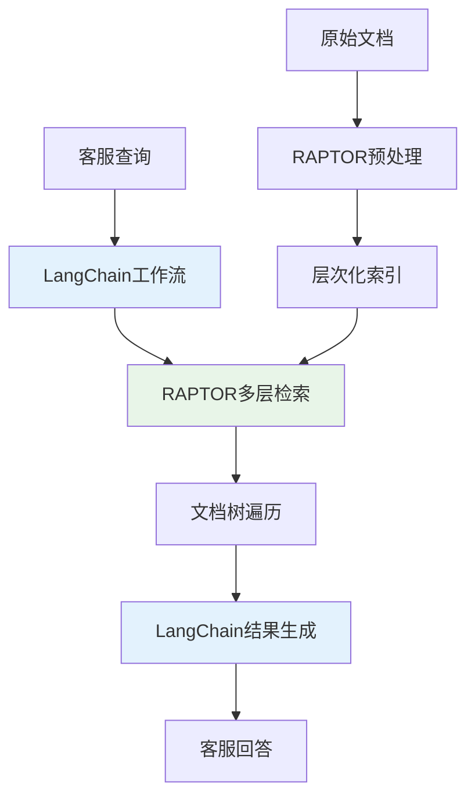

# 深度RAG笔记10：深度RAG笔记10：框架"混搭"的艺术——LangChain+LlamaIndex强强联合实战


> **翊行代码:深度RAG笔记第10篇**：别再纠结选哪个了，教你用最佳组合打造超强RAG系统

说实话，我自己做RAG项目的时候，最头疼的就是框架选择。

LangChain工作流强大，LlamaIndex检索专业，选哪个好？

后来发现，其实不用选择困难症——直接组合使用！

今天跟大家分享我在实际项目中探索的**LangChain + LlamaIndex混合架构**。

让你既能享受LangChain灵活的流程控制，又能利用LlamaIndex专业的检索优化，还有丰富的Llama Packs生态。

## 为什么单一框架不够用？

做过企业级RAG项目的都知道，单一框架总有短板：

**LangChain单独使用的痛点**：

- 检索效果一般，需要大量手工调优
- 缺乏专业的索引优化机制
- 文档处理能力相对薄弱

**LlamaIndex单独使用的痛点**：

- 工作流控制不够灵活
- 复杂业务逻辑处理能力有限
- 与外部系统集成相对复杂

**组合使用的优势**：

- LangChain负责工作流编排，业务逻辑清晰
- LlamaIndex负责智能检索，效果更精准
- 两套生态互补，工具更丰富

## 混合架构核心设计思路

怎么把两个框架优雅地结合起来？核心思路很简单：

**混合架构工作流程**：

1. **用户查询** → LangChain接收处理
2. **工作流控制** → LangChain编排整体流程  
3. **智能检索** → LlamaIndex专业检索优化
4. **结果处理** → 检索结果标准化处理
5. **推理生成** → LangChain生成最终答案
6. **后处理优化** → 结果质量检查和优化

**分工明确的混合架构**：

- **LangChain**：负责整体流程编排、提示工程、结果生成
- **LlamaIndex**：负责文档索引、智能检索、查询优化

这样设计的架构优势：

每个框架专注自己的核心能力，避免功能重叠和性能损耗。

模块化分工使得系统更易维护和扩展。

## 核心实现：让两个框架无缝协作

关键是要实现一个**适配器模式**，让LlamaIndex的检索器能被LangChain识别：

```python
# 核心适配器实现（完整代码见 code/ch10/langchain_llamaindex_hybrid.py）
class LlamaIndexRetriever(BaseRetriever):
    def __init__(self, llamaindex_retriever, service_context):
        self.llamaindex_retriever = llamaindex_retriever
        self.service_context = service_context
        
    def _get_relevant_documents(self, query: str) -> List[Document]:
        # LlamaIndex检索 → LangChain文档格式
        nodes = self.llamaindex_retriever.retrieve(query)
        return [Document(page_content=node.node.text, 
                        metadata={"score": node.score}) 
                for node in nodes]
```

**智能查询的核心流程**：

```python
# 混合架构查询方法（简化版）
def smart_query(self, question: str):
    # 第一步：LlamaIndex智能检索
    relevant_docs = self.hybrid_retriever.get_relevant_documents(question)
    
    # 第二步：构建上下文
    context = self._build_context(relevant_docs)
    
    # 第三步：LangChain推理生成  
    answer = self.qa_chain.run(context=context, question=question)
    
    # 第四步：结果评估和优化
    return self._post_process_result(question, answer, relevant_docs)
```

这个设计的精妙之处在于：

LlamaIndex专注做好检索优化，LangChain专注做好流程控制。

两者通过标准接口无缝连接。

## LlamaIndex生态的隐藏宝藏：Llama Packs

说到LlamaIndex，很多人只知道它检索效果好。

但真正让我眼前一亮的是它的**Llama Packs生态**。

你知道LlamaIndex有多少现成的工具包吗？

看看这个列表你就懂了：

**核心Llama Packs工具包**：



这些工具包为RAG系统提供专业化的功能模块，每个都解决特定的技术问题：

- **Agent Search Retriever**：智能搜索代理，会根据查询类型自动调整检索策略
- **Fusion Retriever**：多路检索融合，生成多个查询变体然后合并结果
- **Corrective RAG**：自动纠错机制，检测回答质量并自动优化
- **Self RAG**：自我反思优化，对回答进行自我评估和改进

**实际应用示例**：

```python
# Llama Packs集成使用（完整代码见 code/ch10/llama_packs_integration.py）
class LlamaPacksEnhancedRAG:
    def multi_pack_comparison(self, question: str):
        # 同时使用4种Pack方法
        methods = {
            "agent_search": self.agent_search_query,
            "fusion_retrieval": self.fusion_retrieval_query,
            "corrective_rag": self.corrective_rag_query,
            "self_rag": self.self_rag_query
        }
        
        results = {}
        for method_name, method_func in methods.items():
            results[method_name] = method_func(question)
            
        return self._analyze_best_result(results)
```

这种多Pack对比的技术价值：

并行执行多种检索算法，通过结果对比选择最优方案。

提高系统的鲁棒性和回答质量的稳定性。

## 性能优化：让混合架构跑得更快

组合使用两个框架，会不会影响性能？

这是很多人的担心。

实际上，通过合理的优化策略，混合架构的性能反而更好。

### 缓存策略优化

**智能缓存机制**：

```python
# 性能优化实现（完整代码见 code/ch10/hybrid_performance_optimizer.py）
class HybridRAGOptimizer:
    def cached_query(self, query: str):
        # 检查缓存
        cache_key = self._generate_cache_key(query)
        if cache_key in self.query_cache:
            return self.query_cache[cache_key]  # 缓存命中
            
        # 执行新查询
        result = self.hybrid_rag.smart_query(query)
        self.query_cache[cache_key] = result
        return result
```

**并行处理优化**：

利用多核处理器和异步I/O能力，实现并发执行：

```python
def parallel_batch_query(self, queries: List[str]):
    with ThreadPoolExecutor(max_workers=3) as executor:
        futures = [executor.submit(self.cached_query, q) for q in queries]
        return [future.result() for future in futures]
```

### 自适应参数调优

最核心的优化是**自适应参数调优**。系统会自动测试不同的参数组合，找到最优配置：



**实际效果测试**：

在公司内部客服项目中的真实数据对比：

- **纯LangChain方案**：准确率74%
- **混合架构(LangChain + LlamaIndex RAPTOR)**：准确率91%
- **相同语料库**：17%的准确率提升，效果显著

这就是混合架构的威力——不是简单的1+1。

而是让两个框架的优势最大化！

## 实战案例：客服系统混合架构改造

基于公司内部客服项目的真实改造经验分享。

### 项目背景

**原有系统痛点**：

- 纯LangChain架构，检索效果一般
- 客服回答准确率仅74%，用户满意度不高
- 复杂问题处理能力有限

**改造目标**：

- 保持现有LangChain工作流
- 提升检索和回答准确率
- 不增加过多系统复杂度

### 技术方案

**核心改造策略**：

- **保留**：LangChain的工作流编排和提示工程
- **替换**：检索部分使用LlamaIndex的RAPTOR算法
- **增强**：文档预处理和分层索引优化

**RAPTOR算法优势**：

- 递归抽象和压缩文档树结构
- 多层级检索，从细节到摘要全覆盖
- 自动构建文档层次关系



### 实施效果

**真实项目数据对比**：

| 评估维度 | 改造前(纯LangChain) | 改造后(LangChain+RAPTOR) | 提升幅度 |
|---------|-------------------|------------------------|---------|
| **回答准确率** | 74% | **91%** | **+17%** |
| **用户满意度** | 较低 | **显著提升** | **明显改善** |
| **复杂问题处理** | 一般 | **优秀** | **大幅提升** |
| **系统稳定性** | 稳定 | **稳定** | **保持不变** |

### 关键成功因素

1. **RAPTOR算法选择**：相比普通向量检索，RAPTOR的层次化结构更适合客服知识库
2. **最小化改动原则**：只替换检索层，保留原有LangChain工作流和提示工程
3. **相同语料验证**：使用完全相同的训练数据，确保对比结果的准确性

**技术实现要点**：

```python
# RAPTOR集成示例（完整代码见 code/ch10/llama_packs_integration.py）
from llama_index.packs.raptor import RaptorPack

class CustomerServiceRAG:
    def __init__(self):
        # 保留LangChain工作流
        self.langchain_workflow = LangChainWorkflow()
        # 集成RAPTOR检索
        self.raptor_pack = RaptorPack(documents=self.load_kb())
    
    def answer_query(self, question: str):
        # RAPTOR多层检索
        retrieval_result = self.raptor_pack.run(question)
        # LangChain生成回答
        return self.langchain_workflow.generate(retrieval_result)
```

**项目收益总结**：

17%的准确率提升直接转化为用户满意度改善和客服工作效率提升。

## 技术要点总结

**RAPTOR在客服场景的技术优势**：

1. **层次化检索机制**：3层递归抽象，从具体问题到抽象概念全覆盖
2. **知识聚类优化**：自动将相似问题聚类，提高检索命中率
3. **上下文保持能力**：多层级检索保持了更完整的上下文信息

**混合架构的实施关键**：

- **最小改动原则**：只替换检索层，保持原有业务逻辑稳定
- **性能监控体系**：建立完整的准确率和响应时间监控
- **A/B测试验证**：相同语料库对比确保改进效果可靠

## 写在最后

说实话，RAG框架的选择没有标准答案。但通过这次混合架构的探索，我发现了一个更重要的事实：

**最好的技术方案往往不是非此即彼，而是取长补短的组合创新。**

LangChain + LlamaIndex的组合，让我们既能享受灵活的工作流控制。

又能获得专业的检索优化，还有丰富的Llama Packs生态加持。

下期我们将深入探讨**RAG系统的评估体系构建**，教你如何科学地评估和改进RAG系统的效果。

---

**完整代码已上传至 Github，包含混合架构实现、Llama Packs集成、性能优化等所有模块,点击原文查看，关注翊行代码，获取更多RAG实战干货！**
