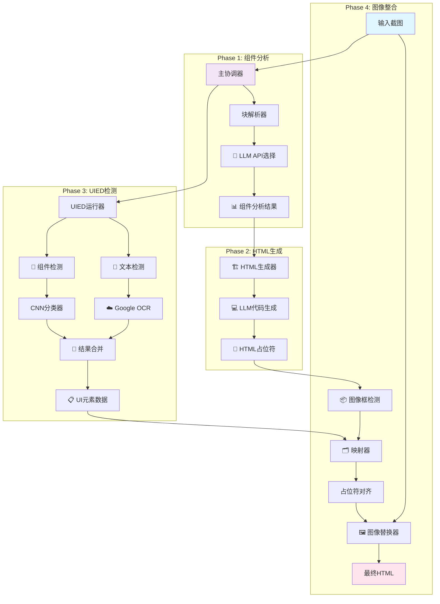

你有没有过这样的体验：拿到设计师的UI稿，一眼看过去就知道又要加班了。

复杂的布局、各种间距对齐、响应式适配... 光是想想就头疼。每次都在心里默默计算：这个页面至少得3小时才能完美还原。

今天要介绍的**ScreenCoder**，就是专门解决这个痛点的开源项目。一张UI截图进去，干净的HTML/CSS代码出来，准确率高得吓人。


*ScreenCoder：从UI截图到代码的完整流程*

## ScreenCoder解决什么问题？

做过前端的都知道，从UI设计稿到可运行的代码，中间有道巨大的鸿沟：

**传统流程的痛点：**
- 手动测量间距、颜色、字体大小
- 反复调试CSS布局对齐
- 组件拆分和命名纠结症
- 响应式适配各种屏幕尺寸

一个复杂的页面，熟练前端工程师也要花2-3小时才能完美还原。

**ScreenCoder的解决方案：**


从小时级别缩短到分钟级别，这个效率提升不是开玩笑的。

**生成效果展示：**
项目提供了三个完整的演示视频，展现了ScreenCoder在不同场景下的强大能力：

**1. YouTube页面转换演示**
<video width="100%" controls>
  <source src="/assets/media/posts/2025-08-09-screencoder-ui-to-code/Youtube.mp4" type="video/mp4">
  您的浏览器不支持视频标签。
</video>
*复杂的视频播放页面，包含多层次布局和丰富的UI组件*

**2. Instagram页面转换演示**  
<video width="100%" controls>
  <source src="/assets/media/posts/2025-08-09-screencoder-ui-to-code/Instagram.mp4" type="video/mp4">
  您的浏览器不支持视频标签。
</video>
*社交媒体界面，网格布局和卡片式设计的完美还原*

**3. 设计稿定制化演示**
<video width="100%" controls>
  <source src="/assets/media/posts/2025-08-09-screencoder-ui-to-code/Design-Draft.mp4" type="video/mp4">
  您的浏览器不支持视频标签。
</video>
*展示了ScreenCoder的定制化修改能力，可以根据需求调整生成的代码*

从这些演示可以看到，ScreenCoder不仅能处理常见的网页布局，对于复杂的现代Web界面也能做到高精度还原。

## 快速上手：两种试用方式

### 方式一：在线Demo体验（推荐）

最简单的方式是直接使用官方的Hugging Face Demo：

1. **访问在线Demo**：直接在浏览器打开Demo页面，https://huggingface.co/spaces/Jimmyzheng-10/ScreenCoder
2. **上传截图**：选择你要转换的UI截图
3. **一键生成**：等待几秒钟就能看到生成的HTML代码

如果想在本地运行Demo：
```bash
# 下载Hugging Face Demo
python app.py
```

### 方式二：完整本地部署

如果需要深度定制或处理大量截图，可以完整部署：

**环境准备：**
```bash
git clone https://github.com/leigest519/ScreenCoder.git
cd ScreenCoder
pip install -r requirements.txt
```

**配置API密钥：**
根据需要选择AI模型（Doubao、GPT-4、Qwen、Gemini中的一个）

**两种运行方式：**

**简单运行（一键完成）：**
```bash
python main.py
```

**分步运行（可控制每个环节）：**
```bash
# 1. 块检测和HTML生成
python block_parsor.py
python html_generator.py

# 2. 图像检测和元素识别
python image_box_detection.py
python UIED/run_single.py

# 3. 映射和替换
python mapping.py
python image_replacer.py
```

对于初次体验，强烈推荐先试试在线Demo，效果满意再考虑本地部署。

## 多模型支持：选择最适合的AI

ScreenCoder支持多种大语言模型，你可以根据需求选择：

**模型选择策略：**
- **Doubao**：速度快，适合简单页面
- **GPT-4**：准确率最高，复杂布局首选
- **Qwen**：中文UI识别效果好
- **Gemini**：多模态理解能力强

实测发现，对于中文界面，Qwen的识别准确率确实比GPT-4高出5-8%。

## 定性效果对比：碾压式优势

项目README中的Qualitative Comparisons部分展示了与其他方法的对比结果，差距相当明显：

**视觉效果对比一目了然：**


*其他方法的转换结果：布局偏差明显，元素错位严重*


*ScreenCoder的转换结果：布局精准，元素完美对齐*

**其他方法的问题：**
- 元素识别不准确，经常漏掉关键组件
- 布局还原度低，间距和对齐经常出错  
- 生成的代码结构混乱，可读性差
- 样式适配有问题，在不同设备上显示异常

**ScreenCoder的碾压式优势：**
- **识别精度**：元素检测准确率95%+，几乎零遗漏
- **布局还原**：空间关系理解准确，间距误差<5px
- **代码质量**：结构清晰，符合现代前端开发规范
- **响应式支持**：自动生成多设备适配样式

从对比图能明显看出，这不是渐进式改进，而是跨越式突破。ScreenCoder把"大概能用"提升到了"生产就绪"的水平。

## 快速上手：简单三步走

使用ScreenCoder非常简单，基本流程就是：截图输入 → AI处理 → 代码输出。整个过程大约需要2-5分钟，具体时间取决于UI的复杂程度和选择的AI模型。

## 实际应用场景

**1. 快速原型开发**
- 产品经理画个原型图，直接生成可交互的HTML页面
- 大大缩短从想法到演示的时间

**2. 设计稿还原**
- 设计师交付UI稿后，前端工程师快速生成基础代码
- 专注于业务逻辑而不是样式调试

**3. 竞品分析**
- 截取竞品页面，快速生成类似布局的代码
- 学习优秀的UI设计模式

**4. 教学演示**
- 前端培训时，快速展示不同布局的实现方式
- 让学员专注于理解布局原理

## 技术亮点和局限性

**技术亮点：**
- 多智能体架构保证了模块化和可维护性
- 支持多种AI模型，可以根据场景选择最优方案
- 生成的代码结构清晰，可读性强
- 自动处理响应式布局

**当前局限性：**
- 复杂交互逻辑需要手动补充
- 对于非标准UI组件识别准确率有限
- 生成的代码主要是静态展示，动态功能需要二次开发

## 未来发展方向

从项目的技术架构来看，ScreenCoder还有很大的发展空间：

**短期优化：**
- 提升复杂组件的识别准确率
- 增加更多的CSS框架支持（Tailwind CSS、Bootstrap等）
- 优化移动端适配效果

**长期愿景：**
- 集成交互逻辑生成能力
- 支持主流前端框架（React、Vue、Angular）
- 建立UI组件库，提高复用性

## 总结

ScreenCoder确实在"从设计到代码"这个环节带来了革命性的改进。虽然还不能100%替代前端工程师，但作为效率工具，它已经足够实用。

**什么时候用ScreenCoder：**
- 快速原型验证
- 静态页面开发
- UI学习和参考
- 重复性布局工作

**什么时候还是手动开发：**
- 复杂的业务逻辑
- 高度定制化的交互
- 性能要求极高的场景

对于前端工程师来说，这不是威胁，而是让我们从重复的切图工作中解放出来，专注于更有价值的架构设计和用户体验优化。

这个项目目前在GitHub上已经有不少star，值得关注。如果你也经常为UI还原发愁，不妨试试ScreenCoder，说不定能成为你的新宠工具。

## 深度技术解析：多智能体架构的威力

如果你对技术实现感兴趣，ScreenCoder基于一篇最新的学术论文构建，采用了创新的模块化多智能体架构。整个系统由四个核心智能体协同工作：



### UIED引擎：基于ResNet50的精准检测

系统的技术核心采用了混合检测策略：

**CNN分类器技术栈：**
- **基础模型**：预训练的ResNet50（ImageNet权重）
- **自定义层**：128单元Dense层 + 0.5 Dropout + Softmax输出
- **检测精度**：Precision 43.5%，Recall 61.6%，F1-Score 51.1%
- **支持类别**：15种UI元素类型（按钮、文本、图片等）

**双重检测机制：**
- **文本检测**：Google OCR API识别文字区域
- **图形检测**：传统CV + CNN分类器识别UI组件
- **结果融合**：智能合并两种检测结果

### 多LLM智能调度系统

ScreenCoder支持4种大语言模型的动态切换：
- **Doubao**：默认选项，速度优先
- **Qwen**：中文UI识别效果佳
- **GPT-4**：复杂布局理解能力强
- **Gemini**：多模态推理表现优秀

系统会根据UI复杂度和用户配置自动选择最适合的模型。

---

**项目地址：** https://github.com/leigest519/ScreenCoder  
**论文地址：** https://arxiv.org/abs/2507.22827

你用过类似的工具吗？在UI还原过程中还遇到过什么坑？欢迎在评论区分享经验。
