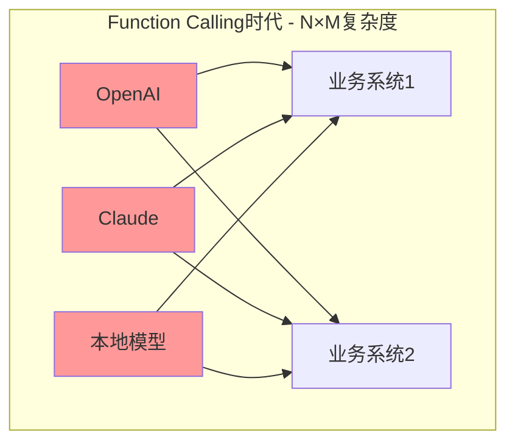
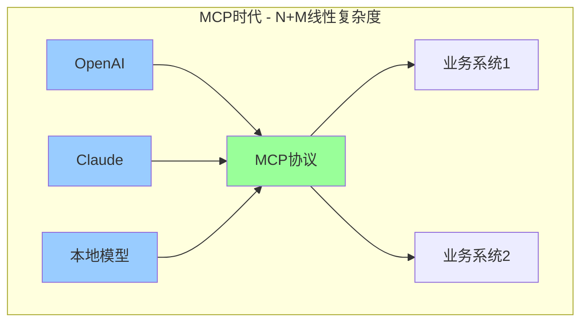
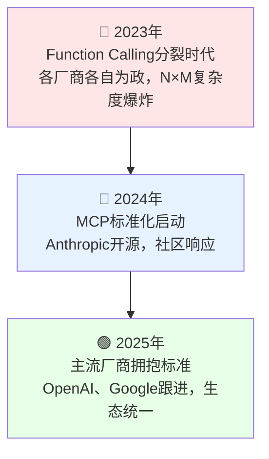

说实话，我自己做AI应用的时候最头疼的就是工具集成。在MCP出现前，我们主要依赖**Function Calling**机制——OpenAI在2023年推出的技术，虽然解决了AI调用工具的基本需求，但痛点也很明显。

你想让你的大模型应用访问你的数据库？得写一套专门的工具集成。想让大模型应用调用你的业务系统？又得写一套Function Calling实现。每个AI服务的集成方式都不一样，简直让人气到吐血。

直到我遇到了MCP（Model Context Protocol），这个痛点才彻底解决。今天我就来聊聊这个"AI工具集成的USB-C协议"是怎么拯救我们这些被Function Calling折磨得半死的开发者的。

## 现状有多痛：Function Calling时代的集成噩梦

你说用户能不急吗？在MCP出现前，我们主要用Function Calling来让AI调用外部工具。这个机制本身不错，但每个AI平台的实现都不一样：

**Function Calling的碎片化现状**：

- **OpenAI**：标准的functions参数，JSON schema格式
- **Qwen**：自定义的tool_use格式，参数结构不同  
- **ChatGLM**：各种自定义实现，兼容性一塌糊涂

我之前给一个公司做智能客服，让AI访问一些平台的接口。结果光是这一个功能，就要写三套Function Calling实现，虽然代码是一样的，但是要维护三个地方，每次数据结构一变，三个地方都要改。更要命的是，每个平台的错误处理、参数验证、返回格式都不一样。

### 真实痛点：本地模型的Function Calling适配噩梦

说个我自己的真实经历。我们智能客服系统主要使用**Qwen 2.5 72B模型**，通过vLLM进行推理，应用层用LangChain的OpenAI SDK调用。听起来很标准对吧？

但实际上，Qwen模型的工具调用格式和OpenAI的标准还是有不少差异：

**OpenAI标准格式**：
```json
{
  "tool_calls": [
    {
      "id": "call_abc123",
      "type": "function", 
      "function": {
        "name": "query_user",
        "arguments": "{\"user_id\": \"12345\"}"
      }
    }
  ]
}
```

**Qwen 2.5实际输出格式**：
```text
Action: query_user
Action Input: {"user_id": "12345"}
```

你看，Qwen用的是完全不同的文本格式，而不是JSON结构。更要命的是，Qwen还经常输出一些不规范的JSON：

```text
Action: search_database  
Action Input: {'query': '用户信息', 'limit': 10}  // 单引号！
```

```text
Action: call_api
Action Input: {"endpoint": "/users", "params": {"id": 123  // 缺少结束括号！
```

为了处理这些格式差异，我们不得不写大量适配代码：

```python
# Function Calling时代的痛苦适配
def qwen_adapter(text):
    # 正则提取Action和Input
    matches = re.findall(r"Action:\s*(.+)\nAction Input:\s*(.+)", text)
    # JSON格式修复：单引号转双引号、补全括号等
    # 键名适配：command -> query  
    # 错误兜底处理...
    return openai_format_result

# 每次调用都要过适配器
response = qwen_adapter(llm.invoke(messages))
```

你说气人不气人？这套适配逻辑包括：

- **正则表达式解析**：提取Action和Action Input
- **JSON格式修复**：处理单引号、缺失括号等不规范格式  
- **键名转换**：处理不一致的参数名称
- **错误兜底**：各种异常情况的降级处理

明明同样的业务功能，就因为格式不统一，要写100多行适配代码。更痛苦的是，模型版本更新时格式可能又变，适配代码又得重新调试。

我就是在这种痛苦中度过了好几个通宵，每次以为搞定了，结果生产环境又出现新的格式异常。

### vLLM + OpenAI SDK：看似标准实则坑多

我们选择这个技术栈本来是想要标准化：

**技术架构**：
- **推理层**：vLLM提供高性能推理服务
- **接口层**：兼容OpenAI API格式
- **应用层**：使用OpenAI SDK调用

理想很丰满，现实很骨感。实际遇到的坑：

**1. 工具调用格式差异**：
- Qwen模型训练时用的工具格式和OpenAI不完全一致
- vLLM虽然兼容OpenAI API，但不能完全统一模型输出格式
- 需要在应用层做二次适配

**2. 参数解析不稳定**：
- 有时返回JSON字符串，有时返回键值对
- 复杂参数结构经常被模型"创新"格式
- 错误处理机制各不相同

**3. 版本兼容性地雷**：
- vLLM版本更新可能改变API行为
- Qwen模型版本更新可能改变输出格式
- 适配代码要跟着两个组件的更新而调整

这就是Function Calling时代的真实写照：**看似标准，实则各家都有自己的"标准"**。

## MCP协议：统一AI数据访问的游戏规则




*图：架构革命对比 - MCP将指数级复杂度降为线性增长*

**MCP（Model Context Protocol）**是Anthropic开源的标准协议，彻底改变AI工具集成架构。你可以把它理解为"AI工具集成的USB标准"：

**一个协议，到处使用**：

- 写一次MCP服务器，所有支持MCP的AI都能用
- 标准化的工具、资源、提示词管理
- 安全的双向通信机制
- 简单的部署和维护

最关键的是，这个协议设计得相当优雅，核心就三个概念：

**核心三大概念，极简实现**：

```python
from fastmcp import FastMCP
mcp = FastMCP("企业工具集")

# Tools：让AI执行操作
@mcp.tool
def query_user(user_id: str) -> dict:
    """查询用户信息"""
    return {"name": "张三", "role": "管理员"}

# Resources：为AI提供上下文
@mcp.resource("config://database")  
def get_db_config() -> dict:
    """数据库配置"""
    return {"host": "localhost", "port": 5432}

# Prompts：预定义提示词模板
@mcp.prompt("customer_service")
def cs_prompt(issue_type: str) -> str:
    """客服提示词"""
    return f"专业处理{issue_type}问题：友好、准确、高效"

mcp.run()  # 启动服务，所有AI都能调用
```

## FastMCP：彻底告别模型适配噩梦

虽然MCP协议很强大，但是手撸协议实现太痛苦了。这时候FastMCP就出现了，它把MCP开发简化到了极致。

### 从100行适配代码到10行业务逻辑

还记得我刚才那100多行的Qwen适配代码吗？用FastMCP的话：

**Function Calling时代（需要适配）**：
```python
# 定义工具
def query_user_openai(user_id: str):
    # OpenAI格式的工具定义
    pass

def query_user_qwen(user_id: str):
    # Qwen格式的工具定义 + 适配逻辑
    pass

# 还要写100多行的适配器...
response = qwen_tool_call_adapter(client.chat.completions.create(...))
```

**MCP时代（零适配成本）**：
```python
from fastmcp import FastMCP

mcp = FastMCP("用户管理工具")

@mcp.tool
def query_user(user_id: str) -> dict:
    """查询用户信息 - 所有AI都能直接调用"""
    return database.get_user(user_id)

mcp.run()  # 一行启动，全AI兼容
```

就这几行代码，完整MCP服务器就跑起来了！不管Claude、GPT、Qwen 2.5还是任何支持MCP的AI，都能直接调用你的函数，**零适配成本**。

### MCP的本地模型兼容性优势

**彻底解决标准化问题**：
- AI模型只需要理解MCP协议，不需要关心具体的工具实现
- 工具开发者只需要实现业务逻辑，不需要关心AI模型差异  
- 中间的MCP协议层完全屏蔽了兼容性问题

**我们系统的改进效果**：
- **删除**：100多行Qwen适配代码全部删除
- **简化**：10行FastMCP代码替代所有适配逻辑
- **通用**：同时支持Claude、GPT、Qwen等所有MCP兼容的AI
- **稳定**：模型版本更新不再影响工具调用

## MCP vs Function Calling：架构级别的效率革命

Function Calling解决了AI调用工具的基本需求，但每个平台的实现方式都不一样，导致开发者需要重复造轮子。MCP通过统一标准彻底解决了这个问题。

### Function Calling时代的核心痛点

**碎片化现状**：
- 每个AI平台都有自己的Function Calling实现
- 同样的业务逻辑要为不同平台写多套代码
- 维护成本随着平台数量线性增长

**真实开发场景**：
就拿我们智能客服系统来说，为了让AI调用用户查询功能，需要写三套完全不同的实现：

- **OpenAI**：标准的functions参数和JSON schema
- **Claude**：tools数组格式，参数结构略有差异
- **本地模型**：比如Qwen 2.5，输出格式完全不同，还要写100多行适配代码处理格式解析

同样一个`query_user`功能，要维护三个地方。每次业务逻辑变更，三个地方都得改。

### MCP标准化的解决方案

**统一架构，一次开发全AI通用**：
```python
from fastmcp import FastMCP

mcp = FastMCP("企业数据中心")

@mcp.tool
def query_user(user_id: str) -> dict:
    """用户查询 - Claude/GPT/Qwen全兼容"""
    return database.get_user(user_id)

@mcp.tool  
def update_order(order_id: str, status: str) -> bool:
    """订单更新 - 无需任何适配代码"""
    return orders.update(order_id, status)

mcp.run()  # 启动后，所有MCP兼容的AI都能调用
```

**核心优势**：
- **写一次，到处用**：不管Claude、GPT还是本地模型，都能直接调用
- **零适配成本**：不需要任何格式转换和兼容性代码
- **统一维护**：业务逻辑变更只需要改一个地方

这不是渐进式改进，而是架构思维的根本转变——就像USB统一了设备接口，MCP统一了AI工具集成。

## 真实应用场景

MCP一次开发，全AI通用，适用于：

**企业集成**：CRM查询、ERP库存、内部知识库访问  
**API服务**：天气预报、支付接口、物流服务对接  
**数据操作**：用户查询、订单更新、报表生成  
**文件处理**：配置读取、文档处理、报告生成

每个场景在Function Calling时代都要重复开发适配。MCP彻底告别这种重复劳动。

## 安全性和学习成本

**安全保障**：MCP提供权限控制、数据加密、操作日志等完整安全机制，AI无法绕过协议直接访问系统。

**上手简单**：Python基础即可，学习路径清晰——第一天理解概念，一周处理企业场景。我们实习生都能快速掌握。

## 生态发展：从Function Calling到MCP的标准化进程


*图：AI工具集成的标准化历程 - 开放协议正在统一生态*

**生态现状**：MCP已获得主流厂商支持，包括Claude原生支持、OpenAI Agents SDK集成、Google跟进。这是AI工具集成的**USB标准化时刻**。

**部署简单**：
```bash
# 开发调试
fastmcp dev my_server.py

# 生产运行  
fastmcp run my_server.py --port 8000
```

## 技术选择建议

**Function Calling适用场景**：简单项目，1-2个AI平台，工具数量少于20个

**MCP成为必选**：企业级应用、多平台支持、长期维护需求、避免厂商绑定

这是AI集成领域的**标准化时刻**——从N×M复杂度到N+M线性架构的根本转变。

下一课我们会动手实战，用FastMCP搭建第一个MCP服务器。体验从Function Calling噩梦到MCP优雅的巨大差异！

你准备好拥抱这个AI工具集成的新时代了吗？

## 📚 完整代码和深入学习

想要动手实践？完整的代码实现和详细教程都在这里：

**🔗 完整代码仓库**: [mcp-quickstart-guide](https://github.com/wangyiyang/mcp-quickstart-guide) - 包含本文所有示例的完整实现

从Function Calling的适配噩梦到MCP的优雅统一，这不仅是技术的升级，更是开发思维的转变。下一课我们就来动手体验这个差异！
