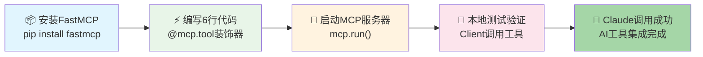
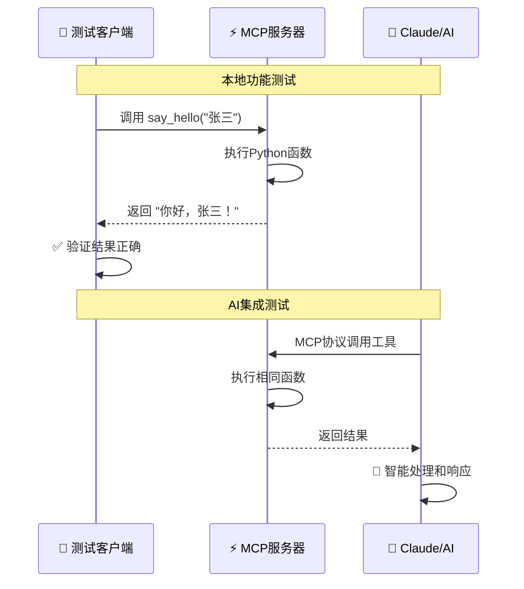
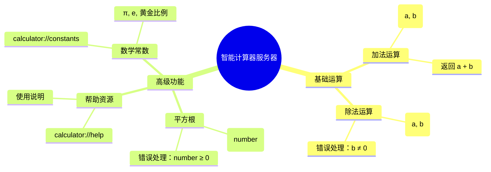
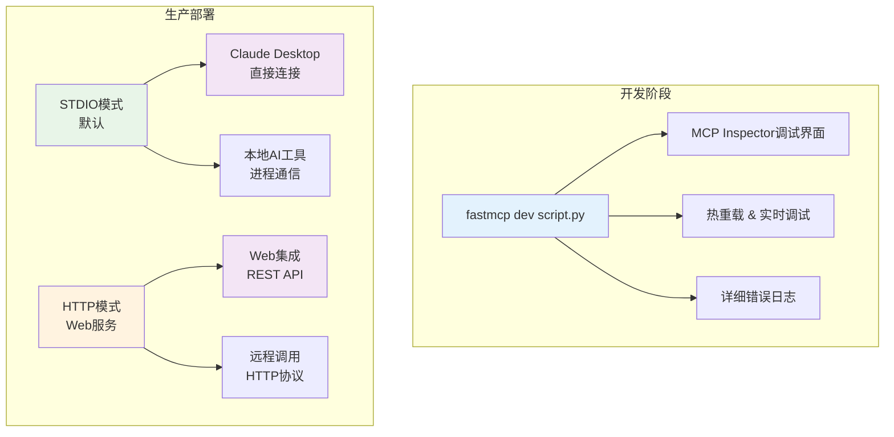
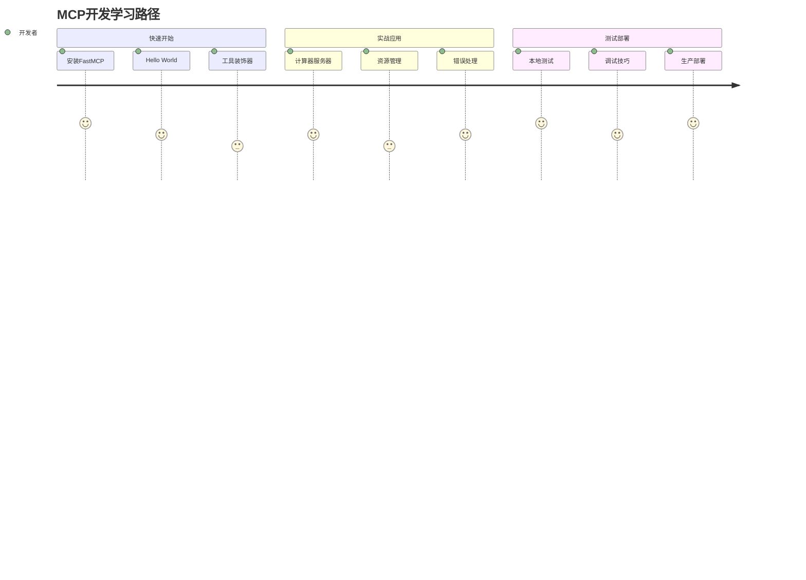

*图：MCP快速开发流程 - 从安装到AI调用的核心步骤*

上一篇我们聊了MCP如何彻底解决Function Calling的适配噩梦，从N×M复杂度降到N+M线性架构。理论听起来不错，但你可能会想："这东西到底好不好用？真能像说的那么简单吗？"

今天就来动手实战，搭建你的第一个MCP服务器，亲自体验这个巨大差异。

## 安装FastMCP：一行命令开始

```bash
pip install fastmcp
```

如果网络慢，可以用国内源：

```bash
pip install fastmcp -i https://pypi.tuna.tsinghua.edu.cn/simple/
```

## 第一个服务器：Hello World开始

废话不多说，直接上代码。创建`hello_server.py`：

```python
from fastmcp import FastMCP

# 创建MCP服务器
mcp = FastMCP("我的第一个AI助手")

@mcp.tool
def say_hello(name: str) -> str:
    """向用户问好"""
    return f"你好，{name}！欢迎来到MCP的世界！"

if __name__ == "__main__":
    mcp.run()
```

就这6行代码，一个完整的MCP服务器就搞定了！

**代码解释**：

- `FastMCP("我的第一个AI助手")`：创建服务器实例，给它起个名字
- `@mcp.tool`：把Python函数变成AI工具
- `name: str -> str`：类型提示很重要，MCP需要知道参数和返回值类型  
- `docstring`：工具描述，AI会根据这个决定何时调用
- `mcp.run()`：启动服务器

### 启动测试

在命令行运行：

```bash
python hello_server.py
```

出现这样的输出，服务器就跑起来了：

```bash
Server is running...
Listening for MCP connections...
```

恭喜！你的第一个MCP服务器已经在运行了。

## 本地测试：确保功能正常


*图：MCP测试工作流程 - 从本地测试到AI集成的完整验证链路*

光启动还不够，我们得测试一下功能。创建`test_client.py`：

```python
import asyncio
from fastmcp import Client
from hello_server import mcp

async def test_hello():
    async with Client(mcp) as client:
        result = await client.call_tool("say_hello", {"name": "张三"})
        print(f"测试结果: {result.data}")

if __name__ == "__main__":
    asyncio.run(test_hello())
```

运行测试：

```bash
python test_client.py
```

如果看到`测试结果: 你好，张三！欢迎来到MCP的世界！`，说明一切正常！

## 实战案例：智能计算器服务器


*图：智能计算器功能架构 - MCP服务器的工具和资源组织*

Hello World太简单了，我们来搞个实用的：计算器服务器。创建`calculator_server.py`：

```python
from fastmcp import FastMCP
import math

mcp = FastMCP("智能计算器")

@mcp.tool
def add(a: float, b: float) -> float:
    """计算两个数的和"""
    return a + b

@mcp.tool
def divide(a: float, b: float) -> float:
    """计算两个数的商（a除以b）"""
    if b == 0:
        raise ValueError("除数不能为零")
    return a / b

@mcp.tool
def sqrt(number: float) -> float:
    """计算平方根"""
    if number < 0:
        raise ValueError("负数没有实数平方根")
    return math.sqrt(number)

if __name__ == "__main__":
    mcp.run()
```

这里展示了三个核心功能：基础运算（加法）、错误处理（除法）、数学函数（平方根）。其他运算（减法、乘法、幂运算）都是类似的实现模式。

## 添加资源：提供上下文信息

除了工具，我们还可以添加资源。修改计算器服务器：

```python
@mcp.resource("calculator://help")
def get_help() -> str:
    """获取计算器使用帮助"""
    return """
    智能计算器使用说明：
    - add(a, b): 加法运算
    - divide(a, b): 除法运算（分母不能为零）
    - sqrt(number): 平方根运算（被开方数不能为负数）
    """

@mcp.resource("calculator://constants")  
def get_constants() -> dict:
    """获取数学常数"""
    return {
        "pi": math.pi,
        "e": math.e,
        "golden_ratio": (1 + math.sqrt(5)) / 2
    }
```

这样AI就能获取计算器的帮助信息和常用数学常数了。

## 常见错误：我掉过的几个大坑

刚开始用MCP时，我在这几个地方连续踩坑。分享出来，希望你们能少走弯路：

### 错误1：忘记类型提示

```python
# 错误写法
@mcp.tool
def bad_add(a, b):  # 没有类型提示
    return a + b

# 正确写法  
@mcp.tool
def good_add(a: float, b: float) -> float:  # 完整类型提示
    return a + b
```

**为什么？** MCP协议需要知道参数类型来正确解析数据。

### 错误2：描述不清楚

```python
# 不好的描述
@mcp.tool
def calc(x: int, y: int) -> int:
    """计算"""  # 太模糊
    return x + y

# 好的描述
@mcp.tool  
def add_integers(x: int, y: int) -> int:
    """计算两个整数的和"""  # 清楚明了
    return x + y
```

AI要根据描述决定何时调用工具，描述越准确越好。

### 错误3：端口冲突

如果运行多个服务器，可能端口冲突：

```python
# 指定不同端口
if __name__ == "__main__":
    mcp.run(transport="http", port=8001)
```

### 错误4：忘记错误处理

```python
@mcp.tool
def safe_divide(a: float, b: float) -> float:
    """安全除法运算"""
    if b == 0:
        raise ValueError("除数不能为零")  # 抛出有意义的错误
    return a / b
```

良好的错误处理让AI知道哪里出了问题。

## 调试技巧：我踩过的坑和解决方法

服务器不工作时，这几个方法基本能解决80%的问题。我之前遇到最多的就是端口被占用和类型提示缺失：

1. **检查日志**：FastMCP的错误信息还算详细，仔细看能找到问题
2. **简化测试**：先测试最简单的hello_world，确保基础功能正常 
3. **类型检查**：用mypy检查一下，类型提示错误是新手最常犯的
4. **端口检查**：lsof -i :8000 看看端口是否被占用

调试时可以加上详细日志：

```python
import logging
logging.basicConfig(level=logging.DEBUG)

mcp = FastMCP("调试服务器")
# ... 其他代码
```

## 运行模式：开发vs生产


*图：MCP运行模式对比 - 开发调试vs生产部署的不同选择*

FastMCP支持多种运行模式：

**开发模式**（推荐用于学习）：

```bash
fastmcp dev calculator_server.py
```

这会启动MCP Inspector，提供可视化调试界面。

**生产模式**：

```bash
fastmcp run calculator_server.py --transport http --port 8000
```

**STDIO模式**（默认）：

```python
mcp.run()  # 适合与Claude Desktop直接连接
```

**HTTP模式**：

```python
mcp.run(transport="http", port=8000)  # 适合Web集成
```

## 测试完整功能

创建一个完整的测试脚本：

```python
import asyncio
from fastmcp import Client
from calculator_server import mcp

async def test_calculator():
    async with Client(mcp) as client:
        # 测试基础运算
        result = await client.call_tool("add", {"a": 10, "b": 5})
        print(f"10 + 5 = {result.data}")
        
        # 测试错误处理
        result = await client.call_tool("sqrt", {"number": 16})
        print(f"√16 = {result.data}")
        
        # 测试资源
        help_resource = await client.read_resource("calculator://help")
        print("帮助信息已加载")

if __name__ == "__main__":
    asyncio.run(test_calculator())
```

这个测试涵盖了工具调用和资源读取的核心功能。完整的测试用例在配套代码中。

## 小结：你已经掌握MCP核心



*图：MCP学习路径 - 从快速开始到生产部署的完整掌握*

恭喜！到这里你已经掌握了MCP开发的核心技能：

**学会了什么**：

1. **快速开始**：FastMCP安装和Hello World实现
2. **基础语法**：@mcp.tool和@mcp.resource装饰器
3. **服务器启动**：不同的运行模式
4. **本地测试**：用Client测试功能
5. **实战开发**：智能计算器服务器
6. **错误处理**：常见问题和解决方案

**关键收获**：

- MCP开发真的很简单，主要就是用装饰器包装Python函数
- 类型提示和清楚的描述很重要
- 测试驱动开发能帮你快速发现问题
- FastMCP让复杂的协议变得易用

当你看到AI能够调用你写的代码，那种成就感确实挺爽的。我第一次看到Claude调用我的计算器工具时，那感觉就像看到自己的作品活过来了一样——这就是MCP带来的革命性体验。

下一课我们会学习如何构建更实用的工具，包括数据库访问、API调用和文件操作。从简单的Hello World到真正的企业级应用，继续深入MCP的强大能力。

接下来，就是让你的AI调用真正有价值的业务逻辑了。

**完整的代码实现已上传至GitHub，[mcp-quickstart-guide](https://github.com/wangyiyang/mcp-quickstart-guide)包含详细的使用示例、测试用例和性能基准测试。**
