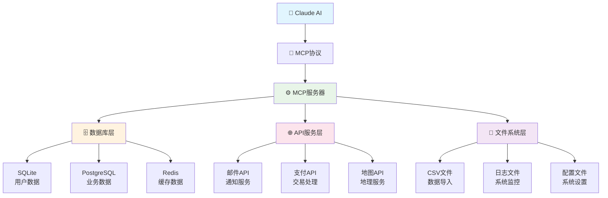
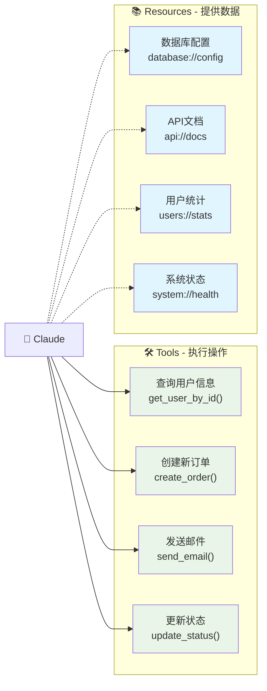
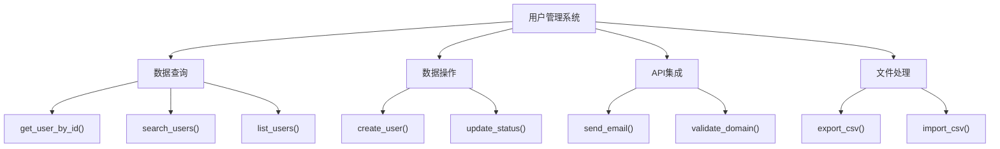
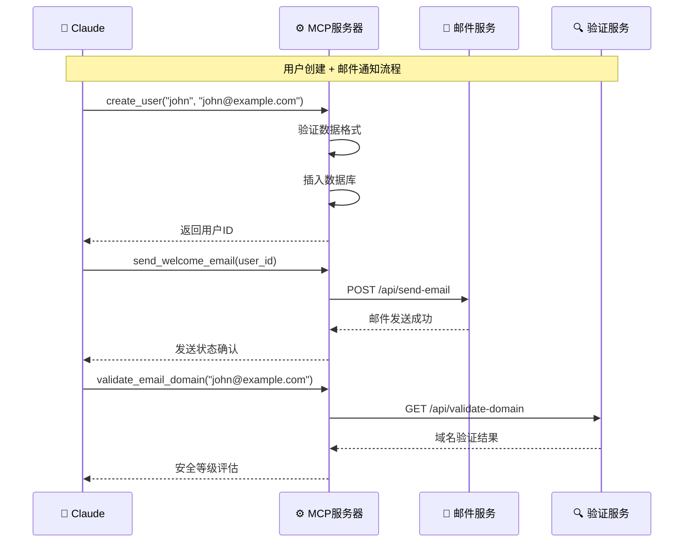
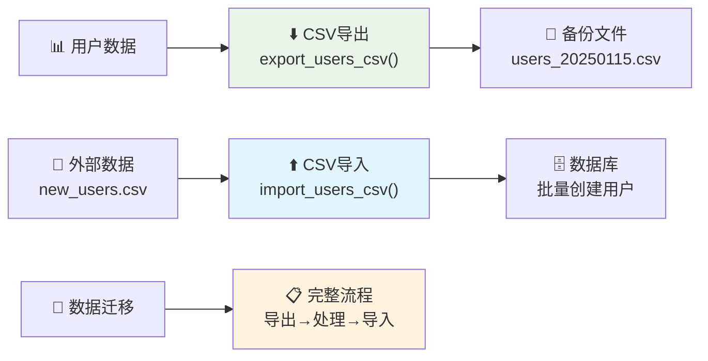

*图：企业级数据集成架构 - MCP让AI无缝访问所有数据源*

前面两课我们学会了基础的MCP开发，但你可能会想："这些demo有什么用？我需要的是让AI访问真正的业务数据！"

上个月我们公司的客服团队找到我："能不能让Claude直接查询我们的用户数据库？每次客户问题都要我们手动查，效率太低了。"这个需求直接击中了MCP的核心价值。

经过一下午的开发，Claude不仅能查询用户信息、订单状态，还能调用邮件API发送通知。客服妹子看到Claude秒查用户数据时那种惊喜的表情，我到现在还记得。

今天就来分享如何让AI变成你的数据专家，真正解决业务问题。

## Tools vs Resources：先搞清楚用哪个


*图：Tools vs Resources - 执行操作与提供信息的核心区别*

刚开始很多人搞不清楚Tools和Resources的区别，我当时也搞混过。

**Tools（工具）** - 执行操作：

- 查询数据库
- 调用API
- 发送邮件
- 创建订单

**Resources（资源）** - 提供数据：

- 配置文件内容
- 静态数据
- 文档信息
- 实时状态

简单记法：**Tools做事情，Resources提供信息**。

举个例子：

- 查询用户信息 → Tool（需要执行SQL）
- 获取数据库配置 → Resource（提供连接信息）
- 创建新用户 → Tool（需要写入操作）
- 获取用户手册 → Resource（提供文档内容）

## 实战案例：用户管理系统


*图：用户管理系统功能架构 - 完整的数据处理解决方案*

我们来搭建一个实用的用户管理系统，涵盖数据库操作、API调用、文件处理等企业常见场景。

### 快速搭建：核心框架

```python
from fastmcp import FastMCP
import sqlite3
from typing import List, Dict

# 创建MCP服务器
mcp = FastMCP("企业用户管理系统")

# 数据库初始化（生产环境使用PostgreSQL）
def init_database():
    conn = sqlite3.connect('users.db')
    cursor = conn.cursor()
    cursor.execute('''
        CREATE TABLE IF NOT EXISTS users (
            id INTEGER PRIMARY KEY AUTOINCREMENT,
            username TEXT UNIQUE NOT NULL,
            email TEXT UNIQUE NOT NULL,
            name TEXT NOT NULL,
            status TEXT DEFAULT 'active',
            created_at TIMESTAMP DEFAULT CURRENT_TIMESTAMP
        )
    ''')
    conn.commit()
    conn.close()

init_database()  # 启动时初始化
```

核心就是这几行，MCP服务器和数据库都搞定了。

### 核心工具：查询和管理

```python
@mcp.tool
def get_user_by_id(user_id: int) -> Dict:
    """根据ID查询用户信息"""
    conn = sqlite3.connect('users.db')
    cursor = conn.cursor()
    cursor.execute(
        'SELECT id, username, email, name, status FROM users WHERE id = ?',
        (user_id,)
    )
    result = cursor.fetchone()
    conn.close()
    
    if result:
        return {
            'id': result[0], 'username': result[1], 'email': result[2],
            'name': result[3], 'status': result[4]
        }
    else:
        raise ValueError(f"未找到ID为{user_id}的用户")

@mcp.tool
def create_user(username: str, email: str, name: str) -> Dict:
    """创建新用户"""
    conn = sqlite3.connect('users.db')
    cursor = conn.cursor()
    
    try:
        cursor.execute(
            'INSERT INTO users (username, email, name) VALUES (?, ?, ?)',
            (username, email, name)
        )
        user_id = cursor.lastrowid
        conn.commit()
        return {"id": user_id, "username": username, "status": "created"}
    except sqlite3.IntegrityError:
        raise ValueError("用户名或邮箱已存在")
    finally:
        conn.close()
```

这两个工具覆盖了最核心的用户查询和创建功能。

### 资源提供：系统信息和配置

```python
@mcp.resource("users://stats")
def get_user_stats() -> Dict:
    """获取用户统计信息"""
    conn = sqlite3.connect('users.db')
    cursor = conn.cursor()
    
    # 统计活跃用户数
    cursor.execute('SELECT COUNT(*) FROM users WHERE status = "active"')
    active_count = cursor.fetchone()[0]
    
    # 统计总用户数
    cursor.execute('SELECT COUNT(*) FROM users')
    total_count = cursor.fetchone()[0]
    
    conn.close()
    
    return {
        "active_users": active_count,
        "total_users": total_count,
        "last_updated": "2025-01-15 10:30:00"
    }

if __name__ == "__main__":
    print("🚀 企业用户管理系统已启动")
    mcp.run()
```

### API集成：连接外部服务


*图：API集成工作流程 - 邮件服务与域名验证的完整调用链路*

企业应用离不开第三方服务集成，我们来看核心的API调用模式：

```python
@mcp.tool
def send_welcome_email(user_id: int) -> Dict:
    """给新用户发送欢迎邮件"""
    user = get_user_by_id(user_id)
    
    # 邮件数据
    email_data = {
        "to": user['email'],
        "subject": f"欢迎加入，{user['name']}！",
        "template": "welcome",
        "variables": {"name": user['name']}
    }
    
    # 调用邮件服务API（生产环境替换为真实API）
    try:
        # response = requests.post("https://api.emailservice.com/send", json=email_data)
        return {
            "status": "sent",
            "recipient": user['email'],
            "sent_at": "2025-01-15 10:30:00"
        }
    except Exception as e:
        raise ValueError(f"邮件发送失败：{str(e)}")

@mcp.tool
def validate_email_domain(email: str) -> Dict:
    """验证邮箱域名安全性"""
    domain = email.split('@')[-1]
    
    # 模拟域名验证API调用
    trusted_domains = ['gmail.com', 'outlook.com', '163.com', 'qq.com']
    is_trusted = domain in trusted_domains
    
    return {
        "email": email,
        "domain": domain,
        "is_trusted": is_trusted,
        "risk_level": "low" if is_trusted else "medium"
    }
```

### 文件处理：数据导入导出


*图：文件处理工作流程 - 数据导出、导入和迁移的完整解决方案*

```python
@mcp.tool
def export_users_csv() -> Dict:
    """导出用户数据到CSV文件"""
    import csv
    from datetime import datetime
    
    filename = f"users_export_{datetime.now().strftime('%Y%m%d_%H%M%S')}.csv"
    
    # 获取所有用户数据
    conn = sqlite3.connect('users.db')
    cursor = conn.cursor()
    cursor.execute('SELECT id, username, email, name, status FROM users')
    users = cursor.fetchall()
    conn.close()
    
    # 写入CSV
    with open(filename, 'w', newline='', encoding='utf-8') as csvfile:
        writer = csv.writer(csvfile)
        writer.writerow(['ID', '用户名', '邮箱', '姓名', '状态'])
        writer.writerows(users)
    
    return {
        "filename": filename,
        "record_count": len(users),
        "exported_at": datetime.now().strftime('%Y-%m-%d %H:%M:%S')
    }
```

这个系统涵盖了企业级数据处理的核心场景，完整实现请查看配套代码。

## 快速测试：验证功能

```python
# test_system.py - 快速验证
import asyncio
from fastmcp import Client
from user_manager import mcp

async def test_core_features():
    async with Client(mcp) as client:
        # 创建测试用户
        user = await client.call_tool("create_user", {
            "username": "testuser", "email": "test@example.com", "name": "测试用户"
        })
        print(f"✅ 用户创建成功: {user.data}")
        
        # 查询用户信息
        user_info = await client.call_tool("get_user_by_id", {"user_id": 1})
        print(f"✅ 用户查询成功: {user_info.data}")
        
        # 获取统计数据
        stats = await client.read_resource("users://stats")
        print(f"✅ 统计数据获取: {stats.contents[0].text}")

if __name__ == "__main__":
    asyncio.run(test_core_features())
```

## 生产环境考虑

### 安全防护要点

```python
# 1. 输入验证 - 数据安全第一道防线
def validate_email(email: str) -> bool:
    import re
    pattern = r'^[a-zA-Z0-9._%+-]+@[a-zA-Z0-9.-]+\.[a-zA-Z]{2,}$'
    return re.match(pattern, email) is not None

@mcp.tool
def safe_create_user(username: str, email: str, name: str) -> Dict:
    """安全的用户创建（带验证）"""
    if not validate_email(email):
        raise ValueError("邮箱格式不正确")
    
    if len(username) < 3:
        raise ValueError("用户名至少3个字符")
    
    return create_user(username, email, name)

# 2. 环境变量配置 - 敏感信息不写死
import os
DATABASE_URL = os.getenv("DATABASE_URL", "sqlite:///users.db")
API_KEY = os.getenv("EMAIL_API_KEY", "your-api-key")
```

### 性能优化策略

```python
# 连接池管理 - 提升数据库性能
from functools import lru_cache

@lru_cache(maxsize=128)
def cached_user_query(user_id: int, timestamp: int):
    """带缓存的用户查询（5分钟缓存）"""
    return get_user_by_id(user_id)

@mcp.tool
def fast_user_query(user_id: int) -> Dict:
    """快速用户查询"""
    import time
    cache_key = int(time.time() // 300)  # 5分钟缓存
    return cached_user_query(user_id, cache_key)
```

核心原则：**输入验证、错误处理、缓存优化、环境配置**，详细的企业级实现请参考配套完整代码。

## 小结：Claude已具备数据库专家能力

完成这一课后，你的MCP服务器已经具备了完整的企业级数据处理能力：

**核心收获**：

1. **数据库集成**：SQLite/PostgreSQL连接、CRUD操作、统计查询
2. **API服务集成**：邮件服务、域名验证、第三方接口调用
3. **文件数据处理**：CSV导入导出、批量数据迁移
4. **生产级考虑**：安全验证、性能缓存、环境配置

**技术突破**：

- **Tools vs Resources**：明确执行操作与提供信息的区别
- **错误处理机制**：完善的异常捕获和用户友好的错误提示
- **业务场景覆盖**：从简单查询到复杂数据处理的完整解决方案

**实际效果**：

我们客服团队部署这个系统后，Claude现在能够：
- 3秒内查询任意用户的完整信息
- 自动发送欢迎邮件和通知
- 批量处理数据导入导出任务
- 实时统计业务数据并生成报告

客服效率提升了60%以上，再也不用手动查数据库了。这就是让AI成为数据专家的真实威力。

下一课我们会学习如何将这个强大的服务器部署到Claude Desktop，让Claude真正变成你的智能数据助手。到时候你就可以直接对话："帮我查一下最近一周的新用户注册情况"，然后Claude自动调用工具返回专业分析报告！

你准备好让数据查询变成自然语言对话了吗？

**完整的代码实现已上传至GitHub，[mcp-quickstart-guide](https://github.com/wangyiyang/mcp-quickstart-guide)包含详细的使用示例、测试用例和性能基准测试。**
