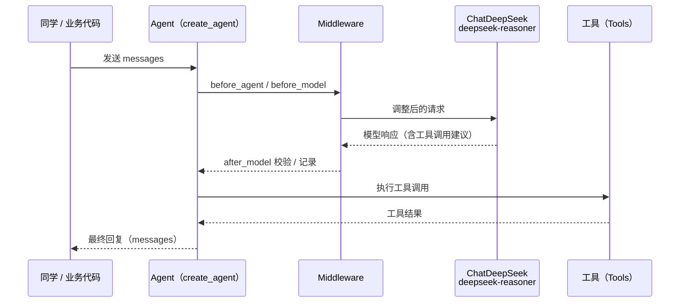

阅读量：待发布 更新于：2025-XX-XX

## 一、为什么要关心 LangChain 1.x？

如果你已经看过本系列前几篇，或者在用 LangChain 写 RAG / Agent 应用，多半遇到过这些问题：

- 包越来越大、依赖越来越多，一不小心就“全都装上了”
- 官方 API 变动频繁，早期 Demo 跑着跑着就开始报警
- Python / JS 心智不统一，Agent 写法有好几套，选哪套都不太放心

LangChain 1.x 的官方定位是：

> 为构建 Agent 提供“专注、生产级”的基础设施。

相比 0.1.x、0.0.x 的“什么都往里塞”，1.x 做了三个收口：

1. 核心 Agent 抽象收敛到 `create_agent` + middleware
2. 不同厂商的模型输出收敛到标准内容块 `content_blocks`
3. 命名空间瘦身：`langchain` 保留核心积木，历史功能挪到 `langchain-classic`

这篇文章不打算翻译 Release Notes，而是站在“工程实践 + 迁移”的视角，回答三个问题：

- 1.x 具体改了什么，和你的日常开发有什么关系？
- 老项目（比如你在用的 0.1.5）该怎么迁到 1.x？
- 之后学习 / 使用 LangChain 时，路径应该怎么调整？

---

## 二、三大核心变化：create_agent / content_blocks / 命名空间瘦身

### 2.1 create_agent：Agent 构建方式的“收口”

在 1.x 之前，写 Agent 大致有三类方式：

- 自己用 Chain + 循环拼一个“工具调用 + 反思”的 loop
- 使用 LangChain 内部的各种 Agent 类（各种 ReAct、Plan&Execute 等）
- 用 LangGraph 的 `langgraph.prebuilt.create_react_agent`

结果是：心智模型不统一，生态也不好维护。

1.x 做了一件很重要的事：把“官方推荐写法”收敛到一个入口：

```python
from langchain.agents import create_agent
from langchain.tools import tool
from langchain_deepseek import ChatDeepSeek

llm = ChatDeepSeek(
    model="deepseek-reasoner",
    api_key="sk-your-api-key",  # 替换为你的 DeepSeek 密钥
)

@tool
def search_product(product_name: str) -> str:
    """搜索某个商品的销量信息"""
    # 这里可以接真实搜索 / 数据查询逻辑
    return f"找到 {product_name} 的销量数据：......"

agent = create_agent(
    model=llm,
    tools=[search_product],
    system_prompt="你是一名电商数据分析助手，回答要简洁、结构化。",
)

result = agent.invoke({
    "messages": [
        {"role": "user", "content": "帮我分析一下 iPhone 15 最近三个月的销量趋势。"}
    ]
})

print(result["messages"][-1]["content"])
```

几个关键信号：

- 官方明确说：`create_agent` 是 1.x 中构建 Agent 的标准方式
- 之前的 `langgraph.prebuilt.create_react_agent` 被视为“旧推荐”，现在主力放回 LangChain
- Agent 的输入输出统一变成一个包含 `messages` 的“对话上下文”字典，便于和 LangGraph、LangSmith 对接

对你来说，更重要的是心智模型的改变：

> “写 Agent” = “选模型 + 挂工具 + 定 system prompt + 配 middleware”

而不是以前那种“挑一个 Agent 类 + 拼一堆 callback”。

### 2.2 Middleware：把“控制逻辑”和“业务逻辑”拆开

现实中的 Agent 应用，很难只靠一条 prompt + 一个模型搞定，往往需要：

- 对敏感信息做脱敏（电话、邮箱、身份证号等）
- 对长对话做中途总结，避免上下文爆炸
- 在执行关键操作前，让人类“点一下确认”（human-in-the-loop）
- 对模型输出做额外的校验和过滤

之前这些逻辑要么散落在业务代码里，要么靠各种 callback/hook 拼出来，维护成本非常高。

1.x 引入了一个正式的一等抽象：`AgentMiddleware`，并且在 `create_agent` 里直接支持：

```python
from langchain.agents import create_agent
from langchain.agents.middleware import (
    PIIMiddleware,
    SummarizationMiddleware,
    HumanInTheLoopMiddleware,
)
from langchain_deepseek import ChatDeepSeek

chat_model = ChatDeepSeek(
    model="deepseek-reasoner",
    api_key="sk-your-api-key",  # 替换为你的 DeepSeek 密钥
)

agent = create_agent(
    model=chat_model,
    tools=[...],
    middleware=[
        # 对邮件内容做脱敏
        PIIMiddleware("email", strategy="redact", apply_to_input=True),
        # 对电话做更严格的拦截
        PIIMiddleware(
            "phone_number",
            detector=(
                r"(?:\\+?\\d{1,3}[\\s.-]?)?"
                r"(?:\\(?\\d{2,4}\\)?[\\s.-]?)?"
                r"\\d{3,4}[\\s.-]?\\d{4}"
            ),
            strategy="block",
        ),
        # 会话过长时自动总结
        SummarizationMiddleware(
            model=chat_model,
            trigger=("tokens", 4000),
            keep=("messages", 20),
        ),
        # 在调用某些工具时人工审批
        HumanInTheLoopMiddleware(
            interrupt_on={
                "send_email": {
                    "allowed_decisions": ["approve", "edit", "reject"],
                }
            }
        ),
    ],
    )
```

用一张图总结一下 `create_agent + Middleware + DeepSeek + Tools` 的整体调用流程：



更底层一点，`AgentMiddleware` 支持多个 hook：

- `before_agent`：Agent 整体运行前（加载记忆、校验输入）
- `before_model` / `after_model`：每次 LLM 调用前后（改 prompt、过滤输出）
- `wrap_model_call`：包裹 LLM 调用（统一打日志、做超时控制）
- `wrap_tool_call`：包裹工具调用（限流、降级、本地缓存）
- `after_agent`：Agent 整体结束后（写入日志、存结果等）

这对工程实践的意义是：

> 业务逻辑只关心“要做什么”，控制逻辑统一搬到 middleware 里做“插件化”治理。

你可以把日志、脱敏、人类确认等横切关注点，用少量 middleware 在多个 Agent 之间复用，而不是每个项目复制粘贴一遍。

### 2.3 Standard Content Blocks：统一多家模型厂商的输出结构

现在的大模型越来越“花”，尤其像 DeepSeek、Anthropic 等：

- 有显式的“思维块”（推理过程）
- 有多模态输出（文本 + 图片 / 音频）
- 有工具调用和中间状态

问题是：**不同厂商的返回结构各不相同**，导致：

- 你要写大量 provider-specific 解析逻辑
- 想做“跨模型行为对比”、“对话审计”非常痛苦

为了解决这个问题，1.x 引入了“标准内容块”的概念：

- 消息对象新增了 `content_blocks` 属性
- 会把不同 provider 的原始输出，懒加载解析成统一的块结构

示例（基于官方文档的 Python 思路）：

```python
from langchain.chat_models import init_chat_model

model = init_chat_model("deepseek-reasoner", model_provider="deepseek")

response = model.invoke("解释一下 LangChain 1.0 的核心变化")

for block in response.content_blocks:
    if block["type"] == "reasoning":
        print("【模型推理过程】")
        print(block.get("reasoning"))
    elif block["type"] == "text":
        print("【最终回答】")
        print(block.get("text"))
```

更进一步，如果你希望这些标准内容块直接写进 `content`，方便外部系统使用，可以：

- 设置环境变量：`LC_OUTPUT_VERSION=v1`
- 或在模型初始化时传入 `output_version="v1"`

结合 DeepSeek 场景，一个合理的工程实践是：

- 提示模型：把“思维过程”和“最终 JSON”分块输出
- 用 `content_blocks` 精确地拿到 JSON 块，而不是在混杂的自然语言里用正则硬抠

这比你在第 06 篇中那种“从 `response.content` 里硬搜 ```json``` 代码块，再 `eval`”要安全、可维护得多。

### 2.4 命名空间与包拆分：langchain vs langchain-classic

1.x 在包结构上做了一次“减肥”，主要是两层含义：

1. `langchain` 命名空间只保留“核心积木”
   - 例如：`langchain.agents`（`create_agent`）、`langchain.messages`、`langchain.tools`、`langchain.chat_models.init_chat_model` 等
   - 这些都是构建 Agent 的基础设施

2. 历史上大量的 Chain、工具和各种 Utility 迁到 `langchain-classic`
   - 例如：`LLMChain`、`ConversationChain`、一些老的 Retriever、Index 组件等

安装上推荐两种方式（考虑到本仓库的规范，同时给出 uv 和 pip 两套）：

```bash
# 使用 uv 管理依赖
uv add langchain langchain-deepseek

# 等价的 pip 命令
pip install -U langchain langchain-deepseek
```

如果你要继续使用旧的 Chain / Retriever：

```bash
uv add langchain-classic
# 或
pip install -U langchain-classic
```

然后在代码里显式区分：

```python
# 新世界：核心 Agent 能力
from langchain.agents import create_agent

# 旧世界：经典链式调用
from langchain_classic.chains import LLMChain
```

从“工程可维护性”的角度看，更推荐的做法是：

- 新项目一律使用 `langchain` 提供的 v1 抽象（`create_agent` / `init_chat_model` / Runnable 等）
- 老项目把对 `langchain-classic` 的依赖收敛在少数模块内，逐步替换，而不是继续往 classic 上堆新逻辑

对于手上已经有大量 0.x 代码的同学，可以把 `langchain-classic` 理解为一个“过渡桥梁”而不是新起点。例如：

```python
from langchain_classic.chains import LLMChain
from langchain_deepseek import ChatDeepSeek

llm = ChatDeepSeek(model="deepseek-reasoner", api_key="sk-your-api-key")

chain = LLMChain(
    llm=llm,
    prompt=...,  # 旧项目中的 PromptTemplate 基本不用改
)
```

这类写法的建议用法是：

- 线上旧项目：先通过 `langchain-classic` 把现有链路稳定跑起来；
- 新功能 / 新模块：优先用 `create_agent`、Middleware 等 v1 心智重写，逐步淘汰 classic 依赖。

### 2.5 LangChain v1 与 LangGraph v1：一高一低两层心智模型

官方的定位可以概括成一句话：

- LangChain v1：偏“业务研发友好”，提供 Agent 和标准接口
- LangGraph v1：偏“基础设施友好”，提供有状态、可持久化的执行图

在 1.x 之后，两者的关系更紧密：

- LangChain 的 `create_agent` 本身就跑在 LangGraph 上
- 如果你只需要“一个能用的 Agent”，用 LangChain 就够了
- 如果你追求：
  - 长期运行的 Agent（小时级甚至天级任务）
  - 强一致的“暂停 / 恢复 / 回滚”
  - 多 Agent 协作 + 人类在回路可视化调度
  那么就该下沉到 LangGraph 的“图 + 状态”心智模型

本篇先聚焦在 LangChain 1.x 上，后面有机会再专门写一篇 LangGraph v1 的实战。

---

## 三、以第 06 篇 Demo 为例：从 0.1.5 迁到 1.x

为了让迁移更“有血有肉”，我们选用第 06 篇《DeepSeek R1 × LangChain：智能数据分析全流程实践》里的核心逻辑来做例子。

### 3.1 旧版实现回顾：langchain==0.1.5 写法

在第 06 篇中，我们使用了：

```bash
pip install langchain-openai==0.0.5 langchain==0.1.5 pandas matplotlib python-dotenv
```

核心调用逻辑类似这样（节选）：

```python
from langchain_openai import ChatOpenAI
from langchain_core.messages import HumanMessage, SystemMessage
import json
import re

llm = ChatOpenAI(
    api_key="sk-your-api-key",
    base_url="https://api.deepseek.com",
    model="deepseek-reasoner",
    temperature=0.2,
)

def analyze_data(data_sample):
    messages = [
        SystemMessage(content="你是一个严谨的数据分析专家，擅长统计计算和数据可视化"),
        HumanMessage(content=ANALYSIS_TEMPLATE.format(data=data_sample)),
    ]

    response = llm.invoke(messages)

    try:
        json_match = re.search(r"```(?:json)?\\s*(.*?)```", response.content, re.DOTALL)
        if json_match:
            content = json_match.group(1).strip()
        else:
            content = response.content

        return json.loads(content)
    except json.JSONDecodeError:
        try:
            # 仅用于教学目的的 eval
            return eval(content)
        except Exception:
            print("响应解析失败，请检查prompt")
            return None
```

这里有几个典型特点：

- 直接依赖 `ChatOpenAI`，通过 `base_url` 兼容 DeepSeek API
- 模型返回类型里主要使用 `response.content` 这个字段
- 为了“兜底解析”，在 JSON 失败后退回 `eval`，有明显安全隐患

下一步我们看一下，迁移到 1.x 之后，这些地方分别怎么改。

### 3.2 迁移步骤 1：升级依赖与模型初始化

首先建议升级依赖（以 DeepSeek 为例，这里推荐使用官方集成包 `langchain-deepseek`）：

```bash
# 使用 uv
uv add langchain langchain-deepseek

# 或使用 pip
pip install -U langchain langchain-deepseek
```

然后在代码里，显式指定 `output_version="v1"`，为标准内容块铺路：

```python
from typing import Optional, Dict, Any

from langchain_deepseek import ChatDeepSeek
from langchain_core.messages import HumanMessage, SystemMessage
import json
import re

llm = ChatDeepSeek(
    model="deepseek-reasoner",
    api_key="sk-your-api-key",        # 替换为你的 DeepSeek API 密钥
    # 如需自定义 Endpoint，可通过 api_base 参数指定，例如 OpenRouter 等
    temperature=0.2,
    # LangChain v1 推荐：显式控制输出版本
    output_version="v1",
)

def analyze_data(data_sample: str) -> Optional[Dict[str, Any]]:
    """使用 DeepSeek + LangChain v1 执行数据分析"""

    messages = [
        SystemMessage(content="你是一个严谨的数据分析专家，擅长统计计算和数据可视化"),
        HumanMessage(content=ANALYSIS_TEMPLATE.format(data=data_sample)),
    ]

    # v1 仍然使用 .invoke，但返回的 AIMessage 支持 .text 和 content_blocks
    response = llm.invoke(messages)

    # v1 推荐通过 .text 获取主文本内容，而不是直接用 .content
    raw_text = response.text

    try:
        # 尽量从可能的代码块中提取 JSON
        json_match = re.search(r"```(?:json)?\\s*(.*?)```", raw_text, re.DOTALL)
        content = json_match.group(1).strip() if json_match else raw_text

        return json.loads(content)
    except json.JSONDecodeError:
        # 生产实践不建议再退回 eval
        print("JSON 解析失败，请检查 prompt 中的输出格式约束")
        return None
```

这里有三个迁移要点：

1. 使用 `response.text` 而不是 `response.content`
   - 1.x 中 `.text()` 已经变为 `.text` 属性
   - `.text()` 继续可用，但会给 deprecation warning，未来版本会移除

2. 添加 `output_version="v1"`
   - 方便你后续使用 `content_blocks`
   - 同时让外部系统可以直接读取标准化后的 `content`

3. 去掉 `eval`
   - 这是一个非常明显的不安全点
   - 在 1.x 的工程实践中，应当通过更严格的 prompt 约束 + JSON 解析 + 错误重试来兜底，而不是执行任意字符串

如果你更喜欢用统一的初始化入口，也可以直接使用 `init_chat_model`：

```python
from langchain.chat_models import init_chat_model

llm = init_chat_model(
    "deepseek-chat",
    model_provider="deepseek",
    output_version="v1",
)
```

两种方式的对比心智可以简单记成：

- 用 `ChatDeepSeek`：当你需要 DeepSeek 的“全家桶能力”（例如更细粒度控制 reasoning 行为、对接 OpenRouter 等兼容 Endpoint）时，直接使用官方集成类。
- 用 `init_chat_model(..., model_provider="deepseek")`：当你想保持代码对不同厂商相对统一、后续方便切换 provider 时，用统一入口。

如果你需要显式打开 DeepSeek 的推理 token（reasoning）能力，可以通过 `extra_body` 传参（示意）：

```python
from langchain_deepseek import ChatDeepSeek

llm = ChatDeepSeek(
    model="deepseek-reasoner",
    api_key="sk-your-api-key",
    api_base="https://api.deepseek.com",
    output_version="v1",
    extra_body={"reasoning": {"enabled": True}},
)
```

这类 DeepSeek 特有能力，是 `ChatDeepSeek` 相比“OpenAI 兼容模式”更值得使用的原因之一。

如果想进一步利用标准内容块，可以在调试或分析时看看模型的“思维过程”：

```python
for block in response.content_blocks:
    if block["type"] == "reasoning":
        print("【模型推理过程】")
        print(block.get("reasoning"))
    elif block["type"] == "text":
        print("【模型回答文本】")
        print(block.get("text"))
```

在 DeepSeek R1 这类有显式推理模式的模型上，这一步尤其有价值。

### 3.3 迁移步骤 2：用 create_agent 封装数据分析链路（可选进阶）

在第 06 篇里，你主要是把“加载 CSV → 调用模型生成 JSON → 用 Python REPL 执行可视化代码”写成一个顺序脚本。

在 1.x 下，一个更工程化的写法，是把其中的可变部分抽象成“工具”，交给 Agent 管理。

示例（简化版）：

```python
from typing import Dict, Any

from langchain.agents import create_agent
from langchain.tools import tool
from langchain_deepseek import ChatDeepSeek

@tool
def execute_matplotlib(code: str) -> str:
    """执行模型生成的 Matplotlib 代码，并保存为图片。"""
    import matplotlib.pyplot as plt

    # 注意：这里仍需谨慎处理安全问题，生产环境建议限制可执行语句
    local_vars: Dict[str, Any] = {}
    exec(code, {"plt": plt}, local_vars)  # 仅示例，不是生产最佳实践

    if "plt" in local_vars:
        local_vars["plt"].savefig("sales_analysis.png")
    else:
        plt.savefig("sales_analysis.png")

    return "图表已保存为 sales_analysis.png"

model = ChatDeepSeek(
    model="deepseek-reasoner",
    api_key="sk-your-api-key",
    # 如需自定义 Endpoint，可通过 api_base 参数指定，例如 OpenRouter 等
    temperature=0.2,
    output_version="v1",
)

analysis_agent = create_agent(
    model=model,
    tools=[execute_matplotlib],
    system_prompt=(
        "你是一名资深数据分析师，负责读取 CSV 数据、生成统计结论，并在必要时调用工具绘制图表。"
        "在需要绘图时，请调用 execute_matplotlib 工具，传入完整可执行的 Matplotlib 代码。"
    ),
)
```

调用时，你可以把数据样本放在 `messages` 里：

```python
result = analysis_agent.invoke({
    "messages": [
        {
            "role": "user",
            "content": (
                "下面是部分销售数据，请先按月份汇总销售额，并分析产品占比，必要时生成图表：\n"
                f"{data_sample}"
            ),
        }
    ]
})

final_message = result["messages"][-1]
print(final_message["content"])
```

这样做的好处是：

- 把“绘图执行”变成一个工具，可以在多个 Agent / 多个项目里复用
- 后续要为这一环节加日志、重试、人工审核时，可以直接通过 middleware 完成，而不用改业务逻辑

当然，考虑到篇幅和安全性，这里只给出一个心智示例。实际生产场景下，你应当：

- 对可执行代码做更严格的 AST 分析 / 沙盒限制
- 或者只让模型输出结构化 JSON，由你在后端拼接 Matplotlib 代码执行

### 3.4 迁移步骤 3：整理一份“迁移 checklist”

结合官方 v1 migration guide 和这一节的示例，可以按下面的顺序逐步迁移老项目：

1. 依赖与环境
   - 锁定当前在生产环境中的旧版本
   - 在新分支中添加 `langchain` 与必要的 integration 包（如 `langchain-deepseek`、`langchain-openai` 等），按模块逐步替换

2. 模型调用层
   - 检查所有使用 `response.content` 的地方，迁移到 `response.text` / `content_blocks`
   - 对 OpenAI 兼容类接口（含 DeepSeek）统一配置 `output_version="v1"`

3. 安全与解析逻辑
   - 去掉 `eval` 等不安全兜底逻辑
   - 用更严格的 prompt + JSON 解析 + 错误提示代替
   - 对关键路径增加输入输出日志（可以结合 LangSmith）

4. Agent / 工具层
   - 识别代码里“反复调用模型 + 工具”的模式，抽象为 Agent
   - 把日志、脱敏、人工确认逻辑迁移到 middleware，而不是散落在业务函数内部

5. 验证与回滚
   - 为迁移后的模块补充单元测试 / 集成测试，尤其是边界条件和错误场景
   - 用一段固定的测试数据，对比新旧实现输出是否在可接受范围内
   - 在上线前预留版本回滚机制（如通过 feature flag 控制新旧 Agent 切换）

---

## 四、在 1.x 下重新学习和使用 LangChain 的推荐路径

如果你是刚开始学 LangChain，或者准备给团队做培训，可以用下面这条路线取代过去那种“从各种 Chain 和 Agent 类开始”的方式。

### 步骤一：掌握最小核心——模型、消息和 Runnable

- 模型：
  - 使用 `langchain.chat_models.init_chat_model` 或对应 integration 包
  - 理解 `response.text` / `content_blocks` 与原始 `content` 的区别

- 消息：
  - `SystemMessage` / `HumanMessage` / `AIMessage` 的角色分工
  - 多轮对话时如何维护 `messages` 列表

- Runnable / 管道：
  - 用 `|` 运算符把多个步骤拼在一起
  - 先实现少量“串行且可复用”的小链，而不要一口气堆大而全的流水线

### 步骤二：进入 Agent 与 middleware 的世界

- 学习 `create_agent` 的用法和参数：
  - `model`、`tools`、`system_prompt`、`middleware`
- 熟悉常见 middleware：
  - 日志与监控（结合 LangSmith）
  - 文本截断、自动总结（`SummarizationMiddleware`）
  - 人在回路（`HumanInTheLoopMiddleware`）

### 步骤三：根据业务需求考虑是否引入 LangGraph

- 如果 Agent 只是处理短对话 / 单次请求：LangChain v1 足够
- 如果需要：
  - 长期运行
  - 支持暂停 / 恢复 / 回滚
  - 多 Agent 协作，且希望可视化查看状态图
  再考虑使用 LangGraph v1 的图模型

---

## 五、什么时候应该升级，什么时候可以暂缓？

最后回到一个很现实的问题：LangChain 1.x 要不要现在就升级？

可以分几类场景来看：

### 推荐尽快升级的场景

- 新项目 / 新 Demo：不再基于 0.x 写新代码，直接用 v1 心智
- 当前处于快速迭代期，希望提升调试 / 观测能力（结合 LangSmith 使用）
- 团队希望统一 Agent 写法，减少“每人一套套路”的维护成本

### 建议先评估再升级的场景

- 运行中的核心生产系统：
  - 大量依赖旧版 Chain / Utility
  - 缺乏系统化测试，迁移风险难以量化
- 项目中混用了多种 Agent 写法，且短期无力做大规模重构

在这些场景下，一个折中策略是：

- 锁定现有版本，不做大范围改动
- 在非关键路径上（如内部工具、监控系统、报表生成）试点使用 `create_agent` + middleware
- 等 v1 心智在团队中跑顺，再逐步把核心业务迁移过去

---

## 六、总结

回顾一下 LangChain 1.x 带来的几个关键变化：

- 用 `create_agent` 把 Agent 写法收敛到一套可组合的标准接口
- 用 `content_blocks` 统一不同模型供应商的复杂输出，为审计和行为分析打基础
- 用 middleware 把日志、脱敏、人类审核等横切逻辑从业务代码里抽离出来
- 用 `langchain` / `langchain-classic` 的拆分，让新旧世界“有清晰边界”
