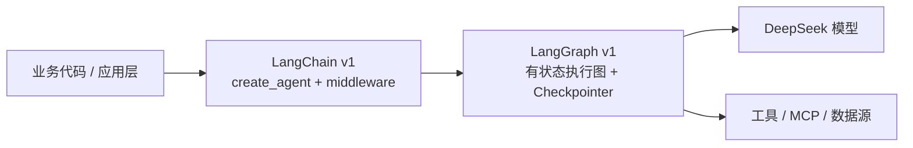
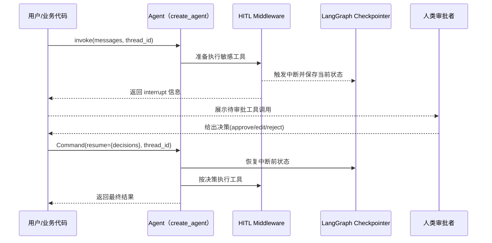

## 一、为什么只用 LangChain 还不够？

在第 06 篇里，我们用上一代的 DeepSeek R1 + LangChain 搭了一个“数据分析脚本”；  
在第 07 篇里，用 LangChain Agent 做了“根据数据报表生成 PPT”；  
第 09 篇又系统讲了 LangChain 1.x 的三件大事：`create_agent`、middleware、`content_blocks`。

如果你跟着写了一圈，很容易遇到这些痛点：

- 任务一旦跑起来，中途想“暂停一下、等人审批”几乎做不到
- 模型提出要执行一段 Python 或 SQL，明知道很危险，却没有统一的审批与回滚机制
- 一个分析任务跑了十几步，出错之后只能“从头再来”，非常不工程

这些都不是 LangChain 本身要解决的问题，而是“Agent 如何在生产环境里长时间、安全地跑下去”的问题。

这正是 LangGraph v1 的定位：

> LangChain v1 负责“怎么写 Agent”，  
> LangGraph v1 负责“Agent 怎么安全、持久地跑”。

这一篇，我们就用一个具体的数据分析场景，带你从 LangChain v1 走到 LangGraph v1，实战一个：

> 能对 CSV 做智能分析、  
> 对敏感操作会自动暂停等你审批、  
> 即便中途中断，也能“从上次进度续命”  
> 的 DeepSeek 数据分析 Agent。

---

## 二、LangChain v1 × LangGraph v1：两层心智模型

先把心智理清楚，避免一上来就被各种 API 名字绕晕。

LangChain 官方的定位可以概括成一句话：

- LangChain v1：写 Agent 的高层抽象（`create_agent` + middleware + 工具）
- LangGraph v1：跑 Agent 的底层执行框架（有状态、可持久化、可中断）

可以用一张简单的架构图来理解两者关系：



几个关键点：

- `create_agent` 本身就是基于 LangGraph v1 实现的“预制 Agent 图”
- LangChain v1 提供了 middleware、Human-in-the-Loop、短期记忆这些高层能力
- LangGraph v1 提供了 Checkpointer（状态持久化）和中断/恢复机制

换句话说：

> 你只要用 LangChain v1 构建 Agent，再配上 LangGraph 的 checkpointer，就已经在用 LangGraph v1 的“持久化执行”能力了。  
> 真正只有在需要完全自定义执行图时，才需要直接写 `StateGraph`。

这一篇我们会两件事都做：

1. 主线：用 LangChain v1 + LangGraph checkpointer 实战一个“可暂停的分析 Agent”（工程实用为主）
2. 顺带给你看一眼“原生 LangGraph 图长什么样”，为后续进阶埋个坑

---

## 三、目标场景与设计拆解（用第一性原理想一想）

假设你有一个典型的数据分析后台需求：

- 用户上传一份 CSV 销售数据（也可以是已有路径）
- 用自然语言提问，比如：
  - “帮我分析近 6 个月的销售趋势，并画一个趋势图”
  - “按城市维度分组，找出销量前 5 的城市，并给出解释”
- Agent 要做的事：
  1. 读取 CSV，对数据做基础校验
  2. 用 DeepSeek 生成结构化分析计划
  3. 在必要时生成并执行 Python / Matplotlib 代码画图
  4. 执行敏感代码前，必须让人类点一下“确认”，才能继续

约束条件：

- CSV 有可能很大，不希望每一步都重复读取、重复计算
- 代码执行是高风险操作（尤其是 `eval` / `exec`），必须有统一的审批机制
- 分析任务有可能跑一半被中断（服务重启、人工暂停），希望能从中断点继续

用第一性原理拆一下：

1. 状态必须外置  
   分析计划、数据摘要、执行进度都不该散落在局部变量里，而应该放进一个持久化状态。
2. 敏感操作要“串起来”统一治理  
   CSV 加载、简单聚合可以自动执行；代码执行、写文件必须人工审批，这类逻辑适合用 middleware 和中断来做。
3. 模型调用与工具调用要解耦  
   模型负责“想明白接下来要干什么”，工具负责“真实世界的动作”。对“动作”进行审计和审批，比对“自然语言”好得多。

根据这个拆解，我们选择：

- 用 LangChain v1 的 `create_agent` 作为 Agent 外壳
- 用 DeepSeek 官方集成包 `langchain-deepseek` 作为模型
- 用 LangGraph v1 的 `InMemorySaver` 做 checkpointer，支持中断/续命
- 用 `HumanInTheLoopMiddleware` 对代码执行工具做统一审批

---

## 四、环境准备：uv 与 pip

按照仓库规范，优先使用 `uv`，同时给出等价 `pip` 命令。

建议在 `04_LangChain_Guide/code/ch10/` 下新建虚拟环境。

```bash
# 建议 Python 3.10+

# 使用 uv（推荐）
uv init ch10-langgraph-agent
cd ch10-langgraph-agent
uv add langchain langgraph langchain-deepseek pandas python-dotenv matplotlib

# 等价的 pip 命令
python -m venv .venv && source .venv/bin/activate
pip install -U langchain langgraph langchain-deepseek pandas python-dotenv matplotlib
```

说明：

- `langchain`：LangChain v1 主包
- `langgraph`：LangGraph v1 主包
- `langchain-deepseek`：DeepSeek 官方集成
- `langgraph.checkpoint.memory` 默认就带有内存型 `InMemorySaver`，足够示范“线程级续命”

---

## 五、步骤一：初始化 DeepSeek 模型，并打开 v1 输出

我们希望后续能用 `content_blocks` 安全拿到 DeepSeek 推理模型的推理过程和最终结果，所以在初始化时显式指定 `output_version="v1"`。

```python
# file: ch10_agent.py

from langchain_deepseek import ChatDeepSeek

llm = ChatDeepSeek(
    model="deepseek-reasoner",
    api_key="sk-your-api-key",  # 替换为你的 DeepSeek API 密钥
    temperature=0.2,
    output_version="v1",        # 关键：启用 v1 标准输出，便于后续 content_blocks 使用
)
```

这里暂时不展开 `content_blocks`，第 12 篇会专门做深度实战，这一篇只要保证“未来可扩展”。

---

## 六、步骤二：定义数据分析工具（安全的那一半）

我们把“读 CSV 与基本聚合”封装成一个工具，Agent 可以随时调用。

```python
# file: ch10_agent.py

from typing import Dict, Any

import pandas as pd
from langchain.tools import tool

@tool
def load_and_profile_csv(path: str, sample_rows: int = 200) -> Dict[str, Any]:
    """
    安全的数据加载与基础画像工具。

    - 读取 CSV
    - 提供列信息、缺失值比例
    - 返回前若干行样本，供模型理解数据分布
    """
    df = pd.read_csv(path)

    # 简单防御：限制样本行数，避免上下文爆炸
    sample = df.head(sample_rows)

    profile = {
        "num_rows": int(df.shape[0]),
        "num_cols": int(df.shape[1]),
        "columns": [
            {
                "name": col,
                "dtype": str(df[col].dtype),
                "num_missing": int(df[col].isna().sum()),
            }
            for col in df.columns
        ],
    }

    return {
        "profile": profile,
        "sample": sample.to_dict(orient="records"),
    }
```

注意几点工程实践：

- 避免把整个 CSV 原样喂给模型，只给“数据画像 + 有限样本”
- 工具的返回值是严格 JSON 可序列化的 Python 对象，后续可以直接记录在状态里
- 这类工具是“低风险”的，可以让 Agent 自动调用，无需人工审批

---

## 七、步骤三：定义“高风险”可视化工具，只允许在审批后执行

真正危险的是“执行模型生成的 Python 代码”。哪怕只是画图，一旦你用 `exec` 无限制执行，风险也很大。

我们按 LangChain v1 的建议，把它封装成一个工具，并且只允许在 Human-in-the-Loop 审批通过后执行。

```python
# file: ch10_agent.py

import textwrap
from pathlib import Path

import matplotlib.pyplot as plt
from langchain.tools import tool

@tool
def execute_plot_code(code: str, output_path: str = "analysis_plot.png") -> str:
    """
    执行模型生成的 Matplotlib 绘图代码，并保存到指定路径。

    警告：这只是教学示例，生产环境请务必加上更严格的安全沙箱。
    """
    # 仅允许使用受控的全局变量，避免随意访问系统资源
    safe_globals = {
        "plt": plt,
        "__builtins__": {
            # 只开放少量安全内置函数，防止任意文件与网络操作
            "range": range,
            "len": len,
            "min": min,
            "max": max,
            "sum": sum,
        },
    }
    safe_locals = {}

    # 简单去掉缩进，提升容错性
    cleaned_code = textwrap.dedent(code)

    # 执行模型生成代码（高风险，必须配合 HITL 使用）
    exec(cleaned_code, safe_globals, safe_locals)

    # 如果模型代码里没有显式保存图片，我们兜底保存一下
    if Path(output_path).suffix == "":
        output_path = output_path + ".png"
    plt.savefig(output_path, bbox_inches="tight")
    plt.close()

    return f"图表已生成，保存为: {output_path}"
```

再次强调：这是教学示例，真正上线时建议：

- 用 AST 分析、白名单语法、容器隔离等方式对代码执行做更严格限制
- 或者索性不让模型输出代码，只输出“图表配置 JSON”，再由你自己拼出安全的绘图代码

这一篇的重点不在“如何完全安全执行代码”，而在于：**如何把这类敏感操作统一挂在 HITL 审批流程下**。

---

## 八、步骤四：用 LangChain v1 + LangGraph checkpointer 组一个“能暂停的 Agent”

现在我们有了两个工具：

- `load_and_profile_csv`：安全的自动执行
- `execute_plot_code`：高风险，必须审批

接下来，用 `create_agent` 把它们和 DeepSeek 串成一个 Agent，并加上：

- `HumanInTheLoopMiddleware`：工具级审批策略
- `InMemorySaver`：来自 LangGraph 的内存 checkpointer，支持线程级状态持久化与中断恢复

```python
# file: ch10_agent.py

from langchain.agents import create_agent
from langchain.agents.middleware import HumanInTheLoopMiddleware
from langgraph.checkpoint.memory import InMemorySaver

from .ch10_agent import llm, load_and_profile_csv, execute_plot_code  # 根据实际文件结构调整导入

tools = [load_and_profile_csv, execute_plot_code]

system_prompt = """
你是一名资深数据分析专家，擅长用 Python 和 Matplotlib 对销售类 CSV 数据进行分析。

使用规则：
1. 优先调用 load_and_profile_csv 工具了解数据结构和样本。
2. 在给出结论前，先用自然语言列清楚你的分析步骤。
3. 仅在用户明确要求“生成图表”或你认为有必要时，才调用 execute_plot_code 工具。
4. 生成绘图代码时，务必：
   - 使用已经加载的样本数据字段
   - 保证代码可直接在 Python 环境中执行
   - 把保存图片的路径参数化为函数的 output_path 入参
"""

# LangGraph 提供的内存型 checkpointer
checkpointer = InMemorySaver()

agent = create_agent(
    model=llm,
    tools=tools,
    system_prompt=system_prompt,
    middleware=[
        HumanInTheLoopMiddleware(
            interrupt_on={
                # 安全操作：无需审批
                "load_and_profile_csv": False,
                # 高风险操作：必须人工审批
                "execute_plot_code": True,
            }
        )
    ],
    checkpointer=checkpointer,  # 关键：把状态交给 LangGraph 持久化
)
```

这里已经体现了“LangChain v1 × LangGraph v1”的组合：

- Agent 写法来自 LangChain v1（`create_agent` 与 middleware）
- 状态持久化来自 LangGraph v1（`InMemorySaver`）
- 工具调用审批通过 LangGraph 的“中断 / 恢复”机制实现（后面会看到 `Command`）

---

## 九、步骤五：完整调用流程——第一次调用、中断、审批、恢复执行

LangGraph 的“续命能力”有两个关键概念：

1. 线程 ID（`thread_id`）  
   把同一条对话或同一次分析任务的所有状态挂在一个 ID 下。
2. 中断与恢复  
   当发现需要人工审批时，Agent 会抛出一个中断（interrupt）；你可以在外部收集审批意见，再用 `Command(resume=...)` 把决策信息传回去，让 Agent 继续。

下面是一个最小可运行示例（假设你在本地已经有 `/path/to/sales.csv`）：

```python
# file: ch10_agent.py

from langchain_core.runnables import RunnableConfig
from langgraph.types import Command

def run_analysis_with_pause_and_resume():
    thread_id = "demo-thread-001"
    # thread_id 是 LangGraph 用来标识“同一条对话/任务”的关键字段
    config: RunnableConfig = {"configurable": {"thread_id": thread_id}}

    # 第一次调用：请求 Agent 做完整分析和绘图
    user_message = {
        "role": "user",
        "content": (
            "请对文件 /path/to/sales.csv 做一次销售趋势分析：\n"
            "1. 先概括整体销售趋势和关键指标\n"
            "2. 再生成一张月度销售额折线图，图片文件名用 analysis_plot.png\n"
        ),
    }

    # 第一次调用：Agent 可能会在调用 execute_plot_code 前中断等待审批
    # 第一次执行，可能会因为敏感工具调用而被 HITL middleware 中断
    result = agent.invoke({"messages": [user_message]}, config=config)

    last_msg = result["messages"][-1]
    print("第一次调用的最后一条消息：")
    print(last_msg)

    # 如果 Agent 没有触发任何中断，说明没有进行敏感操作
    if not result.get("interrupts"):
        print("本次分析未触发敏感工具，无需审批。")
        return

    # 否则，我们假设这里只出现一个工具调用需要审批
    interrupt_info = result["interrupts"][0]
    print("检测到需要人工审批的工具调用：")
    print(interrupt_info)

    # 这里你可以根据 interrupt_info 里的工具名和参数，决定 approve / edit / reject
    # 为简单起见，我们直接 approve（生产环境请加入真实审批流程）
    decisions = [{"type": "approve"}]

    # 第二次调用：用 Command.resume 把决策传回 Agent，继续执行
    resume_cmd = Command(resume={"decisions": decisions})

    resumed_result = agent.invoke(resume_cmd, config=config)

    print("恢复执行后的最终回答：")
    for msg in resumed_result["messages"]:
        print(msg)

if __name__ == "__main__":
    run_analysis_with_pause_and_resume()
```

这里发生了什么？

- 第一次 `invoke`：
  - Agent 先调用 `load_and_profile_csv` 获取数据画像
  - DeepSeek 推理模型生成分析计划与绘图代码
  - 当准备调用 `execute_plot_code` 时，HITL middleware 发现这是一个需要审批的工具
  - LangGraph 通过 checkpointer 把当前状态写入内存，并抛出 `interrupts`
- 你可以：
  - 在后台 UI 或 CLI 中看到待审批的工具调用信息（工具名与入参）
  - 决定是 `approve`、`edit` 还是 `reject`
- 第二次 `invoke`：
  - 把决策封装进 `Command(resume=...)`，传入同一个 `thread_id`
  - LangGraph 从 checkpointer 里恢复状态，从中断点往后继续执行
  - 工具按你的决策执行，Agent 返回最终分析结果

为了更直观地理解“暂停→人工审批→恢复”的过程，可以用一张时序图概括：



至此，这个 Agent 已经具备：

- 线程级记忆（`thread_id`）
- 对敏感工具调用进行统一审批
- 可以在中断后“续命”，而不是从头再跑一遍

这就是 LangGraph v1 在 LangChain v1 体系下最大的工程价值之一。

---

## 十、简单看一眼原生 LangGraph 图长什么样

这一篇我们刻意用 LangChain 的 `create_agent` 做主体，是为了让你低成本先把“中断与续命”的心智走通。

如果你需要完全自定义执行流程（比如自己决定先跑哪个工具、什么时候结束循环），就需要直接用 LangGraph 的 `StateGraph`。

下面是一个极度简化的伪代码，只用来帮你建立“图”的感觉（不建议第一次上手就用这套）：

```python
from typing import Annotated

import operator
from typing_extensions import TypedDict

from langchain_core.messages import AnyMessage, HumanMessage, SystemMessage
from langgraph.checkpoint.memory import InMemorySaver
from langgraph.graph import StateGraph, START, END

# 1. 定义状态结构：消息 + 一些中间结果
class AnalysisState(TypedDict):
    messages: Annotated[list[AnyMessage], operator.add]
    profile: dict | None
    plot_code: str | None

# 2. 定义各个节点
def plan_node(state: AnalysisState) -> dict:
    """让 DeepSeek 生成分析计划和下一步动作。"""
    # 这里可以用 llm.invoke(state["messages"])，
    # 再结合 content_blocks 得到计划，返回更新后的状态
    raise NotImplementedError

def safe_tools_node(state: AnalysisState) -> dict:
    """执行安全工具，比如 load_and_profile_csv。"""
    raise NotImplementedError

def risky_tools_node(state: AnalysisState) -> dict:
    """执行敏感工具，比如 execute_plot_code，并可能触发中断。"""
    raise NotImplementedError

def should_continue(state: AnalysisState) -> str:
    """决定是继续还是结束。"""
    raise NotImplementedError

# 3. 搭图
builder = StateGraph(AnalysisState)

builder.add_node("plan", plan_node)
builder.add_node("safe_tools", safe_tools_node)
builder.add_node("risky_tools", risky_tools_node)

builder.add_edge(START, "plan")
builder.add_edge("plan", "safe_tools")
builder.add_edge("safe_tools", "risky_tools")
builder.add_conditional_edges("risky_tools", should_continue, ["plan", END])

graph = builder.compile(checkpointer=InMemorySaver())
```

你可以看到，`create_agent` 实际上就是帮你把这种图已经预先搭好了：

- 节点包括模型调用节点、工具执行节点、中断处理节点
- 状态类型就类似这里的 `AnalysisState`，至少包含 `messages`

当你需要“可视化整个执行图、精细控制每一条边和状态字段”时，再深入 LangGraph 的 Graph API 就很合适了。
