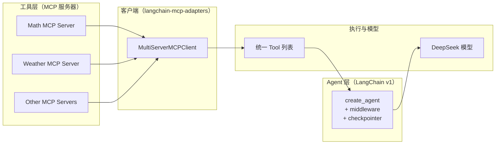
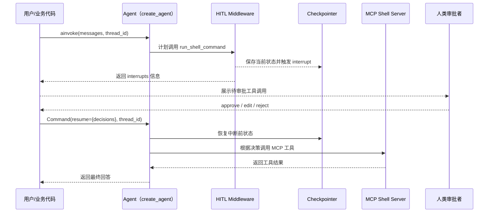

## 一、先别急写代码：MCP 之前的“三种工具地狱”

在第 08 篇里，我们已经用 DeepSeek + MCP 做过 Demo：数学运算服务器、天气服务器、Tavily 搜索、Gaode LBS……  
但如果不用 MCP、LangChain v1，你很可能会落入下面几种“工具地狱”：

1. **HTTP SDK 地狱**  
   每个内部系统都有自己的 REST / SDK，鉴权方式也各不相同，LLM 每接一个系统都要改一堆 glue code。
2. **Agent 行为散落在业务代码里**  
   工具怎么挑、什么时候重试、什么时候暂停等逻辑写在一堆 if/else 里，既不复用也不好测。
3. **安全与审计脱节**  
   哪些工具算高危？谁来审批？调用日志怎么统一看？常常是“出事了再翻 log”，很难在一个统一层面管控。

MCP 和 LangChain v1 的组合，就是要把这三类问题拆开：

- MCP 把“工具是什么、长什么样、怎么调用”标准化  
- LangChain v1 把“Agent 怎么用工具、怎么被治理”标准化

我们这一篇不再解释协议细节，而是用三个递进的实战，把这条主线走一遍：

1. 10 行代码接入一个数学 MCP 服务，体验最小闭环
2. 把多个 MCP 服务拼成一个“工具中枢”，让 Agent 像用本地工具一样用它们
3. 给高危 MCP 工具加上 LangGraph checkpointer + Human-in-the-Loop，做到“可暂停、可审批、可追责”

---

## 二、一张图看清：LangChain v1 × MCP × LangGraph 角色分工

先用一张图把“谁管什么”说清楚，再看代码就不容易迷路：



可以对应到我们会用到的三类库：

- `langchain-mcp-adapters`：实现 Client 层（`MultiServerMCPClient`、`load_mcp_tools`）
- `langchain` v1：实现 Agent 层（`create_agent` + middleware）
- `langgraph`：在 Agent 下面提供 checkpointer 与中断恢复能力

接下来我们就按 1→2→3 的顺序递进，逐步把这三层串起来。

---

## 三、Part 1：10 行代码把数学 MCP 接入 create_agent

### 3.1 复用第 08 篇的 Math 服务器

先把 MCP 服务器准备好，这部分和第 08 篇几乎一样，只做一点注释整理。

```python
# file: math_server.py

from mcp.server.fastmcp import FastMCP

mcp = FastMCP("Math")

@mcp.tool()
def add(a: int, b: int) -> int:
    """Add two numbers."""
    return a + b

@mcp.tool()
def multiply(a: int, b: int) -> int:
    """Multiply two numbers."""
    return a * b

if __name__ == "__main__":
    # 使用 stdio 作为传输机制，方便与本地客户端集成
    # 客户端只要能启动这个进程并接管 stdin/stdout 就能使用这些工具
    mcp.run(transport="stdio")
```

这一步完全不依赖 LangChain，只要你遵循 MCP 协议就行。

### 3.2 LangChain v1 侧：10 行代码接入 MCP 工具

按照仓库规范，推荐在 `04_LangChain_Guide/code/ch11/` 新建虚拟环境：

```bash
uv init ch11-langchain-mcp
cd ch11-langchain-mcp
uv add langchain langgraph langchain-deepseek langchain-mcp-adapters python-dotenv

# 或者
python -m venv .venv && source .venv/bin/activate
pip install -U langchain langgraph langchain-deepseek langchain-mcp-adapters python-dotenv
```

有了依赖之后，用 LangChain v1 的 `create_agent` 把 DeepSeek 和 MCP 工具接起来：

```python
# file: ch11_agent_single_mcp.py

import asyncio

from langchain.agents import create_agent
from langchain_deepseek import ChatDeepSeek
from langchain_mcp_adapters.client import MultiServerMCPClient
from langchain_mcp_adapters.tools import load_mcp_tools

async def main():
    # 1. 初始化 DeepSeek 模型（LangChain v1，开启 v1 输出）
    model = ChatDeepSeek(
        model="deepseek-reasoner",
        api_key="sk-your-api-key",  # 替换为你的 DeepSeek API 密钥
        temperature=0,
        output_version="v1",
    )

    # 2. 创建 MCP 客户端，只配置一个本地 math 服务器
    client = MultiServerMCPClient(
        {
            "math": {
                "command": "python",          # 启动本地 Python 进程
                "args": ["./math_server.py"], # 与 math_server.py 路径保持一致
                "transport": "stdio",         # 本地开发推荐 stdio，零网络依赖
            }
        }
    )

    # 3. 建立与 math 服务器的会话，并加载工具
    async with client.session("math") as session:
        # 自动把 MCP 工具描述转换为 LangChain v1 的 Tool 对象
        tools = await load_mcp_tools(session)

        # 4. 用 create_agent 组装 LangChain v1 Agent
        agent = create_agent(
            model=model,
            tools=tools,
            system_prompt=(
                "你是一个数学助理，可以使用 MCP 提供的数学工具进行计算，"
                "在必要时给出一步一步的推导过程。"
            ),
        )

        # 5. 测试一次调用
        result = await agent.ainvoke(
            {"messages": [{"role": "user", "content": "计算 (3 + 5) × 12 并解释步骤"}]}
        )

        for msg in result["messages"]:
            print(msg)

if __name__ == "__main__":
    asyncio.run(main())
```

到这里，你已经把 MCP 工具“骗”进了 LangChain v1 的视角里：

- 对 Agent 来说，这些工具和普通 Python 工具没有区别
- 对工具提供方来说，只要遵守 MCP 协议，就不需要关心 LangChain 的存在

接下来，我们要把这个单 MCP Agent 扩展成一个“多源工具中枢”。

---

## 四、Part 2：从单 MCP 到“多源工具中枢”

现实项目里，你很少只用一个工具。常见场景是：

- 一部分是你自己写的业务 MCP 服务（订单、库存、财务等）
- 一部分是第三方 MCP 服务（Tavily 搜索、高德 LBS、GitHub、Jira 等）
- 还有一些本地 Python 工具（文件读写、向量检索、数据清洗）

`MultiServerMCPClient` 的目标，就是把“多 MCP 服务”在客户端统一抽象成一个工具集合。

### 4.1 再加一个 Weather 服务器

我们沿用第 08 篇的天气示例，简化为本地 stdio MCP 服务器：

```python
# file: weather_server.py

from mcp.server.fastmcp import FastMCP

mcp = FastMCP("Weather")

@mcp.tool()
async def get_weather(location: str) -> str:
    """Get weather for location."""
    # 教学示例，真实场景可以接第三方天气 API
    return f"The weather in {location} is always sunny in this demo."

if __name__ == "__main__":
    # 这里可以用 SSE 或 stdio，示例中用 stdio 简化本地开发
    mcp.run(transport="stdio")
```

### 4.2 一次性接入两个 MCP 服务

在客户端这边，仅需扩展 `MultiServerMCPClient` 的配置：

```python
# file: ch11_agent_multi_mcp.py

import asyncio

from langchain.agents import create_agent
from langchain_deepseek import ChatDeepSeek
from langchain_mcp_adapters.client import MultiServerMCPClient
from langchain_mcp_adapters.tools import load_mcp_tools

async def main():
    model = ChatDeepSeek(
        model="deepseek-chat",
        api_key="sk-your-api-key",
        temperature=0.3,
        output_version="v1",
    )

    client = MultiServerMCPClient(
        {
            "math": {
                "command": "python",            # 使用同一套二进制启动不同 MCP 服务
                "args": ["./math_server.py"],   # 数学工具服务器
                "transport": "stdio",
            },
            "weather": {
                "command": "python",
                "args": ["./weather_server.py"], # 天气查询服务器
                "transport": "stdio",
            },
        }
    )

    # 演示：从多个服务器加载工具并合并
    all_tools = []
    async with client.session("math") as math_session:
        all_tools.extend(await load_mcp_tools(math_session))

    async with client.session("weather") as weather_session:
        all_tools.extend(await load_mcp_tools(weather_session))

    agent = create_agent(
        model=model,
        tools=all_tools,
        system_prompt=(
            "你可以使用 MCP 工具进行数学计算和查询天气。"
            "在回答问题时，优先利用可用工具给出精确结果。"
        ),
    )

    # 测试数学问题
    math_result = await agent.ainvoke(
        {"messages": [{"role": "user", "content": "what's (3 + 5) x 12?"}]}
    )
    print("数学问题回答：")
    print(math_result["messages"][-1].content)

    # 测试天气问题
    weather_result = await agent.ainvoke(
        {"messages": [{"role": "user", "content": "what is the weather in New York?"}]}
    )
    print("天气问题回答：")
    print(weather_result["messages"][-1].content)

if __name__ == "__main__":
    asyncio.run(main())
```

从 Agent 角度看，工具只是 `all_tools` 列表里的若干项：  
它并不关心这些工具到底来自本地、来自 MCP，还是来自 `langchain_community`。

此时，你已经可以把 `MultiServerMCPClient` 当成一个“多数据源工具网关”在用。  
下一步，是给这个工具网关加上安全与治理。

---

## 五、Part 3：给高危 MCP 工具加“人类审批”和续命能力

有了 MCP 网关、LangChain Agent，还差一块：风控与审计。

典型需求包括：

- 执行 shell 命令、写文件、发邮件等敏感工具，需要**人工审批**后才能执行
- Agent 在等待审批时要**暂停**，不能阻塞线程或丢失上下文
- 审批通过/拒绝后，Agent 能从中断点继续执行，即“续命”

### 5.1 接入一个“执行 Shell 命令”的 MCP 服务（假设）

我们假设存在一个 `shell_server.py`，提供 `run_shell_command` 工具。  
这类工具天然高危，必须走 Human-in-the-Loop。

### 5.2 用 HumanInTheLoopMiddleware + InMemorySaver 统一治理

下面的代码把三者串在一起：

```python
# file: ch11_agent_mcp_hitl.py

import asyncio

from langchain.agents import create_agent
from langchain.agents.middleware import HumanInTheLoopMiddleware
from langchain_deepseek import ChatDeepSeek
from langchain_core.runnables import RunnableConfig
from langchain_mcp_adapters.client import MultiServerMCPClient
from langchain_mcp_adapters.tools import load_mcp_tools
from langgraph.checkpoint.memory import InMemorySaver
from langgraph.types import Command

async def main():
    model = ChatDeepSeek(
        model="deepseek-reasoner",
        api_key="sk-your-api-key",
        temperature=0,
        output_version="v1",
    )

    client = MultiServerMCPClient(
        {
            "math": {
                "command": "python",
                "args": ["./math_server.py"],
                "transport": "stdio",
            },
            "shell": {
                "command": "python",
                "args": ["./shell_server.py"],  # 假设有一个执行 shell 命令的 MCP 服务器
                "transport": "stdio",
            },
        }
    )

    tools = []
    async with client.session("math") as math_session:
        tools.extend(await load_mcp_tools(math_session))
    async with client.session("shell") as shell_session:
        tools.extend(await load_mcp_tools(shell_session))

    # LangGraph 内存 checkpointer，支持线程级状态持久化
    checkpointer = InMemorySaver()

    agent = create_agent(
        model=model,
        tools=tools,
        system_prompt=(
            "你可以使用 MCP 工具执行数学运算和系统命令。"
            "对于可能修改系统状态的命令，必须在获得人类批准后才能执行。"
        ),
        middleware=[
            HumanInTheLoopMiddleware(
                interrupt_on={
                    # 数学工具完全自动化
                    "add": False,
                    "multiply": False,
                    # shell 相关工具一律需要审批
                    "run_shell_command": True,
                }
            )
        ],
        checkpointer=checkpointer,
    )

    thread_id = "mcp-hitl-demo-001"  # 同一 thread_id 下的多次调用共享一份 Agent 状态
    config: RunnableConfig = {"configurable": {"thread_id": thread_id}}

    # 第一次调用：Agent 可能在准备执行 run_shell_command 时中断
    first_result = await agent.ainvoke(
        {
            "messages": [
                {
                    "role": "user",
                    "content": "请帮我查看当前目录下有哪些文件，如果必要可以执行系统命令。",
                }
            ]
        },
        config=config,
    )

    print("第一次调用最后一条消息：")
    print(first_result["messages"][-1])

    if not first_result.get("interrupts"):
        print("未触发任何中断。")
        return

    interrupt_info = first_result["interrupts"][0]
    print("需要审批的工具调用：", interrupt_info)

    # 在真实场景中，这里应当由人类审阅工具名和参数后再决定
    decisions = [{"type": "approve"}]

    resume_cmd = Command(resume={"decisions": decisions})

    resumed_result = await agent.ainvoke(resume_cmd, config=config)

    print("恢复执行后的最终回答：")
    print(resumed_result["messages"][-1])

if __name__ == "__main__":
    asyncio.run(main())
```

可以用一张时序图概括这个流程（和第 10 篇类似，但这里的“工具提供方”是 MCP 服务器）：



在这个模式下：

- 工具是否来自 MCP 已经不重要  
- 真正重要的是：**敏感操作一律走 HITL + 持久化中断**，形成统一的风控面

---

## 六、从第 08 篇（create_react_agent）迁到 v1 的实战攻略

最后，把迁移问题收拢成一个实用的清单，方便你对照现有代码逐步升级：

1. **依赖层面**
   - 安装或升级到 `langchain` v1 与 `langchain-mcp-adapters`
   - 如需中断与持久化，安装 `langgraph`

2. **Agent 构造层面**
   - 将 `langgraph.prebuilt.create_react_agent` 替换为 `langchain.agents.create_agent`
   - 原来的 pre/post hook 转换为 middleware（`before_model`、`after_model`、`wrap_tool_call` 等）

3. **工具加载层面**
   - 用 `MultiServerMCPClient` 管理多个 MCP 服务器的连接与生命周期
   - 用 `load_mcp_tools(session)` 获取 LangChain v1 的 Tool 对象，而不是自己组装 schema

4. **安全与治理层面**
   - 对写文件、执行命令、发邮件等高危 MCP 工具，统一用 `HumanInTheLoopMiddleware` 控制
   - 对 Agent 配置 `checkpointer`（可以先用 `InMemorySaver`，生产时再换成 Postgres 等）

5. **观测与调试层面**
   - 将 Agent 接入 LangSmith，观察完整调用链：模型推理、MCP 工具调用、HITL 中断与恢复
   - 特别是 MCP 工具的入参与返回值，都是后期审计的关键信号

走完这五步，你的 MCP 集成就从“玩具 Demo”升级为“可进生产环境讨论”的水平。

结合前几篇：

- 第 06 / 07 篇：教你把业务场景抽象成 Agent
- 第 09 篇：用 LangChain v1 心智重写 Agent（`create_agent` + middleware + `content_blocks`）
- 第 10 篇：用 LangGraph v1 做长生命周期与中断恢复
- 第 11 篇（本文）：用 MCP 做统一工具层，把外部能力稳稳接进 Agent 体系

下一篇，我们会专门聊 LangChain v1 的第三个关键能力：`content_blocks`，  
让你用 DeepSeek 的推理过程和结构化输出，做出“可观测、可审计”的 Agent。
