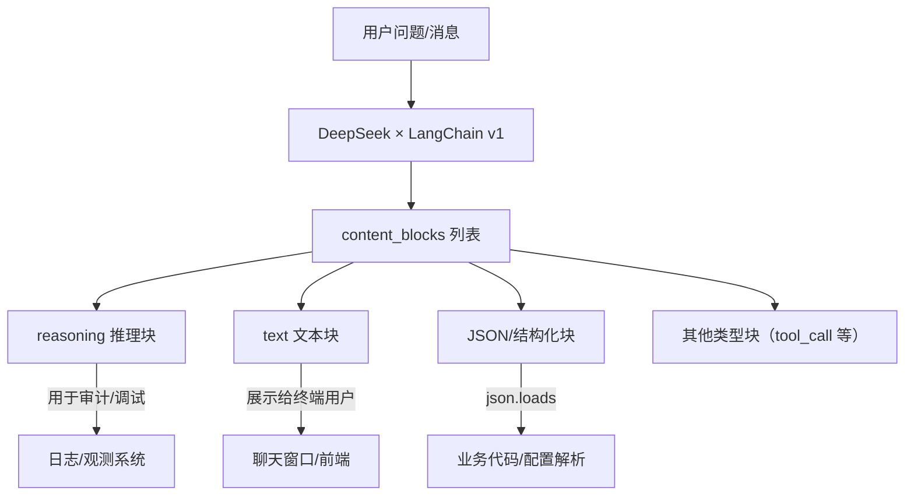
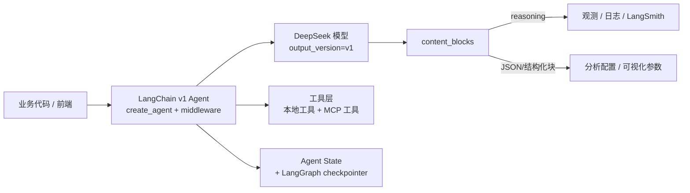

## 一、从第 06 篇的旧代码说起：为什么这是“临时方案”

在第 06 篇的数据分析 Demo 里，我们为了从 DeepSeek 输出中抠出 JSON，写过类似这样的代码：

```python
json_match = re.search(r"```(?:json)?\\s*(.*?)```", response.content, re.DOTALL)
if json_match:
    content = json_match.group(1).strip()
else:
    content = response.content

try:
    return json.loads(content)
except json.JSONDecodeError:
    # 教学示例里甚至退回到 eval
    return eval(content)
```

当时我们就强调过：这是“为了教学方便”的临时写法，不建议直接搬进生产环境。  
原因主要有三点：

- **结构全靠正则猜**：模型一旦多打一行文字、多一个代码块前缀，正则就可能失效；
- **推理过程和 JSON 混在一起**：既想看 reasoning，又想要干净 JSON，只能在字符串里各种 split；
- **`eval` 是最后一根“救命稻草”**：一旦 JSON 不合法，就直接在服务端 eval 一段来自模型的字符串，这在任何安全审计里都过不了关。

这些问题并不是 DeepSeek 独有，而是所有“靠字符串拼接的 LLM 输出”都会遇到的工程痛点。  
LangChain v1 推出的 `content_blocks`，就是要从接口层面把这个问题一次性解决掉。

这一篇我们不会再“背概念”，而是针对“第 06 篇的旧写法”，给出一套完全基于 `content_blocks` 的重写思路：

1. 把 DeepSeek 推理模型的响应拆成“推理过程 + 最终答案”两个清晰层次；
2. 用块级解析重写 JSON 提取逻辑，彻底告别正则与 `eval`；
3. 在 Agent/middleware 里统一消费 `content_blocks`，让观测和审计变成“架构内建能力”。

---

## 二、content_blocks 快速拆解：DeepSeek × LangChain v1 的输出长什么样？

在 LangChain v1 里，我们推荐在初始化模型时显式打开 v1 输出模式：

```python
from langchain_deepseek import ChatDeepSeek

llm = ChatDeepSeek(
    model="deepseek-reasoner",
    api_key="sk-your-api-key",
    temperature=0.2,
    output_version="v1",   # 关键：启用 v1 输出模式
)
```

开启之后，响应对象除了传统的 `content` / `text` 外，还会多出一个：

- `response.content_blocks`：列表，每一项都是一个“内容块”，类似：
  - `{"type": "reasoning", "reasoning": "……模型的思考过程……"}`
  - `{"type": "text", "text": "……给用户看的最终回答……"}`
  - 未来也可能包括 `tool_call`、多模态等更多类型

可以用一张图来理解：



先用一个极小 Demo 感受一下 `content_blocks` 的效果：

```python
# file: ch12_reasoning_demo.py

from langchain_deepseek import ChatDeepSeek

llm = ChatDeepSeek(
    model="deepseek-reasoner",
    api_key="sk-your-api-key",
    temperature=0,
    output_version="v1",
)

def show_reasoning_and_answer():
    # 用一个简单数学问题演示 R1 的推理过程拆分
    response = llm.invoke("解释一下为什么 1+2+...+100 等于 5050，用中学生能听懂的方式。")

    print("原始 content：")
    print(response.content)

    print("\n按 content_blocks 拆解：\n")
    for idx, block in enumerate(response.content_blocks):
        block_type = block.get("type")
        print(f"Block {idx} type={block_type!r}")
        if block_type == "reasoning":
            print("推理过程：")
            print(block.get("reasoning"))
        elif block_type == "text":
            print("最终答案：")
            print(block.get("text"))
        else:
            print("其他块：", block)
        print("-" * 40)

if __name__ == "__main__":
    show_reasoning_and_answer()
```

这一步的目标只有一个：建立“块级视角”的直觉——以后所有“解析输出”的逻辑，都尽量基于 `content_blocks` 而不是整段字符串。

---

## 三、重写第 06 篇的解析逻辑：从正则 + eval 到块级 JSON 解析

在第 06 篇的核心流程里，我们做了三件事：

1. 把 CSV 文件加载为文本片段；
2. 把数据画像和样本拼进 Prompt，请 DeepSeek 生成分析结果；
3. 从模型输出中抠出 JSON，交给后续绘图和分析逻辑。

其中第三步的旧写法，就是前面那段“正则 + `json.loads` + `eval`”。

在 LangChain v1 + `content_blocks` 下，我们推荐改成下面这种风格：


```python
# file: ch12_safe_json_extract.py

import json
from typing import Any, Dict, Optional

from langchain_deepseek import ChatDeepSeek
from langchain_core.messages import HumanMessage, SystemMessage

llm = ChatDeepSeek(
    model="deepseek-reasoner",
    api_key="sk-your-api-key",
    temperature=0,
    output_version="v1",
)

ANALYSIS_PROMPT = """
你现在接收的是一份销售数据样本，以及对应的数据画像。

请完成以下任务：
1. 给出整体趋势和关键指标的自然语言分析
2. 返回一个 JSON 结构，描述后续可视化与分析配置

输出要求：
- 自然语言分析正常输出即可
- JSON 必须是合法的、可解析的 JSON，且不能包含额外注释或多余文本
- JSON 内容请单独放在一个内容块中，不要与自然语言混合

JSON 结构示例：
{{
  "metrics": {{
    "total_revenue": 123456.78,
    "avg_order_value": 345.67
  }},
  "charts": [
    {{
      "type": "line",
      "x": "month",
      "y": "revenue",
      "title": "月度销售趋势"
    }}
  ],
  "next_actions": [
    "进一步分析高价值客户的留存情况",
    "比较不同渠道的转化率"
  ]
}}
"""

def extract_analysis_config(response) -> Optional[Dict[str, Any]]:
    """
    从 content_blocks 中提取 JSON 配置。

    约定：
    - 模型在某个 text 块中单独输出 JSON
    - 该块只包含 JSON 字符串，不包含额外说明
    """
    for block in response.content_blocks:
        # 只在 text 类型块中尝试解析 JSON，避免误把 reasoning 等内容当成配置
        if block.get("type") != "text":
            continue
        text = block.get("text", "").strip()
        if not text:
            continue
        try:
            return json.loads(text)
        except json.JSONDecodeError:
            # 如果不是纯 JSON，就跳过，继续找下一个块
            continue
    return None

def analyze_with_safe_json(data_profile: str, data_sample: str) -> Dict[str, Any]:
    """对第 06 篇 analyze_data 的重写版本：基于 content_blocks 的解析。"""
    messages = [
        SystemMessage(
            content=(
                "你是一个严谨的数据分析助手，只输出可解析的 JSON 时要严格遵守 JSON 语法。"
            )
        ),
        HumanMessage(
            content=(
                ANALYSIS_PROMPT
                + "\n\n"
                f"数据画像：\n{data_profile}\n\n"
                f"数据样本：\n{data_sample[:2000]}"
            )
        ),
    ]

    response = llm.invoke(messages)

    config = extract_analysis_config(response)
    if config is None:
        raise ValueError("未能从模型输出中提取合法 JSON，请检查 Prompt 或模型行为。")

    return config
```


可以看到，相比旧写法有几个显著变化：

- 不再在 `response.content` 上做任何正则和字符串手术；
- 不再存在 `eval` 兜底逻辑，所有异常都转化为“可显式处理”的错误；
- JSON 的位置不再是“猜”，而是 Prompt 约定好放在某个内容块中，然后用 `content_blocks` 定位。

在工程实践中，你可以进一步做两件事：

1. 根据 JSON 结构做 Pydantic 校验或类型检查，而不只是 `json.loads` 成功就算；
2. 在上层加一层“自动重试逻辑”，对“解析失败”这种可预期错误做温和重试，而不是简单地 500。

---

## 四、把 content_blocks 接进 Agent：让“推理过程和结构化结果”变成状态的一部分

前面两节都是“单次模型调用”的视角。  
如果你已经在用第 09 / 10 / 11 篇的 LangChain v1 Agent，那么更自然的做法是：

> 把 `content_blocks` 的解析逻辑沉到 middleware 里，  
> 把 reasoning 和 JSON 配置写回 Agent 的状态（state），供后续节点使用。

下面是一个最小的例子，展示如何在 `after_model` middleware 中处理 `content_blocks`：

```python
# file: ch12_agent_middleware.py

import json
from typing import Any, Dict, Optional

from langchain.agents import AgentState, create_agent
from langchain.agents.middleware import after_model
from langchain_deepseek import ChatDeepSeek
from langgraph.checkpoint.memory import InMemorySaver
from langgraph.runtime import Runtime

def extract_json_from_blocks(content_blocks) -> Optional[Dict[str, Any]]:
    for block in content_blocks:
        if block.get("type") != "text":
            continue
        text = block.get("text", "").strip()
        if not text:
            continue
        try:
            return json.loads(text)
        except json.JSONDecodeError:
            continue
    return None

@after_model
def log_reasoning_and_attach_config(
    state: AgentState,
    runtime: Runtime,
) -> Dict[str, Any] | None:
    """
    一个示例 middleware：
    - 打印最新消息中的推理过程（仅用于调试或内部审计）
    - 尝试从 content_blocks 中提取 JSON 配置，挂到 state 的自定义字段里
    """
    last_msg = state["messages"][-1]
    blocks = getattr(last_msg, "content_blocks", None)
    if not blocks:
        return None

    # 1. 打印推理过程（可以替换为写日志、打到 LangSmith 等）
    for block in blocks:
        if block.get("type") == "reasoning":
            print("模型推理过程：")
            print(block.get("reasoning"))

    # 2. 尝试提取 JSON 配置
    config = extract_json_from_blocks(blocks)
    if config is None:
        return None

    # 这里简单地把配置塞进 state 的一个自定义字段
    # 返回值中的键会被合并进下一步 state
    return {"analysis_config": config}

def build_agent_with_content_blocks():
    model = ChatDeepSeek(
        model="deepseek-reasoner",
        api_key="sk-your-api-key",
        temperature=0,
        output_version="v1",
    )

    agent = create_agent(
        model=model,
        tools=[],  # 示例中不挂工具，专注 content_blocks
        system_prompt=(
            "你是一个数据分析与配置生成助手。"
            "在需要返回 JSON 配置时，请确保相关内容放在单独的内容块中。"
        ),
        middleware=[log_reasoning_and_attach_config],
        checkpointer=InMemorySaver(),
    )

    return agent
```

使用这个 Agent 时，你可以像这样调用：

```python
from langchain_core.runnables import RunnableConfig

def demo_agent():
    agent = build_agent_with_content_blocks()
    config: RunnableConfig = {"configurable": {"thread_id": "cb-demo-001"}}

    result = agent.invoke(
        {"messages": [{"role": "user", "content": "根据样本数据生成一份分析配置 JSON"}]},
        config=config,
    )

    analysis_config = result.get("analysis_config")
    print("提取到的分析配置：", analysis_config)
```

这里的关键是“职责划分”：

- 调用方只关心 `analysis_config` 这样的**结构化结果**；
- middleware 负责处理“从 `content_blocks` 里拿什么、怎么记录推理过程”；
- Agent state + LangGraph checkpointer 则保证这些信息可以“跨多轮对话”被持久化和恢复。

这就是第 09 / 10 / 11 / 12 篇结合在一起后的“标准实践”：  
**模型输出 → content_blocks → middleware/Agent state → 上层业务逻辑**。

---

## 五、常见错误模式与改造建议

结合第 06 篇旧代码和本篇示例，可以快速列一份“错误模式 → v1 改造建议”的对照表，方便你在老项目里做查漏补缺。

- **错误模式 1：所有解析都围绕 `response.content` 展开**
  - 风险：一旦模型输出稍有格式变化，解析逻辑就会碎成一地；
  - 改造建议：统一迁移到 `content_blocks`，至少在新逻辑中避免继续依赖整段字符串。

- **错误模式 2：推理过程和 JSON 混在一起，靠正则和 split 处理**
  - 风险：推理过程常常是自由文本，难以保证固定边界；
  - 改造建议：在 Prompt 中明确区分“展示给用户的文本”和“结构化结果”，并约定后者出现在独立内容块中。

- **错误模式 3：用 `eval` 兜底 JSON 解析失败**
  - 风险：模型输出一旦被注入恶意代码，你的后端就变成远程执行器；
  - 改造建议：用严格 `json.loads`，解析失败时显式抛错，由上层 Agent 或应用决定重试策略。

- **错误模式 4：解析逻辑散落在业务函数中**
  - 风险：难以统一改造，测试和观测都非常困难；
  - 改造建议：尽量把解析逻辑集中到少数工具函数和 middleware 中，业务代码只依赖“结构化结果”。

---

## 六、在整个 LangChain v1 系列中的位置

回顾一下前后几篇的角色分工：

- 第 09 篇：解释 LangChain v1 为什么要收敛到 `create_agent` / middleware / `content_blocks`；
- 第 10 篇：用 LangGraph v1 的 checkpointer 与中断能力，让 Agent“能暂停与续命”；
- 第 11 篇：用 `create_agent` + `langchain-mcp-adapters` 把 MCP 工具生态纳入统一治理体系；
- 第 12 篇（本文）：把 `content_blocks` 真正用在 DeepSeek 的推理过程和安全 JSON 提取上。

如果你把这套组合运用在第 06 / 07 篇的数据分析和 PPT 场景里，大概会得到这样一个整体架构：



这样一来：

- 模型输出不再是“一团糊”，而是通过 `content_blocks` 有序被拆解和消费；
- 安全和观测能力不再是“事后补救”，而是在 LangChain v1 / LangGraph v1 的抽象里被内建；
- DeepSeek 的推理过程既能帮助你 Debug，又不会直接暴露给终端用户。

这就是“标准 `content_blocks` 在工程实践中的真正价值”：  
不是多了一个字段，而是在“解析模型输出”这件事上，终于有了一个可依赖的统一抽象。
