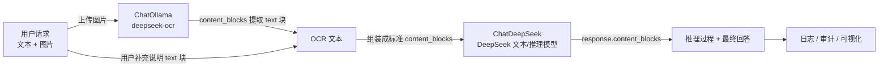

## 一、从 DeepSeek 文本推理，走向多模态世界

在第 12 篇里，我们用 DeepSeek 的推理模型 + LangChain v1 展示了一个完整的链路：

- 模型侧：DeepSeek 的「思维链 + 最终回答」被拆分成标准 `content_blocks`；
- 工程侧：我们基于块级结构做了推理过程可视化与安全的 JSON 提取；
- 架构侧：给后续的 middleware、安全审计、可观测性打下了基础。

但还有一个没展开的关键能力：**多模态**。

现实世界里，用户的问题越来越少是「纯文本」：

- 运营同学直接丢一张后台截图，让模型帮忙分析异常；
- 产品经理拍一张原型图，希望模型生成接口文档和验收用例；
- 数据分析师用图片方式分享图表截图，要求模型生成分析报告。

如果我们还停留在「字符串 in / 字符串 out」的视角，多模态就会变成一堆 provider 各自为战的 JSON 格式，工程体验极差。

LangChain v1 的标准 `content_blocks`，正好给了我们一个统一视角：

- 多模态输入：把「文字 + 图片」组合成一个列表；
- 多模态输出：无论底层是哪个 provider，最终都能用统一的 `content_blocks` 类型安全地解析。

这一篇我们聚焦三件事：

1. 用一个极简例子，把「多模态输入」的 `content_blocks` 结构讲清楚；
2. 用一个可运行 Demo，展示「图片 → deepseek-ocr(Ollama) → 文本 → DeepSeek 文本/推理模型」这一条组合链路；
3. 用一个贴近业务的场景（报表截图分析），演示如何把文本 + 图片整合进一条稳定的调用链路。

> 说明：现在推荐使用 DeepSeek 的新模型（如第 09 篇中通过 `ChatDeepSeek` 调用的模型），它们本质上都是“文本/推理模型”，而不是原生多模态。  
> 在本篇中，我们先用“标准 content_blocks 多模态接口”讲清抽象；  
> 然后落地到一个更实用的组合：**Ollama + deepseek-ocr 做图片 OCR，DeepSeek 文本模型负责推理**。  
> 好处是：既不依赖闭源多模态 API，又能在工程上保持标准 `content_blocks` 结构。

---

## 二、content_blocks 多模态输入：一条消息里同时带文字和图片

先统一一个概念：**在 LangChain v1 里，多模态输入的本质就是「消息内容是若干 content_blocks 的列表」**。

以一个典型的「文本 + 图片」问题为例：

> 用户：  
> - 文本：帮我看看这张图里的销售折线有没有明显异常；  
> - 图片：某运营后台的「近 30 天 GMV 折线图」截图。

### 2.1 理想世界：底层模型原生支持多模态

如果底层模型原生支持图片输入，最直接的方式当然是直接给它「文本 + 图片」：

```python
from langchain.chat_models import init_chat_model
from langchain_core.messages import HumanMessage

model = init_chat_model(
    "your-multimodal-model-id",  # 示例：任意支持多模态的模型
    output_version="v1",
)

def build_multimodal_message(image_base64: str) -> HumanMessage:
    return HumanMessage(
        content=[
            {
                "type": "text",
                "text": "请根据下面这张图，判断近 30 天销售是否有明显异常，并用中文给出结论和可能原因。",
            },
            {
                "type": "image",
                "base64": image_base64,
                "mime_type": "image/png",
            },
        ]
    )
```

LangChain 会负责把这份 content_blocks 转成 provider 原生格式，我们只维护这一份标准结构即可。

### 2.2 现实落地：DeepSeek 新模型 + Ollama + deepseek-ocr（先 OCR 再推理）

如果你和我一样，希望：

- 推理用 DeepSeek 的新模型（如第 09 篇用 `ChatDeepSeek` 调用的推理/聊天模型）；
- 图片识别用本地 Ollama + deepseek-ocr（方便控制成本与数据边界）；

那更务实的方案是：

> **在进 LLM 之前先把图片丢给 deepseek-ocr，拿到纯文本；  
> 再把「用户说明 + OCR 文本」一起组织成 content_blocks 交给 DeepSeek 文本模型。**

示意代码（与本篇配套的 `ch13/demo_multimodal_content_blocks.py` 一致）：

```python
import base64
import os
from pathlib import Path

from langchain_ollama import ChatOllama
from langchain_deepseek import ChatDeepSeek
from langchain_core.messages import HumanMessage

def load_image_as_base64(path: str | Path) -> str:
    p = Path(path)
    with p.open("rb") as f:
        return base64.b64encode(f.read()).decode("utf-8")

def ocr_image_with_ollama(path: str | Path) -> str:
    image_b64 = load_image_as_base64(path)

    base_url = os.getenv("OLLAMA_BASE_URL", "http://localhost:11434")
    ocr_model_id = os.getenv("OCR_MODEL", "deepseek-ocr")
    prompt = os.getenv(
        "OCR_PROMPT",
        "请逐行识别图片中的文字，保持原有行结构，只输出纯文本，不要额外解释。",
    )

    ocr_model = ChatOllama(
        model=ocr_model_id,
        base_url=base_url,
        temperature=0,
        output_version="v1",
    )

    msg = HumanMessage(
        content=[
            {"type": "text", "text": prompt},
            {
                "type": "image",
                "base64": image_b64,
                "mime_type": "image/png",
            },
        ]
    )

    resp = ocr_model.invoke([msg])
    # 简单起见，这里直接用 text 字段；也可以从 resp.content_blocks 里抽取 text 块
    return resp.text.strip()

llm = ChatDeepSeek(
    model=os.getenv("DEEPSEEK_MODEL", "deepseek-reasoner"),
    api_key=os.getenv("DEEPSEEK_API_KEY"),
    api_base=os.getenv("DEEPSEEK_BASE_URL", "https://api.deepseek.com"),
    temperature=0.2,
    output_version="v1",
)

def build_message_from_ocr(image_path: str | Path, user_note: str) -> HumanMessage:
    ocr_text = ocr_image_with_ollama(image_path)

    system_text = (
        "你是一名电商运营分析师，擅长解读 GMV 等业务指标的趋势。\n"
        "给你一张报表截图和用户补充说明，请用中文输出：\n"
        "1）整体趋势概述；2）明显异常点；3）可能原因；4）后续建议。"
    )

    return HumanMessage(
        content=[
            {"type": "text", "text": system_text},
            {"type": "text", "text": f"用户补充说明：{user_note}"},
            {
                "type": "text",
                "text": f"截图 OCR 识别结果：\n{ocr_text}",
            },
        ]
    )

def demo_ocr_pipeline():
    msg = build_message_from_ocr("examples/gmv_trend.png", "最近 7 天做了两次大促")
    resp = llm.invoke([msg])
    print("标准 content_blocks：", resp.content_blocks)
```

这里有几个设计点：

- **多模态在系统层面，而不是模型层面实现**：  
  用户仍然是「文本 + 图片」输入，但我们先用 deepseek-ocr 把图片变成文本；
- **进入 DeepSeek 文本模型的永远是干净的文本块**：  
  所有上下文都以 `{"type": "text", "text": ...}` 的形式组织，便于审计和脱敏；
- **content_blocks 抽象没有丢失**：  
日志和 middleware 仍然只需看一份标准 content_blocks，就能看到「用户说明 + OCR 结果」。

### 2.3 用一张图总结整个链路

用一张简单的流程图，把这一条「图片 → deepseek-ocr → 文本 → DeepSeek 模型」的链路串起来：



从实现角度看：

- 对 OCR，我们用 `ChatOllama(model="deepseek-ocr", output_version="v1")`，输入是 `{type: "text"} + {type: "image"}` 的 content_blocks；
- 对 DeepSeek，我们用 `ChatDeepSeek(..., output_version="v1")`，输入是多个 `{type: "text"}` 块，包含系统提示、用户说明和 OCR 结果；
- 整条链路始终围绕标准 `content_blocks` 打转，后续 middleware、安全审计、前端可视化都可以在这一个抽象层上工作。

---

## 三、多模态输出：统一解析文本 + 图片的标准结构

输入搞定之后，我们再看输出。

在多模态场景下，模型的响应可能是：

- 只有文本：`[{ "type": "text", "text": "……" }]`
- 文本 + 图片：  
  例如「先用文字描述，再返回一张生成的图」：

```python
response = model.invoke("画一张简单的增长曲线图，并简单解释含义。")
print(response.content_blocks)

# 可能的输出结构（示意）
# [
#   {"type": "text", "text": "这张图展示了一个稳定增长的趋势……"},
#   {"type": "image", "base64": "...", "mime_type": "image/jpeg"},
# ]
```

为了方便消费多模态输出，我们通常会写一个小的「块级路由器」：

```python
from typing import List, Dict, Any

def split_multimodal_output(blocks: List[Dict[str, Any]]):
    """把 content_blocks 拆成文本列表 + 图片列表，便于分别处理。"""
    texts = []
    images = []

    for block in blocks:
        if block.get("type") == "text":
            texts.append(block.get("text") or "")
        elif block.get("type") == "image":
            images.append(block)

    return texts, images

def demo_multimodal_output():
    response = model.invoke("画一张简单的增长曲线图，并简单解释含义。")
    texts, images = split_multimodal_output(response.content_blocks)

    print("文本部分：")
    print("\n".join(texts))

    print("\n图片数量：", len(images))
    for idx, img in enumerate(images):
        print(f"第 {idx+1} 张图片 mime_type={img.get('mime_type')}, "
              f"base64 前 50 字符={img.get('base64', '')[:50]}...")
```

注意几个实践经验：

- **统一走 content_blocks**：不要再从 `response.content` 里猜类型；
- UI 层可以根据 `type == "image"` 分发给不同的渲染组件；
- 日志系统可以把图片部分单独落到对象存储，把文本部分打到日志，这在审计和排查时非常好用。

---

## 四、实战场景：报表截图 + 文本补充，一条链路搞定

我们把前面的小段代码拼成一个更真实的场景——运营同学上传报表截图 + 辅助说明，让模型给出分析结论。

### 4.1 业务需求拆解

需求大致长这样：

1. 前端上传一张「近 30 天 GMV 折线图」；
2. 用户附加一段说明文本，例如「最近 7 天我们做了两次大促，帮忙分析一下整体趋势和异常点」；
3. 模型需要：
   - 看懂图里的整体走势；
   - 结合用户说明，判断是否存在异常峰值 / 断崖式下跌；
   - 输出一段结构清晰、可直接放进报告里的分析文本。

从第一性原理看，这其实就是：

- 输入：`text_block(说明) + image_block(图像)`；
- 输出：一个或多个 `text_block`，必要时再配套一张模型生成的标注图。

### 4.2 多模态 Prompt 设计

我们可以继续沿用上面「先 OCR 再推理」的思路，把 Prompt 封装成一个函数，统一生成 `HumanMessage`：

```python
from langchain_core.messages import HumanMessage

def build_report_analysis_message(
    image_path: str,
    user_note: str,
) -> HumanMessage:
    """构造报表截图分析的消息（图片先经过 deepseek-ocr 识别）。"""
    system_text = (
        "你是一名电商运营分析师，擅长解读 GMV 等业务指标的趋势。\n"
        "给你一张报表截图和用户补充说明，请用中文输出：\n"
        "1）整体趋势概述；2）明显异常点；3）可能原因；4）后续建议。"
    )

    ocr_text = ocr_image_with_ollama(image_path)

    return HumanMessage(
        content=[
            {"type": "text", "text": system_text},
            {"type": "text", "text": f"用户补充说明：{user_note}"},
            {"type": "text", "text": f"截图 OCR 识别结果：\n{ocr_text}"},
        ]
    )
```

核心思路是：**把所有「文字上下文」也装进 content_blocks，而不是混在 function 参数之外**。这样：

- LangChain 可以在 provider 适配层做更多优化（如后续对话续写）；
- 你在日志里只需要查看一份 content_blocks，就能看到完整上下文；
- 后面引入 middleware 时，可以在同一套结构上做 PII 脱敏与审计。

### 4.3 从输出中提取「适合写报告」的文本

为了便于下游消费，我们可以规定：  
「最终输出只保留 `type == "text"` 的块，按顺序拼起来」：

```python
def compose_text_from_blocks(blocks):
    return "\n".join(
        block["text"]
        for block in blocks
        if block.get("type") == "text" and block.get("text")
    )

def analyze_report(image_path: str, user_note: str) -> str:
    message = build_report_analysis_message(image_path, user_note)

    response = model.invoke([message])
    return compose_text_from_blocks(response.content_blocks)
```

这段代码看起来非常朴素，但在工程实践里有几个好处：

- 你可以在不改业务逻辑的情况下，给模型增加「思维链」「工具调用」等新 blocks，前提是保证最终有至少一个 `text` 块；
- 日志/中间件层可以对非文本块进行单独审计和过滤，而不会影响主流程；
- 对前端来说，`text` 块可以直接渲染到富文本编辑器，`image` 块则交给截图预览组件。

---

## 五、实践建议与踩坑提示

最后，总结几个做多模态时容易踩的坑，以及在 LangChain v1 + content_blocks 模式下的推荐做法。

### 5.1 尽量早用标准结构，而不是 provider 原生 JSON

- 不要在业务代码里出现大量「`if provider == 'xxx':` then parse JSON like this」；
- 尽量统一用 `HumanMessage(content=[...])` 和 `response.content_blocks`，把 provider 差异压到 LangChain 底层；
- 真的需要利用某个 provider 的“黑科技”时，也建议封装在一个边界清晰的模块里。

### 5.2 图片大小与数量控制

- 大图直接 base64 会非常占带宽，优先考虑压缩或使用 URL 形式；
- 如果一次请求中包含多张图片，可以在 `content_blocks` 中显式标注 `purpose` 字段（自定义），方便后续解析：

```python
{
    "type": "image",
    "base64": "...",
    "mime_type": "image/png",
    "purpose": "main_chart",  # 自定义字段
}
```

### 5.3 与后续 middleware / 安全审计的衔接

提前用标准结构组织多模态输入输出，会极大简化后续工作：

- middleware 里可以对 `image` 块做脱敏（如模糊化水印/用户名）；
- 安全审计可以根据 `type` 做差异化处理：文本走敏感词检测，图片走 OCR + 风险识别；
- 日志与可观测系统可以统一定义「text/image/reasoning/tool_call」等维度的统计指标。

---

## 六、小结：从「多模态 Demo」到「多模态基础设施」

这一篇我们做了三件事：

- 解释了在 LangChain v1 里，多模态输入输出本质上都是 `content_blocks` 的组合；
- 用一个「报表截图 + 文本补充」的例子展示了标准化结构的工程优势；
- 给出了几个工程实践建议，帮助你避免常见的多模态踩坑。

从架构视角看，更重要的是：

> 当你在系统一开始就采用标准 `content_blocks` 组织所有多模态数据时，  
> 后面引入 middleware、日志、审计、安全策略，都会变得简单而自然。

在下一篇（第 14 篇）里，我们会把视角从「模型多模态」扩展到「工具多模态」：  
如何让 MCP 工具返回的文本 + 图片，同样通过 `content_blocks` 统一解析，从而在前后端、模型与工具之间建立一条真正一致的多模态数据通路。
