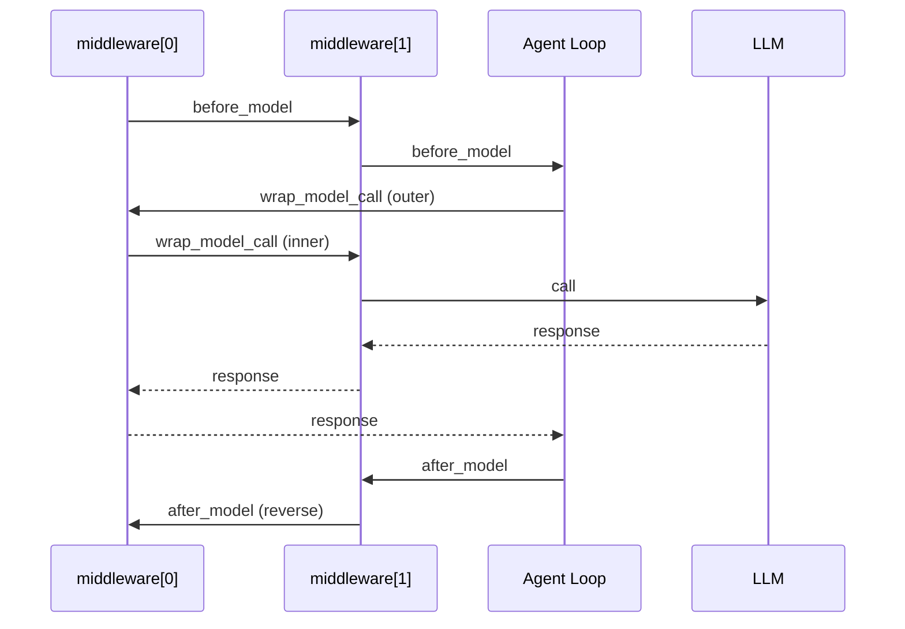

> 你写 Agent 的业务逻辑可能只要 30 行；但一旦要上线，真正麻烦的是：日志、鉴权、脱敏、工具权限、重试、审批、成本控制……这些“治理需求”往往散落在各处，最后变成一坨不可复用的 if/else。
>
> LangChain v1 把这层问题抽成了一个新的标准接口：**Agent Middleware**。这篇文章把它讲清楚：它解决什么问题、有哪些 hook、按什么顺序执行、怎么和 `create_agent(..., middleware=[...])` 组合，以及一个最小 LoggingMiddleware 如何落地。

---

## 一、第一性原理：为什么 Agent 需要“治理层”

把 Agent 当成一个受控的执行循环（loop）更容易理解：

1. **输入**：用户消息 + 系统提示词 + 工具列表  
2. **推理**：模型生成下一步（回复 / 工具调用）  
3. **行动**：执行工具（可能失败、可能高风险、可能越权）  
4. **状态演化**：把结果写回 state，继续下一轮，直到结束

你真正想要的是：**业务逻辑（做什么）** 和 **治理逻辑（怎么安全、可控、可观测地做）** 解耦。

在 LangChain v1 之前，很多人靠 Callback/Tracer/自拼 Prompt 来做治理，但会很快碰到三个硬问题：

- **Callback 只能“看见”，很难“改变”**：大部分回调适合观测，不适合改写请求、裁剪工具、短路执行、重试等控制流。
- **治理逻辑缺少统一入口**：脱敏写一份、权限再写一份、重试又写一份，最后每个 Agent 都长得不一样。
- **执行顺序不可控/不可组合**：多个回调叠一起后，谁先谁后、谁包谁、失败怎么处理，很难形成可复用“策略栈”。

所以 LangChain v1 的关键动作是：把治理能力从“旁路回调”提升为“一等公民”，放进 Agent 的主执行链路里——这就是 Middleware。

---

## 二、Middleware 是什么：不是 Web 中间件，是 Agent 中间件

为避免误解：这里的 Middleware 指的是 **LangChain v1 Agent Runtime 的中间件**，不是 Web 框架（如 Express/Koa/FastAPI）的中间件。

你可以把它理解为：在 Agent 的关键节点插入一组可组合的“Hook/Wrapper”，用于：

- **观测**：日志、指标、trace、成本统计
- **控制**：重试、限流、fallback、短路、跳转（jump）
- **治理**：脱敏、内容安全、工具权限、审批流
- **动态化**：动态 prompt、动态选模、动态选工具

Middleware 的核心特点是：它能读/写 Agent 的输入与运行态，而不是只做旁路通知。

---

## 三、有哪些 Hook：先记住两类就够了

LangChain v1 把 hook 分成两类（足够覆盖 90% 的治理需求）：

### 3.1 Node-style hooks：在“点”上执行（顺序调用）

- `before_agent`：一次调用开始前（每次 invocation 只跑一次）
- `before_model`：每次模型调用前
- `after_model`：每次模型返回后（工具调用执行前）
- `after_agent`：一次调用结束后（每次 invocation 只跑一次）

适合：校验、打点、裁剪 state、追加/移除 messages、输出安全检查等。

### 3.2 Wrap-style hooks：在“边”上包裹（可控 handler 调用）

- `wrap_model_call`：包裹每次模型调用（重试、fallback、动态选模、改写 system message 等）
- `wrap_tool_call`：包裹每次工具调用（重试、鉴权、审计、速率限制、沙箱策略等）

适合：你需要控制 handler 是否调用、调用几次、失败怎么兜底的场景。

---

## 四、执行顺序：Middleware 组合时“谁先谁后”

当你传入多个 middleware 时，执行顺序非常关键（这也是它比 Callback 更适合做治理的原因之一）。

官方规则可以概括为三句话：

1. **`before_*` 按列表顺序执行**（从前到后）  
2. **`wrap_*` 以“套娃”方式嵌套**（列表越靠前，包得越外层）  
3. **`after_*` 按列表逆序执行**（从后到前）

用一个示意图更直观：



这意味着：你可以把 middleware 当成一组“可叠加策略”，按你期望的治理优先级排序即可。

---

## 五、最小 LoggingMiddleware：10 行看懂怎么接入 create_agent

下面给一个“够用但不臃肿”的最小 LoggingMiddleware：记录每次模型调用前后的消息量与耗时。

```python
from __future__ import annotations

import time
from typing import Any, Callable

from langchain.agents import AgentState
from langchain.agents.middleware import before_model, after_model, wrap_model_call, ModelRequest, ModelResponse
from langgraph.runtime import Runtime

@before_model
def log_before(state: AgentState, runtime: Runtime) -> dict[str, Any] | None:
    # before_model：每次“调用模型之前”都会执行
    # 典型用途：日志打点、输入校验、裁剪/清洗 messages、注入动态上下文（但敏感信息别进 messages）
    print(f"[before_model] messages={len(state['messages'])}")
    return None

@wrap_model_call
def timing(request: ModelRequest, handler: Callable[[ModelRequest], ModelResponse]) -> ModelResponse:
    # wrap_model_call：包裹一次模型调用（可控 handler 是否调用、调用几次）
    # 典型用途：重试、fallback、超时、动态选模、改写 system_message / tools / response_format 等
    start = time.perf_counter()
    try:
        # handler(request) 才会真正触发模型调用
        return handler(request)
    finally:
        cost_ms = (time.perf_counter() - start) * 1000
        print(f"[wrap_model_call] model_call_cost_ms={cost_ms:.1f}")

@after_model
def log_after(state: AgentState, runtime: Runtime) -> dict[str, Any] | None:
    # after_model：模型“返回之后”执行（在工具调用真正执行之前）
    # 典型用途：输出审查（安全/合规）、提取结构化 content_blocks、记录模型输出元信息
    last = state["messages"][-1]
    print(f"[after_model] last_type={getattr(last, 'type', type(last))}")
    return None
```

接入方式就是把函数（或 middleware 实例）放进 `create_agent(..., middleware=[...])`：

```python
from langchain.agents import create_agent

agent = create_agent(
    model=model,
    tools=[...],
    system_prompt="你是一个严谨的助手，需要在必要时调用工具。",
    middleware=[log_before, timing, log_after],
)
```

到这里，你已经掌握了 v1 middleware 的基本使用方式：

- 能在模型调用前后拿到 **state/runtime**
- 能在模型调用链路上包裹 **handler**
- 能通过列表顺序控制组合与优先级

---

## 六、Callback 还要不要用：一个简单的取舍建议

不是“Callback 过时了”，而是边界更清晰了：

- **Callback 更适合做观测与集成**：比如把事件发到 LangSmith、日志系统、APM。
- **Middleware 更适合做治理与控制流**：比如脱敏、权限、审批、重试、动态选模/选工具。

如果你发现自己在 Callback 里开始“改 prompt、删消息、拦工具、做重试”，那基本就是在用错误的抽象层；把它上移到 Middleware，通常会更稳定、更可复用。

---

## 七、最佳实践：把 Middleware 当成“策略栈”，别当业务代码

1. **只做治理，不做业务**：业务逻辑放 Tool / 下游服务；Middleware 做策略与约束。
2. **不把敏感信息塞进 messages/prompt**：凭证/密钥这类东西应该走 runtime context（下一篇第 17 篇会做完整实战）。
3. **控制粒度**：日志/审查等策略优先做成小 middleware 组合，不要写“万能中间件”。
4. **顺序显式化**：把“外层策略”放前面（例如全局超时、全局审计），把“内层策略”放后面（例如局部改写 prompt）。

---

## 八、下一步：这一套怎么串成“组合拳”

从第 16 篇开始，你可以把后续几篇当成一个完整的治理闭环：

- 第 17 篇：**密钥治理**（凭证走 context，避免 prompt 泄露）
- 第 21 篇：**动态选模**（不同环节用不同模型，成本/效果平衡）
- 第 22 篇：**动态选工具**（按权限裁剪工具集，最小权限）
- 第 20 篇：**全链路可观测**（把模型×工具一次运行串成 trace）

如果你只记住一句话：**LangChain v1 把“治理”变成了可组合的 Middleware 层，让 Agent 从 Demo 走向工程化。**
