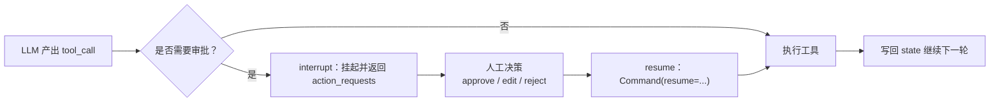

> 最危险的不是模型“胡说八道”，而是它“说到做到”。  
> 一旦你的工具具备副作用，Agent 做出的一个 tool_call，可能就把事故写进生产：群发邮件、批量退款、删库改表……
>
> LangChain v1 给的上线级刹车是：`HumanInTheLoopMiddleware`。它把“执行工具”改成“先审批”：同意就执行、允许就编辑后执行、拒绝就让模型重写方案。

HITL 能不能上线，我只问你 3 个问题（答不出来先别放高危工具进生产）：

- **哪些工具必须“先停一下”？** 用 `HumanInTheLoopMiddleware(interrupt_on=...)` 把高风险 tool_call 全部拦住  
- **停下以后怎么“续命”？** 必须配 checkpointer + `thread_id`，否则无法安全暂停与恢复  
- **出了事怎么“追责复盘”？** 审批人/原因/改了什么/对应哪次工具调用，必须可回放

---

## 一、工具不是能力，是权限：副作用要默认拒绝

本质上，“工具调用”才是事故的真正起点。

把 Agent 拆成最小闭环：

1. 模型：生成下一步（回答 or 工具调用）
2. 工具：对真实世界产生副作用（发邮件、写库、删文件、下单、转账……）

**事故几乎都发生在第 2 步**：副作用一旦执行，靠 prompt 纠错基本来不及。

所以治理要卡在“工具要执行”的那一刻——HITL 的本质就是：

> 让“副作用”默认不可达，除非有人明确批准。

---

## 二、HITL 的工作方式：中断（interrupt）+ 恢复（resume）

LangChain v1 的 `HumanInTheLoopMiddleware` 会在 Agent 试图执行某个工具调用之前，按策略检查：

- 命中 `interrupt_on`：触发 **interrupt**，Agent 暂停，等待外部输入（人工决策）
- 未命中：直接执行工具

触发 interrupt 后，执行态会被 checkpointer 保存；当你给出决策，再用 `Command(resume=...)` **恢复**，Agent 从暂停点继续跑。

用一张图理解最关键的控制流：



---

## 三、最小配置：哪些工具必须审批（interrupt_on）

你不需要一上来就做复杂“风险引擎”，先按工具粒度分三类就够用：

- **只读工具**：默认放行（`False`）
- **高风险副作用**：必须审批（`True`）
- **可编辑的副作用**：允许审批时修改参数（`allowed_decisions=["approve","edit","reject"]`）

最小代码片段（重点看注释）：

```python
from langchain.agents import create_agent
from langchain.agents.middleware import HumanInTheLoopMiddleware
from langgraph.checkpoint.memory import InMemorySaver

# tools：自行替换成你的工具
# - search_tool：只读
# - send_email_tool / delete_database_tool：高风险副作用
agent = create_agent(
    model="gpt-4o",
    tools=[search_tool, send_email_tool, delete_database_tool],
    middleware=[
        HumanInTheLoopMiddleware(
            interrupt_on={
                # True：允许全部决策（approve/edit/reject）
                "send_email": True,

                # 也可以只允许 approve/reject，不允许 edit（看你们风控要求）
                "delete_database": {"allowed_decisions": ["approve", "reject"]},

                # False：明确声明为“无需审批”
                "search": False,
            },
            # description_prefix：用于拼接审批提示（会包含工具名与参数）
            description_prefix="Tool execution pending approval",
        ),
    ],
    # 关键：HITL 必须有 checkpointer，才能在 interrupt 后安全恢复
    checkpointer=InMemorySaver(),
)
```

这里你已经把“可执行”变成“可暂停”：只要命中策略，Agent 就不会直接把副作用做掉。

---

## 四、怎么拿到“待审批请求”：识别 __interrupt__

当 Agent 运行到需要审批的工具调用时，你会拿到一个包含 `__interrupt__` 的更新。

你不需要记住它的完整结构，只要抓住两个字段：

- **interrupt id**：用于恢复时精确指定“你在批准哪一个中断点”
- **action_requests**：里面是待审批的工具调用（包含工具名、参数、描述等）

示意代码（仅展示你要取的字段，行内注释解释含义）：

```python
interrupts = []

for step in agent.stream(
    {"messages": [{"role": "user", "content": "给团队发封邮件，并把生产库里那张表删掉"}]},
    config={"configurable": {"thread_id": "t_001"}},  # thread_id：恢复的“游标”
):
    if "__interrupt__" in step:
        interrupt_ = step["__interrupt__"][0]
        interrupts.append(interrupt_)

        # interrupt_.id：稍后 resume 要用
        # interrupt_.value["action_requests"]：待审批的工具调用列表
        for req in interrupt_.value["action_requests"]:
            print(req["description"])  # 给到审批 UI/工单/IM 的文案
```

---

## 五、三种决策：approve / edit / reject（以及如何恢复执行）

HITL 的“好用”来自它的决策模型非常工程化：你不是“给模型一句话”，而是给一个结构化 decision。

### 5.1 approve：按原样执行

```python
from langgraph.types import Command

# 决策最小形态：只需要 type
# decisions：给当前 interrupt 的决策列表（最常见就是 1 条）
agent.invoke(
    Command(resume={"decisions": [{"type": "approve"}]}),
    config={"configurable": {"thread_id": "t_001"}},  # 必须复用同一个 thread_id
)
```

### 5.2 edit：先改参数，再执行（最适合“发邮件/SQL/工单”）

你通常会把“模型生成的参数”展示给审批人：允许改 subject、改收件人、改 SQL 的 where 条件等。

```python
from langgraph.types import Command

# action_request：来自 interrupt_.value["action_requests"][0]（某一次待审批的工具调用）
# edited_action：把它拷贝出来再改参数；执行时会用“改后的版本”替换原动作
edited_action = action_request.copy()
edited_action["arguments"] = {**edited_action["arguments"], "subject": "【需确认】本周发布节奏同步"}

agent.invoke(
    Command(
        resume={
            "decisions": [{"type": "edit", "edited_action": edited_action}],
        }
    ),
    config={"configurable": {"thread_id": "t_001"}},
)
```

### 5.3 reject：拒绝执行，并把反馈喂回给模型重写计划

```python
from langgraph.types import Command

# reject：不执行工具，把拒绝原因喂回 Agent，让它重写下一步（比如改成只读/走工单）
agent.invoke(
    Command(
        resume={
            "decisions": [
                {"type": "reject", "feedback": "禁止删除生产表；请改为生成只读查询并提交变更单。"}
            ]
        }
    ),
    config={"configurable": {"thread_id": "t_001"}},
)
```

### 5.4 多个 interrupt 一次性恢复：按 interrupt id 精准决策

一次 invocation 里可能出现多个待审批点（比如“发邮件 + 写库”）。

这时你要按 **interrupt id** 给决策（避免“批准错对象”）：

```python
from langgraph.types import Command

# interrupt_id_*：来自 interrupt_.id（每个 interrupt 都有自己的 id）
resume = {
    interrupt_id_1: {"decisions": [{"type": "approve"}]},
    interrupt_id_2: {"decisions": [{"type": "reject", "feedback": "这步太危险，先走审批流程。"}]},
}

agent.invoke(
    Command(resume=resume),
    config={"configurable": {"thread_id": "t_001"}},
)
```

---

## 六、上线模板：你需要补齐的 6 个“工程字段”

HITL 不是“加一个中间件就完事”，你还需要让它变成可运营、可追责的审批流。

建议每次 interrupt 至少落以下字段（写进你们的审计表/日志/工单系统）：

1. `thread_id`：这次会话/任务的恢复游标
2. `interrupt_id`：这次中断点的唯一标识
3. `tool_name` + `arguments`：待执行动作（注意脱敏）
4. `requester`：谁触发的（user_id/tenant_id/role）
5. `decision`：approve/edit/reject + reason + edited diff
6. `timestamp` + `latency`：从中断到批准的耗时（用于 SLA）

把这 6 个字段打通，你的 HITL 才算“可落地”而不是“能跑 demo”。

---

## 七、和第 17 篇怎么配合：密钥走 context，审批看不见密钥

如果你已经按第 17 篇把 `api_key/token/cookie` 放进 `runtime.context`：

- 工具执行时能拿到密钥（对模型不可见）
- 审批页展示的 action_requests **也不应该包含密钥**

建议规则：

1. **审批只展示业务参数**（收件人、主题、SQL 文本、金额、目标资源……）
2. **审批展示身份与权限**（user_id/tenant_id/role），不展示凭证
3. **审计存“脱敏版参数” + hash 指纹**，需要追查时再关联原始请求

---

## 八、踩坑清单：HITL 不稳，通常是这 4 个原因

1. **没配 checkpointer**：interrupt 了，但无法恢复或恢复后状态丢失  
2. **thread_id 乱了**：恢复时换了 thread_id，相当于开了新线程，当然续不上  
3. **工具不幂等**：批准后重试导致重复执行（转账/发邮件/写库最常见）  
4. **审批粒度太粗**：一个工具做太多事（先拆工具，再做策略）

---

## 九、下一步：从“审批流”走向“全治理闭环”

到这里你已经有了一个可上线的“止损阀”。后面两件事，建议和 HITL 一起做成组合拳：

- **动态选模（第 21 篇）**：高风险阶段切强模型，低风险阶段走便宜模型  
- **全链路可观测（第 20 篇）**：把“模型调用 + 工具调用 + 审批决策”串成一次完整 trace

一句话总结：**LangChain v1 的 HumanInTheLoopMiddleware，让 Agent 的副作用从“自动执行”变成“可控执行”。**
