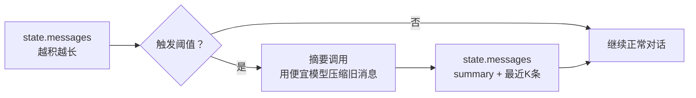

> 你以为长对话是“体验升级”，上线后才发现它也是“账单放大器”。  
> 同一段历史每轮都重复发给模型：token 线性累积、延迟线性累积；一开 trace / 回放，还会把上下文体积一起放大。
>
> LangChain v1 的解法不是“手动截断”，而是把历史压成可持续携带的低成本记忆：`SummarizationMiddleware` 在触发阈值时自动总结旧消息，并把 summary 写回 state，让后续每一轮都“记得住，但背不重”。

先记住一个等式：**长对话成本 ≈ 每轮 tokens × 轮数**。想降成本，你只需要做两件事：

- **把旧历史压成 summary（写回 state）**：不是 trim，而是把旧消息永久替换为摘要，让后续 turn 不再背全量历史  
- **让“摘要”走小模型**：对话用强模型，摘要用便宜模型（最常见、也最立竿见影的省钱点）

加分项（想稳一点再加）：`摘要 + 最近若干轮 + 本轮RAG检索结果（仅本轮注入）`

---

## 一、先算一笔账：上下文就是预算

拆开看，长对话的本质矛盾是“记忆”vs“窗口”。

把问题拆成两件事：

- 你要“记住什么”：事实、决策、用户偏好、已确认的约束  
- 你能“带多少”：模型上下文窗口是硬约束，带得越多越贵、越慢、越不稳定

所以长对话治理的目标不是“让模型记住一切”，而是：

> 把**可复用的信息**变成**低成本的记忆载体**，把**不可复用的噪声**从上下文里清出去。

这也是为什么简单的“截断 N 条消息”经常翻车：它清掉了噪声，也顺手清掉了关键事实。

---

## 二、SummarizationMiddleware 在做什么：不是删，是“压缩 + 写回”

LangChain v1 的官方定义非常直接：

- 当对话超过阈值时，`SummarizationMiddleware` 会额外发起一次 LLM 调用  
- 用这次调用把“较早的 messages”总结成一段摘要  
- 再把旧 messages 替换为一条 summary（写回 state），并保留最近的若干条 messages

你可以把它理解为“把历史对话从一串日志，变成一张长期维护的摘要卡片”：



---

## 三、最小用法：一行中间件把“长对话治理”接入 Agent

下面是最小接入形态：主对话模型用强的，摘要模型用便宜的；触发阈值用 token 数；保留最近 K 条消息。

```python
from langchain.agents import create_agent
from langchain.agents.middleware import SummarizationMiddleware

# 主对话模型（负责“推理与决策”）
agent = create_agent(
    model="gpt-4o",
    tools=[...],
    middleware=[
        SummarizationMiddleware(
            # 摘要模型（负责“压缩历史”）：通常用更便宜、更快的模型
            model="gpt-4o-mini",
            # 触发条件：当对话历史达到阈值时自动触发摘要
            trigger={"tokens": 4000},
            # 保留策略：保留最近 20 条消息不压缩（避免丢失短期上下文）
            keep={"messages": 20},
        )
    ],
)
```

几个关键点（很多人会忽略）：

- `SummarizationMiddleware` 是**治理层**：你不用改 Agent 业务逻辑，也不用手写“什么时候该总结”  
- 它的摘要是**写回 state 的**：这意味着它会影响后续所有 turn（优点是可持续，代价是要为“摘要质量”负责）  
- 摘要调用本身也要钱：所以你必须做阈值与模型的成本权衡（下面会给可复用的参数建议）

---

## 四、最稳的上下文策略：摘要 + 最近对话 + 本轮 RAG

很多团队只做摘要，然后发现效果还是飘：因为“长期记忆”有了，但“当前任务的外部事实”没有。

一个更稳的组合拳是三层上下文：

1. **摘要（长期）**：沉淀事实、偏好、已确认的约束  
2. **最近对话（短期）**：保留最近 K 条的细节与语气  
3. **RAG 结果（本轮）**：只在本次模型调用前注入，不写回 state（避免把临时证据污染成永久记忆）

RAG 这层一般用 `wrap_model_call` 做“只改本轮 prompt，不改 state”的注入（示意片段，重点看思路与 API 形态）：

```python
from typing import Callable

from langchain.agents.middleware import ModelRequest, ModelResponse, wrap_model_call
from langchain.messages import SystemMessage

@wrap_model_call
def inject_rag_evidence(
    request: ModelRequest,
    handler: Callable[[ModelRequest], ModelResponse],
) -> ModelResponse:
    # 1) 从 state 里拿到“本轮用户问题”（示例：假设最后一条是用户输入）
    user_query = request.state["messages"][-1].content

    # 2) 做检索（这里用伪代码；你可以换成自己的 retriever）
    docs = my_retriever.search(user_query)

    # 3) 把检索结果拼成证据块，并“仅本轮”注入到 system_message（不写回 state）
    evidence = "\n\n".join(d.page_content for d in docs[:5])
    new_blocks = list(request.system_message.content_blocks) + [
        {
            "type": "text",
            "text": (
                "以下是本轮检索证据，仅供参考，不要凭空补充未出现的事实：\n" + evidence
            ),
        }
    ]
    new_system_message = SystemMessage(content=new_blocks)

    # 4) 继续交给下游 handler（模型调用）
    return handler(request.override(system_message=new_system_message))
```

这套组合和你在第 17 篇做的“密钥 0 入 prompt”天然互补：

- 密钥在 `runtime.context`，不会进 messages，就不会被摘要“永久写回”  
- messages 里只留业务事实与可见内容，摘要更干净、更可控

---

## 五、阈值怎么设才不翻车：触发点、保留量、成本三角

你可以把参数决策看成一个三角：

- **触发更频繁**：更省上下文、更稳，但摘要成本更高  
- **保留更多消息**：对当前任务更友好，但上下文压力更大  
- **摘要模型更强**：摘要更准，但成本更高

一套“先上线再优化”的建议参数：

- `keep.messages = 10 ~ 30`：多数 ToB 场景够用  
- `trigger.tokens`：先用一个保守阈值（如 60%～75% 的可用窗口），避免到临界点才总结导致抖动  
- `model`：摘要用小模型；只有在“摘要漂移”导致明显问题时再升级

如果你更喜欢“多条件触发”（例如：token 或消息数任意一个超了就摘要），可以把 `trigger` 设成多个条件（示意）：

```python
from langchain.agents.middleware import SummarizationMiddleware

middleware = SummarizationMiddleware(
    model="gpt-4o-mini",  # 摘要用小模型省钱
    trigger=[
        # tokens 超阈值就触发（适合控制成本/延迟）
        ("tokens", 4000),
        # 消息条数超阈值也触发（适合控制“对话轮次很长但单条很短”的情况）
        ("messages", 80),
    ],
    keep=("messages", 20),  # 保留最近 20 条不压缩
)
```

---

## 六、上线清单：摘要做错了，比不做更危险

`SummarizationMiddleware` 不是“锦上添花”，它会改写 state，所以你必须把风险点提前关掉：

1. **摘要漂移（drift）**：多次摘要叠加后，事实会被“越总结越像编的”  
   - 你的摘要提示词要强调：只总结已出现事实，不做推断；不确定就标注“不确定”  
2. **把一次性证据写成永久记忆**：RAG/工具结果不该全部进入 summary  
   - RAG 只做本轮注入；工具结果只保留结论与关键字段，别把整段日志塞进去  
3. **把隐私写进长期记忆**：摘要会被后续每轮携带  
   - 先做输入脱敏/密钥隔离（第 17 篇），再做摘要；必要时在摘要前加一层 PII 清洗 middleware  
4. **断点恢复一致性**：长会话通常配合 checkpointer；摘要也是 state 变更  
   - 确保同一个 `thread_id` 下可回放；摘要触发条件尽量确定（避免重放时“摘要时机不同”）

---

## 七、你真正想要的“记忆”，不该只靠摘要

一句话总结这篇的定位：

> `SummarizationMiddleware` 负责把“历史对话”压缩成可持续携带的低成本记忆；真正可复用的长期知识与规则，应该走 RAG / 配置 / runtime context，而不是塞进对话日志。

下一篇（如果你要把“省钱”做到极致）：把 **摘要模型 / 对话模型 / 工具调用模型** 进一步拆开，按环节动态选模（这正是 LangChain v1 的强项）。
