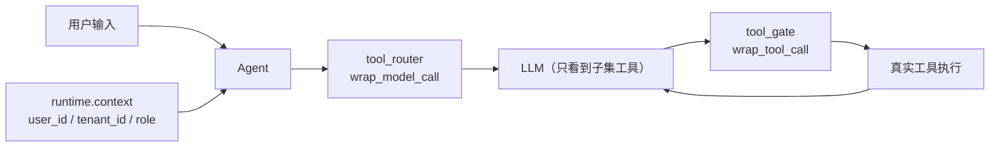

> 真实线上事故里，Agent 最常犯的错不是“答错”，而是“用错工具”：  
> 你给了它 12 个工具，它往往能选中那个**最不该选的**。
>
> 所以治理的第一性原理是：**工具不是能力扩展，是权限授予**。  
> 既然是权限，就不该“全量暴露”，更不该“一次授权终身有效”。

---

## 一、第一性原理：把“工具箱”当成“权限系统”做

在 LangChain v1 Agent 里，模型之所以能调用工具，是因为你把工具列表交给了模型（Tool Calls）。  
这件事的工程等价物是：

- 你把哪些工具暴露给模型 = 你允许它做哪些动作
- 你暴露的工具越多 = 模型的决策空间越大，误用概率越高（而且 prompt 更长、更贵）

因此“动态选工具”本质是两件事：

1. **让模型每次只看见它“当下应该拥有”的工具**（最小权限 / 分级解锁）
2. **就算模型生成了越权 tool call，也必须在执行层拦住**（防御纵深）

---

## 二、一个非常现实的 ChatBI 场景：同一个 Agent，不同人不同工具

你做 ChatBI（查库 + 分析 + 出结论），工具通常长这样：

- 读：`read_sql` / `describe_schema`
- 写：`write_back` / `update_metric`（可能写回看板、写回指标表）
- 高危：`execute_sql`（任意 SQL）、`delete_table`（DDL/DML 破坏性）

但你的用户权限一定是分层的：

- `viewer`：只允许读（甚至只能读某几个 schema）
- `editor`：允许“受控写”（只允许写到指定表，或只能调用白名单动作）
- `admin`：允许高危动作，但必须走审批（第 18 篇的 HITL）

结论：**工具集必须跟着 runtime context（用户/租户/角色）走**，不能静态写死在 Agent 上。

---

## 三、LangChain v1 的落地手法：用 `wrap_model_call` 动态裁剪工具

LangChain v1 的 middleware 允许你在“每一次模型调用之前”拿到：

- `request.tools`：本来要暴露给模型的工具列表
- `request.runtime.context`：本次 invocation 的上下文（用户/租户/权限/密钥…）
- `request.state`：对话状态（例如是否已登录、是否已完成身份确认等）

你要做的就是：**基于 context/state 选出一小撮允许的工具，然后 `request.override(tools=...)`**。

### 3.1 定义上下文：把“权限信号”放进 `runtime.context`

```python
from __future__ import annotations

from dataclasses import dataclass

@dataclass(frozen=True)
class Context:
    # 审计/归因字段
    user_id: str
    tenant_id: str

    # 权限字段（示例：viewer/editor/admin）
    user_role: str

    # 功能开关/灰度字段（可选）
    feature_flags: frozenset[str] = frozenset()
```

### 3.2 工具路由中间件：每次模型调用前裁剪“可见工具集”

```python
from __future__ import annotations

from typing import Callable, Iterable

from langchain.agents.middleware import ModelRequest, ModelResponse, wrap_model_call

def _allowed_tool_names(role: str, *, feature_flags: frozenset[str]) -> set[str]:
    # 这里用“工具命名约定”演示（read_*/write_*/danger_*）
    # 生产中建议用更明确的权限表：role -> allowed_tool_names
    if role == "admin":
        # admin 可以看到全部工具（但执行层仍建议配 HITL / 二次闸）
        return {"*"}
    if role == "editor":
        # editor 默认：读 + 受控写（不暴露高危）
        allowed = {"read_*", "write_*"}
        if "enable_export" in feature_flags:
            allowed.add("export_*")
        return allowed
    # viewer：只读
    return {"read_*"}

def _match(name: str, patterns: set[str]) -> bool:
    # 极简通配：支持 "*" 与 "prefix_*"
    if "*" in patterns:
        return True
    for p in patterns:
        if p.endswith("_*") and name.startswith(p[:-1]):
            return True
        if name == p:
            return True
    return False

@wrap_model_call
def tool_router(
    request: ModelRequest,
    handler: Callable[[ModelRequest], ModelResponse],
) -> ModelResponse:
    # 从 runtime.context 读取权限信号（密钥等敏感字段也应该在这里，但不参与工具裁剪）
    ctx = request.runtime.context
    allowed_patterns = _allowed_tool_names(
        ctx.user_role,
        feature_flags=getattr(ctx, "feature_flags", frozenset()),
    )

    # 从全量注册工具里筛出“本跳允许暴露给模型”的子集
    visible_tools = [t for t in request.tools if _match(t.name, allowed_patterns)]

    # 把裁剪后的工具集交给下一层（最终会进入本次 LLM 调用）
    return handler(request.override(tools=visible_tools))
```

> 关键点：**Agent 可以注册全量工具**，但模型每次只“看见”允许的那部分。  
> 这既是权限控制，也是让 Tool Calls 更准、更省 token 的最直接方法。

---

## 四、防御纵深：用 `wrap_tool_call` 做“执行层二次闸”

动态裁剪能显著降低误用，但线上你还需要一个兜底：

- 模型可能因为幻觉/攻击/越权提示，仍然生成一个不该执行的 tool call
- 一旦进入执行层，**必须再校验一遍权限**（宁可失败，也不要误执行）

LangChain v1 支持用 `wrap_tool_call` 包住每一次工具执行；你可以在这里做：

- 白名单校验（是否允许执行该工具）
- 审计字段补齐（谁、在什么租户、调用了什么工具、参数摘要）
- 高危工具强制走 HITL（第 18 篇）

下面是一个“拒绝越权执行”的最小骨架：

```python
from __future__ import annotations

from typing import Callable

from langchain.agents.middleware import wrap_tool_call
from langchain.messages import ToolMessage
from langchain.tools.tool_node import ToolCallRequest
from langgraph.types import Command

@wrap_tool_call
def tool_gate(
    request: ToolCallRequest,
    handler: Callable[[ToolCallRequest], ToolMessage | Command],
) -> ToolMessage | Command:
    # ToolCallRequest 里能拿到：tool_call（name/args/id）、state、runtime（含 context）
    tool_name: str = request.tool_call["name"]
    ctx = request.runtime.context

    allowed_patterns = _allowed_tool_names(
        ctx.user_role,
        feature_flags=getattr(ctx, "feature_flags", frozenset()),
    )

    # 执行层二次闸：不满足就直接拒绝，避免误调用落地
    if not _match(tool_name, allowed_patterns):
        tool_call_id = request.tool_call.get("id")  # 用于把拒绝结果正确回填给模型
        return ToolMessage(
            content=f"拒绝执行：当前角色无权限调用工具 {tool_name}",
            tool_call_id=tool_call_id,
        )

    return handler(request)
```

---

## 五、一张图把链路钉死：模型“只看见该看见的”，执行“只执行该执行的”



---

## 六、落地清单：动态选工具要一起检查的 6 件事

1. **全量工具注册，但默认不全量暴露**：暴露是按跳（每次模型调用）动态裁剪。  
2. **裁剪依据必须来自 runtime.context / state**：不要从 prompt 里“猜权限”。  
3. **执行层必须二次闸**：`wrap_tool_call` 校验权限，拒绝越权 tool call。  
4. **高危工具默认 HITL**：把“能执行”改成“先停一下再执行”（第 18 篇）。  
5. **工具命名/权限映射要可维护**：别把规则散落在多个文件/多个 if 分支里。  
6. **审计可回放**：至少能回答“谁在何时用什么权限调用了哪个工具，参数是什么”。
