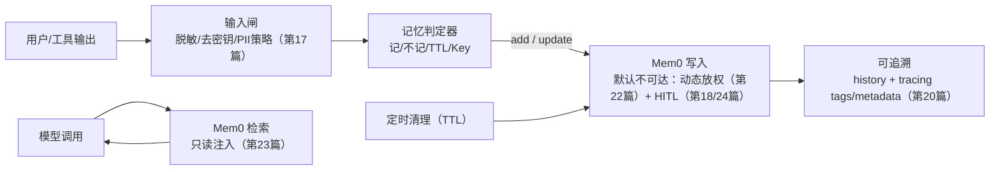

> 第 23/24 篇我们把 Mem0 接进 LangChain v1：  
> 要么用 middleware 做“自动记忆”，要么把记忆封装成 MCP 工具做“显式记忆”。  
>
> 但真正上线之后，你会遇到更棘手的问题：  
> **记错了怎么改？记旧了怎么过期？用户要“忘记我”怎么办？**
>
> 这一篇不再讲“怎么接 SDK”，只讲一件事：**把长期记忆变成可治理的数据资产**。

---

## 一、第一性原理：记忆不是“越多越好”，而是“可纠错、可过期、可删除、可追溯”

长期记忆一旦上线，它的本质就变了：

- **写入是持久化副作用**：错一次，会一直错；还会被不断检索出来放大影响  
- **记忆是数据，不是指令**：它只能作为证据，不能改变系统规则与权限（第 17/18/22/24 篇的底线）  
- **没有治理的记忆 = 线上负债**：合规风险、用户信任崩塌、以及“越用越差”的体验

所以我们先把目标钉死：长期记忆要满足四个“可”：

1. **可纠错**：用户能明确指出哪里错，并把错的改掉/删掉  
2. **可过期**：临时信息能按策略自动失效（TTL）  
3. **可删除**：支持“忘记我”（delete_all），并且删除范围可控  
4. **可追溯**：每次新增/更新/删除都有审计轨迹（history + tracing，第 20 篇）

本文示例默认仍以 **Mem0 Platform（SaaS）** 的 `MemoryClient + MEM0_API_KEY` 为主；如果你用 Mem0 OSS + 自建向量库（如 Qdrant/PGVector），治理思路不变，接口替换为 `Memory.from_config(...)` 即可。

---

## 二、先定“记什么/不记什么”：三问不过关就别落盘

最容易把记忆做崩的，不是检索，而是**写入决策**。

我建议用三个问题做硬门槛（任何一个答不上来，就不要写入长期记忆）：

1. **下周还成立吗？**（是否稳定、可复用）  
2. **泄露会出大事吗？**（是否敏感/合规高风险）  
3. **用户能一键撤回吗？**（能否明确定位并删除）

### 2.1 建议记的（长期资产）

- 稳定偏好：写作风格、语言习惯、默认输出格式  
- 约束与红线：过敏/禁忌/“不要做某类事”  
- 业务画像：角色、部门、常用系统（前提：对业务有用且经过用户明确确认）

### 2.2 不建议记的（高风险或高噪音）

- 密钥/Token/Cookie/内部 URL 等敏感信息（第 17 篇：密钥 0 入 Prompt，同样适用于记忆）  
- 一次性工具输出：SQL、日志、JSON 大块返回、临时报表数字（很快过期，还容易误记为“事实”）  
- 难以删除/难以定位的碎片化闲聊（未来只能越堆越乱）

如果业务确实需要保存敏感信息：不要让它走“记忆系统”，而是进你们自己的加密/权限存储；Mem0 只存一个“引用/指针”或“是否开启某能力”的开关。

---

## 三、治理架构：把“写入/更新/删除”当成受控能力，而不是模型自由发挥



这一套的核心约束只有两条：

- **默认只读**：模型默认只能“用记忆”，不能“改记忆”  
- **写入类操作可被审计/可被拦截**：否则“忘记我”“改错记忆”根本落不了地

---

## 四、作用域与 metadata：记忆治理的“定位系统”

你想治理，就必须先能“定位”。我建议把定位拆成两层：

1. **强作用域（scope）**：谁的记忆？属于哪个产品面？属于哪个短期流程？  
2. **弱标记（metadata）**：这条记忆是什么类型？用来做什么？怎么更新？

### 4.1 强作用域：先把租户隔离钉死

沿用第 23/24 篇的原则：**user_id 永远来自服务端身份态**，并做租户前缀：

- `user_id = f"{tenant_id}:{user_id}"`

然后再按场景补充：

- `app_id`：产品面/白标应用/渠道隔离  
- `run_id`：短期工单、一次会话、一次流程（天然适合 TTL）

注意一个常见坑：在 Mem0 的 entity-scoped memory 里，`user_id` 和 `agent_id` 属于“不同主实体范围”，不要指望用一个 `AND` 同时命中两者。更稳的做法是：**一次检索只查一个 scope**，需要多层记忆就做多次检索，再按优先级合并。

### 4.2 弱标记：用 `metadata.key` 解决“更新 vs 新增”

只靠语义检索，你很难稳定地找到“我要更新的那一条”。  
工程上更推荐给“可更新的偏好/配置”加一个稳定 key（类似配置项主键）：

- `metadata.key = "pref.report_style"`  
- `metadata.kind = "preference" | "profile" | "constraint" | "temporary"`  
- `metadata.source = "chat" | "admin" | "tool"`（谁写的，出了事故好追）

有了 key，记忆就从“不可控的文本堆”变成“可维护的配置表”。

---

## 五、矛盾更新：用 Upsert 把“记错/记旧”变成可修复的常态

这里给一个最小可落地的规则：

- **偏好/配置类（可替换）**：默认 last-write-wins，用 key 定位后 `update`  
- **事实类（需要确认）**：必须来自用户明确纠错或后台确认，否则宁可不写  
- **临时类（可过期）**：写入时就带 TTL 策略（用 run_id 或者分类 + 定时清理）

下面是一个“偏好 upsert”的最小片段（示例仍用 Mem0 Platform 的 `MemoryClient`；Mem0 OSS 同理）：

```python
import os

from mem0 import MemoryClient

client = MemoryClient(api_key=os.environ["MEM0_API_KEY"])

def upsert_preference(*, user_id: str, key: str, text: str) -> None:
    filters = {"AND": [{"user_id": user_id}, {"metadata": {"key": key}}]}
    existed = client.get_all(filters=filters).get("results") or []

    if existed:
        client.update(memory_id=existed[0]["id"], text=text, metadata={"key": key, "kind": "preference"})
    else:
        client.add(text, user_id=user_id, metadata={"key": key, "kind": "preference"})
```

这段代码解决的是“工程确定性”：  
语义检索负责“找相关”，而 **key 负责“找要更新的那一条”**。

### 5.1 用户纠错流程：先“定位给人看”，再“执行给人审”

线上最常见的纠错对话不是“帮我 update 一条 memory”，而是：

> “你记错了 / 把那条偏好改一下 / 别再按那个风格写了”

可落地的产品链路应该是这样：

1. **先搜候选**：用 `search`（或 `get_all(filters=...)`）拉出 3～5 条最相关记忆  
2. **展示给用户选**：把候选记忆的摘要/分类/更新时间展示出来（别让用户盲猜）  
3. **用户确认后再改**：走“动态放权 + HITL”（第 22/18/24 篇），再执行 `update/delete`

一句话总结：**纠错不是模型的自由发挥，而是“可见 + 可审 + 可回放”的变更流程。**

如果你们希望更强的可追溯：更新前把 `memory_id` 的 history 拉出来写入审计（或者至少把 `memory_id`、旧值摘要、操作者写进第 20 篇的 tracing metadata）。

---

## 六、TTL：别等记忆烂了才删，用 run_id + 定时清理把生命周期做成制度

TTL 本质是两类场景：

1. **会话/工单级临时记忆**：天然绑定一次 run（最推荐）  
2. **用户级长期记忆里的“阶段性信息”**：例如“本周出差”“这次项目迭代偏好”

### 6.1 最推荐：run_id 作为 TTL 的“命名空间”

把临时记忆写进 `run_id`（例如 `ticket-2025-001`），流程结束或到期后直接：

- `delete_all(user_id=..., run_id=...)`

好处是删除范围极其明确，也更适合做二次确认。

### 6.2 通用方案：定时清理（按 created_at + 分类筛选）

当你需要“保留 30 天”这类策略时，建议把临时记忆打上可筛选标签（category 或 metadata），并用时间过滤拉出待删列表，再批量删除：

```python
from datetime import datetime, timedelta, timezone

def cleanup_temporary(*, user_id: str, keep_days: int = 30) -> None:
    cutoff = (datetime.now(timezone.utc) - timedelta(days=keep_days)).strftime("%Y-%m-%dT%H:%M:%SZ")
    filters = {
        "AND": [
            {"user_id": user_id},
            {"categories": {"contains": "temporary"}},
            {"created_at": {"lt": cutoff}},
        ]
    }
    page = client.get_all(filters=filters, page=1, page_size=200).get("results") or []
    if not page:
        return
    client.batch_delete([{"memory_id": m["id"]} for m in page])
```

这段“清理脚本”的关键点不是代码，而是制度：

- 只有明确被标记为 temporary 的记忆才会进清理集合  
- 删除走批量接口，且可在删除前做一次数量/抽样预览

---

## 七、忘记我（delete_all）：默认高危操作，必须二次确认 + 强制 scope

“忘记我”在工程上不是按钮，而是一条高风险链路：

1. **强制 scope**：user_id 必须来自 runtime/context（第 24 篇的 scope guard），不允许模型传参指定  
2. **先预览范围**：先 `get_all(filters=...)` 拿到数量（或分页抽样），把“将删除什么”讲清楚  
3. **二次确认**：要求用户显式确认（UI 点击/输入确认短语），并走 HITL（第 18 篇）  
4. **执行 delete_all**：必要时按 `run_id` / `app_id` 分批做，避免误删  
5. **写审计**：把 `tenant_id/user_id/app_id/run_id/操作者/时间/删除数量` 写入 tracing metadata（第 20 篇）

额外提醒：不要把 `reset()` 这类“清库级”能力暴露给任何模型或普通运维链路，它应该只存在于极少数后台管理权限里。

---

## 八、上线 Checklist（把记忆当成数据资产交付）

1. **合规与同意**：默认关闭长期记忆；用户可随时查看/纠错/删除；“忘记我”可用且可验证  
2. **PII 与密钥**：输入闸复用第 17 篇策略；记忆层只存必要信息或引用，不存敏感原文  
3. **最小权限**：默认只给 `search`；写入/更新/删除必须动态放权（第 22 篇）+ HITL（第 18/24 篇）  
4. **作用域隔离**：`tenant_id:user_id` 强制注入；多 app/多 run 用 id 做细分；跨 scope 检索用多次查询 + 合并  
5. **生命周期**：run_id 绑定临时流程；定时清理 temporary；删除前可预览、可回放审计  
6. **成本与规模**：写入/注入都有上限（top_k、长度截断、按需启用）；临时记忆必须可过期，避免“越记越贵”  
7. **可观测与回滚预案**：关键操作写 tracing tags/metadata（第 20 篇）；批量删除前做快照或导出（别把“回滚”押在 LLM 身上）

下一篇（第 26 篇）我们把“治理是否有效”量化：离线对照 + 在线监控，确保记忆不是玄学，而是可回归的工程能力。
