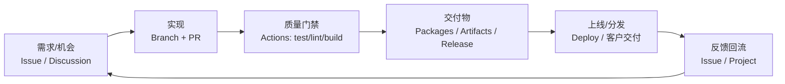

今天是 2025 年 12 月 16 日。  
“程序员开一人公司”这股潮，我认为最值得聊的不是融资叙事，而是一个更朴素的问题：

> 你只有一个人，但你交付给用户/客户的体验，必须像一个小团队。

这意味着你不能把时间浪费在「环境又坏了」「发版靠手点」「线上出问题没人兜底」这些低价值消耗上。  
你需要的是一套可复制、可回滚、可控成本的工程化闭环。

GitHub Pro 的价值，也应该从这个角度去理解：**它不是“更多功能”，而是把一人公司最缺的三件事（时间、确定性、成本上限）写进你的工作流里。**

## 一、先把账算清楚：Pro 回本靠“少出错”，不是“用得多”

一人公司最贵的不是云资源，是你的注意力和交付节奏。

如果你每个月能用 GitHub Pro 解决下面任意一件事，它基本就已经“回本”：

- 新电脑/临时电脑上，30 分钟才能跑起来的项目，变成 1 分钟可开工
- 发版从“人肉打包+上传+填变更”，变成打个 tag 自动产出 Release + 产物
- 私有依赖/镜像不用到处拷贝，用统一的仓库权限体系交付
- 账单不再靠“事后追责”，而是提前设上限，超额自动暂停

为了写得更实在，这里直接给出 GitHub 官方文档里能查到的配额事实（细节以官方为准）：

- **GitHub Actions（私有仓库）**：Pro 每月包含 `3,000` 分钟，Artifact 存储 `1GB`，并且 Actions 的存储与 Packages 共享池  
  https://docs.github.com/billing/managing-billing-for-github-actions/about-billing-for-github-actions
- **GitHub Codespaces（个人账户）**：Pro 每月包含 `180` 小时计算时间、`20 GB-month` 存储；机型核心数越高，消耗越快  
  https://docs.github.com/en/enterprise-cloud@latest/billing/concepts/product-billing/github-codespaces
- **GitHub Packages（私有仓库）**：Pro 包含 `2GB` 存储、`10GB` 月传输；并且 Actions 用 `GITHUB_TOKEN` 下载包可免数据传输计费（这是很多人不知道的省钱点）  
  https://docs.github.com/billing/managing-billing-for-github-packages/about-billing-for-github-packages

你会发现：Pro 的核心能力，不是“给你无限”，而是**给你一段可控的免费区间 + 清晰的计费规则**。  
对一人公司来说，这比“看起来很强但不透明”的套餐更重要。

## 二、把仓库当公司：用一个闭环承接“开发→交付→复盘”

我建议把 GitHub 仓库定位成一人公司的「研发与交付中枢」：代码、流程、产物、反馈都围绕它转。



这个闭环里，GitHub Pro 最有价值的三块分别落在：

- **Codespaces**：让“开工”几乎无成本（环境一致、随时接入）
- **Actions**：让“交付”几乎无成本（测试/构建/发布自动化）
- **Packages**：让“分发与复用”几乎无成本（私有依赖、镜像、构建产物集中管理）

下面我按一人公司的真实节奏，把这三块写成可落地的做法。

## 三、Codespaces：把“开工成本”压到最低

一人公司最容易出现的效率黑洞，是环境漂移：

- 你换了一台电脑，半天在装依赖
- 你同时跑多个项目，依赖版本互相污染
- 你临时改个线上 bug，却发现本地根本复现不了

Codespaces 的正确打开方式是：**把“开发环境”当成代码的一部分版本化**。最小实现就是在仓库里放一个 `.devcontainer/devcontainer.json`。

示例（思路示范，按你的项目改）：

```jsonc
{
  "name": "one-person-company",
  "image": "mcr.microsoft.com/devcontainers/python:3.12",
  "postCreateCommand": "pip install -U uv && uv sync",
  "customizations": {
    "vscode": {
      "extensions": ["ms-python.python", "ms-python.vscode-pylance"]
    }
  }
}
```

一人公司用 Codespaces，我建议把“成本控制”当成默认配置，而不是事后补救：

- **机型默认选 2-core**：先把免费额度榨干，再谈升级
- **用完就停、合并就删**：Codespace 停止后不再计计算时间，但**存储仍然计费**，不删就会慢慢吞掉额度
- **谨慎用 Prebuild**：Prebuild 构建会消耗 Actions minutes；除非你真的需要“秒开工”，否则先不要上来就开

## 四、Actions：把“交付”变成默认动作（而不是手工仪式）

很多一人公司在“写代码”上不弱，弱在“交付链路”太原始：

- PR 没有质量门禁，靠感觉合
- 发版靠手工，漏文件、漏版本、漏变更说明
- 出问题了很难定位，是代码问题还是构建问题

我的建议是：**把一套最小 CI/CD 固化下来，先跑起来，再迭代。**

下面是一份“能覆盖大多数 Python 项目”的最小工作流：PR 自动测试；打 tag 自动构建并推送镜像到 GHCR（GitHub Packages 的 Container Registry）。


```yaml
name: ci
on:
  pull_request:
  push:
    branches: [main]
    tags: ["v*"]

concurrency:
  group: ${{ github.workflow }}-${{ github.ref }}
  cancel-in-progress: true

jobs:
  test:
    runs-on: ubuntu-latest
    steps:
      - uses: actions/checkout@v4
      - uses: astral-sh/setup-uv@v7
        with: { enable-cache: true }
      - run: uv sync --frozen
      - run: uv run pytest -q

  image:
    if: startsWith(github.ref, 'refs/tags/v')
    needs: test
    runs-on: ubuntu-latest
    permissions: { packages: write, contents: read }
    steps:
      - uses: actions/checkout@v4
      - uses: docker/login-action@v3
        with:
          registry: ghcr.io
          username: ${{ github.actor }}
          password: ${{ secrets.GITHUB_TOKEN }}
      - uses: docker/build-push-action@v6
        with:
          push: true
          tags: ghcr.io/${{ github.repository }}:${{ github.ref_name }}
```


这份工作流刻意保持“短小”，但关键点齐了：

- `concurrency`：避免重复跑、浪费分钟数
- `setup-uv`：速度快、并且能缓存依赖（对一人公司非常关键）
- tag 驱动发布：你只需要做到“语义化版本号打对”，交付物就自动产出

## 五、Packages：把私有依赖/镜像留在同一套权限体系里

一人公司常见的交付形态只有几种：源码交付、二进制交付、容器交付、私有依赖交付。  
不管哪种，最怕的是“产物散落”：网盘、对象存储、聊天工具、某台机器的某个目录……时间一久必然失控。

GitHub Packages 的正确用法是：**把产物挂在仓库/组织的权限体系下**，交付时只交付“访问权”。

并且你一定要记住一个容易被忽略的计费细节：  
在私有仓库里，Packages 的数据传输会计费；但如果是 GitHub Actions 用 `GITHUB_TOKEN` 下载包，很多场景下数据传输是免费的（官方文档里有明确说明）。

这会直接影响你的设计取舍：

- 能在 CI 里完成的下载/构建，尽量在 CI 里完成（省钱 + 更可复现）
- 能用 GHCR 镜像交付的，就别让客户去“本地重建”

## 六、成本与风控：把“上限”写进系统，而不是写进自律

一人公司最危险的不是“花钱”，而是“花钱不可预期”：

- Codespace 忘了关，机器一直跑
- Artifact/Cache/Packages 共用存储池，越积越多
- 为了方便开了大机型，免费额度瞬间被吃光

解决思路很简单：**预算、告警、自动清理三件套缺一不可。**

你可以把这套当成“公司制度”，强制执行：

- 为 Codespaces / Actions / Packages 设置预算与阈值，超额自动暂停（避免意外账单）
- Actions 的 Artifact 明确设置保留期（比如 7 天/14 天），不要默认无限期
- 定期清理旧的 Packages（镜像/包），保留最近 N 个版本即可

## 七、最小可执行清单：今天就能开始“用回本”

如果你只打算做 5 件事，我建议按这个顺序：

1. 在仓库加 `.devcontainer/devcontainer.json`，让 Codespaces 能一键启动
2. 加一份最小 `.github/workflows/ci.yml`：PR 自动测；tag 自动产物
3. 把“发版”改成打 tag（`v1.2.3` 这种），停止手工发布
4. 去 Billing 里把预算与上限配好（尤其是 Codespaces）
5. 给仓库加 Issue/PR 模板，让需求与变更可追踪、可复盘

做到这里，你就已经把一人公司最难的三件事——**节奏、确定性、成本上限**——真正落在系统里了。
