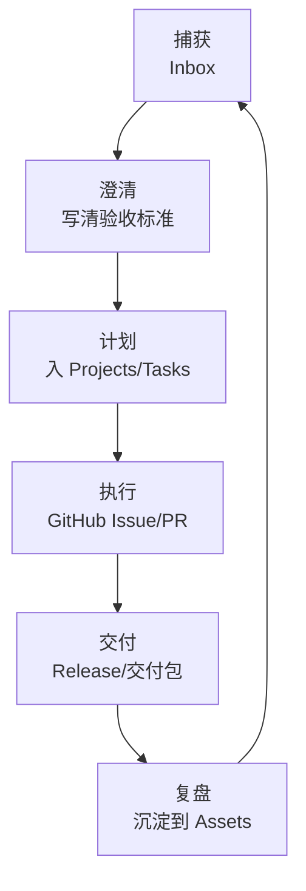

今天是 2025 年 12 月 16 日。  
如果说 GitHub 解决的是“一人公司怎么把代码交付做成流水线”，那 Notion 解决的就是另一个更隐蔽、也更致命的问题：

> 你只有一个大脑，但你需要同时扮演：产品、研发、运营、客服、销售。

一人公司失败的常见原因，并不是技术不行，而是**信息和决策无法复用**：

- 需求从聊天记录里来，验收标准却没写清楚
- 待办散落在各个角落，优先级靠当天心情
- 做过一次的交付流程，下次又重来一遍
- 出了事故只能“凭记忆复盘”，很快再次踩坑

这一篇只讲一个目标：**用最小的 Notion 系统，把“信息→决策→执行→复盘”串成闭环**。  
不追求华丽的仪表盘，只追求你每天真的会用。

## 一、先定边界：Notion 和 GitHub 各做什么

一人公司最容易犯的错，是把 Notion 当成“第二个 GitHub”，或者把 GitHub 当成“第二个 Notion”。  
正确的分工应该很清晰：

- **Notion 负责：**上下文、决策、计划、节奏、资产沉淀（可读、可复盘）
- **GitHub 负责：**代码变更、Issue/PR、版本、交付产物（可执行、可审计）

一个简单但非常实用的规则是：

> **凡是需要写代码的工作，最终必须落到 GitHub Issue/PR；Notion 只保留“为什么做、做到什么算完成、下一步怎么推进”。**

这样做的好处是：你不会在两个系统里重复维护“执行状态”，也不会把工程事实写成“记忆体”。

## 二、第一性原理：一人公司真正需要管理的是“注意力”

Notion 的价值不是“更好看地记录”，而是把你的注意力从两类消耗里解放出来：

1. **切换成本**：反复在聊天记录/文件夹/浏览器书签里找信息
2. **重建成本**：同一个决策和流程，每次从零推导一次

所以设计 Notion 系统时，最关键的不是字段有多全，而是两个指标：

- **信息能不能在 10 秒内找到**
- **一个任务能不能在 30 秒内澄清成可执行的下一步**

接下来所有结构设计，都围绕这两个指标做取舍。

## 三、最小系统：4 张表 + 2 个固定节奏

我建议一人公司先从“最小可用系统”开始：**4 张数据库表**，外加**2 个固定节奏**。  
别一上来就做复杂的 CRM、财务、OKR——你会很快不用。

### 1）Inbox：唯一入口（先捕获，再处理）

Inbox 只做一件事：把所有碎片先收进来，避免占用脑内缓冲区。

| 字段 | 类型 | 说明 |
| --- | --- | --- |
| Title | 标题 | 一句话描述（不要写长文） |
| Type | 选择 | 需求/BUG/想法/客户/运营/学习 |
| Source | 选择 | 微信/邮件/电话/自己/社区 |
| Created | 创建时间 | 默认即可 |
| Status | 选择 | New / Triaged / Archived |

规则很简单：  
**任何东西先丢 Inbox，24 小时内必须清空到其他地方（转任务、转项目、转资产，或直接归档）。**

### 2）Projects：用来“定义成功”，不是用来罗列任务

项目页要回答三个问题：为什么做、做到什么算完成、什么时候算超期。

| 字段 | 类型 | 说明 |
| --- | --- | --- |
| Name | 标题 | 项目/产品/交付名称 |
| Goal | 文本 | 成功标准（可验收） |
| Stage | 选择 | Idea / Doing / Shipping / Done |
| Priority | 选择 | P0/P1/P2 |
| Due | 日期 | 一人公司必须要有“时间盒” |

你会发现：Projects 的关键不是“细”，而是**清晰的验收标准**。  
否则你会永远在“差不多了”里拖延。

### 3）Tasks：只存“下一步动作”（Next Action）

任务库的核心是让你每天打开就能干活，而不是让你“感觉很忙”。

| 字段 | 类型 | 说明 |
| --- | --- | --- |
| Task | 标题 | 动词开头：实现/修复/发布/联系/写文档 |
| Status | 选择 | Todo / Doing / Waiting / Done |
| Priority | 选择 | P0/P1/P2 |
| Due | 日期 | 没有截止就很难排序 |
| Project | 关联 | 关联到 Projects（能关联就关联） |
| Link | URL | GitHub Issue/PR、客户文档、合同等 |

这里建议加两条纪律（比任何仪表盘都有效）：

- **Doing 同时最多 1–2 个**（WIP 限制，不然你会一直在切换）
- **Waiting 必须写“等谁/等什么/何时再跟进”**（避免忘记）

### 4）Assets / Playbooks：把复盘变成“资产”

一人公司最大的杠杆，是把一次性的经验变成可复用的流程与模板。

| 字段 | 类型 | 说明 |
| --- | --- | --- |
| Title | 标题 | 例如：发版检查清单 / 客户交付模板 |
| Type | 选择 | Checklist / SOP / Postmortem / 模板 |
| Tags | 多选 | 交付/运营/支持/安全/成本 |
| Last Updated | 日期 | 便于定期回顾 |

Assets 里最值得优先沉淀的 5 类东西：

- 发版与回滚清单
- 客户交付包模板（交付内容、验收方式、支持边界）
- 事故复盘模板（时间线、根因、修复、预防）
- 常见问题 FAQ（减少你被重复打断）
- 报价与范围模板（外包/定制尤其重要）

### 2 个固定节奏：每天 10 分钟 + 每周 30 分钟

没有节奏的系统，最后一定会变成“信息坟场”。  
一人公司只需要两个极简节奏：

- **每日 10 分钟：清 Inbox + 选出今天唯一的 P0**
- **每周 30 分钟：回顾 Projects/Tasks，删掉不做的，补齐下周的 P0**

注意这里的关键词是“删掉”。  
一人公司最重要的能力不是多做，而是**持续放弃**。

## 四、闭环跑起来：从输入到交付的一条龙

把上面的结构连起来，你每天的动作应该像一个“管道”，而不是一堆随意的列表：

这里唯一需要你“认真写”的地方，是 **澄清**。  
我推荐给一人公司的“澄清模板”只保留 4 行：

1. 这件事解决什么问题（谁痛）
2. 做到什么算完成（验收标准）
3. 不做什么（范围边界）
4. 下一步动作是什么（Today Next Action）

写不出这四行，说明它还不是可执行任务，继续放 Inbox 或变成一个 Project。

## 五、和 GitHub 协作：把“上下文”留在 Notion，把“事实”留在 GitHub

你可以把 Notion 页面当作 Issue 的“外置上下文”，但不要复制执行状态。

一个实用的搭配方式是：

- Notion 的 Task 里放 GitHub Issue/PR 的 URL
- GitHub Issue 里放 Notion 的页面链接（可选）
- 只在 Notion 里维护：验收标准、决策理由、发布说明草稿
- 只在 GitHub 里维护：实现细节、变更记录、最终产物

这样做还有一个隐性收益：当你未来请兼职/招第一个同事时，你能非常快把“为什么这么做”交接出去。

## 六、最常见的 6 个坑（以及更好的做法）

1）**上来就做“大而全系统”**  
更好做法：先用 4 张表跑 2 周，再决定要不要加 CRM/财务/OKR。

2）**Tasks 里塞满“不可执行的大词”**（如：优化体验、提升转化）  
更好做法：强制改成动词 + 可验收结果：例如“把注册流程从 3 步减到 2 步，并通过 5 个用例回归”。

3）**没有 WIP 限制，导致全天在切换**  
更好做法：Doing 永远不超过 2 个；多出来的进 Todo 或 Waiting。

4）**只收集，不清理**  
更好做法：Inbox 必须日清；每周 review 时要敢于删除/归档。

5）**复盘只写感受，不沉淀资产**  
更好做法：每次交付/事故至少产出一条 Checklist 或 SOP，进入 Assets。

6）**在 Notion 里维护代码执行细节**  
更好做法：实现与变更记录留在 GitHub；Notion 只存决策与验收标准。

## 七、最小可执行清单：今天就能落地

如果你今天只做 7 件事，按这个顺序：

1. 建 4 张表：Inbox / Projects / Tasks / Assets
2. 给 Tasks 增加 `Status/Priority/Due/Project/Link` 五个字段
3. 每天固定 10 分钟清 Inbox（不清就算你没下班）
4. 每周固定 30 分钟做 review（删掉不做的）
5. Doing 同时最多 2 个
6. 任何需要写代码的任务，都建 GitHub Issue，并把链接贴回 Notion
7. 每次交付后，沉淀一条 Checklist 到 Assets

这套系统的目标只有一个：让你在“一个人”的情况下，也能稳定地把事情做完，并且越做越快。
