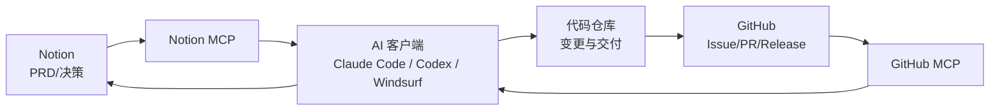

今天是 2025 年 12 月 16 日。  
很多程序员开一人公司后，会很快买一堆 AI 工具：IDE 里一个、终端里一个、浏览器里一个。

但真正卡住你的，往往不是“没有 AI”，而是这件事：

> 需求和决策在 Notion，执行和交付在 GitHub。  
> 你每天都在复制粘贴上下文，AI 也每天都在“盲写”。

这一篇只讲一个目标：**用 MCP 把 Notion（上下文）和 GitHub（执行）接进你的 AI 编程助手，让一人公司的“需求→实现→交付→回写”真正跑成闭环。**

## 一、第一性原理：AI 想像“虚拟同事”一样工作，需要三层

把 AI 当虚拟同事，最容易犯的错是：只给它模型能力，不给它“组织系统”。

从第一性原理拆开，AI 要稳定产出，需要三层：

1. **事实源（System of Record）**：谁说了算？哪里是最终真相？  
   - Notion：PRD、决策、验收标准、复盘（可读、可复用）  
   - GitHub：Issue/PR、提交历史、版本、交付产物（可执行、可审计）
2. **连接层（Tool Gateway）**：AI 怎么拿到事实、怎么落地操作？  
   - 通过 MCP（Model Context Protocol）把工具和数据源“标准化接入”
3. **执行器（Executor）**：谁来动手改代码、跑命令、发起 PR？  
   - Claude Code（终端 Agent）  
   - Codex CLI（本地 Agent）  
   - Windsurf（IDE + Agent，且原生支持 MCP）



你会发现：**MCP 不是“又一个功能”，而是把一人公司最缺的确定性写进系统里。**

## 二、选型：三种客户端怎么搭配（别全都上）

一人公司工具选型的核心不是“最强”，而是**减少切换成本**。我建议你只确立一个主力执行器，其它当备份。

- **Windsurf**：适合“长链路协作”（读需求→查仓库→多文件改动→开 PR），并且原生支持 MCP。  
  文档：https://docs.windsurf.com/windsurf/cascade/mcp
- **Claude Code**：适合“终端批量任务”（重构、解释代码、处理 git 工作流）。  
  安装与概览：https://www.npmjs.com/package/@anthropic-ai/claude-code、https://code.claude.com/docs/en/overview
- **Codex CLI**：适合“本地端到端代理”（在仓库里做任务、可集成到 IDE），并且是开源工具链的一部分。  
  安装与概览：https://www.npmjs.com/package/@openai/codex

现实里最稳的一种搭法是：

> **Windsurf（带 MCP）做“理解与编排”，Claude Code / Codex 做“终端执行”。**  
> 你不需要让所有工具都连接 MCP，只要保证“事实源”和“执行链路”不丢。

## 三、最小配置：把 Notion MCP + GitHub MCP 接进来

### 1）Notion MCP：先用官方远程端点（省心且可控）

Notion 官方建议你先确认连接的是他们的官方端点（Streamable HTTP 推荐）：  

- `https://mcp.notion.com/mcp`  
- `https://mcp.notion.com/sse`

通用 JSON 配置示例（不同客户端字段名可能略有差异，以客户端文档为准）：

```json
{ "mcpServers": { "Notion": { "url": "https://mcp.notion.com/mcp" } } }
```

官方文档：  
https://developers.notion.com/docs/mcp  
https://developers.notion.com/docs/get-started-with-mcp

### 2）GitHub MCP：优先用 GitHub 官方 MCP Server，并限制工具集

GitHub 官方文档对 MCP 的定位很清晰：它让 AI 客户端能“带着 GitHub 上下文干活”，并且你可以选择远程或本地运行。  
概念与入口：https://docs.github.com/en/copilot/concepts/context/mcp

一人公司更建议你从“最小工具集”开始（只开 `repos/issues/pull_requests`），不要一上来就把所有能力暴露给 Agent。  
工具集配置思路：https://docs.github.com/en/copilot/how-tos/provide-context/use-mcp/configure-toolsets

### 3）Windsurf 里把两个 MCP 一次配齐（示例）

Windsurf 的 MCP 配置文件路径（官方文档）：`~/.codeium/windsurf/mcp_config.json`。  
下面示例把 Notion（远程）+ GitHub（本地 Docker）放在一起，你只需要把 token 换成自己的：

```json
{
  "mcpServers": {
    "notion": {
      "serverUrl": "https://mcp.notion.com/mcp"
    },
    "github-mcp-server": {
      "command": "docker",
      "args": ["run", "-i", "--rm", "-e", "GITHUB_PERSONAL_ACCESS_TOKEN", "ghcr.io/github/github-mcp-server"],
      "env": { "GITHUB_PERSONAL_ACCESS_TOKEN": "<YOUR_PAT>" }
    }
  }
}
```

注意：  
1) Token 建议使用 **Fine-grained PAT**，限制到单个仓库，并设置过期时间；不要用“全仓库、不过期”的老 token。  
2) MCP 本质上是“让 AI 具备操作能力”，所以配置文件要当作敏感信息对待，不要提交进仓库。

## 四、一条龙工作流：从 PRD 到 PR，再回写 Notion

下面是我建议你照抄的一套“闭环对话脚本”。关键点不是措辞，而是**每一步都可验证、可回滚、有人类确认点**。

### Step 1：从 Notion 拉上下文，变成可执行的 Issue

你对 AI 说：

> 读取 Notion 里这个 PRD（链接/页面 ID）。  
> 只输出：需求摘要、验收标准、风险点。  
> 然后把它拆成 3–7 个 GitHub Issues（每个都要有 Done 的验收标准），并在仓库里创建。  
> 最后把每个 Issue 的 URL 回写到 Notion 对应任务条目里。

你检查两件事：  
1) Issue 是否“可验收”（不是 TODO 清单）；2) 是否把范围写大了（YAGNI）。

### Step 2：用终端/IDE 执行实现，但把“合并权”留给你

你对 AI 说：

> 从 Issue #123 开始实现：先给改动计划，再动手。  
> 只要涉及依赖升级、数据库迁移、权限改动，必须先停下来让我确认。  
> 完成后创建 PR，并生成 PR 描述（动机、改动点、测试方式、回滚方案）。

### Step 3：合并后回写 Notion，沉淀可复用资产

你对 AI 说：

> PR 合并后：生成一份 Release notes（面向用户/客户的语言）。  
> 把 Notion 里的项目状态推进到 Shipping/Done，并补一段复盘：这次交付里最值得复用的 1 个模板是什么？

你会发现：当 Notion 负责“为什么”和“做到什么算完成”，GitHub 负责“怎么实现”和“交付证据”，AI 才不容易把你带偏。

## 五、风控：别让闭环变成“自动失控”

把 MCP 接进来之后，你需要把风险关进笼子里，否则一人公司最宝贵的资产（代码、数据、账号）会变得脆弱。

### 1）只连接可信端点与可信客户端

Notion 官方明确给出了应当验证的端点：`https://mcp.notion.com/mcp`（推荐）与 `https://mcp.notion.com/sse`。  
不要为了“省一步”去连来路不明的中转服务。

### 2）默认开启“人类确认”，把不可逆操作卡住

典型的不可逆操作包括：删除数据、批量改权限、发版、合并到主分支、给客户发邮件。  
这些动作在一人公司里成本极高，必须明确由你确认。

### 3）最小权限 + 最小工具集

- Token：只给必要权限、只给必要仓库、设置到期时间。  
- GitHub MCP：只开你当前需要的 toolsets；用得越少，越不容易被“提示注入”带偏。  
- Notion MCP：把“可写范围”限制在你愿意让 AI 改的空间里（用权限与页面结构实现边界）。

## 六、Checklist：把 AI 协作变成一人公司的默认能力

- Notion 写清：目标、范围、验收标准（别把“写代码”当成验收标准）。
- GitHub 承接执行：每个 Issue 都要有 Done 的验收口径与测试方式。
- 只选择一个主力执行器（Windsurf / Claude Code / Codex），减少上下文切换。
- 用 MCP 接两类事实源：Notion（上下文）+ GitHub（执行证据）。
- 所有敏感动作都要有人类确认点（合并、发版、权限、账单相关）。
- Token 用 Fine-grained、限制仓库、设置过期；配置文件不要进仓库。
- 默认只开最小工具集，用到再加（YAGNI）。
- 每次交付后沉淀 1 份可复用模板（SOP、Checklist、复盘）。

## 参考链接（官方）

- MCP 概念：https://modelcontextprotocol.io/introduction
- Notion MCP：https://developers.notion.com/docs/mcp
- 连接 Notion MCP：https://developers.notion.com/docs/get-started-with-mcp
- GitHub MCP（Copilot 文档）：https://docs.github.com/en/copilot/concepts/context/mcp
- GitHub MCP 工具集配置：https://docs.github.com/en/copilot/how-tos/provide-context/use-mcp/configure-toolsets
- Windsurf MCP：https://docs.windsurf.com/windsurf/cascade/mcp
- Claude Code：https://www.npmjs.com/package/@anthropic-ai/claude-code
- Codex CLI：https://www.npmjs.com/package/@openai/codex
