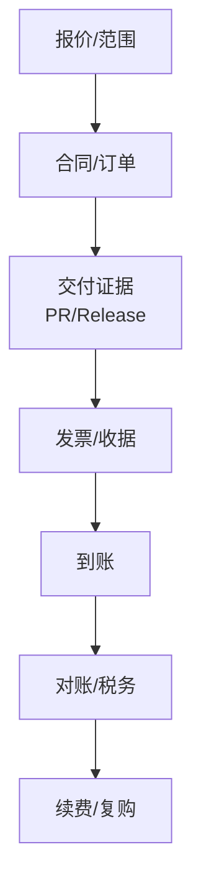
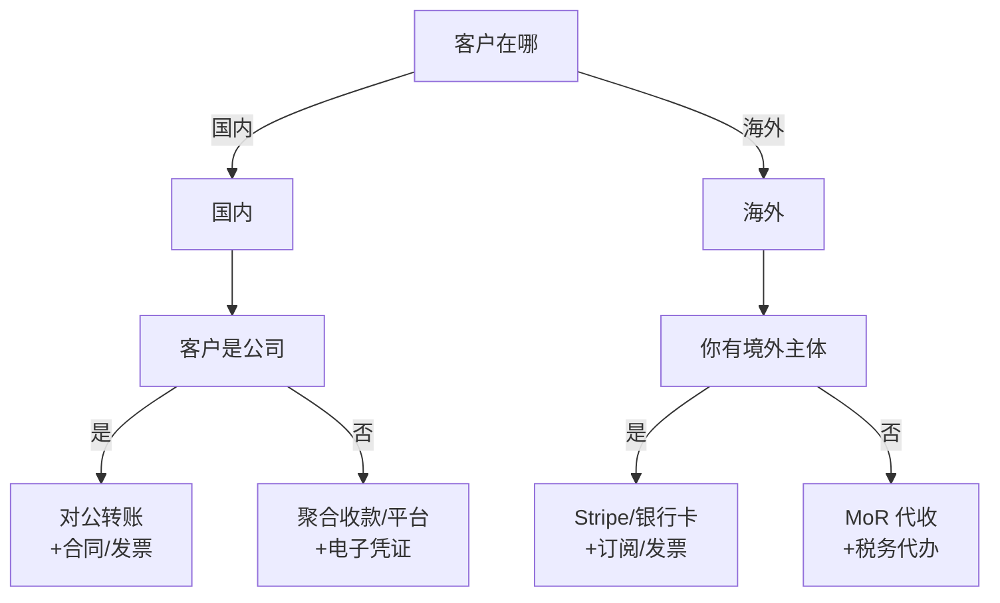

今天是 2025 年 12 月 16 日。  
很多程序员开一人公司后，会发现一个反直觉的事实：

> 写代码的难点在工程；收钱的难点在流程。

你不是缺一个“支付按钮”，你缺的是一套能复用的收钱闭环：**报价与范围、交付证据、凭证、到账、对账、税务/发票、退款与争议**。

本文不是法律/税务意见；涉及主体设立、开票与税务口径，请以当地政策与专业人士建议为准。

## 一、第一性原理：收钱不是“支付”，而是一条可审计的链路

一人公司最怕的不是“收不到钱”，而是“收到了钱但说不清楚为什么、交付了什么、该怎么对账、该怎么处理退款”。

把收钱当作一条链路，会更接近真实世界：



你只要把这条链路跑顺，工具选 Stripe、对公转账、还是平台代收，都只是“实现细节”。

## 二、先选路径：国内对公 vs 国内对私 vs 出海 Stripe

收钱路径不是凭喜好选的，取决于三个变量：

1) 客户在哪里（国内/海外）  
2) 客户是谁（公司/个人）  
3) 你用什么主体收钱（个人/个体/公司/境外主体）

一个足够实用的决策树如下：



下面按三条主线把“怎么收钱”讲清楚。

## 三、国内 ToB：对公收款是默认选项（也是最能规模化的）

如果你做外包交付、企业订阅、私有化部署、ToB 顾问：**优先把对公这条链路跑顺**。

### 1）最小 SOP：把钱和交付绑定到“可验收”的里程碑

不要用“时间”当里程碑（比如“做两周”），要用“可验收的结果”当里程碑（比如“完成 A 功能并通过验收用例”）。

最小流程建议是：

- 报价时写清：范围、交付物、验收标准、支持边界
- 付款条款用“里程碑”拆分：预付款 → 阶段验收 → 尾款
- 交付证据落在 GitHub：PR、Release、交付包（可追溯）
- 发票/收据与订单绑定：避免事后补材料

你会明显感觉到：这不是“更复杂”，而是在把沟通成本从“交付后吵架”前置到“交付前对齐”。

### 2）把 GitHub 变成交付证据库（减少扯皮）

对一人公司来说，GitHub 的价值不只在代码，还在“证据”：

- 每个收费需求对应一个 Issue（写清验收口径）
- 实现通过 PR 合并（可审计）
- 每次交付打 Tag/Release（可回滚）
- 给客户的交付包用 Release/Artifact 留档（可复用）

你不需要用花哨系统，只要做到“每一笔钱都有对应的证据”，你的交付确定性会提升一个量级。

## 四、国内 ToB 但要对私：能做，但要当作临时方案

当客户是公司、却要打到你个人账户，通常意味着他们走“劳务/报销/一次性采购”等内部流程。

现实里这条路常见的痛点是：

- 客户财务不一定接受（制度卡得严）
- 你需要提供更多个人信息与材料（隐私与合规成本上升）
- 税务处理与入账口径更容易变形，后续升级为对公会更痛

如果你不得不走对私，我建议你至少做到三点（把风险压住）：

- **先确认材料清单**：合同/劳务协议、付款审批需要的资料、是否需要完税证明等
- **先写清支持边界**：交付范围、验收方式、支持时长（否则“付一次钱管一年”）
- **把它写进迁移计划**：当你月度订单稳定到一定程度，就把客户引导到对公

对私不是原罪，但它很难成为“可规模化的默认路径”。

## 五、出海收款：Stripe 很好用，但前提是主体与合规路径要对

Stripe 的强项是把“在线支付+订阅+发票+风控+对账”做成基础设施，尤其适合海外 B2C SaaS、数字产品、国际化服务。

但你需要先看清一个边界：Stripe 的出海页面对中国大陆用户有明确声明（不在大陆境内提供或要约提供支付服务）。  
来源：https://stripe.com/zh-sg/lp/china-cross-border

因此，把 Stripe 放进一人公司的收钱路径，通常是两种架构：

### 1）你是商户（Stripe Payments）

你自己作为卖方收钱、出账、承担税务与争议处理。优点是控制力强、毛利更好；缺点是合规与税务工作更多。

### 2）平台代收（MoR，Merchant of Record）

MoR 的思路是：由对方作为“名义卖方”代你收款、开具税务单据并处理部分合规，你拿分成。优点是省事、上手快；缺点通常是费率更高、可控性更弱、账务结构更像平台分成。

一人公司最稳的策略是：**先用 MoR 跑通商业闭环，确定产品能卖；再决定是否升级为自营 Stripe 模式。**

## 六、Stripe 最小落地：用 Checkout 收钱，用 Webhook 记账（别相信跳转回调）

Stripe Checkout 是 Stripe 托管的预构建支付页，能显著减少你自己做支付表单与合规的工作量：  
https://docs.stripe.com/checkout

工程上最关键的一条纪律是：

> **以 Webhook 为准，不以“支付成功跳转回你的页面”为准。**

因为支付确认、异步支付方式、失败重试、争议与退款，都只能通过事件流可靠落地。  
Webhook 文档：https://docs.stripe.com/webhooks

下面给一个“够用且安全边界明确”的最小片段（示意用，字段以你的产品为准）：

```python
import os
import stripe
from flask import Flask, request

stripe.api_key = os.environ["STRIPE_SECRET_KEY"]
app = Flask(__name__)

@app.post("/create-checkout-session")
def create_checkout_session():
    session = stripe.checkout.Session.create(
        mode="subscription",  # 订阅；一次性支付用 payment
        line_items=[{"price": os.environ["STRIPE_PRICE_ID"], "quantity": 1}],
        success_url=os.environ["SUCCESS_URL"],
        cancel_url=os.environ["CANCEL_URL"],
        client_reference_id=request.json.get("user_id"),  # 绑定你的用户
    )
    return {"url": session.url}

@app.post("/stripe/webhook")
def stripe_webhook():
    event = stripe.Webhook.construct_event(
        request.data,  # 需要原始 body；别让框架改写它
        request.headers.get("Stripe-Signature"),
        os.environ["STRIPE_WEBHOOK_SECRET"],
    )
    if event["type"] == "checkout.session.completed":
        # TODO: 幂等处理；落库订阅状态；关联 customer/subscription id
        pass
    return "", 200
```

你不需要一开始就做很全，但至少要做到：

- 验签（拒绝伪造请求）
- 幂等（Webhook 重试时不重复开通权益）
- 快速返回 2xx（复杂逻辑丢队列/后台任务）

## 七、把收钱接回你的系统：Notion 记“订单事实”，GitHub 记“交付证据”

不管你用什么收款方式，最终都建议你沉淀一个“订单台账”（最小即可）：

- 订单号/客户/金额/币种
- 合同/发票/收据链接
- 交付对应的 GitHub Issue/PR/Release
- 收款状态（未付/部分/已付/退款/争议）
- 支持到期时间与支持边界

Notion 适合存“订单事实”，GitHub 适合存“交付证据”。两者一旦对齐，你就能把收钱从“手工记忆”变成“系统事实”。

## 八、Checklist：一人公司把收钱跑顺的最小动作

- 先确定路径：国内对公/国内对私/出海 Stripe/MoR，不要混用一堆入口。
- 收钱前先锁定：范围、验收标准、支持边界（把扯皮成本前置）。
- 国内 ToB 优先对公：对账、税务、复购都更稳。
- 对私只当临时：材料、隐私、税务口径都要提前确认。
- Stripe 以 Webhook 为准：验签 + 幂等 + 异步处理。
- 每笔钱都能追溯到交付证据：Issue → PR → Release。
- 订单台账最小化：能对账、能复盘、能续费就够。

## 参考链接（官方）

- Stripe 出海（中国大陆边界说明）：https://stripe.com/zh-sg/lp/china-cross-border
- Stripe Checkout：https://docs.stripe.com/checkout
- 创建 Checkout Session：https://docs.stripe.com/api/checkout/sessions/create
- Stripe Webhooks：https://docs.stripe.com/webhooks
