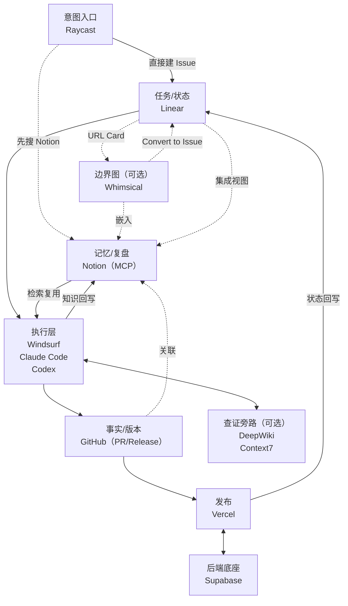

最近一段时间，“Spec Coding 将颠覆 Vibe Coding”这句话在开发者圈里刷屏。我的建议是：先别站队。

对团队来说，Spec-Driven Development 能显著降低沟通与返工；但对“个体即公司”的一人开发，过重的 spec 往往是一种负债——需求会变、优先级会变、范围会变，你很容易把时间耗在维护文档，而不是交付。

我最后保留了 **Vibe Coding（氛围编程）**，但把它工程化成一条可控的闭环：  
**用最小 spec 让意图可验证，用编码智能体做执行，用 PR/测试把结果变成证据，用 Notion 让经验可复用。**

为了避免概念打架，先把三个词对齐：

- **Vibe Coding**：你说目标，模型写代码；你负责“说清楚”和“验收”。  
- **Agentic Coding / Coding Agent（编码智能体）**：不只写片段，而是在仓库里读文件、改多文件、跑命令、开 PR，像执行器一样推进任务。  
- **Spec Coding（Spec-Driven Development）**：先写规格（目标/边界/验收/计划），让 Agent 按 spec 实现；适合协作与复杂工程，但有维护成本。  

我也试过 spec 体系，结论很直接：**它对团队协作、复杂重构很有价值，但对一人开发往往偏重。**  
所以我把“spec”压缩成最小版本（后面你会看到我的 4 行澄清模板），再用三道护栏把健壮性兜住：

- **经验兜底**：先画边界、先写清“不做什么”，把复杂度关在笼子里  
- **AI 交叉 Review**：一个写，一个只看 diff 挑刺、提风险点和测试建议  
- **单元测试覆盖度**：把关键路径的验证变成自动化门禁（CI 里跑），而不是靠记忆回归  

问题是：很多人把 Vibe Coding 当成“更强的补全”，爽一阵就结束了；真正的分水岭，是你能不能把它接进一条**可回滚、可复盘、可控成本**的交付闭环。

这篇是《一人公司》系列的第 01 篇，读完你会拿到 4 个东西：

- 一张“意图 → 交付 → 沉淀”的最短链路图  
- 一个 4 行澄清模板（替代厚重 spec）  
- 一套“随缘但不翻车”的三道护栏（经验/交叉 Review/单元测试）  
- 一份今天就能落地的最小清单  

如果你此刻最纠结的是：到底该 Vibe 还是 Spec？我现在用一个很粗暴的判据：

- **只要碰到“不可逆 / 高风险 / 跨多模块”**（比如付费、鉴权、数据迁移、公共 API），我就写更细一点的 spec（哪怕只是半页）。  
- **其它情况全部走轻量闭环**：4 行澄清模板 + 小步 PR + 测试门禁，把维护成本压到最低。  

所以，如果你还在纠结“哪款浏览器更适合开发”，我建议你先停一下：你在优化一个**最不决定产出的环节**。

一人公司真正的分水岭，从来不是“工具多不多”，而是你能不能把三件事写进系统里：

- **节奏**：每天都能推进，而不是靠灵感冲刺  
- **确定性**：需求、实现、交付可追溯，可复盘  
- **成本上限**：订阅、算力、时间，都有边界与预案  

这篇我想把话说得更硬一点：**所谓“数字化军火库”，不是一张工具清单，而是把 Vibe（灵感）变成交付（证据链）的那条管道。**

## 一、第一性原理：你要做的是“减少切换”，不是“升级工具”

一个人像一个小团队一样交付，最大的敌人是“切换”：

- 需求散在聊天记录里，验收标准没写清
- 任务靠脑内记忆推进，随时被打断
- 上线靠手工，出问题靠猜
- 复盘不沉淀，下次继续踩坑

所以“军火库”的目标不是让你多开几个 App，而是把你的工作变成一条管道：

> 捕捉意图 → 任务化 → 生产执行 → 版本化 → 自动交付 → 反馈回流 → 资产沉淀

后面所有工具，只是这条管道的“部件”。

你可以把这件事理解成一句话：

> **Vibe Coding 负责“快”，软件工程负责“稳”。一人公司要的是：快 + 稳。**

## 二、系统分工：每个组件只做一件事（否则必然失控）

一人公司最容易犯的错，是让一个工具“什么都做一点”，最后变成“什么都做不好”。  
正确分工必须清晰到可以写成规则：

- **Raycast**：只负责“系统级入口”和指令分发（可直接检索 Notion，减少切换；不负责管理任务）  
- **Whimsical**：只负责把“边界与依赖”画清楚（节点可一键转成 Linear Issue；图会嵌入到 Notion，方便长期复盘）  
- **Linear（+ Linear MCP）**：只负责任务状态与优先级，并让执行器能直接拿/更新/创建 Issue（不负责沉淀决策与长文档）  
- **GitHub Pro**：只负责事实与交付（Issue/PR/Release/产物），一切可审计  
- **Codex（大脑）**：方案论证、架构图/边界设计、关键决策与交叉 Review（尤其擅长“先把路走通”）  
- **Claude Code（执行者）**：终端侧执行，一次性脚本、运维命令、小工具、批处理（把方案落到可执行动作）  
- **Windsurf（生产车间）**：在真实仓库里做长期维护/重构，改多文件、跑测试、看 diff，并把 MCP/DeepWiki/Codemaps 串成工作流  
- **Vercel / Supabase**：自动化工厂，把“上线/运维”变成默认动作  
- **Notion**：档案馆，只存上下文、决策、复盘与可复用 Playbook（同时把 Linear / Whimsical / GitHub 集成进来：在同一页里“看上下文 + 看证据链 + 看图”；不追执行状态；但要做到“可被 AI 复用”）

这里强调一句：Notion 的“集成”是为了把信息聚合到同一页里方便复盘与沉淀，**不是**让 Notion 变成第二套任务/交付系统。任务状态仍以 Linear 为准，交付事实仍以 GitHub 为准。

还有一个我非常依赖的“减少翻译成本”的组合：**Whimsical × Linear**。

1）**把 Whimsical 节点直接转成 Linear Issue（单向转化）**  
你在 Whimsical 里把架构图/流程图画完后，可以直接选中某个卡片/形状/便签，点 `Convert to Issue` 推到 Linear 的 Team。  
结果是：这个节点会变成 Linear 里的一个任务，并且两边会保持链接——Linear 的描述里自动带 Whimsical 预览；Whimsical 节点上也会显示 Issue 编号和状态（Todo/Done）。

2）**在 Whimsical 中嵌入 Linear 任务（双向链接）**  
把 Linear 的 Issue URL 直接粘到 Whimsical 画布上，它会变成一个 Linear Card。  
这很适合复盘/讨论：你不用离开图，就能看到优先级、指派人和实时状态。

这套分工的好处只有一个：**你不会在多个地方维护同一份真相**。

我自己日常的分工，大概是三层火力：

- **Codex（大脑）负责：**
  - 快速论证方案、拆边界、画架构图、做取舍  
  - 交叉 Review：只看 diff 挑刺，指出风险点与测试缺口  
  - 写 PR 描述/技术笔记/文章，把“过程”沉淀成“资产”  

- **Claude Code（执行者）负责：**
  - 写一次性脚本、小工具、运维命令、批处理（能在终端里跑通）  
  - 查 API/看官方例子/对比写法，然后把结果落成可执行动作  

- **Windsurf 负责：**
  - 打开真实项目仓库，做长期维护和重构  
  - 前端开发：浏览器预览 + 选中组件直接跳到对应代码  
  - 和 Cascade 一起改多文件、跑测试、看 diff  
  - 把 MCP、DeepWiki、Codemaps 这些“周边能力”串成一个完整工作流  

换句话说：

> Codex 是我最信任的 AI “大脑”，负责产出架构图与方案设计。  
> Claude Code 是我最信任的 AI “执行者”，负责执行脚本、运维命令与一次性小工具。  
> Windsurf 是把这些能力真正落在仓库里的“生产车间”，并且自己还带了一堆强模型。

另外我会把 **Linear 也接入 MCP**：  
这样我在 Windsurf / Claude Code / Codex 里不需要来回切工具，就能直接把 Issue 拉出来处理、更新状态、补充评论；有些 Issue 也会直接用 Linear MCP 创建（当然，Raycast 里一键创建依然是我的常用入口）。

如果你最近也频繁看到 **MCP（Model Context Protocol）**：它本质上是“连接层标准”，决定了编码智能体能不能稳定地读到事实源、调用工具、并把结果回写到你的系统里。  
这件事我在本系列第 04 篇会单独展开。

这里我补一个我自己最常用、也最“值回票价”的用法：**Notion MCP = 把知识也接进闭环。**

- 代码里遇到新知识、或者某个框架踩了坑：我会直接用 Claude Code / Codex / Windsurf + Notion MCP，把它写成一条“可复用知识”（结论 + 边界 + 复现/修复步骤 + 参考链接）。  
- 做新功能前：我会让 Claude Code / Codex / Windsurf 先通过 Notion MCP 检索历史记录，把相关坑点、约束与最佳实践拉出来再开工。

一句话：**Notion 不是“记笔记”，而是给编码智能体提供一个可查询、可回写的长期记忆。**

同样的思路也适用于“日常学习”——我会把学习本身也接进这个闭环：

- **Codex（大脑）**：负责提炼学习路径、对比方案、把“看懂”变成“能用”  
- **DeepWiki MCP**：用来读开源仓库的结构、关键模块与实现细节（比在网页里翻更快）  
- **Context7 MCP**：用来查框架/库的最新用法与代码片段（尤其是版本差异、最佳实践）  
- **Notion MCP**：把结论沉淀成“知识卡”，并在做新功能时自动拉取复用  

比如我学习 `GitHub spec-kit`（以及背后的 spec-driven 思路）时，就是用 **Codex + DeepWiki MCP + Notion MCP**：先把仓库“读透”，再把关键概念、约束与坑点写进 Notion。下一次做类似需求，就不需要从 0 开始搜索和试错。

如果你想把这套闭环进一步做得更“可执行”：  
GitHub 工程化与成本上限可以参考本系列第 02 篇；Notion 最小系统参考第 03 篇；Claude Code/Codex/Windsurf 与 MCP 的连接层参考第 04 篇。

## 三、闭环长什么样：一条从“意图”到“交付”的最短路径

下面这张图，我建议你做成正文的核心配图。它表达的不是“工具很酷”，而是“链路很短”：



你会发现：浏览器在这张图里根本不重要。它只是“查看信息”的界面，不是生产系统的一部分。

## 四、把军火库落地：我给每个模块定了“默认纪律”

工具能不能变成系统，关键不在功能，而在纪律。下面这些规则你完全可以照抄。

### 1）Raycast：只做入口，不做仓库

Raycast 的目标是把“想法”快速压缩成可执行动作。我的要求只有一个：

> 任何输入，必须在 30 秒内落成一个 Linear Task（或被丢弃）。

这里有个很关键但经常被忽略的细节：**Raycast 其实可以直接检索 Notion**。  
所以我会先用 Raycast 在 Notion 里搜 10 秒：如果已经有 Playbook/知识卡，就直接复用；如果没有，再创建 Linear Issue 进入闭环。

你可以用一个最小“澄清模板”做筛选（写不出来就先别做）：

1. 这件事解决谁的什么痛点  
2. 做到什么算完成（验收标准）  
3. 明确不做什么（范围边界）  
4. 下一步动作是什么（Next Action）  

### 2）Linear：没有验收标准的任务，一律不进 Doing

Linear 不是“待办清单”，是你的战术地图。两条硬规则：

- **Doing 同时最多 1–2 个**（没有 WIP 限制，你就会整天切换）  
- **每个任务必须写清验收标准**（否则你永远在“差不多了”里拖延）  

### 3）Windsurf + Claude Code + Codex：分层协作，避免“AI 一把梭”

我把“AI 写代码”拆成三层：**大脑（Codex）**、**执行者（Claude Code）**、**车间（Windsurf）**。  
一旦分层清晰，你就不容易被“模型很强、结果很爽”的幻觉带跑偏。

但不管你用哪一层动手，必须遵守一条底线：

> **任何“看起来很爽的大改”，都要先拆成可回滚的小步 PR。**

原因很简单：一人公司最怕的不是慢，是“翻车后没人兜底”。

再补一条“随缘但稳”的规则：**交付前必须交叉 Review，并用测试把结论落地。**  
具体做法很简单：让 Windsurf/Claude Code 产出变更，让 Codex 只看 diff 挑刺，最后用单元测试把关键路径锁死。  
你可以理解成：编码智能体负责产出，我负责让它“可合并、可回滚、可复盘”。

为了把“开始开发”和“收尾交付”变成默认动作，我在 Claude Code 里维护了两条可复用的 slash command（放在 `~/.claude/commands/`，我会在 Notion 里长期迭代它们）：

- `/linear-worktree <ISSUE_KEY>`：从 Linear Issue 拉信息 → 生成分支名 → 创建 git worktree，并且**显式处理私密文件**（不让 `.env` 混进提交）。  
- `/commit-push-pr`：把当前改动整理成 commit → push 到远端分支 → 创建 PR，把 URL 和验证方式回传。  

下面是我用于分享的“精简版提示词”（保留关键护栏与最短路径）：

```text
command: /linear-worktree <ISSUE_KEY>
目标：基于 Linear issue `$1` 创建分支 + worktree，并安全处理私密文件
步骤：
1) 优先从 Linear 读取 `gitBranchName`；拿不到就让我提供分支名
2) `git fetch origin --prune`，推断 base 分支
3) worktree 放仓库同级：`<repo>.worktrees/$1-<slug>`
4) 创建/复用分支并 `git worktree add`（要求幂等）
5) 列出可能的私密文件（`.env` 等），问我选：symlink / 复制 / 跳过
6) 把私密文件写入 worktree 的 `.git/info/exclude`，并确认未被跟踪
7) 输出：issue、分支名、worktree 路径、下一步启动/测试建议
```

```text
command: /commit-push-pr
目标：整理改动 → commit → push → 创建 PR（GitHub Flow）
步骤：
1) `git status -sb`，确认不在 main/master（否则先建分支）
2) `git diff` 审阅变更，按功能/模块拆分提交
3) `git add -p` 交互暂存
4) 用 `feat/fix/refactor/test/docs/chore` 生成 commit message 并提交（必要时多次）
5) `git push -u origin <branch>`
6) 优先 `gh pr create --fill`；没有 gh 就输出 compare URL + PR 标题/描述草稿
7) 输出：commit 列表、PR URL、验证命令/结果（或为什么没跑）
```

我常用的“交叉 Review 提示词”也很短（建议直接收藏复用）：

```text
请只基于 diff 做审计，不要重写代码。
按顺序输出：1) 风险点 2) 边界遗漏 3) 需要补的测试 4) 回滚建议。
如果你不确定，就把“不确定”写出来，并给出最小验证步骤。
```

### 4）GitHub：让交付可审计（否则你永远在解释）

GitHub 的价值不在“托管代码”，而在“把交付变成证据链”。  
我建议每个 PR 至少回答 4 个问题（写不出来就先别合）：

1. 为什么改（问题与背景）  
2. 改了什么（范围与边界）  
3. 怎么验证（最小验证步骤：至少给出可执行的回归命令；关键逻辑补单元测试）  
4. 风险与回滚（出事时怎么退）  

### 5）Vercel / Supabase：上线只允许一种方式

如果你想让系统自动运转，上线动作必须足够单一：

- **Git Push 是唯一的上线动作**（不要手工点发布）  
- **分支预览是默认能力**（先在 Preview 里验收，再合 main）  

这会把“发布”从仪式变成惯性。

### 6）Notion：每次交付至少沉淀一条 Playbook

Notion 不是拿来“记录努力”的，是拿来“制造复利”的。  
我对 Notion 的最低要求是：

> 每次交付/事故之后，至少新增或更新一条 Checklist / SOP。

另外还有一种更“日常”的沉淀：你在写代码时遇到的新知识/新坑，不要等复盘才补。  
直接让 Claude Code / Codex / Windsurf 通过 Notion MCP 写入一条“知识卡”，以后做类似需求时，再让它从 Notion 拉取并引用这条知识。

我用的“知识卡”模板很固定：

```text
结论：
适用范围：
复现：
修复：
参考：
```

长期来看，这比你买任何订阅都更能决定你是不是“越来越快”。

## 五、最常见的 6 个坑（以及更好的做法）

1）**入口太多：浏览器、IDE、终端、聊天窗口都在“接单”**  
更好做法：只保留一个入口（Raycast/终端/IDE 三选一），其它都只是信息源。

2）**任务系统和知识库混用**  
更好做法：Linear 只管执行状态；Notion 只管决策与资产；GitHub 只管事实。

3）**没有验收标准就开工**  
更好做法：强制写 4 行澄清模板；写不出来就先别做。

4）**AI 一次改太大，合完才发现逻辑烂了**  
更好做法：小步 PR + 可回滚；复杂改动先画边界再动手。

5）**上线靠手点，回滚靠祈祷**  
更好做法：把“发布”固化为流水线动作；把“回滚”写进 PR 风险字段。

6）**复盘只写感受，不产出模板**  
更好做法：复盘的最低产出是 Checklist/SOP；否则等于没有复盘。

## 六、最小可执行清单：今天就能开始跑闭环

如果你只做 7 件事，按这个顺序：

1. 选定一个唯一入口（Raycast 或终端），把“捕捉意图”收敛到这里
2. Linear 建一个最小工作流：Todo/Doing/Waiting/Done，并加上 WIP 限制
3. 约束任务：没有验收标准的不进 Doing
4. 约束执行：任何改动拆成小步 PR，确保可回滚
5. 约束交付：Git Push 是唯一上线方式（Vercel 自动部署 + Preview 验收）
6. 约束事实：实现细节与证据链永远留在 GitHub（Issue/PR/Release）
7. 约束沉淀：每次交付至少更新一条 Playbook（Notion）

做到这里，你就已经把“一人公司最缺的三件事”落进系统：节奏、确定性、成本上限。

最后补一句：工具会变，闭环不变。  
当你把这条管道跑顺，浏览器自然会退化成一个渲染器；你真正要优化的，是链路是否短、是否可控、是否可复盘。

下一篇我会把“GitHub Pro 的工程化与交付闭环”拆开讲清楚：一人公司怎么用最小成本把 PR/Release/Preview 变成默认动作。

你现在的数字化军火库里，哪一件是你的“镇店之宝”？评论区聊聊。
