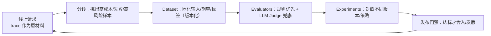

> “我一直把 LangSmith 当 trace 观测工具来用，后来手写了个 LogMiddleware，就更不怎么碰它了。直到看到你提 Dataset…能不能讲讲 LangSmith 的正确打开方式？”

如果你也有同样的感觉，这篇加餐只讲一个结论：

> 你缺的往往不是“能记录”，而是**能把线上行为变成可回归的评测资产**。  
> Trace 只是原材料，Dataset + Evaluators + Experiments 才是闭环。

这也是为什么今天我要把 **LangSmith** 和 **Langfuse** 放到同一张“工程闭环图”里看：  
它们当然都能做观测，但真正拉开差距的，是你是否把它们用成“迭代基建”。

---

## 一、第一性原理：LLM 应用迭代，本质是把“不确定”变成“可重复”

传统后端的质量提升路线通常是：`监控 → 报警 → 修 bug → 发版`。  
但 LLM/Agent 的问题更像：**同样输入，可能跑出不同路径**；今天好，明天坏；你修了 A，B 又退化。

所以你最终需要的不是“更花的看板”，而是一个可持续循环：



只要你把闭环跑起来，LangSmith/Langfuse 才会从“观测工具”变成“生产力工具”。

---

## 二、你手写 LogMiddleware 之后，LangSmith 仍然值得的 3 个点

LogMiddleware 很有价值：它能把你自己的业务字段（tenant/user/thread/risk）打出来，能接你们现有的日志/指标系统。  
但它天然缺三件事（这三件事恰好决定了“能不能形成闭环”）：

1. **可协作的回放载体**：排障不是你一个人看日志，是开发/测试/产品/审核一起对同一条运行“对齐事实”。  
2. **可版本化的用例资产**：线上事故如果不能沉淀成 Dataset，下次你还会靠“经验”再踩一次。  
3. **可对照的实验机制**：你改了 prompt、模型、工具路由、HITL 策略……到底是哪一项让指标变好/变坏？没有对照就只能猜。

LangSmith 最常见的“正确打开方式”，就是把这三件事补齐。

---

## 三、LangSmith 的正确打开方式：把 Trace 变成“评测与回归”的资产

下面这套方法，刻意不讲“功能清单”，只讲“工程动作”。你做完 4 步，就算入门。

### 3.1 抽样：从“线上 trace”里挑出值得固化的样本

别从“全部请求”开始，最容易做成数据垃圾场。建议只挑三类样本进入候选池：

- **失败样本**：报错、超时、工具调用异常、HITL 被拒绝、输出不合规  
- **高成本样本**：工具调用暴增、tokens 异常、p95 延迟飙升  
- **高风险样本**：涉及删除/付款/越权工具、涉及敏感数据、涉及合规红线

这些样本的共同点是：一旦复现，就能指导行动（降级、修 bug、改策略、加闸）。

### 3.2 固化：把样本写进 Dataset（输入/期望/标签要能复跑）

做 Dataset 只要遵守一个底线：**输入必须可复现**。  
对于 LangChain v1 Agent 来说，最小可复现输入通常就是：

- `messages`（用户输入 + 必要的上下文，不要把密钥塞进去）  
- `context` 的“可控开关”（例如 `risk=high`、`plan=pro`、`ab=route_v2`）  
- （可选）你依赖的外部数据快照（工具结果、RAG 证据）——做不到就先 stub

Dataset 不是越大越好。先做 **20～50 条**，覆盖你们最常翻车的 3～5 类场景，就能立刻产生价值。

### 3.3 量化：Evaluator 先用规则，别一上来就 LLM Judge

一个很实用的策略是“二层评测”：

- **规则层**：能断言就断言（格式、必含字段、是否越权、是否给出拒答等）  
- **裁判层**：规则断言不了的再上 LLM Judge（“是否更有帮助/是否引用了证据/是否存在暗示性越权”等）

原因很简单：规则评测稳定、便宜、可解释；LLM Judge 适合做补充，而不是做地基。

下面给一个“规则评测器”的最小示意：它不依赖 trace 内部结构，只对最终输出做强约束，适合先把 CI 跑通。

```python
import json

from langsmith import Client

ls = Client()
DATASET = "agent-regression"

def run_case(inputs: dict) -> dict:
    # 只示意接口形态：你们自己的 agent.invoke / graph.invoke 放这里
    res = agent.invoke({"messages": inputs["messages"]})
    return {"answer": getattr(res, "content", str(res))}

def json_contract_ok(inputs: dict, outputs: dict, reference_outputs: dict) -> dict:
    required = reference_outputs.get("required_keys", [])
    try:
        obj = json.loads(outputs["answer"])
        ok = all(k in obj for k in required)
    except Exception:  # noqa: BLE001
        ok = False
    return {"key": "json_contract_ok", "score": 1.0 if ok else 0.0}

print(
    ls.evaluate(
        run_case,
        data=DATASET,
        evaluators=[json_contract_ok],
        experiment_prefix="release-candidate",
        max_concurrency=2,
    )
)
```

你会发现：一旦输出契约固定了，后面“换模型/换 prompt/加工具/加闸”都能被稳定回归。

### 3.4 对照：用 Experiments 把“改动”变成可解释的结论

在 Agent 体系里，最容易做对照的改动通常是这些：

- **模型路由**：便宜模型 vs 强模型；严格推理模式开关  
- **工具暴露策略**：工具全开 vs 动态选工具（最小权限）  
- **风险闸**：HITL 开/关；工具执行二次闸的阈值  
- **提示词版本**：同一任务不同 prompt 版本

对照的底线是：一次实验只改一件事。  
否则你看见指标变好了，也不知道是“模型”还是“prompt”还是“工具集”起作用。

---

## 四、Langfuse 在这套闭环里怎么用：开源观测 + Prompt 管理 + Experiments

如果你的诉求里有“自建/开源/数据主权”，或者你想把 LLM 观测接进更通用的工程栈（比如 OpenTelemetry），Langfuse 会很顺手。

它在闭环里的位置可以理解成三块能力：

1. **Observability & Tracing**：围绕 trace/observations 做结构化观测（输入输出、耗时、token 与成本、工具/检索步骤）。  
2. **Prompt Management**：把 prompt 从代码里解耦出来，做版本、标签、回滚，并且把 prompt 版本和 trace 关联起来看效果。  
3. **Evaluation / Datasets / Experiments**：把生产 trace 里的样本沉淀进 dataset，用实验对照不同版本的表现。

注意：Langfuse 的 Datasets/Experiments 不是“为了做离线 benchmark 而存在”，更像是把**线上样本 → 回归用例**这条路打通。  
如果你们团队里有人负责 prompt 迭代，有人负责代码发布，这种“分工边界”会非常舒服。

---

## 五、怎么选（以及要不要两套都上）：先问自己 3 个问题

我更建议你把选择写成决策树，而不是做“功能对比表”：

1. **你是否必须自建/私有化，且希望观测融入通用可观测体系？**  
   - 是：优先看 Langfuse（开源 + 可自建 + 可走更标准化的链路）  
2. **你是否已经深度使用 LangChain v1/LangGraph，并把“评测回归”当发布门禁？**  
   - 是：LangSmith 的闭环体验会很顺（trace → dataset → evaluate → experiments）  
3. **你现阶段最大痛点到底是排障，还是迭代？**  
   - 排障优先：先把 tracing + tags/metadata + 脱敏做到位（别急着搞大而全评测）  
   - 迭代优先：先做小而硬的 dataset + 规则评测器，能进 CI 就赢一半

至于“要不要两套都上”：  
如果你还在 0→1 阶段，别一上来双持，观测字段、ID、脱敏策略、实验口径会把人绕晕。  
先用一套把闭环跑通；真的遇到“自建合规/跨栈统一/组织协作边界”再拆分，通常更稳。

---

## 六、踩坑清单：闭环没跑起来，通常不是工具问题

你可以用这 6 条做自查：

1. **Dataset 没有“可复现输入”**：依赖外部系统实时数据，导致评测不可重复  
2. **评测只靠 LLM Judge**：结果抖动、成本高、争论多，最后没人信  
3. **对照一次改太多**：指标变了但不可解释，迭代效率反而下降  
4. **没有“失败样本回灌”机制**：线上翻车过的场景没有沉淀，下次继续翻  
5. **隐私与密钥边界不清**：trace 变成“录屏泄露面”，审计无法过关  
6. **只盯平均值**：Agent 事故往往藏在 p95 与长尾，别被均值麻痹

---

## 七、行动清单（1 周内能落地的版本）

1. 先把 tracing 跑通，并统一 `tenant_id/user_id/thread_id/release` 这类可归因字段  
2. 从线上挑 20～50 条“失败/高成本/高风险”样本，固化成一个最小 Dataset  
3. 先写 2～3 个规则评测器（格式/越权/拒答），让评测可以进 CI  
4. 只做一次对照实验：改一件事（prompt 或模型或工具策略），看结论是否可解释  
5. 每周把线上最新失败样本回灌 Dataset，让回归集跟着产品一起长大

---

## 八、配套源码（可直接跑）

本次加餐我给了两套“最小可跑”的闭环 demo（不追求覆盖所有高级功能，只追求你能跑通一条回归链路）：

- LangSmith：Dataset + `evaluate` 跑出 Experiment  
- Langfuse：Dataset + Dataset Run 写回 scores（`json_parse_ok` / `exact_match`）

安装依赖：

```bash
uv pip install -r 04_LangChain_Guide/code/addon01/requirements.txt
# 或者
pip install -r 04_LangChain_Guide/code/addon01/requirements.txt
```

运行 LangSmith demo（需要 `LANGSMITH_API_KEY` + `LANGSMITH_TRACING=true`）：

```bash
python 04_LangChain_Guide/code/addon01/demo_langsmith_dataset_eval.py
```

运行 Langfuse demo（需要 `LANGFUSE_PUBLIC_KEY/LANGFUSE_SECRET_KEY`）：

```bash
python 04_LangChain_Guide/code/addon01/demo_langfuse_dataset_run.py
```

如果你愿意，我可以基于你们现有的第 16～22 篇中间件骨架，给这篇加餐再补一段“把评测门禁接进 GitHub Flow”的 PR 模板与命令清单（保持只给关键片段，不写完整脚本）。
