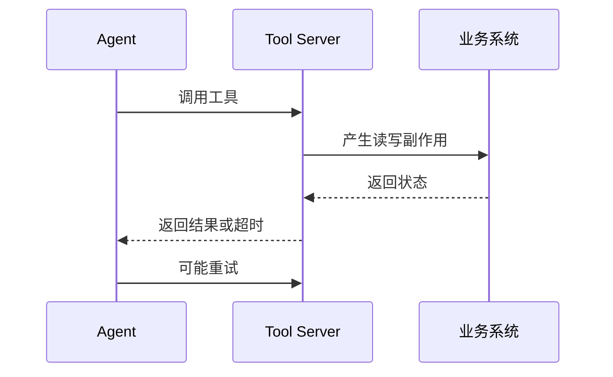

> AI 工具协议看起来很新，但一旦进入生产，超时、重试、幂等、状态漂移这些老问题会全部回来。

很多 AI 工具协议的讨论，习惯从模型视角开始。

模型怎么发现工具？  
工具怎么描述能力？  
参数怎么传？  
结果怎么返回？

这些当然重要。

但如果从系统工程视角看，AI 工具调用很快会撞上分布式系统早就踩过的坑。

Anthropic 最早介绍 MCP 时，把它定位成连接 AI 系统和数据源、工具的标准化方式。这个定位很关键：一旦“连接”从本地 Demo 变成跨系统调用，协议面对的就不再只是参数描述，而是身份、权限、状态和副作用。

## 工具调用本质上就是远程副作用

一个 Agent 调用工具，不只是一次函数调用。

它可能在远端系统里读数据、写记录、发消息、改配置、触发任务。

这些动作都有副作用。



只要有网络、有权限、有状态，就会遇到老问题：

- 请求超时了，实际执行了吗；
- 重试两次，会不会重复写入；
- 工具返回成功，但下游状态没同步怎么办；
- Agent 读到的是旧数据还是新数据；
- 中间步骤失败，前面步骤要不要回滚。

这些问题不会因为调用者变成 LLM 而消失。

## 幂等性会变成 Agent 工具的硬指标

未来高风险工具要被 Agent 调用，必须考虑幂等。

比如创建工单、发送邮件、更新订单、修改权限，都不能简单依赖“模型会谨慎”。

工具接口本身要支持：

- request id；
- dry run；
- 幂等键；
- 预检查；
- 提交确认；
- 操作回执。

否则 Agent 一次重试，就可能把小错误变成真实事故。

## 状态漂移比调用失败更麻烦

调用失败至少能被发现。

更麻烦的是状态漂移：Agent 以为自己掌握了最新状态，但真实系统已经变化。

这会导致它基于旧信息继续做决策。

所以工具协议不能只描述输入输出，还要考虑状态新鲜度、版本号、快照和冲突处理。

这也是 MCP 授权规范开始强调 protected resource metadata、授权服务器发现、token audience 校验等细节的原因。协议进入生产后，调用方、资源方、授权方必须能彼此识别，否则工具调用就会退化成“谁拿到 token 谁就能做事”。

## 先给结论

AI 工具协议不是把 JSON schema 写漂亮就够了。

它迟早要面对分布式系统的基本问题：

- 超时；
- 重试；
- 幂等；
- 一致性；
- 回滚；
- 审计；
- 权限边界。

真正成熟的 Agent 工具生态，不会只拼工具数量，而会拼谁把这些老工程问题重新解决了一遍。

参考资料：

- https://www.anthropic.com/news/model-context-protocol
- https://modelcontextprotocol.io/specification/draft/basic/authorization

## 一个最容易被忽略的例子：发消息

很多人觉得“让 Agent 发一条消息”很简单。

但只要进入真实业务，就会出现分布式系统问题。

Agent 调用发送消息工具，接口超时了。

这时它该不该重试？

如果消息其实已经发送成功，只是响应丢了，再重试就会重复发送。如果消息没有发送成功，不重试又会漏通知。

所以一个看似简单的工具，至少需要：

- 幂等 key；
- 发送结果查询；
- 重试上限；
- 去重策略；
- 人工确认入口；
- 操作日志。

这和传统分布式系统里“支付请求超时了怎么办”本质上是同一类问题。

## Agent 会放大老问题

传统程序调用工具，逻辑通常写死在代码里。

Agent 调用工具，决策来自模型推理。

这会让问题更复杂。

因为模型可能在错误结果上继续推理，也可能把超时理解成“任务失败”，然后选择另一条工具路径。

所以工具协议要提供的不只是 API 描述，还要提供失败语义。

例如：

- 这是临时失败还是永久失败；
- 是否可以安全重试；
- 是否产生了副作用；
- 是否需要人工确认；
- 是否有补偿操作。

## 工具协议应该内置工程语义

未来成熟的 AI 工具协议，不能只描述：

```json
{
  "name": "send_message",
  "parameters": {
    "text": "string"
  }
}
```

还应该描述：

- 是否只读；
- 是否幂等；
- 是否有副作用；
- 最大执行时间；
- 失败是否可重试；
- 是否需要审批；
- 审计字段是什么。

这些字段看起来“不 AI”，但正是生产系统需要的。

## 一个工具调用的生产级清单

如果要把一个工具开放给 Agent，可以先用一张清单判断它是否适合进入生产。

第一，它是否只读。

只读工具通常风险低，更适合先开放。

第二，它是否有外部副作用。

发邮件、改权限、触发部署、创建订单，都必须额外谨慎。

第三，它是否支持幂等。

如果 Agent 重试一次会造成重复操作，就不应该直接开放。

第四，它是否能 dry run。

高风险工具最好先返回“将要做什么”，再由人或策略确认。

第五，它是否有补偿路径。

如果操作做错了，能不能撤回、回滚或人工修复。

这张清单比工具描述更重要，因为它直接决定 Agent 能不能安全行动。

## 为什么 AI 会让老问题更难

传统分布式系统里，调用路径通常由程序员明确写死。

AI Agent 的调用路径却是动态生成的。

这意味着同一个工具，今天可能被用于正常流程，明天可能被 Agent 组合进一个意想不到的流程里。

工具越通用，组合越不可预测。

所以生产环境里的 AI 工具协议，不能假设“调用方总是知道自己在做什么”。协议和工具本身必须承担更多防护责任。

## 最后：AI 工具调用是分布式副作用

AI 工具调用不是聪明版 RPC，而是带推理不确定性的分布式副作用。

只要抓住这一点，就能理解为什么 MCP、A2A 这类协议迟早要补工程语义。

真正决定工具生态成熟度的，不是工具列表有多长，而是工具在超时、重试、冲突、权限和审计下是否还能稳定运行。
