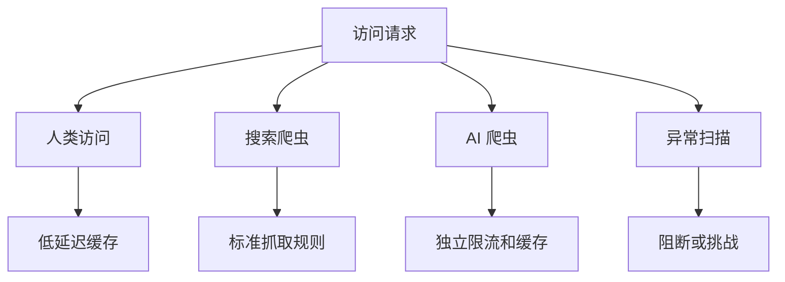

> AI 爬虫改变的不是流量大小这么简单，而是访问模式。传统缓存策略遇到的是“重复访问减少、长尾扫描增加”的新负载。

过去网站缓存主要面向人类访问。

人类访问有相对稳定的热点：首页、热门文章、商品详情、搜索结果。

AI 爬虫和 AI 助手带来的访问模式不一样。

它们可能高并发扫描大量长尾页面，也可能为了构建检索库，顺序访问很少被人打开的内容。

这会让传统缓存命中率下降。

Cloudflare 在 2026 年的缓存分析里把问题讲得更细：AI crawler 既服务实时搜索、RAG、页面摘要，也服务训练集和大规模内容收集。前者对延迟敏感，后者更能容忍延迟。把这两类请求混在同一层缓存里，本身就是问题来源。

## AI 流量的问题是模式变了

很多团队第一反应是加缓存。

但如果访问请求大量分散在长尾页面，普通缓存不一定有效。

因为缓存最擅长的是重复访问。

当请求变成“每个 URL 都只来一次”或“很久才重复一次”，缓存就会变成成本，而不是收益。

所以问题不是简单的“缓存不够”，而是缓存策略需要识别访问来源和访问意图。

## 人类流量和 AI 流量应该分层

更合理的做法，是把流量分层处理：

- 人类访问继续走低延迟体验优先；
- 搜索引擎爬虫按既有规则开放；
- AI 爬虫进入独立缓存层或限流策略；
- 高价值内容可考虑结构化 feed；
- 高成本内容需要鉴权或付费访问。

这样做的目的不是一刀切屏蔽 AI，而是让不同流量承担不同成本。

## 缓存策略也要更“内容感知”

AI 爬虫经常访问长尾内容。

这时传统 LRU 不一定合适。

可以考虑：

- 按内容类型设置 TTL；
- 对归档内容生成静态快照；
- 对高成本动态页面设置预渲染；
- 对 API 结果做语义粒度缓存；
- 对 AI 访问单独统计命中和成本。

缓存不再只是基础设施参数，而是内容分发策略的一部分。

## 先给结论

AI 爬虫带来的挑战，不只是流量变多，而是访问规律变化。

如果继续用面向人类热点访问的缓存思路，很容易出现成本上升、命中率下降、服务质量波动。

下一阶段的网站基础设施，需要把人类访问、搜索爬虫和 AI Agent 访问区分开设计。

参考资料：

- https://blog.cloudflare.com/rethinking-cache-ai-humans/
- https://www.infoq.com/news/2026/04/cloudflare-ai-caching-strategies/

## 为什么传统指标会失真

过去看缓存效果，大家最关心命中率。

但 AI 流量进来后，单看总体命中率可能会误导判断。

如果人类访问命中率很高，AI 爬虫命中率很低，混在一起看，总体指标会被稀释。你可能误以为缓存系统整体退化了，但实际上是新增流量类型改变了分母。

所以更合理的做法，是拆分指标：

- human cache hit ratio；
- search bot cache hit ratio；
- AI crawler cache hit ratio；
- long-tail URL cost；
- origin pressure by traffic type。

只有拆开看，才知道问题到底来自哪里。

Cloudflare 还提到，AI agent 在迭代检索时可能保持很高的 unique access ratio，传统 LRU 会被长尾扫描拖累。它们正在探索 AI-aware caching algorithms，以及把 AI traffic 引到独立缓存层的架构。这正好解释了为什么“给缓存加容量”不一定是最优解。

## 内容站应该先做三件小事

第一，识别流量。

至少把常见搜索爬虫、AI 爬虫、普通用户、异常扫描区分开。

第二，给长尾内容做静态化。

如果文章、文档、归档页面基本不变，就不要每次都打到动态服务。

第三，为 AI 访问准备结构化入口。

如果你希望 AI 正确引用你的内容，可以考虑 sitemap、feed、清晰的元数据和稳定页面结构。

一味封锁不是唯一答案。

更好的策略是：让高价值访问有路可走，让高成本抓取受到约束。

## 对产品和商业的影响

AI 爬虫问题不只是运维问题。

它会影响内容商业模式。

如果 AI 大量抓取内容，却不带来人类访问，网站承担了成本，却失去了流量回报。

未来内容站可能需要更明确地设计：

- 哪些内容开放给 AI；
- 哪些内容只给付费用户；
- 哪些内容允许摘要；
- 哪些内容要求引用和跳转；
- 哪些高成本访问需要付费接口。

缓存策略只是表层，背后是内容分发权的重新划分。

## 对技术团队来说，先别急着全封禁

面对 AI 爬虫，很多团队的第一反应是封。

封禁当然是选项，尤其是当对方不遵守规则、访问成本过高、内容存在版权或付费边界时。

但全封禁并不总是最优解。

如果你的网站依赖内容被发现、被引用、被推荐，完全阻断 AI 访问可能会失去新的分发入口。更稳妥的策略，是先把访问分层，再根据价值和成本制定规则。

比如：

- 对公开文章允许低频抓取；
- 对高成本动态页面要求走静态快照；
- 对会员内容必须鉴权；
- 对大规模抓取提供专用 feed 或 API；
- 对异常请求直接限速或封禁。

这套策略比“放开或封死”更接近真实业务。

## 缓存策略要和内容策略一起设计

AI 访问会迫使内容站重新回答一个问题：哪些内容值得开放给机器读？

如果只是普通资讯，开放抓取可能带来曝光；如果是高价值研究报告，开放摘要但保留全文可能更合适；如果是用户生成内容，还要考虑隐私、授权和删除权。

技术层面的缓存、限流、预渲染，最终都服务于内容策略。

所以这个问题不应该只由运维团队处理。产品、法务、内容、商业化和基础设施都要参与。

AI 爬虫带来的不是一次流量波动，而是内容分发结构的变化。

## 最后：缓存从性能问题变成分发治理问题

过去缓存主要解决性能和成本。

AI 爬虫出现后，缓存还要承担治理职责：识别谁在访问、为什么访问、访问成本由谁承担、哪些内容可以被机器消费。

网站基础设施的下一步，不只是把页面缓存得更快，而是让不同类型的访问进入不同的成本和权限通道。
