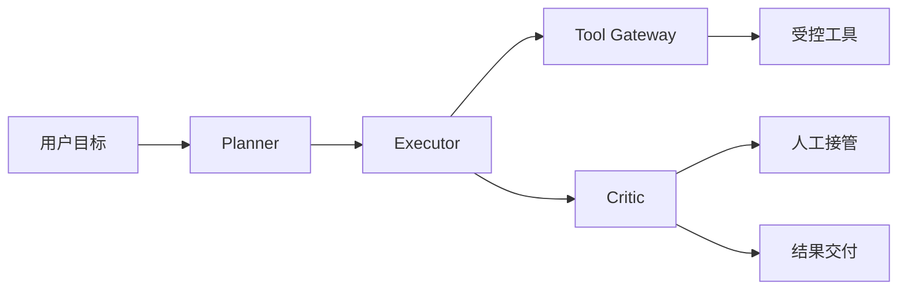

> Agent 设计难，不是因为我们不会写 Prompt，而是因为我们总想让一个系统承担太多不该承担的责任。

Agent 设计到今天仍然很难。

这句话今天听起来依然成立。

不是因为框架不够多，也不是因为模型不够强，而是因为很多 Agent 从一开始就没有设计清楚边界。

它到底负责什么？  
它不负责什么？  
它能自主到什么程度？  
什么时候必须停下来问人？

这些问题不清楚，Agent 越能干，风险越大。

## Agent 不是“会调用工具的聊天框”

很多失败的 Agent 设计，起点就是错的。

它们把 Agent 当成一个聊天框，再给它加一堆工具。

但真实 Agent 更像一个受约束的执行系统。

它需要目标、状态、工具、权限、反馈和停止条件。

少了任何一层，系统都会变得不可控。

A2A 的 Agent Card 设计也从侧面说明了这一点：当 Agent 要和其他 Agent 协作时，它需要公开的是机器可读的能力、端点、认证方式和交互模式，而不是一句“我很智能”。能力能被发现，边界才能被治理。

## 最难的是定义停止条件

很多 Agent 设计只定义了开始，没有定义停止。

什么时候算完成？  
什么时候算失败？  
什么时候应该重试？  
什么时候应该交给人？

如果没有停止条件，Agent 会倾向继续行动。

而生产系统最怕的，就是“错了还继续做”。

## 好的 Agent 设计从反例开始

设计 Agent 时，不要先问“它能做什么”。

应该先问“它不能做什么”。

比如：

- 不能直接删除生产数据；
- 不能跳过测试提交代码；
- 不能在证据不足时给确定结论；
- 不能在权限不明时继续调用工具；
- 不能在高风险操作前绕过审批。

这些反例会逼你把边界写清楚。

## Agent 应该被拆成可验证的子系统

一个大而全 Agent 很难评估。

更好的方式是拆层：

- Planner 负责拆任务；
- Executor 负责执行；
- Critic 负责检查；
- Tool Gateway 负责权限；
- Human-in-the-loop 负责高风险确认。

每一层职责越小，系统越容易验证。

## 先给结论

Agent 设计难，不是难在会不会写一个复杂 Prompt。

真正难的是把目标、边界、工具、状态、验证和接管机制设计清楚。

如果没有这些，Agent 看起来越聪明，越容易把不确定性带进真实系统。

所以 Agent 设计的第一性原理不是“让模型多做一点”，而是“让系统知道什么时候该做，什么时候不该做”。

参考资料：

- https://a2a-protocol.org/latest/topics/agent-discovery/
- https://a2a-protocol.org/latest/topics/a2a-and-mcp/

## 边界设计应该从权限开始

Agent 的能力边界，最终会落到权限边界。

一个只读 Agent 和一个能写数据库的 Agent，不是同一种产品。

一个能创建 PR 的 Agent 和一个能直接合并发布的 Agent，也不是同一种风险。

所以设计 Agent 时，应该先把操作分级：

- 观察：读文档、查代码、看日志；
- 建议：生成方案、写补丁、给 checklist；
- 准执行：创建 PR、生成命令、准备变更；
- 执行：修改生产状态、发消息、发布系统。

不同等级需要不同审批。

这比讨论“Agent 自主性”更具体。

## 上下文边界同样重要

Agent 不应该默认看到所有信息。

它应该看到完成任务所需的最小上下文。

这不是为了限制能力，而是为了降低误判和泄漏风险。

比如一个财务 Agent 处理报销，不一定需要读取员工所有聊天记录；一个代码 Agent 修测试，也不一定需要访问生产密钥。

上下文越多，模型越容易被无关信息干扰，也越容易带来合规问题。

## 评价一个 Agent 设计，可以看五个问题

第一，它的任务是否足够具体。

第二，它是否有明确停止条件。

第三，它能调用哪些工具，权限如何分级。

第四，它失败时能否恢复或交给人。

第五，它的过程能否被审计和复盘。

如果这五个问题答不上来，Agent 设计就还停留在 Demo 阶段。

## 四类边界要分开设计

Agent 设计里最容易混淆的是边界。

很多团队只讨论“让它自主一点还是保守一点”，这太粗。

更好的做法是把边界拆成四类。

第一是目标边界：它到底负责哪个任务结果，不负责哪些外部目标。

第二是权限边界：它可以读什么、写什么、触发什么。

第三是上下文边界：它能看到哪些信息，哪些信息默认不可见。

第四是停止边界：遇到什么情况必须停、问人、回滚或只输出建议。

这四类边界不要混在一个 Prompt 里含糊描述，而应该落实到系统配置、工具权限、工作流状态和评测用例里。

## 一个客服 Agent 的例子

假设要做一个客服 Agent。

坏设计是：让它“自动回答客户所有问题”。

好一点的设计是：

- 目标边界：只处理售后政策、物流查询、常见故障，不处理投诉赔付谈判；
- 权限边界：只能读取订单和知识库，不能修改退款金额；
- 上下文边界：只读取当前客户相关订单，不读取无关客户数据；
- 停止边界：遇到赔付、法律、媒体投诉、超出知识库的问题，必须转人工。

这样设计后，Agent 的能力看起来变窄了，但产品变得可控。

生产系统宁可要一个窄而稳定的 Agent，也不要一个看似强大但责任不清的 Agent。

## 最后：Agent 设计要先限制，再放权

Agent 设计最重要的，不是让它更自主，而是让它知道不能自主到哪里。

先限制边界，再根据真实评估逐步放权，这比一开始追求全自动更稳。

越是强模型，越要有清晰系统设计承接它的行动能力。
