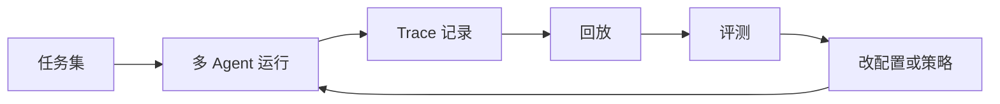

---

layout: post
title: "Google Scion：多 Agent 编排需要工程化试验台"
date: 2026-04-09 08:00:00 +0800
categories: [AI, 技术]
description: "多 Agent 真正难的，不是让几个 Agent 互相说话，而是让它们在可重复、可观察、可回放的环境里协作。"
keywords: Google,Scion多,Agent,编排需要工程化试验台
mermaid: true
sequence: false
flow: false
mathjax: false
mindmap: false
mindmap2: false
cover: "/images/posts/post_google-scion-agent-orchestration-testbed_001.webp"
permalink: /2026/04/09/Google-Scion多-Agent-编排需要工程化试验台/
---

> 多 Agent 真正难的，不是让几个 Agent 互相说话，而是让它们在可重复、可观察、可回放的环境里协作。

多 Agent 这件事，很容易被讲成一个热闹的故事。

一个 Agent 做规划，一个 Agent 写代码，一个 Agent 测试，一个 Agent 审查。它们互相协作，看起来像一个自动化团队。

但工程上真正难的地方不在这里。

真正难的是：当这套协作系统失败时，你能不能知道到底是哪一个 Agent、哪一次工具调用、哪一个中间判断出了问题。

这也是 Scion 这类 testbed 值得关注的原因。

Google Research 对多 Agent 系统的研究也给了一个很有用的提醒：多 Agent 并不是天然更强。对可并行任务，增加 Agent 可能带来明显收益；但对强顺序任务，独立 Agent 反而可能放大错误、拖累结果。这正好说明，多 Agent 需要先被评测，而不是先被信仰。

## 多 Agent 编排不是编排图，而是实验系统

很多团队做多 Agent，第一反应是画流程图。

流程图当然需要，但远远不够。

只要 Agent 具备自主判断能力，系统就会出现传统流程编排里不常见的问题：

- 同一个任务，多次运行路径不同；
- 某个 Agent 的输出会影响后续 Agent 的上下文；
- 工具调用失败后，系统可能以错误状态继续前进；
- 最终结果不好，但很难定位是哪一步造成的。

所以多 Agent 编排需要的不是更漂亮的 DAG，而是实验台。

## 工程化试验台至少要解决三件事

第一是可重复。

同一个任务、同一组输入、同一版配置，应该能尽量复现实验过程。否则你无法比较改动前后系统有没有变好。

第二是可观测。

每个 Agent 的输入、输出、工具调用、失败重试、人工接管，都应该被记录下来。

第三是可评测。

多 Agent 系统的质量不能只看最终答案，还要看路径质量：有没有多余步骤、有没有越权调用、有没有把简单任务复杂化。

## 企业落地前，先要过“试验台”这一关

多 Agent Demo 很容易好看。

但企业系统关心的不是演示效果，而是责任边界：

- 谁拥有任务状态；
- 谁能修改生产数据；
- 谁负责失败恢复；
- 谁能解释某次决策；
- 谁来定义成功和失败。

这些问题不解决，多 Agent 只是把单 Agent 的不确定性放大了。

## Scion 的启发

Scion 这类项目最重要的启发不是“Google 又开源了一个框架”。

它真正说明的是：Agent 工程正在从“能不能跑”进入“能不能实验、比较和治理”的阶段。

这也是多 Agent 工程化的分水岭。

单个 Agent 还可以靠人工盯住。多个 Agent 一旦开始协作，系统就必须把实验、观测、评估和回放能力补齐。

## 先给结论

多 Agent 的竞争点，不会只停留在谁能编排更多角色。

真正有价值的系统，一定是能把复杂协作放进稳定试验台里，持续改进、持续评测、持续治理。

如果说第一阶段的 Agent 工程追求“能完成任务”，那么下一阶段的多 Agent 工程，要追求“能解释为什么完成，失败时能知道怎么修”。

参考资料：

- https://googlecloudplatform.github.io/scion/contributing/architecture/
- https://research.google/blog/towards-a-science-of-scaling-agent-systems-when-and-why-agent-systems-work/
- https://www.infoq.com/news/2026/04/google-agent-testbed-scion/

## 为什么“试验台”比“框架”更重要

多 Agent 框架已经不少。

但框架解决的是怎么把 Agent 串起来，试验台解决的是怎么判断这套串联到底有没有变好。

这两者差别很大。

一个团队今天调整了 Planner 的提示词，明天换了一个代码执行 Agent，后天把工具调用策略从自动改成人工审批。每次改动之后，系统到底更稳了，还是只是这次 demo 更顺了？

没有试验台，就没有答案。

多 Agent 系统最需要的不是“更多角色”，而是一组可复现任务：

- 同样的输入；
- 同样的工具权限；
- 同样的评测标准；
- 同样的失败记录；
- 同样的回放能力。

只有这样，团队才能比较不同编排策略，而不是靠会议里争论“感觉哪个更好”。

Scion 的架构文档也把这件事讲得很工程化：它关注任务、Agent 配置、运行记录、评估和回放，而不只是一个“多角色聊天框”。这类设计会把多 Agent 从产品演示拉回工程实验。

## 多 Agent 的失败通常发生在中间层

单 Agent 失败时，定位还相对直接。

多 Agent 失败时，问题会藏得更深。

例如：

1. Planner 把任务拆得过细；
2. Research Agent 找到了一组过时信息；
3. Coding Agent 基于过时信息写了代码；
4. Reviewer 只检查了语法，没有检查业务假设；
5. 最终输出看起来完整，但方向已经偏了。

如果没有 trace，团队只会看到最后结果不好。

如果有试验台，你能看到偏航发生在哪一步。

## 企业试点可以从三类任务开始

多 Agent 不适合一上来接管核心生产流程。

更合理的试点任务有三类：

第一类是低风险研究任务。比如竞品分析、资料汇总、方案初筛。

第二类是可回滚工程任务。比如生成测试、修复文档、补充示例。

第三类是强人工验收任务。比如生成变更方案、迁移计划、风险清单。

这些任务失败成本较低，但足够暴露编排、状态和评估问题。

## Scion 类项目带来的判断

我更愿意把 Scion 看成一个信号：多 Agent 工程正在离开“搭积木”阶段。

下一阶段，大家会越来越关心：

- 任务集怎么设计；
- 失败样本怎么沉淀；
- Agent 之间的上下文怎么传；
- 工具调用怎么记录；
- 多轮实验怎么比较。

谁先把这些问题做好，谁的多 Agent 系统就更接近生产。
