---

layout: post
title: "Google Scion:Agent orchestration 正在从概念验证走向工程化试验台"
categories: [AI, 技术]
description: "Google Scion:Agent orchestration 正在从概念验证走向工程化试验台"
keywords: Google,Scion:Agent,orchestration,正在从æ¦å¿µéªè¯èµ°å‘工程å–试éªå°
mermaid: true
sequence: false
flow: false
mathjax: false
mindmap: false
mindmap2: false
cover: "/images/posts/post_google-scion-agent-orchestration-testbed_001.jpg"
---


一个 AI 编程 Agent 在终端里跑?简单。

五个 Agent 在同一个 repo 里协作?它们开始互相踩文件、跨会话泄露凭证、每十分钟搞出一次合并冲突。

没有隔离的编排,只是有组织的混乱。

2026 年 4 月,Google 开源了 Scion--一个实验性的多 Agent 编排试验台。它想做一件事:**给 Agent 一个真正可用的工程化环境**。

---

## Scion 是什么?

先说它不是什么。

它不是又一个编排框架。不是 LangGraph,不是 CrewAI,也不是 AutoGen。

它是一个 **testbed(试验台)**。

Google 把它定义为 **"Agent 的 hypervisor"**--像虚拟机监视器一样,管理多个 Agent 的生命周期、身份、凭证和工作空间。

核心设计原则:**每个 Agent 都在隔离的容器里运行**。

- 自己的 home 目录
- 自己的环境变量
- 自己的凭证
- 自己的 git worktree

Agent 可以跑在本地 Docker、远程 VM、或者 Kubernetes 集群。可以长期驻留,也可以用完即弃。

---

## 为什么需要 testbed,而不是框架?

过去两年,多 Agent 编排框架层出不穷。

但它们解决的是"怎么编排"的问题--谁来协调、怎么分工、怎么通信。

**Scion 解决的是"在哪跑"的问题。**

为什么这很重要?

### 1. 隔离不只是安全,是基础能力

没有隔离,多个 Agent 在同一个工作目录里跑,会发生什么?

- Agent A 修改了 `config.json`,Agent B 同时在读
- Agent C 提交了代码,用掉了 Agent D 准备提交的改动
- Agent E 的 API key 被 Agent F 的日志打印出来

这不是边界情况,这是常态。

Scion 用容器 + git worktree 的组合,从物理层面杜绝了这些问题。每个 Agent 有自己的沙箱,互不干扰。

### 2. 可重复实验是前提

做 Agent 实验,最难的不是写 prompt,是**复现问题**。

同样的 prompt,昨天跑了没问题,今天跑了出 bug。为什么?

- 环境变了?
- 模型版本变了?
- 上一次运行的残留状态影响了这一次?

Scion 的 testbed 设计,天然支持"从干净环境开始"。每次实验都可以用独立的容器、独立的 worktree。出了问题,可以精确复现。

### 3. 边界控制是企业落地的门槛

企业环境里,Agent 的边界不是"建议",是"要求"。

- 哪些文件可以访问?
- 哪些 API 可以调用?
- 哪些操作需要审批?

框架层面的"权限控制"往往是在 prompt 里写规则。Agent 听不听,看心情。

Scion 在基础设施层面做边界--容器隔离、文件系统隔离、网络隔离。Agent 想越界,物理上做不到。

---

## 快速上手:30 秒启动一个 Grove

说了这么多,实际怎么用?

**第一步:创建 Grove**

```bash
# 从 GitHub 仓库创建一个 Grove
scion grove create acme-backend --url https://github.com/acme/backend
```

**第二步:配置凭证**

```bash
# 设置 GitHub Token(用于 Agent 克隆仓库)
scion hub secret set --grove acme-backend GITHUB_TOKEN=ghp_xxxx
```

**第三步:启动 Agent**

```bash
# 启动一个 Agent,给它一个任务
scion start my-agent --grove acme-backend "add input validation to the /users endpoint"
```

你会看到 Agent 的启动过程：

```
Agent 'my-agent' starting on broker 'us-west-01'...
Status: CLONING (github.com/acme/backend @ main)
Status: STARTING
Status: RUNNING
```



```mermaid
sequenceDiagram
    participant U as 用户
    participant S as Scion CLI
    participant G as Grove
    participant C as 容器
    participant A as Agent
    
    U->>S: scion start my-agent --grove acme-backend
    S->>G: 查找 Grove 配置
    G->>S: 返回仓库 URL + 凭证
    S->>C: 创建隔离容器
    C->>C: 克隆代码到 worktree
    C->>C: 注入 GITHUB_TOKEN
    S->>A: 启动 Agent (Gemini CLI)
    A->>A: 执行任务
    A-->>U: 输出进度
```

**发生了什么？**

1. Scion 从你的 GitHub 仓库克隆代码到一个隔离容器
2. 为这个 Agent 创建独立的 home 目录和 git worktree
3. 注入你配置的凭证(GITHUB_TOKEN)
4. 启动 Agent(默认用 Gemini CLI,也可以换成 Claude Code)

Agent 开始工作了。你可以在 `.scion/my-agent/` 里看到它的日志、历史和状态。

**多 Agent 协作?**

```bash
# 启动第二个 Agent
scion start test-agent --grove acme-backend "write unit tests for the validation logic"
```

两个 Agent 在同一个 Grove 里,但各有各的 worktree。它们可以并行工作,不会互相踩文件。

---

## Scion vs LangGraph vs CrewAI vs AutoGen:定位不同,不在同一个战场

很多人问:Scion 和 LangGraph/CrewAI/AutoGen 怎么选?

答案是:**它们解决的不是同一个问题。**

| 维度 | LangGraph | CrewAI | AutoGen | Scion |
|------|-----------|--------|---------|-------|
| **核心问题** | 怎么编排 | 怎么分工 | 怎么对话 | 在哪跑 |
| **编排模式** | 图驱动(状态机) | 角色驱动 | 对话驱动 | 不预设 |
| **隔离机制** | 无 | 无 | 无 | 容器 + worktree |
| **学习曲线** | 陡(图设计) | 平(角色/任务) | 中(对话模式) | 平(CLI) |
| **生产就绪** | 高(控制力强) | 中(原型快) | 低(研究友好) | 未知(实验性) |
| **适用场景** | 复杂工作流、审计需求 | 快速原型、团队模拟 | 研究、探索性任务 | 多 Agent 工程实验 |

**LangGraph:给编排逻辑加钢筋水泥**

LangGraph 用图(节点 + 边)定义工作流。每个节点是一个 Agent 或工具,边定义流转条件。

优点:控制力极强。你可以精确追踪每一步、定义分支逻辑、实现复杂的条件跳转。适合生产级系统,尤其是有合规、审计需求的场景(金融、医疗)。

缺点:学习曲线陡。你需要理解图设计、状态管理、边条件。写起来像在写状态机。

**CrewAI:像组建一个团队**

CrewAI 用角色和任务组织 Agent。你定义每个 Agent 的角色(研究员、写手、审核员),再定义任务列表,框架自动分配和协调。

优点:上手最快。思维模型直观:招人 → 分工 → 合作。适合快速原型、演示、小团队协作模拟。

缺点:灵活性有限。角色和任务的模式固定,遇到非标准工作流就得绕路。

**AutoGen:让 Agent 互相聊天**

AutoGen 用对话组织 Agent。多个 Agent 在一个聊天室里,通过多轮对话完成任务。可以有 human-in-the-loop,适合研究探索。

优点:最灵活。对话模式天然支持不确定路径、需要人类介入的场景。研究友好。

缺点:成本高。多轮对话意味着多次 LLM 调用。性能难以预测。

**Scion:它们都没解决的问题**

这三个框架有个共同点:**它们假设 Agent 有一个地方跑。**

在哪跑?同一个进程?同一个容器?同一个目录?

如果你只跑一个 Agent,这不是问题。如果你跑五个,它们会:

- 互相覆盖文件
- 泄露彼此的凭证
- 产生合并冲突
- 无法复现问题

Scion 解决的就是这个问题。**它不是编排框架,是基础设施。**

你可以把 Scion 和 LangGraph/CrewAI/AutoGen 结合:用 Scion 提供隔离的运行环境,用框架编排逻辑。

```mermaid
graph LR
    subgraph 传统框架
        L[LangGraph<br/>图驱动]
        C[CrewAI<br/>角色驱动]
        A[AutoGen<br/>对话驱动]
    end

    subgraph 基础设施层
        S[Scion<br/>容器+隔离+worktree]
    end

    L -.-> S
    C -.-> S
    A -.-> S

    style S fill:#ffe6e6
    style L fill:#e6f3ff
    style C fill:#e6f3ff
    style A fill:#e6f3ff
```

---

## Scion 的核心设计

### Grove、Agent、Template、Runtime

四个核心概念:

- **Grove(树林)**:一个项目命名空间,通常对应一个 git repo
- **Agent(代理)**:一个正在运行的 Agent 实例
- **Template(模板)**:Agent 的蓝图--系统提示词 + 技能集
- **Runtime(运行时)**:Docker、Podman、Apple Container、Kubernetes

```mermaid
graph TD
    G[Grove 项目命名空间] --> A1[Agent 1]
    G --> A2[Agent 2]
    G --> A3[Agent 3]

    A1 --> T1[Template: Gemini CLI]
    A2 --> T2[Template: Claude Code]
    A3 --> T3[Template: Codex]

    A1 --> R[Runtime: Docker/K8s]
    A2 --> R
    A3 --> R

    style G fill:#e1f5ff
    style R fill:#f0f0f0
```



每个 Agent 在自己的容器里运行,共享 Grove 的项目上下文,但拥有独立的 worktree 和凭证。

### 支持的 Agent Harness

Scion 不绑定特定模型,支持多种"深度 Agent":

- **Gemini CLI**(Google)
- **Claude Code**(Anthropic)
- **OpenAI Codex**
- **OpenCode**(实验性)

每个 Harness 有自己的适配层,处理认证、配置、生命周期管理。

### "Less is More" 的哲学:一场关于编排未来的赌注

这是 Scion 最有争议的设计决策。

它**不预设编排模式**。

没有 Supervisor,没有 Router,没有复杂的任务分解逻辑。

相反,它让 **模型自己决定如何协调**。

Agent 通过动态学习一个 CLI 工具(`scion`),彼此发送消息,自主协作。编排逻辑用自然语言写在 prompt 里,而不是硬编码在代码里。

**为什么 Google 敢这么赌?**

```mermaid
graph TB
    subgraph 传统框架
        F1[硬编码编排规则]
        F2[状态机/角色/对话]
        F3[改代码=牵一发动全身]
        F1 --> F2 --> F3
    end

    subgraph Scion方式
        N1[自然语言编写规则]
        N2[模型自主决定协作]
        N3[改prompt即可调整]
        N1 --> N2 --> N3
    end

    style F3 fill:#ffcccc
    style N3 fill:#ccffcc
```

### 赌注一:模型能力追上框架抽象

过去两年,编排框架之所以存在,是因为模型不够聪明。

模型不知道什么时候该问人,什么时候该自己决定。所以我们用框架硬编码这些规则:Supervisor 模式、Router 模式、Hierarchical 任务分解。

但前沿模型(Claude 3.5、GPT-4o、Gemini 2)正在快速补上这块能力。它们能理解复杂指令、判断什么时候该找人、什么时候该继续。

**如果模型足够聪明,框架就是累赘。**

### 赌注二:自然语言是最灵活的协议

框架的刚性协议(状态机、角色定义、对话模式)写起来像代码。改起来也像代码--牵一发动全身。

自然语言呢?改一句 prompt 就行。

```markdown
# 你的团队有两个 Agent

- Backend Agent:负责写 API
- Frontend Agent:负责写 UI

协作规则:
1. Backend 先完成 API,然后通知 Frontend
2. Frontend 看到通知后开始写 UI
3. 两人都完成后,通知你
```

这比写一个 LangGraph 图、定义节点和边,要简单太多。

当然,自然语言有模糊性。但前沿模型的上下文理解能力,正在把这个模糊性降到可接受的范围。

### 赌注三:复杂框架是昨天的解法

Google 的判断:**复杂框架、刚性协议、全栈多 Agent 系统--可能是在解决昨天的问题。**

今天的问题是:模型能力在爆发,但基础设施没跟上。我们还在用同一个终端、同一个目录跑多个 Agent,然后奇怪为什么出问题。

Scion 的选择:把复杂性从编排逻辑里移走,交给基础设施。

**这当然有风险。**

如果模型能力停在这儿,Scion 的 "Less is More" 就是 "Less is Less"--你少了框架的帮助,但模型又不够聪明,结果就是混乱。

但 Google 显然在赌另一个未来:模型能力继续往上走,直到自然语言编排成为主流。

---

---

## 这场赌局,Google 不是唯一玩家

同样的趋势也在其他地方出现。

**Claude Code 的 Agent Teams**:Anthropic 在 Claude Code 里实验了类似的思路--让多个 Agent 通过任务列表和消息队列协作,而不是预设编排模式。

**OpenAI 的 Swarm**:OpenAI 的轻量级编排框架,也在尝试用更简单的模式(路由器 + handoff)替代复杂的状态机。

**行业共识**:编排框架的重,可能是过渡期的产物。模型能力上来后,更轻、更灵活的方式会占主流。

Scion 的差异化在于:它不仅简化了编排逻辑,还把基础设施层面的隔离做实了。容器 + worktree + 凭证隔离,这些是编排框架很少碰的领域。

---

## 从概念验证到工程化试验台

Scion 的定位很明确:**实验性**。

但它指向了一个趋势:Agent 编排正在从"概念验证"走向"工程化试验台"。

概念验证阶段:
- 一个 Jupyter Notebook
- 几个 API 调用
- 演示能用,但不可持续

工程化试验台阶段:
- 隔离的运行环境
- 可重复的实验条件
- 可观测的执行过程
- 可扩展的基础设施

**企业落地前,需要的是试验台,不是演示。**

---

## 这对开发者意味着什么?

如果你在评估多 Agent 方案,Scion 提供了几个视角:

### 1. 先想清楚边界,再想编排

编排模式会变。边界控制不会。

先设计好隔离方案:Agent 在哪跑、能访问什么、怎么追溯。编排逻辑可以后面调。

### 2. 可观测性是刚需

Scion 内置了 OTEL 遥测。Agent 的日志、指标统一收集。

多 Agent 系统出了问题,没有可观测性就是盲人摸象。

### 3. 从本地到云端的平滑过渡

Scion 的 Runtime 抽象,让同一套配置可以从笔记本无缝迁移到 Kubernetes。

概念验证在本地跑,生产环境在云端跑,不用重写。

---

## 结语:现在该做什么?

Scion 还很早期。很多概念还在成型,功能还在完善。不建议直接上生产。

但它指向的方向值得认真对待:

**方向一:从"怎么编排"到"在哪跑"**

如果你在评估多 Agent 方案,先问自己:Agent 有隔离吗?凭证会泄露吗?问题能复现吗?这些比"用哪个框架"更基础。

**方向二:简化编排逻辑,把复杂性下推**

不要一上来就设计复杂的状态机。先试试自然语言编排,让模型自己决定。如果不行,再加结构。从简单开始,而不是从复杂开始。

**方向三:基础设施先行**

在多 Agent 场景里,隔离、观测、凭证管理是刚需。这些东西不做在前面,后面全是坑。

**多 Agent 编排,需要的不是更聪明的 Agent,而是更可靠的基础设施。**

编排框架解决的是"怎么做"。试验台解决的是"在哪做"。

**先解决"在哪做","怎么做"才有意义。**

如果你对 Scion 感兴趣,可以去 [GitHub](https://github.com/GoogleCloudPlatform/scion) 看看。试着建一个 Grove,跑几个 Agent,体验一下"隔离 + 自然语言编排"的感觉。

不需要立刻在生产环境用。但这个方向,值得你花一小时了解一下。

---

**延伸阅读**:
- [Scion GitHub 仓库](https://github.com/GoogleCloudPlatform/scion)
- [Scion 官方文档](https://googlecloudplatform.github.io/scion/)
- [Google 多 Agent 系统扩展原则研究](https://www.infoq.com/news/2026/02/google-agent-scaling-principles/)
