---

layout: post
title: "MCP Dev Summit 观察：企业级 MCP 采用的三道门"
categories: [AI, MCP]
description: "企业采用 MCP，不会只因为协议流行。它必须先过安全、治理和可观测性三道门。"
keywords: MCP,Dev,Summit,è§å¯ää¸çº§,MCP,采用ç„ä¸é“é—¨
mermaid: true
sequence: false
flow: false
mathjax: false
mindmap: false
mindmap2: false
cover: "/images/posts/post_mcp-dev-intro-02_001.jpg"
---

> 企业采用 MCP，不会只因为协议流行。它必须先过安全、治理和可观测性三道门。

MCP 在开发者圈层里已经足够热。

但企业采用一项协议，从来不是看它能不能跑通 Demo，而是看它能不能被纳入现有工程体系。

从 MCP Dev Summit 相关讨论看，MCP 正在从“工具接入协议”进入“企业基础设施协议”的阶段。

这会带来一组更现实的问题。

如果再看 MCP 授权规范，趋势更明显。规范已经开始讨论 protected resource metadata、授权服务器发现、PKCE、scope challenge 和 token audience 校验。这些内容说明 MCP 的企业化不是会议口号，而是在身份、授权和资源边界上逐步补生产语义。

## 第一道门：安全

MCP 的本质是让模型调用外部工具。

这件事一旦进入企业环境，安全问题会立刻出现。

哪些工具可以被调用？  
哪些数据可以被读取？  
哪些操作需要审批？  
调用参数是否可能泄漏敏感信息？  
Server 是否可信？

如果这些问题没有统一治理，MCP Server 越多，风险越大。

企业需要的不是“开放所有工具”，而是“按角色、场景和风险逐级开放工具”。

## 第二道门：治理

企业内部的工具不是静态的。

API 会升级，数据权限会变化，团队会新增 Server，也会废弃旧 Server。

所以 MCP 需要治理平面：

- Server 注册；
- 工具版本；
- Owner 归属；
- 权限策略；
- 生命周期管理；
- 变更审批。

没有这些，MCP 很容易变成一堆没人负责的工具入口。

## 第三道门：可观测性

Agent 出错时，企业必须知道它怎么错的。

这要求 MCP 调用具备完整追踪：

- 调用了哪个 Server；
- 调用了哪个工具；
- 输入参数是什么；
- 输出结果是什么；
- 耗时和失败原因是什么；
- 后续 Agent 如何使用这个结果。

没有可观测性，就没有事故复盘。

没有事故复盘，就谈不上生产化。

## 先给结论

MCP 进入企业，不会只是客户端支持一个配置文件。

它需要被放进企业已有的安全、治理和运维体系里。

所以 MCP 的下一波机会，很可能不只是更多 Server，而是围绕 Gateway、Policy、Registry、Tracing、Sandbox 这一层企业级基础设施展开。

参考资料：

- https://modelcontextprotocol.io/specification/draft/basic/authorization
- https://www.infoq.com/news/2026/04/aaif-mcp-summit/

## 企业为什么不会直接“全员开 MCP”

个人开发者接 MCP，往往是为了效率。

企业接 MCP，首先面对的是风险。

一个 MCP Server 可能连接内部文档、工单系统、数据库、CI/CD、云控制台。只要 Agent 能调用这些工具，它就不再只是一个问答助手，而是进入了企业执行链路。

这意味着企业必须先回答三个基础问题：

- 谁能调用；
- 能调用什么；
- 调用后留下什么记录。

如果这三个问题没有答案，MCP Server 越多，安全团队越紧张。

## 三道门背后的组织变化

安全、治理、可观测性不是三个孤立能力。

它们背后对应三类团队协作。

```mermaid
flowchart TB
    A["企业级 MCP 采用"] --> B["安全"]
    A --> C["治理"]
    A --> D["可观测性"]
    B --> E["风险分级和审批"]
    C --> F["注册、版本、Owner"]
    D --> G["日志、追踪、复盘"]
```

安全团队要定义风险分级和审批策略。

平台团队要建设统一网关、注册中心和运行时。

业务团队要明确哪些工具真正服务高频流程，哪些只是 demo。

这也是企业级 MCP 和个人 MCP 最大的差别：个人只要能用，企业必须可管。

## 企业级采用的最小闭环

一个更现实的落地闭环可以这样设计：

1. 选一个低风险高频场景，比如知识库检索或日志查询；
2. 建一个只读 MCP Server；
3. 接入统一身份和调用日志；
4. 运行一段时间，统计调用频率、失败率和节省时间；
5. 再决定是否开放写操作或更高风险工具。

这样做虽然慢，但能避免协议热度驱动的盲目铺开。

## 三道门不是阻力，而是采用条件

企业采用 MCP 的关键，不是“更快接入更多工具”。

恰恰相反，第一阶段应该是“更慢、更窄、更可控”。

只有把最小闭环跑稳，后续扩展才有意义。

否则 MCP 只会从一个效率工具，变成一组没人敢负责的自动化入口。

这听起来像保守，但对企业来说，这是采用新技术的必要条件。

安全让业务敢开放工具，治理让平台敢持续维护，可观测性让事故之后能复盘。这三件事不是和效率对立，而是让效率收益能长期存在。

如果没有这些基础，MCP 的短期收益越明显，长期风险越难控制。

## 对创业公司的机会

MCP 企业化也会打开新的产品机会。

早期生态里，大家更关注 Server 市场：谁能提供更多工具连接器。

但企业真正愿意付费的，可能是中间层能力：

- 统一 MCP 网关；
- Server 目录和权限管理；
- 工具调用审计；
- 沙箱执行环境；
- 敏感数据脱敏；
- Agent 行为回放；
- 跨客户端兼容层。

这些能力不炫技，但离预算更近。

因为它们解决的不是“能不能玩”，而是“敢不敢用”。

## 企业试点应避免三类场景

第一类是高权限写操作。

比如直接改生产配置、触发部署、修改客户数据。这类场景可以研究，但不适合作为第一批试点。

第二类是 owner 不清楚的工具。

如果一个 Server 没人负责维护，出了问题也没人解释，企业不应该把它接进正式流程。

第三类是无法衡量收益的场景。

如果只是“感觉更智能”，没有节省时间、降低错误率或改善体验的指标，试点很难获得持续支持。

MCP 企业化不是把所有工具都接进来，而是先挑出少数能证明价值、又能控制风险的入口。

## 最后：企业级 MCP 的第一原则是可控

MCP 进入企业的第一阶段，不应该追求工具数量。

更合理的目标是把少数高频、低风险、可衡量的场景跑稳。

企业级采用的第一原则不是开放，而是可控；不是全员试用，而是让每一次工具调用都有身份、边界、日志和责任。
