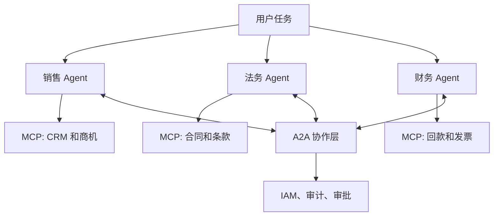

> MCP 解决的是 Agent 怎么连接工具，A2A 试图解决的是 Agent 怎么连接 Agent。两者不是替代关系，更像分工关系。

MCP 火起来之后，很多人自然会问下一个问题：如果工具接入有了协议，Agent 之间的协作会不会也需要协议？

这就是 A2A 的核心语境。

Agent2Agent 不是为了再造一个“更大的 MCP”，而是试图解决另一类问题：多个独立 Agent 之间如何发现能力、交换任务、保持上下文并处理长任务。

A2A 官方文档对 MCP 和 A2A 的关系说得很清楚：两者是互补关系。MCP 更适合 Agent 内部连接工具和资源，A2A 更适合 Agent 之间协作。这一点能避免一个常见误解：A2A 不是要替换 MCP，而是补上跨 Agent 协作边界。

## MCP 和 A2A 解决的问题不同

MCP 更像垂直连接。

一个 Agent 需要查数据库、调 API、读文件、操作浏览器，就通过 MCP Server 暴露工具。

A2A 更像水平连接。

一个 Agent 发现自己不该独立完成任务，就需要找到另一个专业 Agent，协商任务边界，并把结果带回当前流程。

简单说：

- MCP 解决“我能调用什么工具”；
- A2A 解决“我能和谁协作”。

这两件事会同时存在。

## A2A 的难点不是通信，而是责任

Agent 之间发消息并不难。

真正难的是工程责任：

- 谁拥有任务状态；
- 谁负责失败重试；
- 谁来判断对方能力是否可信；
- 谁能访问共享上下文；
- 任务结果不合格时谁负责回滚。

如果没有这些约束，A2A 很容易变成“多个不稳定系统互相放大不确定性”。

## 企业为什么会需要 A2A

企业内部通常不会只有一个 Agent。

客服 Agent、数据分析 Agent、代码 Agent、流程 Agent、安全 Agent，它们可能由不同团队维护，连接不同系统，也有不同权限。

这时让一个超级 Agent 直接拿到所有权限并不现实。

更可控的方式，是让专业 Agent 通过协议协作：

- 每个 Agent 只暴露自己的能力卡片；
- 请求方只发送必要上下文；
- 执行方返回结构化结果；
- 高风险动作仍由本域系统审批。

这也是 A2A 有价值的地方。

## 但 A2A 不会自动变成热点

协议能不能热，不只取决于概念对不对。

还取决于三件事：

- 是否有足够多的真实多 Agent 场景；
- 是否有大厂和开源框架共同采用；
- 是否能和 MCP、身份认证、审计体系顺畅组合。

如果这些条件不成熟，A2A 会停留在“听起来合理”的阶段。

## 先给结论

MCP 之后，A2A 确实可能成为下一阶段的协议热点。

但它真正要解决的不是“Agent 之间能不能聊天”，而是“跨团队、跨系统、跨权限的 Agent 协作能不能被治理”。

如果 MCP 是 Agent 工具生态的接口层，A2A 更像 Agent 组织协作的边界层。

参考资料：

- https://github.com/a2aproject/A2A
- https://a2a-protocol.org/latest/topics/a2a-and-mcp/
- https://a2a-protocol.org/latest/topics/agent-discovery/
- https://developers.googleblog.com/en/google-cloud-donates-a2a-to-linux-foundation/

## 一个 A2A 更有价值的场景

假设一家企业有三个 Agent：

- 销售 Agent：负责客户背景、合同信息和商机进度；
- 法务 Agent：负责合同条款、风险条款和审批建议；
- 财务 Agent：负责报价、回款、账期和发票规则。

如果用户问：

> 这个客户能不能给 90 天账期？

这不是任何一个 Agent 能独立回答的问题。

销售 Agent 知道客户价值，法务 Agent 知道合同风险，财务 Agent 知道现金流约束。

A2A 真正有价值的地方，是让这些 Agent 在不互相开放全部权限的情况下完成协作。

每个 Agent 只暴露能力和必要结果，不暴露完整内部系统。

## A2A 的工程难点

第一是身份。

一个 Agent 请求另一个 Agent 时，必须能证明自己是谁，代表哪个用户或系统，拥有多大权限。

第二是能力发现。

Agent 不能靠自然语言猜对方会什么。它需要机器可读的能力描述、输入输出 schema 和风险等级。

A2A 的 Agent Card 正是在解决这件事：把 Agent 名称、能力、端点、认证要求、支持的交互方式等信息变成可发现的描述。但对企业来说，Agent Card 也不能无脑公开。敏感能力卡片应该经过认证授权后才可见，并且不能泄露内部实现细节、环境信息或静态密钥。

第三是任务状态。

跨 Agent 的任务往往不是一次请求返回。它可能需要等待审批、补充材料、异步执行和结果回传。

第四是失败责任。

如果法务 Agent 给了错误建议，销售 Agent 又基于建议承诺客户，责任链必须能追踪。

这些问题没有解决，A2A 就还只是概念层协作。

## MCP + A2A 的组合形态

更现实的系统不会二选一。

每个专业 Agent 内部通过 MCP 调用自己的工具；Agent 之间通过 A2A 交换任务和结果。

也就是说：

- MCP 是能力接入层；
- A2A 是能力协作层；
- 企业 IAM、审计和审批是治理层。

只有三层都在，Agent 协作才可能进入生产。

## A2A 最需要避免的是“组织幻觉”

多 Agent 系统很容易制造一种错觉：把多个角色拆出来，系统就更像组织了。

但真实组织之所以能协作，不只是因为人会说话。

组织有职责、权限、流程、记录、升级机制和责任边界。

如果 A2A 只是让 Agent 互相发自然语言消息，那它不会比一个大 Prompt 更可靠。

真正有价值的 A2A，应该让每个 Agent 的能力、输入、输出、状态和责任都机器可读。

否则，所谓多 Agent 协作，只是把不确定性从一个模型扩散到多个模型。

## 热点会来自企业复杂度，而不是协议口号

A2A 会不会成为热点，取决于企业复杂度是否足够强地推动它。

当一个企业只有一个 Agent、一个工具集、一个团队维护时，A2A 不是刚需。

但当 Agent 开始分属不同团队、拥有不同权限、连接不同系统，并且要共同完成长任务时，A2A 的价值才会显现。

所以 A2A 的热度不会来自“又一个新协议”，而会来自真实场景里对跨 Agent 协作治理的需求。

## 最后：MCP 管工具，A2A 管协作

更准确地说，MCP 管能力接入，A2A 管能力协作。

前者让 Agent 能安全调用工具，后者让多个 Agent 能在边界清晰的前提下协同完成任务。

如果下一阶段 Agent 真要进入企业流程，MCP 和 A2A 很可能不会互相替代，而是共同进入治理层：一个管工具，一个管协作，一个管责任链。
