cover: "/images/posts/MCP-ä-æ-å-µç-èµ-å-å-ç-ç_001.jpg"

> MCP 的热度没有消失，只是关注点正在迁移：从“这是什么”变成“怎么稳定用在真实系统里”。

很多技术的第一波热度，来自概念。

MCP 也是这样。

它刚被广泛讨论时，大家最关心的是协议本身：模型怎么发现工具，工具怎么描述参数，客户端怎么调用 Server。

但当越来越多开发者真的把 MCP 接进工作流，问题就会自然转向工程层。

从官方叙事看，这个迁移并不意外。MCP 一开始解决的是“让模型以统一方式连接外部系统”，但连接真实系统之后，统一接口只是第一步。授权、审计、资源边界和 Server 生命周期，才是能否长期运行的部分。

## 概念热解决认知，工程热解决落地

概念热阶段，大家问的是：

- MCP 是什么；
- 和 Function Calling 有什么区别；
- 有哪些 Server；
- Claude、Cursor、Codex 能不能接。

工程热阶段，问题会变成：

- Server 怎么部署；
- 权限怎么管；
- 多个 Server 怎么路由；
- 调用失败怎么恢复；
- 工具调用怎么审计；
- 不同客户端兼容性怎么保证。

这说明 MCP 正在从教程素材，进入基础设施讨论。

```mermaid
flowchart LR
    A["概念热"] --> B["Demo 和教程"]
    B --> C["真实流程接入"]
    C --> D["权限、审计、观测"]
    D --> E["企业级基础设施"]
```

## MCP 的下半场是治理

一旦 MCP 进入企业系统，最大的挑战不是写一个 Server。

真正难的是治理。

企业会希望所有 MCP Server 都经过登记，工具能力有清晰描述，敏感工具有审批，调用链路可追踪，异常行为能被发现。

这会催生新的组件：

- MCP Gateway；
- Server Registry；
- Tool Policy；
- Audit Log；
- Observability Dashboard；
- Sandbox Runner。

这些东西没有第一个 Demo 好看，但决定系统能不能长期运行。

## 工程化也会反过来改变协议使用方式

概念阶段，开发者喜欢“一个 Agent 接很多工具”。

工程阶段，系统会更倾向分层：

- 通用工具和高风险工具分开；
- 读操作和写操作分开；
- 本地工具和远端工具分开；
- 实验环境和生产环境分开。

这会让 MCP 的使用方式从“接上就行”，变成“按风险分区接入”。

## 先给结论

MCP 从概念热走向工程热，是一件好事。

它说明协议开始承受真实场景的压力。

真正值得做的，不是再写一篇“如何手撸 MCP Server”，而是开始回答：

- 如何给 MCP Server 建目录；
- 如何治理工具权限；
- 如何观测 Agent 调用链；
- 如何在失败时恢复状态。

MCP 的下一阶段，不是更热闹，而是更工程化。

参考资料：

- https://www.anthropic.com/news/model-context-protocol
- https://modelcontextprotocol.io/specification/draft/basic/authorization

## 这波工程热会催生哪些需求

第一是企业内部 MCP 目录。

团队需要知道有哪些 Server、谁维护、能访问什么数据、适合什么场景。

第二是 MCP 调用审计。

Agent 调工具之后，不能只在聊天记录里留一句“我查了一下”。系统必须记录请求、参数、结果和调用者身份。

第三是工具风险分级。

读文件和删文件不是一个风险级别。查日志和触发部署也不是一个风险级别。MCP 工具必须有风险标签。

第四是运行环境隔离。

本地 Server、云端 Server、生产 Server 不能混在一起。不同环境要有不同权限和策略。

这里尤其要警惕 token passthrough 一类做法。授权规范之所以要求校验 token audience，是为了避免一个系统签发的访问凭证被拿去访问另一个资源服务器。对企业来说，这不是协议细节，而是 MCP 能否跨团队部署的底线。

## 开发者也要调整心态

早期做 MCP，很容易追求“我接了多少工具”。

但成熟后，更重要的问题是：

- 这些工具有没有被使用；
- 使用失败率高不高；
- 是否真的缩短了流程；
- 是否引入了新的风险；
- 是否有人负责维护。

工具数量不是护城河，工具治理才是。

## 一个判断框架

判断一个 MCP 项目是否值得继续投入，可以看三点：

1. 它是否接入真实高频流程；
2. 它是否有可验证的效率或质量收益；
3. 它是否有明确的安全和维护责任。

如果只是“为了支持 MCP 而支持 MCP”，很快会变成 demo 仓库。

## 一个最小生产化样板

如果一个团队想把 MCP 从概念推进到真实使用，不需要一开始做大平台。

可以先选一个低风险场景，比如内部文档检索。

这个样板只需要包含几个关键动作：

- Server 有明确 owner；
- 工具只读，不产生副作用；
- 参数 schema 清楚；
- 调用日志可查询；
- 失败原因可定位；
- 有最基本的权限控制；
- 使用效果能被统计。

这个小闭环跑通以后，再扩展到日志查询、工单读取、代码搜索等场景。

一开始就做高风险写操作，比如改数据库、触发部署、发客户消息，反而会让安全和平台团队快速踩刹车。

## 工程热会筛掉一批伪需求

概念热阶段，很多需求看起来都值得做。

工程热阶段，只有能进入真实流程的需求才会留下。

一个 MCP Server 如果没有稳定使用者，没有维护人，没有可观测指标，也没有明确收益，最后很可能变成仓库里的“生态展示品”。

这不是坏事。

任何协议生态成熟，都会经历从数量膨胀到质量筛选的过程。

真正有价值的 MCP 项目，不是接入工具最多的项目，而是把一个流程变得更短、更稳、更可审计的项目。

## 最后：下一阶段要把 Server 管起来

MCP 的故事已经从协议科普走向工程落地。

下一批有价值的问题，不再只是“怎么写一个 Server”，而是“怎么把 Server 管起来”。

当 MCP 开始面对权限、审计、运行时、版本和责任边界，它才真正进入基础设施阶段。
