cover: "/images/posts/MCP-å-è-æ-å-ç-å-ï¼-ä-ç-å-å-ç-äº-å-ºç-è-¾æ-½_001.jpg"

> MCP 的上半场是“能接工具”，下半场是“能不能在企业里稳定、安全、可观测地接工具”。

MCP 刚被大量讨论时，最吸引人的地方很简单：它让模型接工具这件事有了统一接口。

这解决了一个很直接的问题。

以前每个产品都要自己写一套工具适配层，每个 Agent 框架都要重新定义工具发现、参数描述和调用方式。MCP 把这件事抽成协议，生态扩张自然变快。

官方对 MCP 的原始定位是“让 AI 应用以标准方式连接数据源和工具”。这个定位解释了它为什么会快速扩散，也解释了它为什么一定会进入治理问题：只要连接的是企业真实数据和操作入口，协议就必须承担安全边界。

但当 MCP 真的开始进入生产讨论，问题就变了。

企业不只关心“能不能接上”，更关心“接上之后会不会出事”。

## 协议硬化的三个信号

第一个信号是网关。

企业不会允许每个客户端随意直连所有 MCP Server。网关会变成权限、审计、限流、路由和策略控制的入口。

第二个信号是可观测性。

工具调用不再只是一次黑盒 RPC。谁调用了什么工具、传了什么参数、返回了什么结果、失败后是否重试，都需要进入日志和追踪系统。

第三个信号是传输和运行时治理。

当 MCP 从本地玩具走向跨团队、跨网络、跨云环境使用时，连接管理、认证、超时、重试和兼容性都会变成协议生态必须正视的问题。

MCP 授权规范里已经能看到这种硬化趋势：它讨论的不只是“有没有 token”，还包括 protected resource metadata、授权服务器发现、scope challenge、PKCE，以及 token audience 校验。换句话说，MCP 正在补齐企业身份体系会追问的那一层语义。

## MCP 不会停在“开发者好用”

开发者喜欢 MCP，是因为它降低了接工具成本。

企业采用 MCP，则会要求另一套能力：

- 工具白名单；
- 数据脱敏；
- 细粒度授权；
- 高风险调用审批；
- 调用链追踪；
- Server 生命周期管理；
- 版本兼容策略。

这意味着 MCP 的竞争不只发生在 Server 数量上，也会发生在治理平面上。

## 从工具协议到基础设施

一个协议一旦进入基础设施层，它就会承担更多“无聊但重要”的责任。

稳定性、兼容性、安全性、可运维性，都会变得比概念新鲜感更重要。

这也是我理解的“硬化”：协议不再只是展示能力，而是开始承受生产系统的约束。

## 先给结论

MCP 没有结束，反而正在进入更难的一段。

如果说第一阶段大家在问“有哪些 MCP Server 可以用”，第二阶段就会问：

- 谁来治理这些 Server；
- 谁来审计工具调用；
- 谁来定义企业内的权限边界；
- 谁来保证协议升级时系统不崩。

MCP 变成生产基础设施，不是因为它更热了，而是因为它开始面对真正的工程问题。

参考资料：

- https://www.anthropic.com/news/model-context-protocol
- https://modelcontextprotocol.io/specification/draft/basic/authorization
- https://www.infoq.com/news/2026/04/aaif-mcp-summit/

## 一个企业接入 MCP 的真实路径

如果一个企业今天要引入 MCP，最差的做法是让每个团队自己随便接 Server。

这会很快失控。

更合理的路径应该分四步。

这条路径可以理解成一层层加约束：先控制副作用，再登记资产，再统一入口，最后才开放高风险能力。

```mermaid
flowchart LR
    A["只读工具"] --> B["Server 登记"]
    B --> C["统一网关和策略"]
    C --> D["开放写操作"]
    D --> E["生产级 MCP 基础设施"]
```

第一步，只允许只读工具。

例如文档检索、接口查询、日志读取、知识库搜索。这类工具即使出错，副作用也相对可控。

第二步，建立 Server 登记。

每个 MCP Server 都要有 owner、用途、权限范围、数据分级、部署位置和版本记录。

第三步，引入网关和策略。

所有工具调用先过统一入口。网关负责鉴权、限流、审计、脱敏和风险判定。

第四步，再开放写操作。

写数据库、改配置、发消息、触发部署，都必须有审批或至少 dry run。

这才是 MCP 从玩具到基础设施的真实路径。

## MCP 硬化后会带来新分工

未来 MCP 生态里，Server 作者、客户端作者和平台团队会出现更清晰分工。

Server 作者负责暴露能力。

客户端负责用户体验。

平台团队负责治理：权限、审计、注册、观测、策略和生命周期。

如果没有平台层，MCP Server 越多，企业越不敢用。

## 判断一个 MCP 系统是否生产化

可以用五个问题快速判断：

- 工具调用有没有审计日志；
- 高风险工具有没有审批；
- Server 下线会不会影响核心流程；
- 参数有没有 schema 和脱敏；
- 失败调用能不能被追踪和回放。

如果答案都是否定的，那它还只是实验系统。

## 硬化会改变开发者体验

MCP 真正进入生产，不是因为协议更优雅，而是因为它开始接受企业工程约束。

这也意味着，未来开发者体验可能会变得没那么“自由”。

你不能随便把一个本地脚本暴露成生产工具；不能让 Agent 默认获得所有文件权限；不能把敏感参数直接传给任意 Server；不能在没有日志的情况下触发高风险操作。

这不是倒退。

这是协议从个人效率工具进入多人协作系统必然要经历的过程。

好的基础设施不是让所有人随便做任何事，而是让正确的人在正确边界内高效做事。

## 对开发者的实际影响

未来写 MCP Server，不能只写功能。

还要考虑：

- 参数 schema 是否稳定；
- 错误码是否可理解；
- 是否区分只读和写操作；
- 是否支持 dry run；
- 是否暴露审计字段；
- 是否说明权限需求；
- 是否有版本兼容策略。

这些能力会决定一个 Server 能不能被企业采用。

换句话说，MCP Server 会从“会不会接”进入“能不能被治理”的竞争。

## 最后：基础设施需求不会随着热度消失

协议热度会过去，但基础设施需求不会过去。

当 MCP 开始承担真实工具调用，它就必须接受安全、治理、观测和运行时约束。

谁能把 MCP 做成可治理的工具运行时，谁才有机会吃到下一阶段红利。
