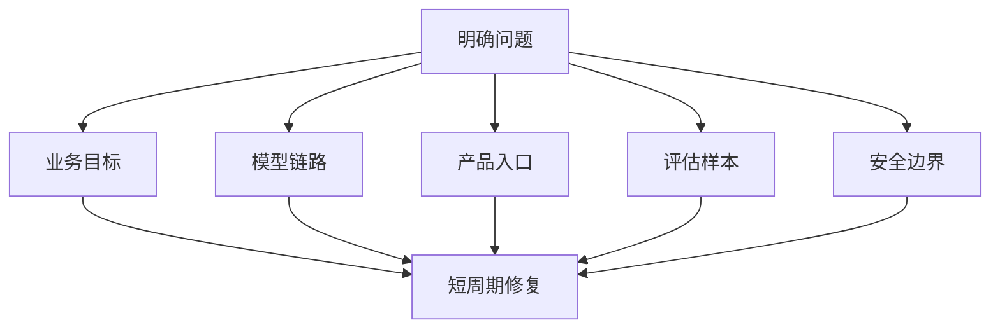

> AI 工程进入深水区后，组织方式也要变。真正有效的团队，不是按职能排队，而是围绕问题组建高密度小队。

Tiger Teams 不是一个新词。

但放到 AI 工程里，它重新变得重要。

因为 AI 项目最大的问题，往往不是某个单点能力不足，而是模型、数据、产品、评估、安全和工程链路同时纠缠在一起。

传统职能分工很容易让问题在团队之间来回传递。

Tiger Team 的价值，就是把关键角色短时间拉到同一个问题现场。

## AI 项目不适合长链条传递

一个 Agent 项目出问题时，原因可能来自很多层：

- prompt 设计不清楚；
- 数据质量不稳定；
- 工具权限过宽；
- 评估集缺失；
- 产品入口不合理；
- 运行时缺少可观测性。

如果每一层都等另一个团队排期，系统会越拖越慢。

AI 工程需要更短的反馈回路。

## Tiger Team 解决的是密度

Tiger Team 的关键不是“人多”，而是密度高。

一个小队里最好同时有：

- 了解业务目标的人；
- 能改模型链路的人；
- 能改产品入口的人；
- 能补评估和数据的人；
- 能处理安全和发布风险的人。

这些人围绕一个明确问题短周期推进，比大型跨部门同步会更有效。

## Evals 会成为 Tiger Team 的共同语言

AI 项目最怕讨论变成主观感受。

“好像更聪明了”“感觉更稳了”“这次回答不错”，都不足以指导工程迭代。

Tiger Team 需要共同语言，这个语言就是评估。

评估集、失败样本、回归指标、人工复核标准，会让不同角色围绕同一组事实讨论。

没有 Evals，Tiger Team 很容易变成临时救火队。

有了 Evals，它才会变成持续改进小队。

Google Research 对 180 组 Agent 配置的评估有一个很值得组织吸收的结论：多 Agent 不是越多越好，任务结构会决定扩展是否有效。这类结果会倒逼团队用评估集讨论系统，而不是用“多上几个 Agent”替代工程判断。

## 先给结论

AI 工程的新组织范式，不是所有人都变成 prompt engineer。

更可能发生的是：围绕关键问题形成高密度、短周期、跨职能的小队。

Tiger Teams 的价值不是制造组织口号，而是缩短从问题发现到系统修复的路径。

当 AI 系统越来越复杂，组织方式也必须从职能排队，转向围绕问题作战。

参考资料：

- https://research.google/blog/towards-a-science-of-scaling-agent-systems-when-and-why-agent-systems-work/
- https://www.infoq.com/podcasts/tiger-teams-evals-agents/

## Tiger Team 不等于临时加班小组

很多团队会误解 Tiger Team。

以为它就是遇到问题后拉几个人集中救火。

如果只是救火，它不会形成组织能力。

真正有效的 Tiger Team 有三个特征：

第一，目标明确。

不是“提升 Agent 效果”，而是“把订单客服场景的一次解决率从当前基线提升到目标区间，同时不增加高风险误操作”。

第二，周期有限。

它不是永久组织，而是围绕一个问题进行两到四周高密度迭代。

第三，产出可沉淀。

最后留下的不是会议纪要，而是评估集、失败样本、工具改造、流程规范和可复用经验。

## AI Tiger Team 的标准配置

一个 AI 工程 Tiger Team，最好不要全是算法或全是后端。

比较合理的配置是：

- 业务 owner：定义真实成功标准；
- AI engineer：负责模型链路和提示策略；
- 后端或平台工程师：负责工具、权限、运行时；
- 产品或设计：负责入口和交互；
- QA 或评估负责人：负责样本、指标和回归；
- 安全或合规角色：评估风险边界。

人数不用多，但角色要完整。

## 为什么 Evals 是组织语言

没有评估，Tiger Team 很容易变成意见战。

业务说不准，工程说能跑，算法说指标变好了，产品说用户还是不满意。

评估集能把争论拉回事实。

比如：

- 哪些样本失败最多；
- 哪些错误最伤用户；
- 哪类任务应该交给人；
- 哪些工具调用最不稳定；
- 新版本有没有回归。

这些问题能被量化，团队才有共同改进方向。

## 一个两周 Tiger Team 怎么跑

以“客服 Agent 幻觉率过高”为例，一个两周 Tiger Team 可以这样推进。

第一天只做问题定义：确认幻觉类型、影响用户、当前基线、可接受目标。

第二到三天整理失败样本：把真实对话按错误类型分组，建立最小评估集。

第四到七天并行修复：模型链路调提示词和检索策略，平台补工具权限和日志，产品调整转人工入口。

第八到十天跑回归：新旧版本对同一批样本做对比，看幻觉率、拒答率、解决率是否同时改善。

最后两天沉淀资产：保留评估集、失败案例、改动记录和上线守护指标。

这个过程的重点不是开了多少会，而是每一天都围绕同一个可验证问题收敛。

## Tiger Team 不能替代长期平台能力

Tiger Team 适合解决高不确定、高耦合的问题。

但它不能成为所有 AI 项目的常态组织。

如果每个问题都要临时拉人救火，说明平台能力还不够：评估体系不成熟、日志不完整、工具权限不清、发布流程不稳定。

健康的组织应该让 Tiger Team 解决关键难题，然后把经验沉淀回平台。

这样下一次类似问题出现时，不需要再从零组队。

## 最后：组织反馈速度要跟上系统变化速度

AI 工程越往后，越不是单点英雄主义。

真正能把系统做稳的团队，会围绕问题建立小型、高密度、可评估的作战单元。

Tiger Team 的本质，是让组织反馈速度跟上 AI 系统变化速度。
