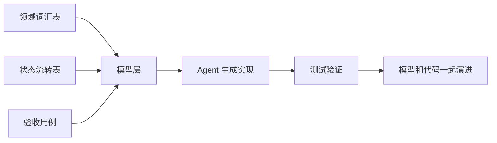

> AI 编程如果只停留在“让模型直接写代码”，很难真正工程化。建模驱动的价值，是先把软件意图变成可约束的结构。

Vibe Coding 很吸引人。

描述一个想法，让 AI 快速生成代码，立刻看到结果。

这种方式适合探索，但不一定适合工程化。

当项目变大、需求变复杂、多人协作加入后，“随性写”会遇到传统软件工程早就熟悉的问题：边界不清、模型不一致、代码难维护、变更难追踪。

建模驱动的 AI 编程，想解决的正是这个问题。

## 代码不是第一产物，模型才是

传统 AI Coding 很容易把代码当成第一产物。

用户说需求，模型直接写代码。

但工程上更稳的路径，应该是先形成中间模型：

- 业务对象；
- 状态流转；
- 权限边界；
- 数据关系；
- 接口契约；
- 验收条件。

代码只是这些模型的实现。

如果模型不清楚，代码写得越快，后面返工越快。

## 建模驱动能约束 AI 的自由度

AI 最大的问题之一，是太容易给出“看起来合理”的实现。

建模驱动的价值，是把自由度提前收窄。

当系统已经有领域模型、状态机和接口契约时，Agent 写代码不再是凭空发挥，而是在既定结构里填充实现。

这会降低幻觉空间，也更方便做一致性检查。

## 工程化的关键是可追踪

AI 编程真正进入团队协作后，必须能回答：

- 这段代码对应哪个需求；
- 这个字段来自哪个模型；
- 这次变更影响哪些接口；
- 测试覆盖了哪个验收条件；
- 生成代码和业务意图是否一致。

如果没有模型层，这些问题只能靠人工读代码。

## 先给结论

Toco AI 这类建模驱动思路的意义，不是让 AI 写更多代码，而是让 AI 在更明确的工程边界里写代码。

Vibe Coding 适合从零探索。

Architecture Coding 更适合长期项目。

AI 编程要真正工程化，必须从“生成代码”升级为“维护模型、契约和验证闭环”。

参考资料：

- https://tocoai.dev/en/docs/

## 建模驱动并不等于重回重型 UML

一提建模，很多开发者会本能反感。

因为过去很多建模工具确实太重：画了很多图，代码还是要手写；模型和实现脱节，最后变成文档债。

AI 时代的建模驱动，不应该重走这条路。

它应该更轻：

- 用自然语言描述领域对象；
- 用 schema 定义数据结构；
- 用状态机描述核心流转；
- 用测试表达验收条件；
- 用 Agent 生成和更新实现。

模型不是为了画给人看，而是为了约束 AI 写代码。

TocoAI 官方文档把自己定位为 Model-Driven AI Coding platform，强调用 AI Architect 和 Modeling Engine 解决 LLM coding 里的 context loss 和 maintenance difficulty。它还把 modeling 称为 precise spec，并要求模型和代码实时映射。这个定位和“轻模型约束 AI”的方向是一致的。

## 为什么 Vibe Coding 后面会遇到墙

Vibe Coding 在个人 demo 阶段非常爽。

但项目一旦进入长期维护，就会遇到三个问题。

第一，需求变更没有锚点。

用户说“把会员逻辑改一下”，Agent 不知道会员模型和订单模型的真实边界。

第二，代码一致性难保持。

每次生成都看似合理，但风格、抽象和状态流转可能逐渐偏移。

第三，测试滞后。

没有验收模型，测试只能围绕当前实现补洞。

建模驱动的价值，就是给 AI 一个稳定锚点。

## 最小可行的建模驱动

不需要一开始做复杂平台。

一个普通项目可以先做三件事：

1. 写领域词汇表：核心对象、字段、关系；
2. 写状态流转表：从什么状态到什么状态，需要什么条件；
3. 写验收用例：给 Agent 明确“什么叫做对”。

这三件事加起来，就已经比一句“帮我实现会员系统”可靠很多。

## 一个例子：会员系统应该先建模什么

假设要让 Agent 实现会员系统。

直接说“帮我做会员系统”，模型大概率会生成一套看起来完整的代码：用户表、会员表、订单表、接口、页面。

但真正影响工程质量的，不是它能不能写出这些文件，而是它是否理解会员系统的规则。

比如：

- 会员有哪些等级；
- 等级如何升级和降级；
- 退款后权益是否回滚；
- 套餐过期如何处理；
- 赠送会员和付费会员是否同权；
- 管理员能否手动调整状态；
- 历史订单如何追溯。

这些不是代码细节，而是领域模型。

如果这些规则没有先变成结构化约束，Agent 会凭常识补全。短期看代码生成很快，长期看每个补全都可能变成债务。

## 建模驱动也需要版本管理

模型层一旦成为代码生成的依据，就必须和代码一样进入版本管理。

需求变了，不能只改实现；状态机变了，不能只改接口；字段含义变了，不能只改数据库。

更合理的流程是：

1. 先更新领域模型或契约；
2. 再让 Agent 根据模型生成修改；
3. 然后用测试验证模型和实现一致；
4. 最后在 PR 中同时审查模型变更和代码变更。

这样 AI 写出来的代码才不是一次性产物，而是可追踪的软件资产。

## 最容易落地的是“轻模型”

建模驱动不一定意味着引入复杂工具。

很多团队可以先用轻模型开始：

- 一份领域词汇表；
- 一张状态流转表；
- 一组接口契约；
- 一批验收用例。

这些文件可以直接放进仓库，让 Agent 在生成代码前先读取。

轻模型的好处是阻力低。它不会打断现有研发流程，却能给 AI 一个更稳定的上下文。

当这些轻模型开始频繁被使用，再考虑更正式的建模平台也不迟。

## 最后：AI Coding 要从生成代码走向维护结构

AI 编程的下一步，不是让模型生成更多代码。

而是让模型围绕更清楚的结构生成代码。

谁能把业务模型、接口契约、测试和生成过程连起来，谁就更接近真正的 AI 软件工程。否则，AI 只是把代码债务生成得更快。
