cover: "/images/posts/Uber-Hive-Federationï¼-é-å-æ-ºè-ç-ç-å-ç-å-å_001.jpg"

> 大规模数据迁移真正难的，不是把数据搬过去，而是在业务不停的情况下让系统逐步切换。

Uber 的 Hive Federation 案例值得看，不只是因为规模大。

真正有启发的是“零停机迁移”这个目标。

Uber 原文里还有两个数字值得放进语境：一个单体 Hive 数据库里承载了超过 16,000 个数据集和 10PB 数据。它的问题不是“表太多”这么简单，而是共享命运故障、资源争抢、集中运维瓶颈、治理盲区和过宽 ACL 叠在了一起。

很多数据系统迁移失败，不是因为目标架构不合理，而是因为迁移路径太粗暴。

一旦数据量、业务依赖和下游任务足够复杂，“停机迁移”往往不可接受。

## 迁移不是一次动作，而是一段双轨运行

大规模迁移最忌讳“一刀切”。

更稳的路径通常是：

- 先梳理数据资产和依赖关系；
- 再建立新旧系统的映射；
- 让一部分读流量先切到新系统；
- 持续校验结果一致性；
- 最后逐步迁移写入和调度任务。

这意味着迁移不是一个发布日，而是一段双轨运行期。

## 难点在依赖，不在存储

数据集本身只是表面。

真正复杂的是依赖：

- 哪些任务读取这些数据；
- 哪些团队拥有这些表；
- 哪些指标依赖旧路径；
- 哪些报表不能中断；
- 哪些历史数据必须保持可追溯。

如果依赖没有理清，迁移看似完成，后面会不断冒出隐性问题。

## 零停机迁移需要可观测性

迁移过程中，最重要的是持续知道系统有没有偏。

需要观测：

- 查询成功率；
- 读写延迟；
- 数据一致性；
- 下游任务失败率；
- 新旧路径差异；
- 回滚触发条件。

没有这些指标，迁移只能靠感觉推进。

## 对普通团队的启发

不一定每个团队都有 Uber 的规模。

但迁移原则是通用的：

- 先建清单，再动系统；
- 先读后写，逐步切流；
- 先验证一致性，再扩大范围；
- 任何阶段都要能回滚。

## 先给结论

零停机迁移不是某个工具的能力，而是一套工程策略。

它要求团队把迁移看成长期演进，而不是一次性搬家。

数据系统越关键，越不能追求“大爆炸式升级”。真正成熟的迁移，是让系统在变化中继续稳定服务。

参考资料：

- https://www.uber.com/us/en/blog/database-federation/
- https://www.infoq.com/news/2026/04/uber-hive-decentralized-data/

## 为什么“零停机”是组织能力

很多迁移方案在纸面上都成立。

真正难的是让多个团队按同一节奏行动。

数据平台团队可以改底层架构，但业务团队拥有报表、任务和指标口径。如果没有跨团队协作，平台迁移很容易变成“平台说迁完了，业务说不能用”。

所以零停机迁移不只是技术能力，也是组织能力。

它要求：

- 资产 owner 清楚；
- 下游依赖清楚；
- 迁移批次清楚；
- 验收指标清楚；
- 回滚责任清楚。

## 小团队也会遇到类似问题

不要觉得 Uber 这种规模离普通团队很远。

小团队从 MySQL 迁到 PostgreSQL，从单体表迁到数据仓库，从旧报表系统迁到新 BI，也会遇到同样问题。

差别只是规模。

原则一样：

- 不要一次性切换所有读写；
- 不要在没有对账的情况下宣布完成；
- 不要忽略下游隐性依赖；
- 不要把回滚方案留到出事后再想。

## 迁移计划应该像发布计划

成熟团队会给迁移写发布计划，而不是只写技术方案。

计划里至少包括：

- 迁移范围；
- 批次顺序；
- 影响系统；
- 验证方式；
- 监控指标；
- 回滚触发条件；
- 负责人和窗口期。

这听起来很普通，但大多数迁移事故正是因为这些普通动作没做好。

Uber 的迁移系统不是一段脚本，而是四个组件组成的运行系统：Bootstrap Migrator 负责一次性迁移，Realtime Synchronizer 处理实时变化，Batch Synchronizer 做批量同步，Rollback Orchestrator 负责按需回滚。这个结构说明，真正的零停机迁移必须把“迁移中会出错”当成默认前提。

## 真正危险的是“影子依赖”

迁移里最麻烦的，往往不是登记在案的依赖，而是影子依赖。

比如某个团队有一个临时脚本，每天凌晨读取旧表生成报表；某个运营同学把旧查询链接写进了 SOP；某个机器学习任务依赖了一个没人维护的历史字段。

这些东西不会出现在架构图里，却会在切换后变成事故。

所以迁移前的资产盘点，不能只问“哪些系统依赖它”，还要看真实访问日志、查询历史、任务调度记录和权限使用情况。

技术上要做血缘分析，组织上要做 owner 确认。

只有两者结合，才能把隐藏依赖尽量挖出来。

## 一套更稳的迁移节奏

普通团队可以把迁移拆成五个阶段。

```mermaid
flowchart LR
    A["只读镜像"] --> B["影子查询"]
    B --> C["小流量读切换"]
    C --> D["写入双轨"]
    D --> E["正式下线旧系统"]
```

第一阶段是只读镜像：新系统先同步数据，但不承接业务流量。

第二阶段是影子查询：同一批请求同时跑新旧路径，只比较结果，不影响用户。

第三阶段是小流量读切换：选择低风险报表、低峰时段、少量团队先切过去。

第四阶段是写入双轨：新旧路径同时写，持续对账，确认没有一致性问题。

第五阶段才是正式下线：旧系统不再承接生产依赖，但保留一段审计和回滚窗口。

这个过程看起来慢，但比一次性切换后到处救火更快。

## 对账是迁移里最容易低估的工作

很多迁移计划写了切流，却没写清楚怎么对账。

对账不是看“任务有没有跑完”，而是看新旧系统在业务含义上是否一致。

比如同一张报表，新旧系统行数一致不代表指标一致；指标一致不代表时间窗口一致；时间窗口一致不代表权限过滤一致。

所以迁移验证要从技术指标走向业务指标。

真正成熟的迁移计划，会把关键报表、核心任务、下游接口和用户查询都列成对账清单。只有这些清单稳定通过，迁移才算进入下一阶段。

## 最后：迁移的本质是控制变化

不要只把 Uber 的案例理解成“大公司基础设施很强”。

它更值得普通团队借鉴的地方，是迁移方法论。

大规模迁移的本质，不是搬迁数据，而是管理依赖、验证一致性和控制切换风险。

只要业务还在运行，迁移就不是一项后台工作，而是一场有节奏的发布。
