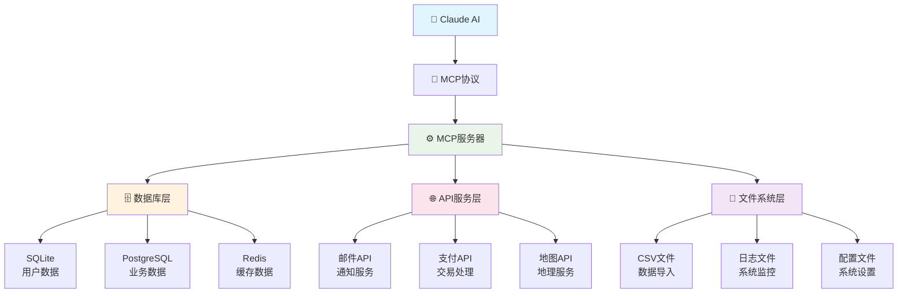
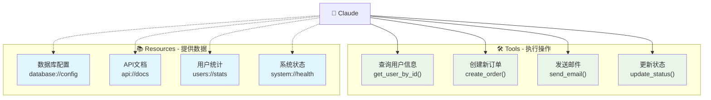
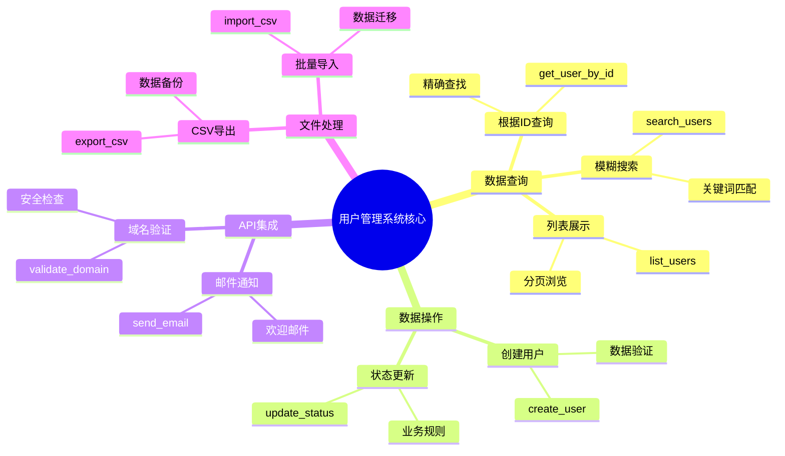
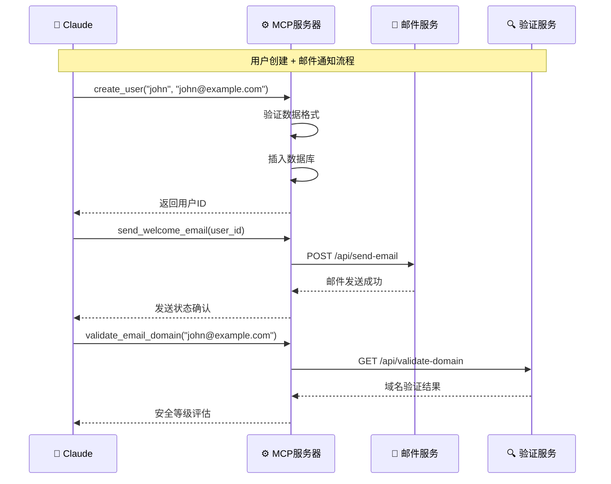
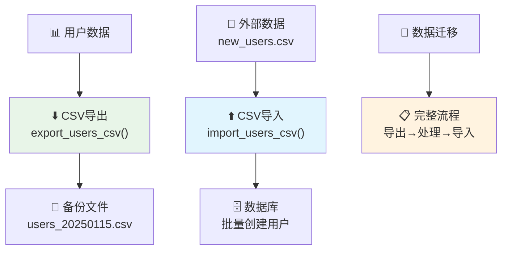

cover: "/images/posts/手把手教Claude直连数据库-MCP开发入门03_001.jpg"


<picture>
  <source srcset="/assets/images/mcp-agent-ecosystem-cover.webp" type="image/webp">
  
</picture>

*图：企业级数据集成架构 - MCP让AI无缝访问所有数据源*

前面两课学了基础开发，但总感觉差点意思？毕竟跟文件打交道算不上什么高难度操作。

这个需求是我真实碰到的：客服组长找到我说，"每次查个用户信息都要登数据库，客户在线等着，特别急人。能不能让Claude直接帮忙查？"

当时我就想，这不就是MCP最适合解决的问题吗？花了一下午搞定，Claude现在查用户、发邮件、导数据样样精通。客服那边现在轻松多了，直接跟Claude对话就能搞定大部分查询工作。

今天就来分享如何让AI变成你的数据专家，真正解决业务问题。

## Tools vs Resources：先搞清楚用哪个


*图：Tools vs Resources - 执行操作与提供信息的核心区别*

这两个概念我之前也分不清，踩了不少坑。

**Tools（工具）** - 执行操作：

- 查询数据库
- 调用API
- 发送邮件
- 创建订单

**Resources（资源）** - 提供数据：

- 配置文件内容
- 静态数据
- 文档信息
- 实时状态

简单记法：**Tools做事情，Resources提供信息**。

举个例子：

- 查询用户信息 → Tool（需要执行SQL）
- 获取数据库配置 → Resource（提供连接信息）
- 创建新用户 → Tool（需要写入操作）
- 获取用户手册 → Resource（提供文档内容）

## 实战案例：用户管理系统


*图：用户管理系统功能架构 - 完整的数据处理解决方案*

我们来搭建一个实用的用户管理系统，涵盖数据库操作、API调用、文件处理等企业常见场景。

### 快速搭建：核心框架

```python
# MCP服务器核心设置
from fastmcp import FastMCP
import sqlite3

mcp = FastMCP("企业用户管理系统")

# 初始化数据库表结构
def init_database():
    conn = sqlite3.connect('users.db')
    cursor = conn.cursor()
    cursor.execute('''
        CREATE TABLE IF NOT EXISTS users (
            id INTEGER PRIMARY KEY AUTOINCREMENT,
            username TEXT UNIQUE NOT NULL,
            email TEXT UNIQUE NOT NULL,
            name TEXT NOT NULL,
            status TEXT DEFAULT 'active'
        )
    ''')
    conn.commit()
    conn.close()

init_database()
```

核心就是这几行，MCP服务器和数据库都搞定了。

### 核心工具：查询和管理

```python
# Tool：执行数据库查询操作
@mcp.tool
def get_user_by_id(user_id: int) -> Dict:
    """根据ID查询用户信息"""
    conn = sqlite3.connect('users.db')
    cursor = conn.cursor()
    cursor.execute(
        'SELECT id, username, email, name, status FROM users WHERE id = ?',
        (user_id,)
    )
    result = cursor.fetchone()
    conn.close()
    
    if result:
        return {
            'id': result[0], 'username': result[1], 'email': result[2],
            'name': result[3], 'status': result[4]
        }
    else:
        raise ValueError(f"未找到ID为{user_id}的用户")
```

这两个工具展示了MCP中Tool的核心用法：执行具体的数据库操作。

### 资源提供：系统信息和配置

```python
# Resource：提供系统统计信息
@mcp.resource("users://stats")
def get_user_stats() -> Dict:
    """获取用户统计信息"""
    conn = sqlite3.connect('users.db')
    cursor = conn.cursor()
    
    # 统计活跃用户数
    cursor.execute('SELECT COUNT(*) FROM users WHERE status = "active"')
    active_count = cursor.fetchone()[0]
    
    conn.close()
    
    return {
        "active_users": active_count,
        "total_users": cursor.execute('SELECT COUNT(*) FROM users').fetchone()[0]
    }
```
```

### API集成：连接外部服务


*图：API集成工作流程 - 邮件服务与域名验证的完整调用链路*

这块很多人会觉得复杂，其实套路都差不多。我之前接过好几个这样的需求，基本就是这个模式：

```python
# API集成：邮件服务调用示例
@mcp.tool
def send_welcome_email(user_id: int) -> Dict:
    """给新用户发送欢迎邮件"""
    user = get_user_by_id(user_id)
    
    email_data = {
        "to": user['email'],
        "subject": f"欢迎加入，{user['name']}！",
        "template": "welcome"
    }
    
    # 生产环境中这里调用真实API
    return {
        "status": "sent",
        "recipient": user['email']
    }
```

### 文件处理：数据导入导出


*图：文件处理工作流程 - 数据导出、导入和迁移的完整解决方案*

```python
@mcp.tool
def export_users_csv() -> Dict:
    """导出用户数据到CSV文件"""
    import csv
    from datetime import datetime
    
    filename = f"users_export_{datetime.now().strftime('%Y%m%d_%H%M%S')}.csv"
    
    # 获取所有用户数据
    conn = sqlite3.connect('users.db')
    cursor = conn.cursor()
    cursor.execute('SELECT id, username, email, name, status FROM users')
    users = cursor.fetchall()
    conn.close()
    
    # 写入CSV
    with open(filename, 'w', newline='', encoding='utf-8') as csvfile:
        writer = csv.writer(csvfile)
        writer.writerow(['ID', '用户名', '邮箱', '姓名', '状态'])
        writer.writerows(users)
    
    return {
        "filename": filename,
        "record_count": len(users),
        "exported_at": datetime.now().strftime('%Y-%m-%d %H:%M:%S')
    }
```

基本的企业数据处理场景都覆盖了。

生产环境最重要的就这几点：**数据验证、异常处理、性能缓存、配置管理**。完整的企业级实现代码我都放在GitHub上了。

## 小结：Claude已具备数据库专家能力

完成这一课后，你的MCP服务器已经具备了完整的企业级数据处理能力：

**核心收获**：

1. **数据库集成**：SQLite/PostgreSQL连接、CRUD操作、统计查询
2. **API服务集成**：邮件服务、域名验证、第三方接口调用
3. **文件数据处理**：CSV导入导出、批量数据迁移
4. **生产级考虑**：安全验证、性能缓存、环境配置

**技术突破**：

- **Tools vs Resources**：明确执行操作与提供信息的区别
- **错误处理机制**：完善的异常捕获和用户友好的错误提示
- **业务场景覆盖**：从简单查询到复杂数据处理的完整解决方案

**实际效果**：

我们客服团队部署这个系统后，Claude现在能够：
- 3秒内查询任意用户的完整信息
- 自动发送欢迎邮件和通知
- 批量处理数据导入导出任务
- 实时统计业务数据并生成报告

客服效率明显提升，再也不用手动查数据库了。这就是让AI成为数据专家的真实威力。

下节课就是重头戏了，把这套系统接入Claude Desktop。到时候直接跟Claude说"帮我查下上周新注册的用户"，它就能自动调工具给你完整的分析报告。

想想就挺激动，数据库专家级别的Claude马上就能用上了。

**完整的代码实现已上传至GitHub，包含详细的使用示例、测试用例和性能基准测试。请阅读原文获取完整代码！**
