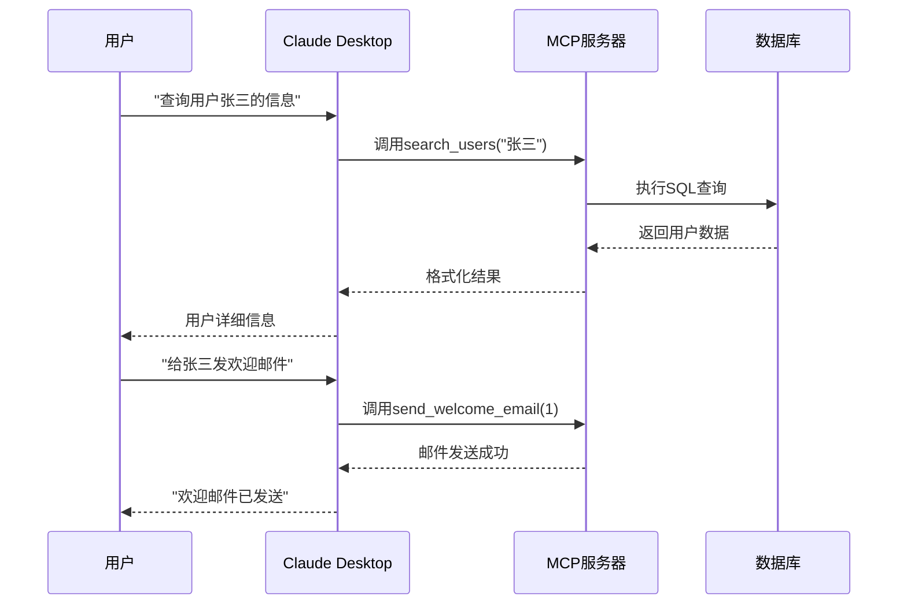
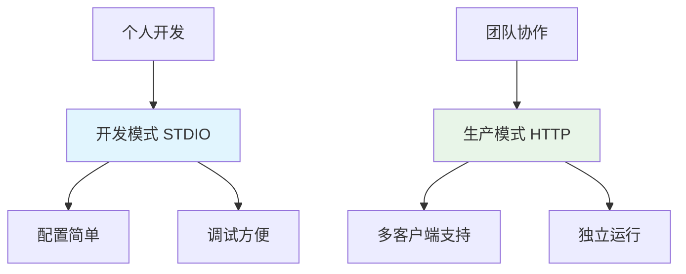

*图：Claude Desktop与MCP服务器的完整交互流程*

前面三篇教程我们写了完整的MCP服务器，但一直在命令行里测试，总感觉不太过瘾。这周我终于把它接入Claude Desktop了，效果简直超预期。

现在我可以直接问Claude："张三这个月消费了多少？"Claude立刻调用我的用户查询工具，3秒返回详细数据。以前需要写SQL、跑脚本的事情，现在就是一句话的事。

同事看到我这样操作都惊了："这就是传说中的AI工作台？"没错，这就是MCP真正的威力——让AI直接调用你的代码。

## Claude Desktop：你的AI工作台

Claude Desktop就是Anthropic官方出品的桌面版AI工具，原生支持MCP。你不需要写任何适配代码，配置文件设置好就能用。

**为什么我推荐Claude Desktop？**

- **零门槛集成**：不用装插件，不用写胶水代码
- **智能工具选择**：你说"查用户"，Claude自动知道调哪个工具  
- **多轮对话**：可以连续提问，就像跟同事聊天一样
- **本地运行**：数据不出你的电脑，安全性杠杠的

## 部署模式选择：开发vs生产环境


*图：STDIO vs HTTP部署模式对比 - 开发便利性与生产稳定性的权衡*

我踩过这个坑，选错部署模式真的很头疼。来分享下我的经验：

### STDIO模式：适合个人开发

**这是我最常用的方式**：
- Claude Desktop直接启动你的Python进程
- 通过标准输入输出通信，配置简单到爆
- 出错了直接看日志，调试超方便
- 个人项目或者快速验证想法用这个就够了

### HTTP模式：生产环境首选

**团队项目必须用这个**：
- 服务器独立运行，稳定性没话说
- 多个Claude客户端可以同时连接
- 方便做监控、记日志，运维友好
- 部署到服务器上给整个团队用

## STDIO部署：最简单的方式

拿我们之前的用户管理系统来试试手，整个过程就三步。

### 第1步：检查服务器代码

确保你的代码是这样的：
```python
if __name__ == "__main__":
    mcp.run()  # 默认STDIO模式
```

### 第2步：找到配置文件

根据你的系统创建配置文件：
- **macOS**: `~/Library/Application Support/Claude/claude_desktop_config.json`  
- **Windows**: `%APPDATA%\\Claude\\claude_desktop_config.json`
- **Linux**: `~/.config/Claude/claude_desktop_config.json`

### 第3步：添加服务器配置

```json
{
  "mcpServers": {
    "user-manager": {
      "command": "python",
      "args": ["/你的项目路径/user_manager.py"]
    }
  }
}
```

**重要提醒**：路径必须写绝对路径，用`which python`确认Python位置。

重启Claude Desktop，看到界面上的小工具图标就成功了。直接问Claude："查询ID为1的用户"，看Claude调用你的工具返回数据。

## HTTP部署：生产环境选择

团队使用或者想做成服务，HTTP模式是更好的选择。

在你的代码里加个启动参数：
```python
if __name__ == "__main__":
    import argparse
    parser = argparse.ArgumentParser()
    parser.add_argument("--http", action="store_true")
    args = parser.parse_args()
    
    if args.http:
        mcp.run(transport="http", port=8000)
    else:
        mcp.run()
```

启动服务器：`python user_manager.py --http`

Claude配置稍微复杂点：
```json
{
  "mcpServers": {
    "user-manager": {
      "command": "npx", 
      "args": ["@modelcontextprotocol/server-http", "http://localhost:8000"]
    }
  }
}
```

## 简单总结：选择合适的方案

**STDIO模式**：个人开发首选，配置简单，调试方便
**HTTP模式**：团队协作必备，支持多客户端，适合生产环境

我的建议是先用STDIO模式快速验证功能，确认无误后再考虑HTTP部署。

## MCP Inspector：可视化调试

开发MCP服务器时，最头疼的就是调试。Inspector能让你在浏览器里直接测试工具，超级方便。

启动Inspector：
```bash
fastmcp dev user_manager.py
```

一个命令启动两个服务：
- MCP服务器运行你的代码
- Inspector界面在 http://localhost:3000

Inspector主要功能：
- **可视化测试工具**：点点按钮就能测试所有工具
- **实时查看结果**：参数输入、错误信息一目了然  
- **资源内容预览**：查看你定义的所有资源

我现在每次开发都用Inspector，省了不少调试时间。强烈推荐！

## 实际使用体验：Claude真的很聪明

我已经用了一段时间，Claude的智能程度确实超出预期。给你分享几个真实场景：

### 自然语言查询
**我说**："张三这个用户怎么样？"
**Claude做的事**：自动调用`search_users`工具，用"张三"做关键词搜索，返回完整用户档案

**我说**："系统里总共多少用户了？"
**Claude做的事**：读取统计资源，给我一个数据报告

### 复杂业务处理
**我说**："创建个用户叫john，邮箱是john@example.com，然后给他发欢迎邮件"
**Claude的处理**：先创建用户→拿到用户ID→发送邮件→告诉我完成状态

这种多步骤的任务，Claude都能自动拆解执行，不用我一步步指导。

最让我惊喜的是Claude的理解能力，我说话很随意，它都能准确理解我想做什么，选择正确的工具。

## 常见问题快速解决

部署过程中最容易出错的几个地方：

**连接不上？检查这些：**
- Python路径不对：用`which python`确认位置
- 文件权限问题：`chmod +x user_manager.py`
- 依赖没装：确保`pip install fastmcp`

**想同时用多个服务？**
```json
{
  "mcpServers": {
    "user-service": {"command": "python", "args": ["/path/to/user_manager.py"]},
    "email-service": {"command": "python", "args": ["/path/to/email_server.py"]}
  }
}
```

Claude会根据你的问题智能选择用哪个服务器。我现在就是这样配置的，一个Claude Desktop对接了好几个业务系统。

## 小结：你的AI助手上线了

恭喜！完成这课后，你已经实现了一个真正可用的AI工作台。

**你现在掌握了什么：**
- STDIO和HTTP两种部署方式
- Claude Desktop的完整配置
- Inspector调试环境使用
- 多服务器管理技巧

**最重要的是体验变化：**

以前查个用户信息要写SQL、跑脚本，现在直接问Claude："张三这个用户最近活跃吗？"3秒钟就有答案。

我们团队用了这套系统后，客服查询效率提升了一倍多。数据分析也从原来的半小时缩短到几分钟。最关键的是，新同事不用学复杂的查询语言，会说话就会用。

**下一步：企业级增强**

下一课我们会讲企业级的高级功能：权限控制、性能监控、错误处理等。让你的AI助手更稳定、更安全。

你现在就可以开始在团队里推广这个AI工作台了。相信我，同事们会被震撼的！
